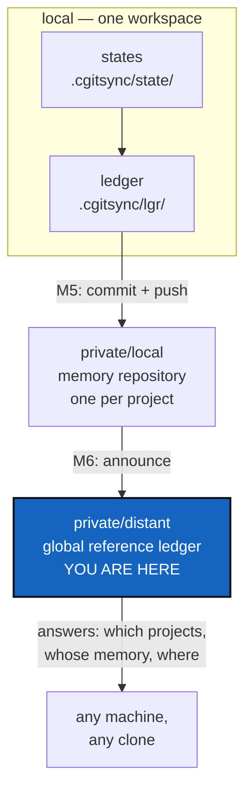

# MemoryArchitecture — a project's memory, kept locally and answerable from one place

*Created: 2026-09-12*

> **Owner direction — 2026-09-12.** From
> `AgentSpec/shortTickets/memorySpecs.md`. This ticket is the design the
> six that follow implement; it is priority 1-1 because every one of them
> cites it for what a memory is and where it lives.

## Abstract — read this first

**The one-line version.** What a workspace remembers should outlive the
machine it was remembered on: each project keeps its states and its ledger
in a memory repository of its own, and one distant reference ledger knows
which projects exist and where their memories are.

**What this document is.** The architecture, the vocabulary, and the
milestone map. It designs; it does not build. Each milestone is its own
ticket, listed in §4 with the order they must land in.

**Why it exists.** `.cgitsync/` is the only thing in ComplexGitSync that
remembers anything, and today it is a gitignored scratch directory on one
disk. Lose the disk and the project's history of synchronised states is
gone; move to a second machine and the same tree remembers nothing. Every
other part of this tool exists to keep repositories in step across
machines. Its own memory is the one thing that never leaves home.

**What you will find.** §1 the vocabulary, which is where most confusion
comes from. §2 the three layers. §3 the decisions the owner has to make.
§4 the milestone map — the six tickets and their order. §5 what this
architecture refuses to do. §6 how we will know it works.

**Who it is for.** Whoever picks up any memory ticket, and the owner, who
answers §3 before milestone M4 starts.

**What you need to do with it.** Read §1 and §2, then go to your own
ticket. Answer §3 before M4.



---

## 1. The words, fixed here and used everywhere

Four things are easy to confuse, and three of them are called "the
register" somewhere in today's code. Fixed meanings:

| Word | What it is | Where it lives |
|---|---|---|
| **State** | One `.gts` snapshot: what the tree contained at one moment | `.cgitsync/state/` |
| **Ledger** | The ordered, hash-chained record of when each State was seen | `.cgitsync/lgr/` |
| **Memory** | One project's States and Ledger together — everything `.cgitsync/` holds | `.cgitsync/`, and its memory repository |
| **Reference ledger** | The distant index of which projects have a memory, and where | its own repository, one for all projects |

A **memory repository** is an ordinary private/local repository in the
`.cgs` sense — shared with your other projects, on a branch of its own,
written only with `--private`. It is not a new kind of mount, and it needs
no new transport: the provider registry in `git_repo.py` already carries
everything a memory repository needs.

## 2. The three layers

### 2.1 Local — what a project remembers

From the owner's note: *"a project has his states (ie .gts) back-up in
`.cgitsync/state/hash.gts`, where hash is sha256 of the GitTree content
@timestamp. the project/state/hash.gts is recorded in its ledger with
@timestamp."*

Two rules in one sentence, and they are the foundation everything else
stands on:

1. **A State is named by what it contains.** `sha256` of the tree's
   content, so the same tree yields the same name on any machine. Today it
   is named after a timestamp instead — see the audit in
   `AgentSpec/archive/20260912_StateMemory_DevPlanTicket.md` §0.2.
2. **The ledger says when.** The timestamp belongs to the record of the
   event, not to the name of the thing.

Note what the flat `state/<hash>.gts` shape settles for free: the `_n`
occurrence counter in today's `state(<hash>)_<n>/` has nothing left to
count, because the same content is the same file and being seen twice is
two ledger entries. Milestone M2 carries that decision.

### 2.2 Private/local — a memory that survives the machine

`.cgitsync/` becomes a repository, mounted in the tree exactly like
`.localSpec` or `.claude` is today:

```toml
memory = { repository = "github:you/.memory-MyProject", relative_path = ".cgitsync", private = true, writable = true }
```

The parent's `.gitignore` keeps listing `.cgitsync/` — that is the
ordinary rule for every child mount, the same line that keeps `docs/` out
of ComplexGitSync's own index. **The line stays and its meaning changes**,
from "suppressed scratch" to "a mounted repository with a history of its
own". Nothing in the gitignore-leak fix
(`archive/20260903_CgitsyncGitignoreLeak_DevPlanTicket.md`) is undone: that
fix said the memory must not be committed *into the project repository as
untyped content*, which stays true.

### 2.3 Private/distant — one place that knows what exists

One repository, shared across every project this installation administers,
holding an index and nothing else: for each project, its name, the memory
repository that holds it, and the last memory head pushed there. It is
**read-mostly and write-rarely**, and it never holds States.

Keeping it distant and separate is the point. The account that can rewrite
the evidence of what was synchronised should not be the account that holds
the code — a reference ledger on one provider for trees on another means
compromising the code host does not silently let someone rewrite the
record.

## 3. Decisions — the owner's call, needed before M4

### D1. What is pushed to a memory repository — everything, or the ledger?

The ledger is small and grows by one entry per operation. States are whole
`.gts` documents, and a busy workspace writes many.

| Option | What happens |
|---|---|
| **Ledger always, States by policy** (recommended) | The ledger is pushed on every sync; States are pushed according to a declared policy — all, or only those a `freeze` named. The ledger still records every State by hash, so a missing one is a known gap rather than a silent hole |
| Everything, always | Simplest to explain and unbounded in size: a year of `status` calls is a year of snapshots |
| Ledger only | Smallest, and it throws away the ability to restore a tree from its memory, which is half the reason to keep one |

### D2. One memory repository per project, or one for all?

Recommended: **one per project**, mounted at that project's `.cgitsync/`.
It keeps a project's memory with the project, it needs no new mount
semantics, and it means one project's memory can be shared with a
collaborator without handing over every other project's. The reference
ledger is what makes them findable as a set.

### D3. How is a memory repository addressed?

Recommended: declared in the `.cgs` like any other private entry, with a
documented default convention (`<owner>/.memory-<project name>`) that
`cgitsync memory init` proposes and the user accepts or overrides. No
implicit repository is ever created without the user seeing its name.

### D4. When does a sync happen?

Recommended: never automatically at first. An explicit `cgitsync memory
push` in M5, with the cadence question — every operation, or only on
`freeze` — answered from evidence once there is a working protocol to
measure. Pushing a ledger entry per `status` call is noise; pushing only
per `freeze` may lose the intermediate history that makes a chain worth
keeping.

### D5. What may a memory contain?

This is the one that must be settled before anything leaves the machine.
Today's ledger records `snapshot_path = "$HOME/.cgs/CGS…/…"` and `actor =
"flipoyo"`. Publishing that publishes one developer's directory layout and
login name. **No absolute path, no OS user name, no credential** — paths
relative to the tree root, and `actor` a deliberate, documented, opt-in
field. M4 does not ship until this holds.

## 4. The milestone map

Seven tickets, this one included. Each is a milestone: something that
works and can be shown, not a layer that only makes sense once the next
one lands.

| M | Ticket | Milestone reached |
|---|---|---|
| **M0** | MemoryArchitecture (this one) | The words mean one thing each, and everyone is building the same system |
| **M1** | VerifyHonesty | The tool stops reporting history it never checked |
| **M2** | StateIdentity | A State is named by its content, so two machines agree on what they hold |
| **M3** | OneRegister | One ledger, hash-chained, actually written, and able to fail |
| **M4** | MemoryModule | `memory/` exists with a CLI to match: a local memory can be inspected |
| **M5** | MemoryRepoLocal | A project's memory is a repository, pushed, and survives the machine |
| **M6** | MemorySyncDistant | The reference ledger answers "which projects, and where is their memory" |

The order is a dependency chain, not a preference. M2 before M3 because a
chain of entries pointing at timestamp-named directories records nothing
portable. M3 before M5 because pushing a register nothing writes is
pushing an empty directory. M4 before M5 because the code needs a home
before it grows a protocol.

**`memory/` is a new top-level area of `src/ComplexGitSync/`**, the
owner's own suggestion and the right one: `cli/` earned its own package
when it outgrew one file, and memory is a larger subject than the CLI. M4
places it, and `.localSpec/AdditionalSpecs.md`'s ring table gains its row
in that ticket, not this one.

## 5. What this architecture refuses to do

- **It is not a backup product.** A memory repository holds what
  ComplexGitSync recorded, not the working tree. Restoring a project means
  re-cloning from a State, not unpacking files.
- **It is not a sync service.** No daemon, no background push, no
  scheduler. Every network operation is a command someone typed.
- **It must work offline.** Local-first, pushed later, is the only
  acceptable answer. A machine with no network keeps a complete, valid,
  verifiable local memory.
- **It does not merge chains.** Two people writing one memory repository
  concurrently is a real problem with no answer here. D2's one-per-project
  shape keeps it rare; a real merge rule for concurrent chains is its own
  ticket, opened when someone actually needs it.

## 6. Acceptance

This ticket is done when all of the following are true — none of them is
code:

- `.localSpec/AdditionalSpecs.md` carries §1's four definitions, and no
  docstring in `src/` contradicts them.
- §3's five decisions are answered in this file, by the owner, with the
  reasoning kept.
- The six tickets in §4 exist, each naming this file for its design and
  stating which milestone it delivers.
- Every one of them states what it does *not* do, so the seams between
  them are visible from inside each ticket.

It stays open until M6 lands, because it is the one document a reader
should be able to open to find out what the memory system is.
