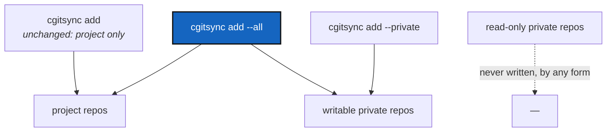

# UnifiedProjectPrivateScope — `--all`: one command for both halves of the tree

*Created: 2026-09-10*

## Abstract — read this first

**What this document is.** A ticket for adding `--all` to the commands that
today need running twice — once for the project's repositories, once with
`--private` for the writable configuration ones.

**Why it exists.** Every write is two commands today. `cgitsync add` then
`cgitsync add --private`, `commit` then `commit --private`, and so on.
`--all` does both in one invocation. One command already works this way:
`freeze-release` spans both halves in a single pass.

**What you will find.** What `--all` means and where it fits (§1), the
eleven commands that take `--private` and the four different things it means
among them (§2), the naming trap (§3), the traps that remain (§4), work
packages and acceptance.

**Who it is for.** The developer implementing this and its reviewer. Read
[CLAUDE.md](../../CLAUDE.md) and its referenced specs first.

**What you need to do with it.** `--all` is purely additive for four
commands and means nothing new for four others (§2). Read that table before
estimating.

---

## 1. The design

Three forms, and the default does not move:

| Form | Reaches | Status |
|---|---|---|
| `cgitsync <cmd>` | the project's own repositories | **unchanged** |
| `cgitsync <cmd> --private` | the writable configuration repositories | **unchanged** |
| `cgitsync <cmd> --all` | both of the above, in one pass | **new** |

Read-only configuration repositories are never written by any of the three.
`--all` and `--private` are mutually exclusive.

Leaving the default alone is what makes this cheap. Nothing an existing user
or CI job runs today changes meaning, so there is no release note to write,
no transition to manage, and no way for this change to write somewhere a
script did not expect.

**The precedent already in the tree:** `freeze_release_tree()` runs at
`RepoScope.WRITABLE` — project **and** writable-private, one pass, one commit
message. The minimalist flagship already does what `--all` will do, which is
both the argument for the change and evidence that the one-pass form works.

## 2. Where `--all` fits, command by command

Eleven commands accept `--private` today, and it does not mean the same thing
in all of them.

| Command | Default scope today | What `--all` would do |
|---|---|---|
| `add`, `commit`, `push` | `PROJECT` | **`WRITABLE` — the real win.** Purely additive. |
| `merge` | `PROJECT` | **`WRITABLE`, and it must be one pass** (§4.2). Purely additive. |
| `tag` | `WRITABLE` | **nothing new** — already both halves. `--all` is at best an explicit alias for the default. |
| `checkout`, `branch` | `ALL` | **nothing new, and narrower** — these already reach every repository, private ones included, because each resolves its own branch name. |
| `freeze` | `--private` is **dead** — `_handle_freeze` never reads `args.private` | undefined until the flag works |
| `rm` | `--private` is **dead** — `_handle_rm` never reads it, and `client.remove()` has no `private` parameter | undefined until the flag works |
| `pull`, `pull-force` | whole tree; `--private` calls `refresh_private()` | **not a scope at all.** `pull --private` fetches and merges each private repo's *base* branch into the derived branch it sits on — a different operation. `--all` here would mean "pull the tree, **then** refresh the private repos": a useful sequence, but sequencing, not widening. |

So the answer to "can it apply to branch, checkout, pull, add, commit, push,
tag, freeze — and merge?" is:

- **Yes, and worth doing: `add`, `commit`, `push`, `merge`.**
- **No, because they already do it: `tag`, `checkout`, `branch`.** Adding
  `--all` there is a no-op flag at best, and a no-op flag is exactly the bug
  §4.1 is about.
- **Not until the flag works: `rm`, `freeze`.**
- **Yes, but as a different feature: `pull`, `pull-force`.**

**One thing to decide separately.** Making the bare form mean *project only*
**uniformly** — including `checkout`, `branch` and `tag` — is not part of
`--all`. For those three it is a **narrowing** of today's behaviour: private
repositories would stop being checked out, branched, and tagged with the
tree. That may well be wanted, but it is a behaviour change on commands
people rely on, and it should be argued on its own, not carried in on the
back of an additive flag.

## 3. The naming trap

`RepoScope.ALL` already exists in `git_repo.py`, and it means **every
repository, read-only configuration repos included** — strictly wider than
what `--all` will mean. The CLI flag maps to `RepoScope.WRITABLE`.

That collision will mislead a reviewer, and it will mislead the next person
reading `_resolve_write_scope`. Two ways out:

| Option | Trade-off |
|---|---|
| `--all`, mapped to `RepoScope.WRITABLE` | The better user-facing word — "all" is what a user means. Requires the help text and the code comment to say plainly: *every repository cgitsync may write to; read-only configuration repos are never written.* |
| `--writable` | Matches the internal vocabulary exactly, no collision. Worse word for a user, who does not think in terms of writability. |

Recommended: **`--all`, with the mapping stated in both the help text and at
the call site.** The status legend already translates this vocabulary for
users (`project` / `private/local` / `private/distant`), so the CLI is
already the layer where the internal words get rephrased.

## 4. Traps

1. **`rm --private` and `freeze --private` are dead flags today.** Both are
   accepted and silently ignored. Fix that first: it is a real bug of the
   exact kind `resolve_command_scope` exists to prevent, and it shrinks the
   surface the rest of this work reasons about.
2. **`merge --all` must be a single `WRITABLE` pass, never two.**
   `merge_tree()` checks the whole scope before merging any of it, so a
   conflict anywhere leaves nothing merged. Two sequential passes means two
   preflights: the project half merges, the private half then refuses, and
   the result is exactly the half-merged tree that guarantee exists to
   prevent. `merge_source_ref()` already translates the branch per
   repository, so one pass is correct as it stands.
3. **`--all` on a tree with no writable configuration repository must not
   fail.** `resolve_command_scope` raises today when `--private` selects
   nothing, deliberately. Most trees have none — `examples/cawaqs.cgs`,
   `htas.cgs`, `template.cgs`. `--all` must do the project half and report
   the private half as empty; an explicit `--private` must still raise. One
   function, two callers, two behaviours.
4. **`commit --all` needs one decision.** `resolve_command_scope`'s docstring
   says a shared repository "gets its own commit message", but
   `freeze-release` already commits both halves with one. Those contradict.
   Either accept one message for both (simplest, matches the precedent) or
   add `--private-message`. Do not leave it implicit.
5. **The output must keep the halves apart.** The `RepoOutcome` lines
   (`staged .localSpec: …` / `skipped …`) and `_print_scope_note` already
   exist. A user giving up *typing* the distinction should not also lose
   *seeing* it.
6. **`_print_scope_note` needs a third case.** It currently prints
   `scope=project skipped=5 configuration repo(s) (.localSpec, .claude with
   --private)`. Under `--all` nothing is skipped and that hint is wrong.

## 5. Work packages

| Work package | Files | Deliverable |
|---|---|---|
| WP1: fix the dead flags | `cli/expert.py`, `orchestre.py` | `rm` and `freeze` either honour `--private` or stop accepting it (§4.1). Add a parser-wide test that no command registers a flag no handler reads. |
| WP2: `--all` | `cli/expert.py`, `cli/_shared.py`, `orchestre.py` | Register `--all` on `add`, `commit`, `push`, `merge`, mutually exclusive with `--private`, mapping to `RepoScope.WRITABLE` (§3). Help text states the mapping and that read-only repos are never written. |
| WP3: the empty private half | `orchestre.py` | §4.3. `--all` reports; `--private` still raises. |
| WP4: `merge --all` | `operations.py`, `orchestre.py` | §4.2 in one pass. A test must show a conflict in a private repository leaves the project repositories unmerged. |
| WP5: reporting | `cli/_shared.py`, `cli/expert.py` | §4.5 and §4.6. |
| WP6: docs | `README.md`, `docs/Text/user_guide.tex`, `tutorials/04_private_repos.md` | Tutorial 4 §4 teaches the two-command habit; it becomes "or do both with `--all`". No release note needed — the default does not move. |
| WP7: verify and land | tests, this ticket | `pixi run lint` and `pixi run test` pass; apply CLAUDE.md's before-committing checklist; archive under [TICKETLIFECYCLE.md](../../.agentSpec/TICKETLIFECYCLE.md). |

## 6. Acceptance criteria

- For `add`, `commit`, `push`, `merge`: the bare command and `--private`
  behave **exactly** as they do today, proven by the existing tests passing
  unchanged; `--all` reaches both halves.
- `--all` and `--private` together are refused by the parser.
- On a tree with no writable configuration repository, `--all` succeeds, acts
  on the project half, and says the private half was empty. `--private` on
  that same tree still fails with today's message.
- `merge --all` with a conflict in a private repository leaves **no**
  project repository merged. A test proves it.
- No command accepts a flag no handler reads. A parser-wide test asserts it,
  so the next one cannot be added silently.
- Output names both halves; a user can tell which repositories were written
  as project and which as private without re-running anything.
- `--help` states the reach of all three forms in one sentence each, and says
  read-only configuration repositories are never written.

## 7. Scope and handoff

Out of scope: what `private` and `writable` *mean*, the branch fallback
chain, `merge_source_ref`'s translation, and the `RepoScope.ALL` readers
(`status`, `view-tree`, `clone`) — reading every repository is already right.

Also out of scope, and deliberately: making the bare form mean *project only*
for `checkout`, `branch` and `tag` (§2). That is a narrowing of current
behaviour and deserves its own ticket.

`pull --all` (§2, last row) is a sequencing feature, not a scope flag. Decide
it separately — including "not now" — rather than letting the wording of
"every command that takes `--private`" pull it in.
