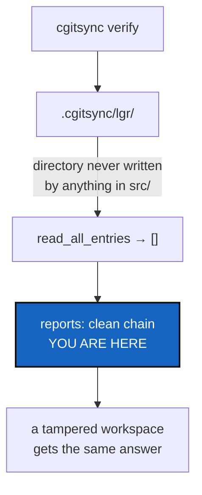

# VerifyHonesty — a check that cannot fail is not a check

*Created: 2026-09-12*

> **Milestone M1** of [MemoryArchitecture](1-1_MemoryArchitecture_DevPlanTicket.md).
> Split from the audit in
> `AgentSpec/archive/20260912_StateMemory_DevPlanTicket.md` (§3.0a, §3.0,
> finding F1). Smallest ticket on the memory path and the first one:
> nothing else should be built on top of a command that reports success
> for a question it never asked.

## Abstract — read this first

**The one-line version.** `cgitsync verify` reads a directory nothing ever
writes, finds it empty, and reports a clean chain — so it answers "yes" on
every workspace in existence, including a tampered one.

**What this document is.** A bug ticket with the cause located and the
evidence already gathered. No storage format changes here; that is
[StateIdentity](1-3_StateIdentity_DevPlanTicket.md) and
[OneRegister](1-4_OneRegister_DevPlanTicket.md).

**Why it exists.** A distributed memory is worth exactly what its
verification is worth. Before a memory is pushed anywhere, the command
that says whether it is intact has to be capable of saying no.

**What you will find.** §1 the evidence. §2 the four answers `verify` owes
a user. §3 the documentation that currently lies. §4 the work. §5
acceptance.

**Who it is for.** Whoever starts the memory work. It is a good first one.

**What you need to do with it.** §4 in order; it is short.

---

## 1. The evidence

`ComplexGitSyncClient.verify` reads `<cgshome>/.cgitsync/lgr/` through
`read_all_entries`. Nothing in `src/` calls `ledger_store.write_entry` or
`append_entry` — the only callers are `tests/unit/test_ledger_store.py`.
`CLAUDE.md`'s own module table says it in one line: the hash-chained
register is "not yet wired into `SyncLedger`'s actual write path".

Checked again on 2026-09-12 in this very workspace: `.cgitsync/` holds four
state directories and **no `lgr/` directory at all**. `verify` here reports
a clean chain over nothing.

The register that *is* written is a plain TOML file, rewritten whole on
every operation, with a sequential `sync_id` and no `prev`, no
`entry_hash`, no chain. It is append-only by convention, and an edit to it
is undetectable by design.

## 2. The four answers `verify` owes

One of these, never a blur of two:

| Answer | When |
|---|---|
| **verified** | A non-empty hash chain was read and every link checked out |
| **no history** | This workspace has recorded nothing yet. Not a failure — a new workspace is not a broken one |
| **legacy, unverifiable** | History exists in the old single-file format, which carries no chain. Readable, not verifiable, and the difference must be said out loud |
| **corrupt** | A chain was read and it does not hold: a broken link, a bad entry hash, a gap or a duplicate in the sequence |

The third is the one most likely to be dropped, and it is the one that
matters most to an existing user: every workspace created before this work
lands is in exactly that state.

## 3. The documentation that lies while you are in there

Cheap to fix, in the same pass, all from the same audit:

- **Ten citations of `AgentSpec/IsolationPlan.md`**, a file that does not
  exist, in `ledger_store.py`, `integrity.py`, `ledger_entry.py`,
  `config_document.py` and `status_render.py`. Every schema in the
  hash-chained ledger is declared unchangeable without first consulting a
  document nobody can open. The real file is
  `AgentSpec/archive/20260828_Isolation_DevPlanTicket.md` — and if a schema
  there is still binding, lift it into `.localSpec/AdditionalSpecs.md` and
  cite that instead: an archived ticket is a historical record and is never
  edited, so a live schema must not live inside one.
- **`state_store.py`'s docstring still says "this module is not wired in
  yet".** It has been wired in for weeks; `orchestre.py` imports five names
  from it.
- **`LocalGitRegister`'s docstring** states the identity rule that
  [StateIdentity](1-3_StateIdentity_DevPlanTicket.md) is about to reverse.
  Leave the sentence accurate for today and let M2 rewrite it; do not
  pre-announce a design that has not landed.

## 4. The work

| WP | Touches | Deliverable |
|---|---|---|
| **WP-V1** | `orchestre.py`, `integrity.py` | `verify` distinguishes §2's four answers. Missing and legacy history are never reported as verified history, and a legacy workspace is explained rather than crashed on |
| **WP-V2** | `cli/expert.py` | Each answer prints its own line, and the wording says what was actually checked. Its exit code is settled with [CliContract](2-1_CliContract_DevPlanTicket.md) — "no history" is not a failure |
| **WP-V3** | `ledger_store.py`, `integrity.py`, `ledger_entry.py`, `config_document.py`, `status_render.py`, `state_store.py` | §3's citations and stale claims |
| **WP-V4** | `tests/` | One regression test per §2 answer, each built from a fixture workspace |
| **WP-V5** | tests, docs, this ticket | `pixi run lint` and `pixi run test`; the before-committing checklist; archive under [TICKETLIFECYCLE.md](../../.agentSpec/TICKETLIFECYCLE.md) |

**Explicitly not here.** Writing the chain (that is M3), renaming state
directories (M2), and implementing `MISSING_STATE` / `ORPHAN_STATE` /
`STATE_DIGEST_MISMATCH` — those three become checkable only once States
are named by their content, so they belong to M3's ticket.

This ticket makes `verify` honest about what it can see today. It does not
give it more to see.

## 5. Acceptance

- On a workspace with no `.cgitsync/lgr/`, `verify` says there is no
  recorded history, and does not say the chain is clean.
- On a workspace whose only history is the legacy single-file register,
  `verify` says so, names the limitation, and does not crash.
- On a workspace with a real chain (constructed in a test through
  `ledger_store` directly, since nothing else writes one yet), `verify`
  reports it verified, and reports corruption when one entry byte is
  flipped.
- `grep -rn "IsolationPlan" src/` returns nothing, or returns citations of
  a file that exists.
- No docstring in `src/` claims a module is unwired when it is wired.
- `pixi run lint` and `pixi run test` pass.
