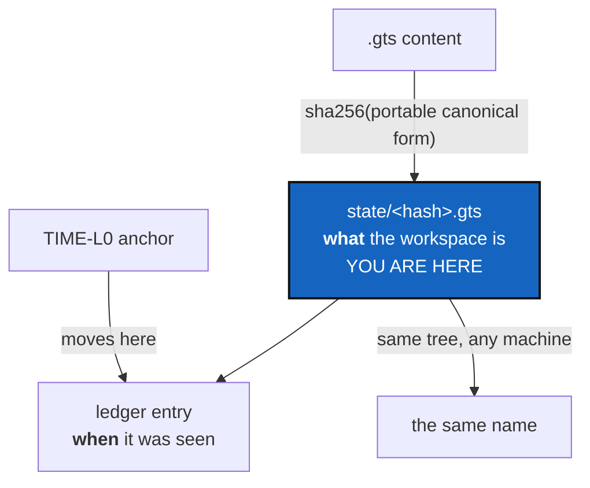

# StateIdentity — a State is named by what it contains

*Created: 2026-09-12*

*Branch: memory-dev*

> **Milestone M2** of [MemoryArchitecture](1-1_memDev-MemoryArchitecture_DevPlanTicket.md).
> Split from `AgentSpec/archive/20260912_StateMemory_DevPlanTicket.md`
> (§2, §3.1, finding F2), and reshaped by the owner's
> `AgentSpec/shortTickets/memorySpecs.md`, which asks for
> `.cgitsync/state/<hash>.gts` where the hash is the tree's content.

## Abstract — read this first

**The one-line version.** Two hashes are doing each other's jobs: the
directory called `state(<hash>)` is named after a timestamp, and the
content hash that would make two machines agree is computed, stored, and
explicitly excluded from identity.

**What this document is.** The change that makes a memory portable. Until
a State name means the same thing on two machines, there is nothing worth
sending between them.

**Why it exists.** A distributed memory is a set of names two parties can
agree on. Name a State after the moment it was written and every machine —
every *run* — invents a new name for the same tree. Four state directories
sit in this workspace right now, all `_0`, all for a tree that changed very
little between them.

**What you will find.** §1 what is wrong, precisely. §2 the shape the owner
asked for, and the counter it deletes. §3 the hard part: what "content"
means when the document records absolute paths. §4 the work. §5 acceptance,
where cross-machine determinism is the test that matters.

**Who it is for.** Whoever takes M2. Read
[VerifyHonesty](1-2_memDev-VerifyHonesty_DevPlanTicket.md) first — it should land
before this.

**What you need to do with it.** §3 is the risk. Do it first and do it
deliberately.

---

## 1. What is wrong

`write_gts_snapshot` calls `new_time_l0_anchor(SystemClock())` on every
write and uses its digest to name the state directory. The anchor is
`sha256("TIME-L0:<iso>:<time_ns>:<pid>:<random 16 bytes>")` — a timestamp
with entropy in it. `LocalGitRegister`'s own docstring admits the result:
`snapshot_hash` "remains the canonical hash of the `.gts` payload, but it
does not participate in State identity".

Meanwhile `GtsDocument.compute_snapshot_hash` *is* a canonical content
digest, validation refuses a `.gts` whose recorded hash disagrees, and the
value names nothing.

Consequences, all observable today: every `initialise`, `pull`,
`checkout`, `commit`, `push` and `freeze` allocates a fresh state
directory even when the workspace has not changed by a byte; the `_n`
occurrence counter can never fire, so it is dead code; and the register
carries `current_state_hash` (the anchor) and `current_snapshot_hash` (the
content) as two fields that never agree, with nothing saying which one
means "the same workspace".

The TIME-L0 anchor is not the problem. It is a good mechanism pointed at
the wrong object, and it moves to the ledger, where *when* is the whole
point.

## 2. The shape, and the counter it deletes

The owner's note asks for `.cgitsync/state/<hash>.gts`. That is flatter
than today's `state(<hash>)_<n>/` directory holding `<name>.gts`,
`<name>.cgs`, `<name>.log` and sometimes a `.lgr`.

**It also answers a question the old ticket left open.** `_n` exists to
count repeated occurrences of one State. In a flat `state/<hash>.gts`
layout there is nothing to count: the same content is the same file, and
being seen twice is two ledger entries pointing at one name. That is
simpler and more honest than a counter in a directory name, and it is the
recommended reading.

**Decide, and record it here before writing code:** the `.cgs` and `.log`
that today share a state directory need a home in the flat layout — beside
the `.gts` as `state/<hash>.cgs` and `state/<hash>.log`, or moved out of
the state area entirely. Recommendation: the `.cgs` beside it (it is part
of what the state *was*), the `.log` out (it is a record of a run, which is
the ledger's subject, not the State's).

## 3. The hard part: what counts as content

`GtsDocument._build_canonical_payload()` today includes `absolute_path`,
`parent_absolute_path`, the project's `root_absolute_path` and
`source_cgs_path`. Hashing that digest unchanged gives a name that changes
when the tree moves directory — which is not identity, it is a location.

So M2 is really: **define a portable canonical payload, versioned.**

- Replace machine-local paths with stable tree-relative identifiers.
- Fix a canonical ordering that does not depend on filesystem order.
- Audit every remaining field and say, for each, whether it is part of what
  the workspace *is* (identity) or something observed about it on one
  machine (metadata). `commit_sha`, yes. A path, no. The rest needs
  deciding one field at a time, in writing.
- Version the result. New snapshots declare which canonicalisation they
  use; old snapshots keep validating under the old one, are never silently
  rewritten, and are never checked against the new algorithm.

## 4. The work

| WP | Touches | Deliverable |
|---|---|---|
| **WP-S1** | `gts_document.py`, `.localSpec/AdditionalSpecs.md` | The portable canonical payload, versioned, with the per-field identity/metadata decision written down |
| **WP-S2** | `state_store.py`, `orchestre.py` | `state/<hash>.gts` per §2, named from the content digest. `new_time_l0_anchor` leaves the naming path entirely |
| **WP-S3** | `snapshot_resolver.py`, `state_store.py` | One implementation of the state-path grammar — `snapshot_resolver.py` imports it instead of carrying the copy its own docstring admits to. Both layouts readable |
| **WP-S4** | `orchestre.py` | `current_state_hash` and `current_snapshot_hash` collapse into one field with one meaning |
| **WP-S5** | `tests/` | The determinism tests in §5, plus legacy fixtures that still load |
| **WP-S6** | tests, docs, this ticket | Checklist, then archive under [TICKETLIFECYCLE.md](../../.agentSpec/TICKETLIFECYCLE.md) |

**Explicitly not here.** Writing the ledger chain (M3), and what happens
to a memory once it is portable (M5). This ticket ends when a State has a
name two machines agree on.

## 5. Acceptance

**The test that matters is cross-machine determinism**, and it is not an
implementation detail: the same tree, materialised twice, in two
directories with different absolute paths, by two different users,
produces the same `state/<hash>.gts` name. If it does not, something
machine-specific is still leaking into the canonical form, and that is a
`gts_document.py` bug to fix before this ticket closes.

Also:

- Two writes over an unchanged workspace produce **one** State name, not
  two directories.
- No call to `new_time_l0_anchor` remains anywhere in the state-naming
  path (`grep` proves it).
- A snapshot written by the old build still loads, still validates under
  its original hash algorithm, and is not rewritten.
- The state-path grammar appears once in `src/`.
- `.localSpec/AdditionalSpecs.md` says, in one paragraph, that a State is
  named by its content and the ledger is ordered by time — and no docstring
  contradicts it.
- `pixi run lint` and `pixi run test` pass.
