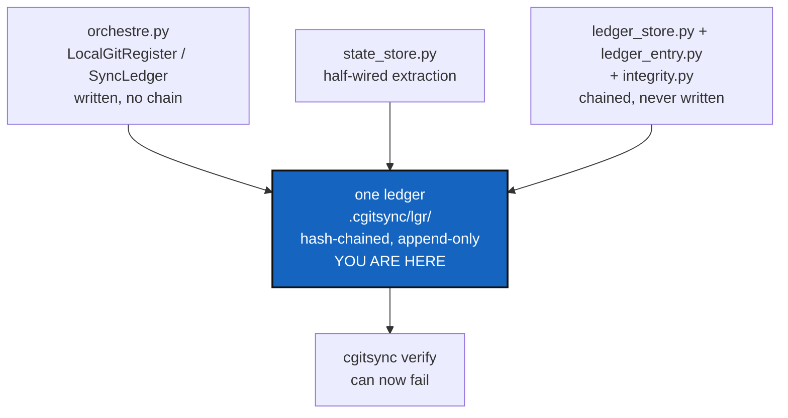

# OneRegister — one ledger, written for real, able to fail

*Created: 2026-09-12*

> **Milestone M3** of [MemoryArchitecture](1-1_MemoryArchitecture_DevPlanTicket.md).
> Split from `AgentSpec/archive/20260912_StateMemory_DevPlanTicket.md`
> (§3.2, §3.3, §3.4, findings F1, F3, F4, decisions D2 and D3).

## Abstract — read this first

**The one-line version.** Three attempts at remembering things are in the
tree at once — the live one in `orchestre.py`, a half-wired extraction in
`state_store.py`, and a hash-chained one that only `verify` reads and
nothing writes. This milestone leaves one.

**What this document is.** The ticket that turns the ledger from a
convention into evidence. It is the last thing that has to be true before
a memory is worth sending anywhere.

**Why it exists.** A memory repository is only as good as the chain inside
it. Push today's ledger and you push a TOML file rewritten in full on every
operation, with no `prev` and no entry hash, in which an edit leaves no
trace. Push a real chain and a reader on another machine can check it.

**What you will find.** §1 the three registers and the two decisions that
pick one. §2 the copy-forward, which is a correctness bug and not only a
size one. §3 the checks that become possible here. §4 the work. §5
acceptance.

**Who it is for.** Whoever takes M3, after
[StateIdentity](1-3_StateIdentity_DevPlanTicket.md) has landed. Not
before: a chain whose entries name timestamp-derived directories records
nothing a second machine can use.

**What you need to do with it.** Settle §1's two decisions in writing,
then §4.

---

## 1. Three registers, two decisions

**D1 — which implementation survives?** Recommended: the hash-chained one
(`ledger_store.py` / `ledger_entry.py` / `integrity.py`), with
`LocalGitRegister`/`SyncLedger` reduced to a reader for the existing
single-file format so old workspaces keep resolving.

The alternative — deleting the hash-chained modules and `verify` with them
— is honest and cheap, and it throws away the only tamper-evident design
in the tree. The memory architecture needs one, so the recommendation
stands; but the choice is real and should be written down rather than
assumed.

**D2 — one ledger per tree, or one per state?** Recommended: **one**, at
`<cgshome>/.cgitsync/lgr/`, which is where `verify` already looks. That
deletes §2's copy-forward outright.

Whatever is decided, the live write path routes through
`ledger_store.append_entry`, and `record_snapshot`/`record_event` become
thin callers. Old single-file registers stay readable; entries written by
an older build are never rewritten.

## 2. The copy-forward is a correctness bug

Before each write, `write_gts_snapshot` finds the previous register and
copies it into the new state directory. Two problems, and the second is
the serious one:

- **Growth.** After *n* operations, `.cgitsync/` holds *n* copies of a
  register of length *n*. Quadratic in bytes, for a file that only grows.
- **The parent is chosen by modification time.** `_latest_state_artifact`
  takes `max(..., key=st_mtime)`. Restore a backup, copy a tree with `cp
  -p`, or run twice inside one filesystem timestamp tick, and the new
  register forks from the wrong parent — silently, with no error and no
  way to notice afterwards.

Under a real chain the question disappears: the parent is `HEAD`, and
`HEAD` is a fact recorded in the ledger, not a property of the filesystem.
Delete the copy-forward and the mtime lookup together.

The same file also holds F4's duplication: `_STATE_DIR_RE` and its helpers
live in `state_store.py` and are copied into `snapshot_resolver.py`, and
the hash canonicalisation is implemented twice, in `ledger_entry.py` and
`integrity.py`, the latter documenting the duplication as deliberate and
temporary. The work package that made it temporary has landed. This is the
reconciliation those comments promised.

## 3. The checks that become possible here

`verify`'s `Finding` enum already names three store-level results that are
implemented nowhere, because until M2 none of them was checkable:

| Finding | Now checkable because |
|---|---|
| `STATE_DIGEST_MISMATCH` | A State's name is a checksum of its content, so a stored `.gts` that no longer matches its name is detectable |
| `MISSING_STATE` | Entries name States, so an entry pointing at a State that is not on disk is detectable |
| `ORPHAN_STATE` | A State on disk that no entry ever recorded is detectable |

[VerifyHonesty](1-2_VerifyHonesty_DevPlanTicket.md) made `verify` honest
about what it could see. This milestone gives it something to see, and
these three are how you prove it.

## 4. The work

| WP | Depends on | Touches | Deliverable |
|---|---|---|---|
| **WP-R1** | — | this ticket | §1's two decisions, answered in writing |
| **WP-R2** | WP-R1 | `orchestre.py`, `ledger_store.py` | The live write path goes through `append_entry`; `.cgitsync/lgr/` is actually written |
| **WP-R3** | WP-R2 | `orchestre.py`, `state_store.py` | The copy-forward and the mtime parent lookup are gone; the chain's parent is `HEAD` |
| **WP-R4** | WP-R2 | `ledger_entry.py`, `integrity.py` | One canonicalisation function, shared |
| **WP-R5** | WP-R2 | `orchestre.py`, `integrity.py` | §3's three findings implemented |
| **WP-R6** | — | `orchestre.py`, `ledger_store.py` | Legacy single-file registers still read. One-way migration; nothing is rewritten |
| **WP-R7** | all | `tests/` | §5's cases, each provoked rather than asserted |
| **WP-R8** | all | tests, docs, this ticket | Checklist, then archive under [TICKETLIFECYCLE.md](../../.agentSpec/TICKETLIFECYCLE.md) |

**Explicitly not here.** Locking — two processes in one workspace still
race, and that is [StateLocking](2-4_StateLocking_DevPlanTicket.md).
Pushing a ledger anywhere — that is M5. Changing any CLI flag or public
client signature: `--gts`, `--search-dir` and friends resolve exactly what
they resolve today, whatever happens underneath.

## 5. Acceptance

- A real operation writes an entry to `.cgitsync/lgr/`, and `verify`
  reports a non-empty verified chain on a workspace with history.
- `verify` reports corruption when one byte is flipped in an entry file —
  which is impossible to provoke today.
- `verify` reports `STATE_DIGEST_MISMATCH` when a stored `.gts` is edited,
  `MISSING_STATE` for an entry with no State, `ORPHAN_STATE` for a State no
  entry recorded. One test each.
- Two state writes with identical mtimes chain correctly, because the
  parent came from `HEAD`.
- `.cgitsync/` holds exactly one ledger. No file is copied forward into a
  state directory.
- The hash canonicalisation appears once in `src/`.
- A workspace created before this change still resolves its snapshot and
  still runs every command.
- `pixi run lint` and `pixi run test` pass.
