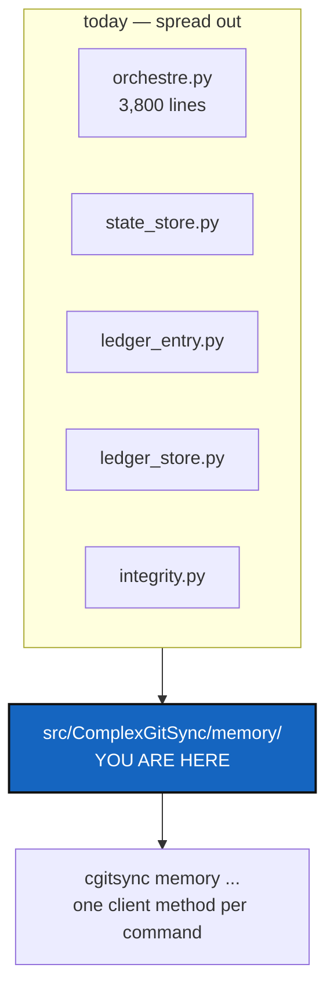

# MemoryModule — memory gets its own source area, and a command to match

*Created: 2026-09-12*

> **Milestone M4** of [MemoryArchitecture](1-1_MemoryArchitecture_DevPlanTicket.md).
> From the owner's `AgentSpec/shortTickets/memorySpecs.md`: *"As cli has
> its one src folder, i would suggest memory too"*.

## Abstract — read this first

**The one-line version.** Everything a workspace remembers is currently
spread across `orchestre.py`, `state_store.py`, three ledger modules and a
resolver; before it grows a network protocol it needs one home and one
command.

**What this document is.** The refactor-and-surface milestone. It moves no
decisions and adds no storage format — it gives the subject a place to
live and a way for a user to look at it.

**Why it exists.** M5 and M6 add a protocol, a repository and a distant
index. Adding those to code that has no home means adding them to
`orchestre.py`, which is 3,800 lines and already the thing every other
extraction was trying to get out of. `cli/` earned its own package when it
outgrew one file. Memory is a larger subject than the CLI.

**What you will find.** §1 what moves. §2 where it sits in the ring
structure. §3 the command surface. §4 the work. §5 acceptance.

**Who it is for.** Whoever takes M4, after
[OneRegister](1-4_OneRegister_DevPlanTicket.md). Doing it earlier means
moving code that is about to change shape.

**What you need to do with it.** §1 is a move, not a rewrite. Resist
improving things on the way past.

---

## 1. What moves

`src/ComplexGitSync/memory/`, assembled from what already exists:

| Comes from | Becomes | Why it belongs |
|---|---|---|
| `state_store.py` | `memory/states.py` | The state area *is* memory |
| `ledger_entry.py`, `ledger_store.py`, `integrity.py` | `memory/ledger.py`, `memory/integrity.py` | The ledger *is* memory |
| `orchestre.py`'s `LocalGitRegister` / `SyncLedger` / `write_gts_snapshot` | `memory/store.py` | The last live copy, and the one that must stop being in the orchestrator |
| — | `memory/__init__.py` | The public surface the client calls, and the only thing outside `memory/` imports |

`snapshot_resolver.py` **stays where it is.** It answers "which workspace
and which snapshot did the user mean", which is a CLI question about
resolution, not a question about what is remembered. It will import from
`memory/`; it does not move into it.

This is a move, not a redesign. A move whose diff contains new behaviour
is two changes wearing one hat, and the ratchet in
`scripts/ceiling_baseline.json` will show it: `orchestre.py` must come out
of this **smaller**, and nothing else may grow except the new package.

## 2. Where it sits

`memory/` is Ring 1: filesystem and clock, no `subprocess`, no Git. It is
imported by `orchestre.py` (Ring 3) and by `snapshot_resolver.py`; it
imports `cgs_format`, `gts_document` and `paths`, and nothing above it.

M5 is where that changes — a memory repository has to be committed and
pushed, which is Git. When it does, the Git work belongs to
`operations.py` and `git_runner.py` as it does for every other repository
in the tree, driven *by* `memory/`, not done inside it. Write that
boundary into the module docstring now, while it is still true and cheap to
state.

`.localSpec/AdditionalSpecs.md`'s responsibility table and ring diagram
gain their rows in this ticket, per `CLAUDE.md`'s rule that they are
updated in the same change that moves responsibility.

## 3. The command surface

Per `CLAUDE.md`'s mirror rule, every capability exists as a
`ComplexGitSyncClient` method carrying the semantics, plus a thin
`_handle_*`/`_execute_*` pair that collects arguments and prints. A
command group with no client method is unreachable from Python; a client
method with no command is unreachable for users.

Read-only to start with, because M4 ships before there is anywhere to push:

| Command | Answers |
|---|---|
| `cgitsync memory status` | How many States, how long the chain is, when it was last written, and which of [VerifyHonesty](1-2_VerifyHonesty_DevPlanTicket.md)'s four answers this memory is in |
| `cgitsync memory list` | The States this workspace holds, by name, with the ledger's timestamp for each |
| `cgitsync memory show <hash>` | One State: what it recorded, and every ledger entry that names it |

`cgitsync verify` stays where it is and keeps its name. It is the
integrity question, users already know it, and moving it would break the
CLI contract for no gain.

Whether these live under a `memory` command group or as flat commands is
this ticket's own call; the README's Minimalist/Expert/Configuration
grouping decides where the module goes in `cli/`. A group reads better and
the README table must show every subcommand either way.

## 4. The work

| WP | Touches | Deliverable |
|---|---|---|
| **WP-M1** | `memory/` (new), the five source modules | The move of §1, behaviour identical, `orchestre.py` smaller |
| **WP-M2** | `.localSpec/AdditionalSpecs.md`, `CLAUDE.md` | The responsibility table, the ring diagram, and the Git boundary of §2 |
| **WP-M3** | `orchestre.py` | The three client methods behind §3's commands |
| **WP-M4** | `cli/` | The command surface, in the group the README's own grouping implies |
| **WP-M5** | `README.md`, `docs/Text/user_guide.tex`, `docs/Text/api_python.tex` | Each new command in the README table and the user guide; each client method in the API doc. The README half is enforced by `test_cli_smoke.py` |
| **WP-M6** | `scripts/ceiling_baseline.json`, `tests/` | The new package recorded; tests moved with their modules |
| **WP-M7** | all | Checklist, then archive under [TICKETLIFECYCLE.md](../../.agentSpec/TICKETLIFECYCLE.md) |

**Explicitly not here.** Any repository, any commit, any network. A memory
is still a directory on one disk when this ticket closes — it just has a
home, a name, and a way to look at it.

## 5. Acceptance

- `src/ComplexGitSync/memory/` exists, and `grep` finds no ledger or
  state-store logic left in `orchestre.py`.
- `orchestre.py`'s recorded LOC is lower than before this ticket; no
  module outside `memory/` grew.
- `cgitsync memory status` on this repository's own workspace prints a
  true answer, including which of the four verification states it is in.
- `cgitsync memory list` names every State in `.cgitsync/state/` with the
  ledger timestamp for each.
- Every new command is in the README table, the user guide, and the Python
  API doc.
- No existing command's output changes.
- `pixi run lint` and `pixi run test` pass.
