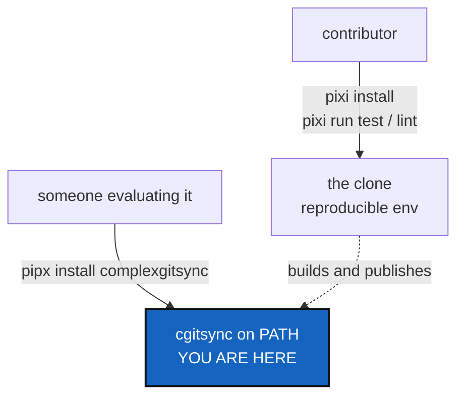

# UserInstallPath — Pixi for contributors, one install command for everyone else

*Created: 2026-09-11*

> **Release review — 2026-09-11. Priority 1-5.** Promoted from 2-6 for a tested installation outside the source checkout and a repeatable public release. Support only validated platforms; broader coverage is deferred.

## Abstract — read this first

**The one-line version.** A person evaluating this tool should type one
install command and get `cgitsync`, without cloning the source, installing
Pixi, or learning anything about Python environments.

**What this document is.** A ticket, from an outside review of the project
on 2026-09-10. Nothing here has been built.

**Why it exists.** Pixi is the right answer for developing and testing this
project, and nothing below removes it. The problem is narrower: Pixi is
currently the *only* route in, so a user must adopt the maintainer's
toolchain before running a Git tool once. `README.md` §1.2 says so
outright — *"There is no global install: every invocation is `pixi run
cgitsync ...`, run from inside the clone below."* That sentence is the
obstacle. Pixi should solve the maintainer's problem without becoming the
user's.

**What you will find.** §1 how close the packaging already is. §2 what is
missing. §3 the decisions, of which the version scheme is the awkward one.
§4 work packages. §5 acceptance.

**Who it is for.** Whoever picks this up, and the owner, who answers §3.

**What you need to do with it.** Answer §3, then §4 in order.

---

## 1. How close this already is

Most of the work is done. `pyproject.toml` today:

| Field | Value | Verdict |
|---|---|---|
| `build-system` | `hatchling>=1.27` | A standard backend. Nothing to change |
| `[project.scripts]` | `cgitsync = "ComplexGitSync.cli:main"` | The console entry point already exists |
| `dependencies` | `tomli-w>=1.0,<2` | One runtime dependency, bounded |
| `requires-python` | `>=3.11` | Declared |
| `license`, `readme`, `authors` | present | Enough for a package page |

The console entry point and wheel configuration are present. Prove the
built artifact installs and runs outside the checkout in a clean environment;
metadata inspection alone does not prove installation works. Document Git on
PATH, the supported Python version, and how to obtain the chosen installer
(such as pipx). User installation must not depend on Pixi or mounted developer
repositories.

## 2. What is missing

| # | Missing | Why it matters |
|---|---|---|
| 2.1 | Publication status must be checked before release | Package-name ownership/availability was not checked in this local planning review |
| 2.2 | No `classifiers`, no `[project.urls]` | The package page would carry no link to the repository, no issue tracker, no supported-Python badge |
| 2.3 | No publish workflow | Releasing by hand from a laptop is how a wrong artefact gets uploaded once and can never be replaced |
| 2.4 | No `CHANGELOG.md` | A user upgrading has no way to learn what changed |
| 2.5 | CI runs on `ubuntu-latest` only | Nothing tests that this works on macOS or Windows, so nothing may claim it does |
| 2.6 | `README.md` §1.2 tells every reader to use Pixi | The user path and the contributor path are the same paragraph |

**Not in this ticket.** Standalone binaries built with PyInstaller or
Nuitka. They bring per-OS builds, architecture variants, signing and
notarisation, and a second upgrade channel. They are worth revisiting once
the CLI and the `.cgs` grammar have settled, and not before.

## 3. Decisions — your call

### D1. The version scheme, which publishing forces

`pyproject.toml` reads `version = "0002.49"` at this review. Recheck the
current value when implementing the release. `CLAUDE.md` calls this
`YYYY.XX`, but `0002` is not a year — it is a counter. Publishing makes
this a user-visible problem for two reasons:

- PEP 440 normalises `0002.49` to `2.49`, so the package page and
  `pipx install complexgitsync==...` would show a version the repository
  never writes.
- Ordering is then by number, so `2.49` sorts after `2.9`. That is fine
  going forward and surprising to read.

Three ways out, all needing a decision before anything is uploaded:

| Option | What happens |
|---|---|
| **Publish `2.49` and adopt it** (recommended) | Accept the normalised form, change the release to write `2.49`, and update `bump-version` and `CLAUDE.md`'s `YYYY.XX` wording to match what the file actually holds |
| Re-base on a real calendar version | `2026.9` and onward. Honest about what the number is, and a discontinuity in the sequence |
| Move to semantic versioning | Fits the stability promises in `CliContract`, and is the largest change |

Whichever wins, `pixi run bump-version` is the only thing allowed to write
the version, per `CLAUDE.md`. It has to keep being so.

### D2. What is the published name?

`name = "ComplexGitSync"` normalises to `complexgitsync` on PyPI, so
`pipx install complexgitsync` is what a user types while the repository
says `ComplexGitSync`. Confirm that is acceptable, and check the name is
available or under the owner's control before publication. This gates publishing,
not artifact testing, metadata, documentation drafts, or other preparation.

### D3. Which operating systems are supported?

First-release decision: claim support only for platforms actually validated,
including the installed artifact. The existing Linux CI is the starting point;
macOS and Windows expansion may follow later and must not block release.
Select compatible runners for the Pixi platforms when extending CI, and test
Git invocation and path handling on each newly claimed platform.

### D4. Does publishing happen on a tag, and by whom?

Recommendation: a GitHub Actions job on a tag, using PyPI's trusted
publishing, so no token is stored anywhere. Confirm the owner wants
releases cut from a tag rather than manually.

## 4. Work packages

| WP | Depends on | Touches | Deliverable |
|---|---|---|---|
| **WP-U1** | D2 | — | Check publication status and name ownership/availability before publishing. Arrange the chosen name with the owner; unrelated preparation can proceed |
| **WP-U2** | D1 | `pyproject.toml`, `scripts/bump_version.py`, `CLAUDE.md` | The version scheme decided in D1, written by `bump-version` alone, with `CLAUDE.md`'s wording matching what the file holds |
| **WP-U3** | — | `pyproject.toml` | `classifiers` and `[project.urls]`: repository, issues, documentation |
| **WP-U4** | D3 | `.github/workflows/ci.yml` | Validate the installed artifact on each claimed platform. CI already uses the existing `examples/complexgitsync4dev.cgs`; the former filename bug is fixed. Additional platforms are optional follow-up work |
| **WP-U5** | D4, WP-U1 to WP-U3 | `.github/workflows/` | A release workflow on a tag: build, check the artefact, publish through trusted publishing. Test it against TestPyPI first |
| **WP-U6** | WP-U2 | `CHANGELOG.md` | A changelog, starting at the first published version. State whether `bump-version` touches it or a person does |
| **WP-U7** | WP-U5 | `README.md`, `docs/Text/` | Document Git, supported Python, installer prerequisites, and a clean-environment installation. Split the two audiences. A user section opening with `pipx install complexgitsync` and `cgitsync --help`; the Pixi instructions kept and moved under a contributor heading. §1.2's "no global install" sentence goes |
| **WP-U8** | WP-U7 | tests, docs, this ticket | `pixi run lint` and `pixi run test`; the before-committing checklist; archive this ticket in the implementing commit |

## 5. Acceptance

- On a machine with no clone of this repository and no Pixi,
  `pipx install complexgitsync` followed by `cgitsync --help` works, and
  `cgitsync --version` prints the published version. The installed artifact
  also runs a local workspace smoke check outside the source checkout with
  the documented Git/Python/installer prerequisites and no developer mounts.
- The PyPI page links to the repository and the issue tracker and states
  the supported Python versions.
- CI passes on every operating system the README claims, and its
  dogfooding step names a `.cgs` file that exists.
- A tag produces a published release with no manual upload step and no
  stored token.
- `CHANGELOG.md` has an entry for the released version.
- `README.md` reaches the user install command before it mentions Pixi,
  and the Pixi instructions are still there, under a contributor heading.
- `pixi run lint` and `pixi run test` pass.

## 6. Coordination and deferred work

Coordinate the version scheme with [1-4 CliContract](1-4_CliContract_DevPlanTicket.md)
before committing to major-version compatibility promises. Broadening operating
system coverage and standalone binaries remain follow-up work, not release gates.
Publication, package-name/account changes, tags, and remote workflow execution
are future release actions; this planning review authorizes none of them.
