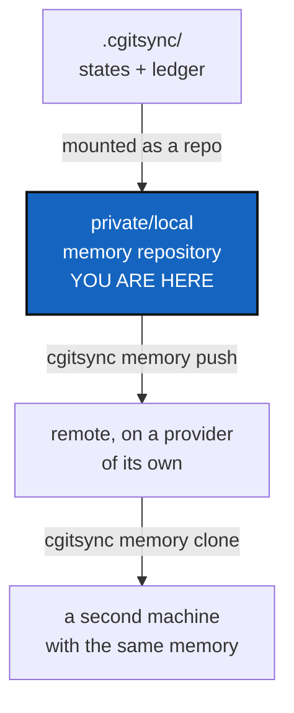

# MemoryRepoLocal — a project's memory survives its machine

*Created: 2026-09-12*

*Branch: memory-dev*

> **Milestone M5** of [MemoryArchitecture](1-1_memDev-MemoryArchitecture_DevPlanTicket.md).
> Carries §4 of `AgentSpec/archive/20260912_StateMemory_DevPlanTicket.md`,
> which designed `.cgitsync/` as a repository and set the gates it has to
> pass first.

## Abstract — read this first

**The one-line version.** `.cgitsync/` becomes a private/local repository,
mounted like any other, so a project's states and ledger are committed,
pushed, and still there when the disk is not.

**What this document is.** The milestone that makes a memory portable in
practice rather than in principle. It is the first one that touches a
network, and the first that can leak something.

**Why it exists.** Everything before this makes the memory correct, single
and verifiable — on one machine. This is the point of the exercise: a
laptop that dies takes a project's whole synchronisation history with it,
and a second machine that clones the same tree starts with no memory at
all.

**What you will find.** §1 why `.cgitsync/` is ignored today and what that
decision actually was. §2 the gates, which are the real content of this
ticket. §3 what graduation changes. §4 the work. §5 acceptance.

**Who it is for.** Whoever takes M5, after
[MemoryModule](1-5_memDev-MemoryModule_DevPlanTicket.md). The owner signs off §2
before anything is pushed.

**What you need to do with it.** Check every gate in §2 honestly. A gate
you argue around is a leak you ship.



---

## 1. Why it is ignored today, and what that decision was

`.gitignore` excludes `.cgitsync/` and the root `<name>.lgr`, written into
every tree root by `sync_gitignore`. That came from
`archive/20260903_CgitsyncGitignoreLeak_DevPlanTicket.md`, which
reproduced a real leak: running a tutorial against a real project committed
`.cgitsync/state(366ca0a3…)_0/…` into that project as ordinary content.

That fix was never "the memory must not be versioned". It was "the memory
must not be committed **into the project repository, as untyped project
content**". Those are different statements and only the second was ever
true. While the format was churning, ignoring it was right — a store whose
schema changes weekly is scratch, and scratch does not belong in a
project's history.

M2 and M3 are what end the churn. Once a State's name is a checksum of its
content and the ledger is a verifiable chain, the memory stops being
scratch and starts being evidence.

## 2. The gates

Graduation is not a date, it is a checklist. Every item is objectively
checkable, and all of them hold before §3 begins:

| # | Gate | How it is checked |
|---|---|---|
| G1 | State names are content-derived | M2 landed; `grep` finds no `new_time_l0_anchor` in the state-naming path |
| G2 | Cross-machine determinism | The same tree, cloned twice, yields the same State name — an integration test on two runner images |
| G3 | The chain is real | `verify` reports a non-empty chain on a workspace with history, and reports a bad entry hash when one byte is flipped |
| G4 | Store-level integrity | M3's three findings implemented, each provoked by a test |
| G5 | **No secrets, no machine identity** | The memory carries no credential, no OS user name, no absolute path outside the tree root |
| G6 | Schema pinned, with a migration path | The ledger declares a version; one written by version *X* is read by *X+1*, proven by a fixture rather than asserted |
| G7 | One memory, one implementation | M3 closed; `.cgitsync/` holds exactly one ledger |

**G5 is the one most likely to be waved through.** Today's live register
records `snapshot_path = "$HOME/.cgs/CGS…/ComplexGitSync/…"` and `actor =
"flipoyo"`. The `$HOME` prefix is substituted; the rest of the path and the
login name are verbatim. `ledger_store` already scrubs credentials from
argv and URLs, while `LocalGitRegister`/`SyncLedger` scrub nothing at all.
Pushing that today publishes one developer's directory layout and user
name. Paths become relative to the tree root, and `actor` becomes a
deliberate, documented, opt-in field — before anything leaves the machine,
not after someone notices.

## 3. What graduation changes

The memory is declared in the `.cgs` like any other private entry:

```toml
memory = { repository = "github:you/.memory-MyProject", relative_path = ".cgitsync", private = true, writable = true }
```

The parent's `.gitignore` still lists `.cgitsync/`, because that is the
ordinary rule for every child mount — the same line that keeps `docs/` out
of ComplexGitSync's own index. **The line stays and its meaning changes**,
from suppressed scratch to a mounted repository with a history of its own.

The commands, mirroring the client as `CLAUDE.md` requires:

| Command | Does |
|---|---|
| `cgitsync memory init` | Proposes a memory repository name per D3 of the architecture, and mounts it once the user accepts |
| `cgitsync memory push` | Commits what the memory gained and pushes it |
| `cgitsync memory clone` | Brings a project's memory onto a machine that does not have it |

No automatic push. D4 of the architecture says the cadence question is
answered from evidence once there is a protocol to measure, and until then
every network operation is a command somebody typed.

**Offline is not a failure mode**, it is the normal case. A machine with
no network keeps a complete, valid, verifiable local memory and pushes it
later. Nothing in the local write path may depend on a remote being
reachable.

## 4. The work

| WP | Depends on | Touches | Deliverable |
|---|---|---|---|
| **WP-L1** | — | `memory/`, `orchestre.py` | G5: paths relative to the tree root, `actor` opt-in and documented, both scrubbers unified |
| **WP-L2** | WP-L1 | `memory/`, `cgs_format.py` | The memory mount: declared in the `.cgs`, resolved like any private entry |
| **WP-L3** | WP-L2 | `memory/`, `operations.py` | `init` / `push` / `clone`, with the Git work done through `operations.py` and `git_runner.py`, driven by `memory/` |
| **WP-L4** | WP-L3 | `cli/`, `README.md`, `docs/` | The three commands, in the README table, the user guide and the API doc |
| **WP-L5** | — | `tests/integration/` | The rewritten leak regression of §5, plus a memory-as-a-git-repository test mode |
| **WP-L6** | all | this ticket | Every gate in §2 checked and recorded, then archive under [TICKETLIFECYCLE.md](../../.agentSpec/TICKETLIFECYCLE.md) |

**Explicitly not here.** The distant reference ledger — that is M6. Merge
rules for two people writing one memory repository: the architecture's §5
says that is its own ticket, opened when someone needs it.

## 5. Acceptance

- Every gate in §2 holds, each with the evidence recorded in this ticket.
- A memory repository can be initialised, pushed, and cloned onto a second
  machine, where `cgitsync memory status` reports the same States and the
  same chain.
- With no network, every local command still works and the memory still
  verifies.
- **The leak regression is rewritten to the invariant that survives**:
  `git ls-files .cgitsync` is empty in the project repository, whatever
  mechanism keeps it out. No test asserts that `.cgitsync/` is invisible to
  Git, because under this ticket it is a repository.
- A pushed memory contains no absolute path outside the tree root and no OS
  user name unless the user configured one deliberately.
- `pixi run lint` and `pixi run test` pass.
