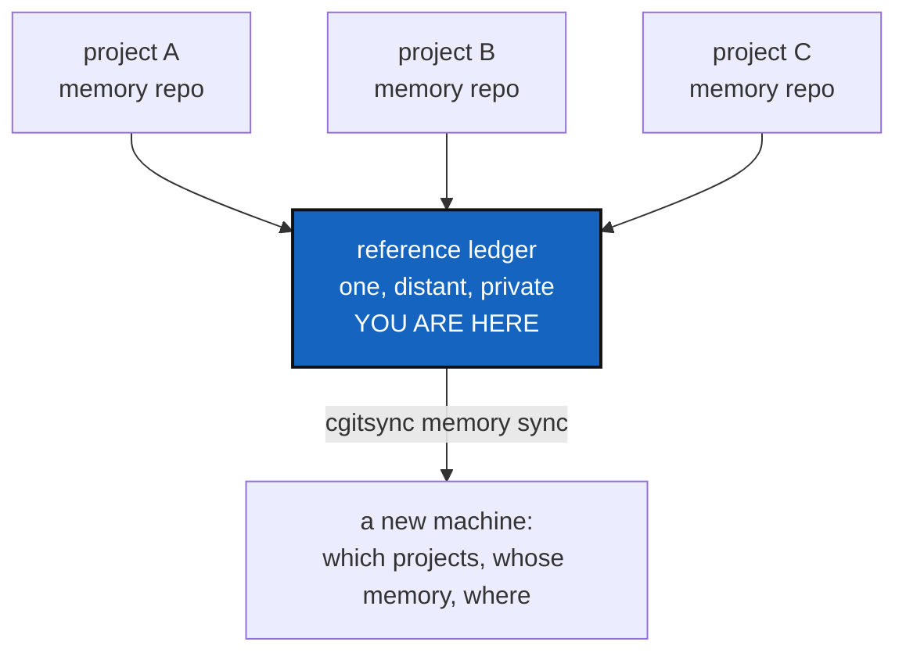

# MemorySyncDistant — one place that knows which projects exist

*Created: 2026-09-12*

> **Milestone M6** of [MemoryArchitecture](1-1_MemoryArchitecture_DevPlanTicket.md),
> and the last of them. From the owner's
> `AgentSpec/shortTickets/memorySpecs.md`: *"cgitsync should be capable of
> synchronizing local memory repos with its own private/distant global
> reference ledger that records all cgitsync administrated pushed
> private/local project-name/.cgitsync"*.

## Abstract — read this first

**The one-line version.** Every project's memory is pushed somewhere, and
one distant ledger records where — so a new machine can ask "what do I
administer, and where is its memory" and get a complete answer.

**What this document is.** The protocol milestone: what the distant
reference ledger holds, what it never holds, and what synchronising it
means.

**Why it exists.** After M5 each project's memory survives its machine,
but only if you already know the memory repository's name. A fresh laptop,
a colleague picking up the work, or a person coming back after a year has
no list. The reference ledger is that list, and keeping it on a provider of
its own means the account that holds the code cannot silently rewrite the
record of what was synchronised.

**What you will find.** §1 what the reference ledger holds. §2 what it
must never hold. §3 the protocol. §4 the decisions. §5 the work. §6
acceptance.

**Who it is for.** Whoever takes M6, after
[MemoryRepoLocal](1-6_MemoryRepoLocal_DevPlanTicket.md). Nothing here is
safe to build on a memory that has not passed M5's gates.

**What you need to do with it.** Settle §4, then §5. §2 is not negotiable.

---

## 1. What the reference ledger holds

One repository for every project this installation administers, holding an
index and nothing else. One record per project:

| Field | Example | Why |
|---|---|---|
| project name | `MyProject` | What the user calls it |
| memory repository | `github:you/.memory-MyProject` | Where the memory actually is |
| last pushed head | the ledger head hash at the last push | Lets a reader tell a stale record from a current one |
| recorded at | a timestamp | When this installation last announced it |

That is the whole schema, and keeping it that small is a design choice, not
laziness. Anything more turns a findable index into a second copy of
everything, with its own consistency problem.

It is **read-mostly and write-rarely**: one small record changes when a
project's memory is pushed.

## 2. What it must never hold

- **No States.** A `.gts` lives in its project's memory repository. The
  reference ledger points; it does not store.
- **No credentials, no machine identity.** M5's G5 applies here with no
  exceptions — this repository is the most widely shared thing in the
  system.
- **No private project content.** A project name and a repository address
  are already a disclosure: whoever can read the reference ledger learns
  every project this installation administers. That is a deliberate,
  documented consequence of having one, and the reason it is private and
  distant rather than public.

## 3. The protocol

Three operations, each one a command someone typed:

| Step | What happens |
|---|---|
| **announce** | After a memory push, this project's record in the reference ledger is updated with the new head |
| **discover** | Read the reference ledger and list every project it knows, marking which ones this machine has a workspace for |
| **adopt** | Given a project name from that list, clone its memory and stand up a workspace from the State the ledger names |

**Adopt is the payoff.** Everything before it is bookkeeping; this is the
step where a new machine goes from nothing to a working tree, from a name
alone. If adopt does not work, the whole memory path was an expensive way
to store files.

**Conflict is the hard part and must be answered, not avoided.** Two
machines announcing the same project, whose heads disagree, is the normal
case for a person with a laptop and a desktop. The minimum acceptable
behaviour: the announcement is refused, both heads are named, and the user
is told which command reconciles them. Silently taking the later timestamp
is how evidence gets lost.

## 4. Decisions — the owner's call

### D1. Is there one reference ledger, or one per person?

Recommended: **one per installation**, named in a per-user configuration
rather than in any project's `.cgs` — it is a property of who is
administering, not of what is administered. `master.py` already owns
per-workspace identity in `.cgitsync/master.toml`; this is the same kind
of fact, one level up.

### D2. What happens when a project is renamed or retired?

Recommended: records are never deleted, only marked retired, with the
timestamp. A reference ledger that forgets is a reference ledger you cannot
trust to be complete.

### D3. Does adopt trust the reference ledger?

It cannot, fully — the ledger says where a memory is, and the memory says
what the project was. Recommended: adopt clones the memory, verifies its
chain (M3's `verify`), and refuses to build a workspace from a memory that
does not verify. The reference ledger is an address book, not an authority.

## 5. The work

| WP | Depends on | Touches | Deliverable |
|---|---|---|---|
| **WP-D1** | D1 | `memory/`, `master.py` | Where the reference ledger is configured, and how a user points at theirs |
| **WP-D2** | WP-D1 | `memory/` | The record schema of §1, versioned like M5's G6 requires |
| **WP-D3** | WP-D2 | `memory/`, `operations.py` | announce, with §3's conflict rule |
| **WP-D4** | WP-D2 | `memory/` | discover |
| **WP-D5** | WP-D3, WP-D4, D3 | `memory/`, `orchestre.py` | adopt: clone the memory, verify it, build the workspace |
| **WP-D6** | WP-D5 | `cli/`, `README.md`, `docs/` | `cgitsync memory announce` / `discover` / `adopt`, each in the README table, the user guide and the API doc |
| **WP-D7** | all | `tests/integration/` | §6's cases, including two machines disagreeing |
| **WP-D8** | all | `.localSpec/AdditionalSpecs.md`, this ticket | The architecture section, then archive under [TICKETLIFECYCLE.md](../../.agentSpec/TICKETLIFECYCLE.md) |

**Explicitly not here.** Any automatic or scheduled synchronisation.
Merging two divergent memory chains — §3 refuses and reports, and a real
merge rule is its own ticket. Anything resembling a hosted service:
everything here is Git repositories and commands.

## 6. Acceptance

- From a machine with no workspace and only a reference ledger address,
  `cgitsync memory discover` lists the projects, and `cgitsync memory
  adopt <name>` produces a working tree that `cgitsync status` reports as
  READY.
- Adopt refuses a memory whose chain does not verify, and says why.
- Two machines announcing divergent heads for one project: the second is
  refused, both heads are named, and the message says what to do.
- The reference ledger contains no `.gts`, no credential, no absolute path
  and no OS user name.
- Everything still works with no network except the three commands that
  are explicitly about the network.
- `pixi run lint` and `pixi run test` pass.
- [MemoryArchitecture](1-1_MemoryArchitecture_DevPlanTicket.md) is archived
  in the same commit: with M6 landed, the design it describes is the system
  that exists, and its content belongs in
  `.localSpec/AdditionalSpecs.md` rather than in an open ticket.
