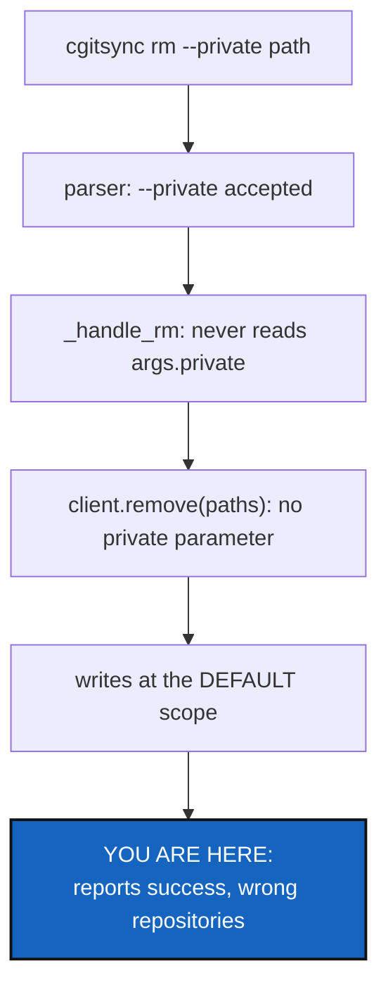

# DeadScopeFlags — `rm --private` and `freeze --private` are accepted and ignored

*Created: 2026-09-11*

## Abstract — read this first

**The one-line version.** Two commands advertise `--private` in their help,
accept it without complaint, and then do exactly what they would have done
without it — because the handler never reads the flag.

**What this document is.** A bug ticket with the cause already located.
Split out of UnifiedProjectPrivateScope §4.1, which found these while adding
`--all` and deliberately did not fix them: an additive flag should not carry
unrelated repairs in on its back.

**Why it exists.** A flag that does nothing is worse than a missing one. A
missing flag fails loudly and the user tries something else. This one
reports success while writing to the repositories the user was trying to
avoid — which is the exact failure the whole scope mechanism exists to
prevent.

**What you will find.** The evidence (§1), what makes it more than a wiring
job (§2), work packages (§3), acceptance (§4).

**Who it is for.** Whoever picks it up next. Read
[CLAUDE.md](../../CLAUDE.md) and its referenced specs first.

**What you need to do with it.** Read §2 before estimating — `rm` is not
symmetric with the others, and that is the whole of the work.

---

## 1. What was observed

Both flags are registered and neither is read:

| Command | Registered at | Handler | Reads it? |
|---|---|---|---|
| `rm` | `_add_private_argument(subparser, verb="Remove the paths from")` | `_handle_rm` | **no** |
| `freeze` | `_add_private_argument(subparser, verb="Freeze")` | `_handle_freeze` | **no** |

Both handlers pass only `paths`/`name` and `dry_run` to their `_execute_*`,
and neither `_execute_rm` nor `_execute_freeze` takes a scope at all. Every
other command that registers the flag threads it through to
`resolve_command_scope`.

`client.remove()` has no `private` parameter either, so this is not a CLI
wiring oversight alone — the capability is missing from the Python API
as well, which the CLI is supposed to mirror.

## 2. Why this is not just wiring

**`rm` takes explicit paths, and the other scoped commands do not.** `add`
and `commit` sweep a scope; `rm` is given specific files and resolves each
one to the repository that owns it. A path either lands in a private
repository or it does not, and the resolution already knows which. So
`--private` on `rm` has two possible meanings, and the ticket must choose:

| Reading | Behaviour |
|---|---|
| **A filter** | Refuse a path that resolves outside the writable configuration repositories, the way the bare command should refuse one that resolves inside them. |
| **A scope** | The same `resolve_command_scope` call every other command makes, with the path resolution then constrained to it. |

They differ on the error a user sees when they name the wrong file, which
is the only thing this flag is for. Decide it explicitly.

**Whether the bare `rm` is safe today is the real question.** If `rm` has no
scope at all, then `cgitsync rm .localSpec/notes.md` already deletes from a
configuration repository with no flag and no refusal. Check that before
designing the flag: it decides whether this ticket is a missing feature or a
live hole in the safety rail.

**`freeze` is the simpler half** — it sweeps like the others, so it likely
is just wiring. Confirm that rather than assuming it.

## 3. Work packages

| WP | Where | Work |
|---|---|---|
| **WP-1** | none | Establish what bare `rm` does with a path inside a configuration repository today. Record the answer here; it sets this ticket's priority. |
| **WP-2** | this ticket | Decide §2's filter-or-scope question for `rm`. |
| **WP-3** | `orchestre.py` | Give `client.remove()` the scope parameter the mirror rule requires, alongside `private` and `all_writable`. |
| **WP-4** | `cli/expert.py` | Thread the flag through `_handle_rm`/`_execute_rm` and `_handle_freeze`/`_execute_freeze`. |
| **WP-5** | `tests/` | A test per command proving the flag changes what is written. Both must fail if the wiring is removed again. |
| **WP-6** | `cli/` | Sweep the parser for any other registered-but-unread argument, and add a test that fails when one exists. A flag nothing reads should not be possible to ship twice. |
| **WP-7** | docs, tests | `pixi run lint` and `pixi run test`; CLAUDE.md's before-committing checklist; archive under [TICKETLIFECYCLE.md](../../.agentSpec/TICKETLIFECYCLE.md). |

## 4. Acceptance criteria

- `rm --private` and `freeze --private` each change which repositories are
  written, proven by a test that fails if the flag stops being read.
- `client.remove()` exposes the same capability as the CLI flag, per
  CLAUDE.md's mirror rule.
- Bare `rm` and bare `freeze` behave exactly as they do today.
- WP-6's sweep reports no remaining flag that no handler reads, and a test
  keeps it that way.
- The `rm` decision from §2 is written down in this ticket before the code
  is written, not inferred from the diff afterwards.

## 5. Scope and handoff

Out of scope: `--all` for these two commands. Adding a second scope form to
a flag that does not work yet would be building on sand; once `--private` is
read, `--all` is a small follow-on if it is wanted at all.

Also out of scope: what `private` and `writable` mean, and the branch
fallback chain. Both are settled elsewhere.
