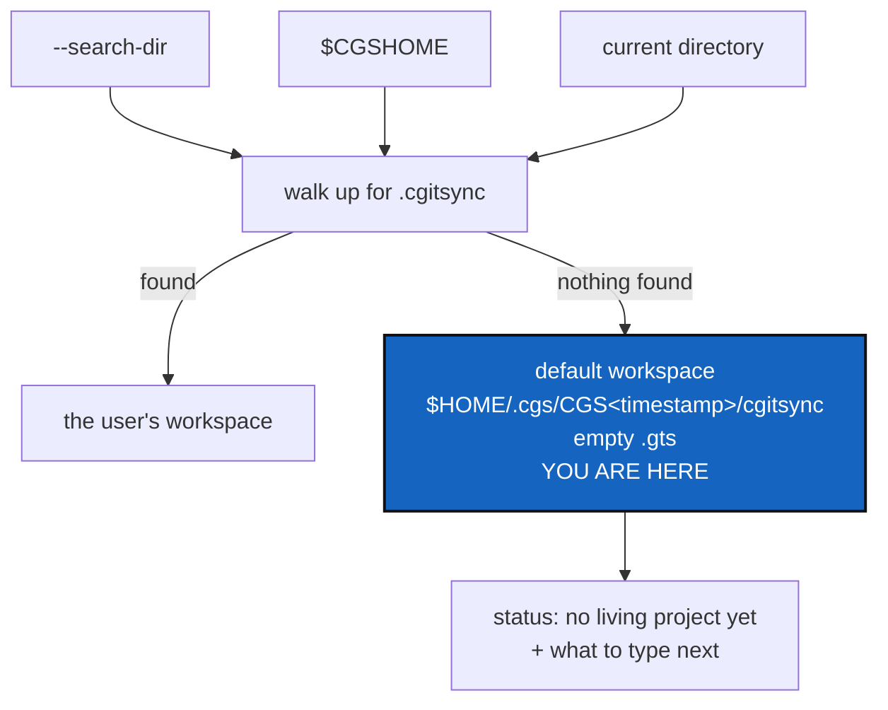

# CgshomeDefault — a default workspace that always exists, so no command has nothing to stand on

*Created: 2026-09-12*

*Branch: main*

> **Memory review — 2026-09-12. Priority 2-3.** Ranked behind
> [CliContract](2-1_CliContract_DevPlanTicket.md) and
> [UserInstallPath](2-2_UserInstallPath_DevPlanTicket.md) after the
> priority-1 pile became the memory path of
> [MemoryArchitecture](1-1_memDev-MemoryArchitecture_DevPlanTicket.md). Two
> points of contact, and they pull in the same direction:
>
> - **"No living project yet" is the empty-memory answer.** D2 here asks
>   what `status` says in a workspace with nothing in it. That is the same
>   question [VerifyHonesty](1-2_memDev-VerifyHonesty_DevPlanTicket.md) answers
>   for a ledger with no entries. One wording, decided once: a new
>   workspace is not a broken one.
> - **`$HOME/.cgs` is where an adopted project lands.**
>   [MemorySyncDistant](1-7_memDev-MemorySyncDistant_DevPlanTicket.md)'s `memory
>   adopt` builds a workspace from a memory on a machine that has none —
>   which is exactly the default-root question D1 asks here, arriving from
>   the other end. Settle D1 before adopt is built, or adopt will settle it
>   by accident.

> **Owner direction — 2026-09-12.** Stand-by, not
> prioritary. The approach is settled: when nothing else resolves,
> `CGSHOME` defaults to a real, empty workspace under `$HOME/.cgs`,
> holding an empty `.gts`, so `status` answers *"no living project yet"*
> instead of failing. The open questions in §3 are about when that
> workspace is created and what the empty answer looks like, not whether
> to have one.

## Abstract — read this first

**The one-line version.** `cgitsync status`, typed in a fresh clone with
nothing exported, ends in a Python traceback; it should land in a default,
empty workspace and say *"no living project yet"*.

**What this document is.** A ticket, written on 2026-09-12 from a bug
report on a fresh clone. Nothing here has been built.

**Why it exists.** Workspace discovery has three inputs — `--search-dir`,
`$CGSHOME`, the current directory — and every one has to be supplied by
the user. When none of them lands on a `.cgitsync` directory, the tool has
no state at all, and "no state" is currently spelled as an unhandled
exception. A tool that manages state should have a valid empty state: an
empty tree is not an error, it is a project that has not started.

**What you will find.** §1 what happens today, with the reported failure.
§2 the three defects. §3 the decisions — when the default workspace is
created, what the empty answer says, and what happens to workspaces
already on disk. §4 work packages. §5 acceptance. §6 coordination.

**Who it is for.** Whoever picks this up, and the owner, who answers §3.

**What you need to do with it.** Answer §3, then §4 in order.



---

## 1. What happens today

`describe_cgshome` ([snapshot_resolver.py:202-240](../../src/ComplexGitSync/snapshot_resolver.py#L202-L240))
picks a starting directory — `--search-dir`, else `$CGSHOME`, else the
current directory — and walks up from it looking for a `.cgitsync`
directory. If no ancestor has one, it raises `FileNotFoundError`.

`main` ([cli/__init__.py:67-76](../../src/ComplexGitSync/cli/__init__.py#L67-L76))
has no exception boundary, so that error reaches the user as a traceback.
The report that prompted this ticket, run from a fresh clone of the tool:

```text
$ pixi run cgitsync status
Traceback (most recent call last):
  ...
FileNotFoundError: Unable to locate CGSHOME. Checked current directory
(/home/flipoyo/Programmes/ComplexGitSync) and its parents for a .cgitsync directory.
```

The machine that produced it had **seven** usable workspaces on disk, all
under `$HOME/.cgs`, all put there by `bootstrap` — which already defaults
to `$HOME/.cgs/CGS<timestamp>/<project-name>` and creates `$HOME/.cgs` if
it is missing ([paths.py:193-217](../../src/ComplexGitSync/paths.py#L193-L217)).
The tool could not find a single one of them, and had nothing of its own
to fall back to.

## 2. The three defects

| # | Defect | Why it matters |
|---|---|---|
| 2.1 | There is no empty state. Every command assumes a workspace already exists | An empty tree is a legitimate condition — it is where every user starts. Spelling it as an exception means the tool's first answer to its first user is a stack trace |
| 2.2 | The failure is a traceback | A stack trace says "this program is broken". The message inside it is already good; it is wrapped in the wrong thing |
| 2.3 | Nothing says which way the tool is running | `README.md` §2 names two ways to run — standalone and nested — and the choice decides how the tree is laid out. No command ever says which one is in force, so a user who thinks they are in one and is in the other has nothing to correct them |

## 3. Decisions — your call

### D1. When is the default workspace created, and is its name minted once?

The shape is `$HOME/.cgs/CGS<timestamp>/cgitsync` — the same layout
`bootstrap` already writes, with `cgitsync` as the project-name segment
standing for "no project chosen yet".

The question is the timestamp. Minting a fresh one on every run means a
user who types `status` from the wrong directory three times owns three
empty workspaces, all of them nothing.

| Option | What happens |
|---|---|
| **A — minted once, then reused** (recommended) | The first run that needs a default creates the directory and records it in a pointer file (`$HOME/.cgs/default`). Every later run reads the pointer and reuses that workspace. The timestamp still names the directory, so it looks like every other workspace on disk; it is just not re-minted |
| B — a fresh timestamp each run | Simplest to implement and it litters `$HOME/.cgs` with empty trees that are indistinguishable, by name, from real ones |
| C — nothing on disk until something is written | Read-only commands resolve to an empty workspace held in memory only; the directory appears on the first command that writes (`initialise`, `bootstrap`, `configure`). Nothing is created by a command that was only asking a question. Cleanest, and the most code: every writing path has to materialise the workspace first |

A is recommended: it gives the user exactly one default workspace, it is
a real directory so nothing downstream needs a special case, and the
pointer file is the thing option C would eventually need anyway.

**Also decide:** is the root overridable? `CGSPATH` already exists as a
concept — the parent of `CGSHOME` — but only as the `--cgs-path` and
`--output-path` options, never as an environment variable.
Recommendation: read `$CGSPATH` when set, fall back to `$HOME/.cgs`, and
keep both out of `.cgs`/`.gts` documents, which must stay
machine-independent.

### D2. What does `status` print in an empty workspace?

An empty `.gts` is already representable. `GtsDocument.validate`
([gts_document.py:154-181](../../src/ComplexGitSync/gts_document.py#L154-L181))
requires `[document]`, `[project]` and `[tree_state]` keys but iterates
`repo_state` — zero entries validate. So the default snapshot is a real,
valid document with `project.name = "cgitsync"`, the workspace as
`root_absolute_path`, and no repositories.

Two things break on the way to printing it, and both must be fixed:

- `ComplexGitSyncClient.status()` starts with `registry.get(ROOT_REPO_ID)`
  ([orchestre.py:3674-3684](../../src/ComplexGitSync/orchestre.py#L3674-L3684)).
  `WorkingGitTree.get` is a plain dict lookup, so an empty registry raises
  `KeyError` — the traceback moves, it does not go away.
- `is_ready()` ([git_tree.py:474-487](../../src/ComplexGitSync/git_tree.py#L474-L487))
  returns `True` over zero repositories, so `build_tree_state` would
  report `ready=true repos=0`. **An empty workspace must never claim
  READY.** `recompute_tree_state` already answers `UNLOADED` for an empty
  tree ([git_tree.py:489-493](../../src/ComplexGitSync/git_tree.py#L489-L493)),
  which is the right lifecycle state and the right thing to print. The
  written snapshot records `is_ready = false`; the live computation
  disagrees with it, and the live one is wrong.

**Decide the wording and the shape.** Recommendation: one line —
`no living project yet` — with the workspace path, no table, and the
three commands that start a project (`bootstrap`, `initialise`,
`discover`). Exit code `0`: the question was answered, and the answer is
"nothing here".

### D3. The workspaces already on disk — a hint, never an answer

The default workspace guarantees the tool never fails. It does not answer
"the user probably meant one of the seven". Those are different problems
and merging them is how a command ends up acting on the wrong tree — this
project's known sharp edge, and the reason `_cgshome_warnings`
([cli/_shared.py:191-223](../../src/ComplexGitSync/cli/_shared.py#L191-L223))
exists at all.

Recommendation: when the default workspace is used and other workspaces
exist under the root, list them beneath the "no living project yet" line
with an `export CGSHOME=...` line for each. Never select one
automatically, however few there are.

### D4. Standalone or nested — observed, or set?

The request is a `_CUR_USE_CASE` variable, `STANDALONE` by default,
switched to `NESTED` by the command, displayed by `status`.

The value can be derived instead of stored: **nested** is the case where
the ComplexGitSync installation being executed lives *inside* the resolved
`CGSHOME`; **standalone** is every other case. Both sides of that
comparison are known the moment `CGSHOME` resolves — and in the default
empty workspace the answer is `STANDALONE` by construction, since that
workspace contains nothing at all.

| Option | What happens |
|---|---|
| **A — derive it** (recommended) | `settings.py` holds the enum and one function taking the resolved `CGSHOME`. No stored state, so two callers in one process — the test suite, two `ComplexGitSyncClient` instances — cannot disagree, and the answer cannot go stale when a later command resolves a different workspace |
| B — a module global, as asked | `_CUR_USE_CASE = STANDALONE`, reassigned per command. Simpler to read at a glance. The cost is hidden mutable state in a low ring, which the architecture boundary otherwise keeps out, and a value that is only correct if every entry point remembers to set it |

**Also decide:** is the mode *observed* or *obeyed*? Recommendation:
observed only. It is printed, and nothing branches on it. A flag that
changes behaviour needs its own ticket and its own tests; a flag that
reports behaviour is worth having now and costs nothing to get wrong.

### D5. Where this lives

Recommendation: a new `settings.py`, Ring 1 (reads the environment and the
filesystem, no `subprocess`), owning the default root, the default
workspace path and its pointer file, and the use-case enum and derivation.

It is **not** `master.py`, which holds the Git identity ComplexGitSync
commits under and persists it per workspace in `.cgitsync/master.toml`. A
per-workspace file cannot be read before a workspace has been found, which
is the whole problem this ticket is about.

## 4. Work packages

| WP | Depends on | Touches | Deliverable |
|---|---|---|---|
| **WP-C1** | — | `tests/conftest.py` | `_isolate_cgshome` also points `HOME` at a temporary directory. Without this the suite reads and writes the developer's real `$HOME/.cgs`. Do this first |
| **WP-C2** | D1, D4, D5 | `settings.py` (new), `.localSpec/AdditionalSpecs.md` | The module: default root, default workspace path, pointer file, use-case enum and derivation. Unit tests. The responsibility table and ring diagram gain a row, in this change, per `CLAUDE.md` |
| **WP-C3** | D1, WP-C1, WP-C2 | `settings.py`, `gts_document.py` if needed | Creating the default workspace: the directory, its `.cgitsync` state directory, and an empty but valid `.gts` with `lifecycle_state = UNLOADED` and `is_ready = false`. Confirm the content-hash builder handles zero repositories — the state directory name embeds that hash |
| **WP-C4** | WP-C3 | `snapshot_resolver.py` | A fourth resolution step, with its own `CGSHOME_ORIGIN_DEFAULT` constant so the provenance line names it. Reuse before create, per D1 |
| **WP-C5** | D2, WP-C4 | `orchestre.py`, `status_render.py`, `cli/minimalist.py` | The empty answer: no `KeyError`, no `ready=true` over zero repositories, the "no living project yet" line, and the commands to type next |
| **WP-C6** | D3, WP-C5 | `cli/_shared.py` | The hint: other workspaces under the root listed with their `export` lines, never selected |
| **WP-C7** | D4, WP-C2 | `cli/_shared.py`, `cli/minimalist.py` | The use case printed beside the `cgshome=` line and in `status` |
| **WP-C8** | WP-C5 | `README.md`, `docs/Text/user_guide.tex` | Document the default workspace, the empty answer, and the resolution order. README §2.1's `export CGSHOME` advice stays — it is how you pick between workspaces — but it stops being the only way to run anything |
| **WP-C9** | all | tests, docs, this ticket | `pixi run lint` and `pixi run test`; the before-committing checklist; archive this ticket in the implementing commit |

## 5. Acceptance

From a clone of this repository, with no `$CGSHOME` exported and no
`.cgitsync` at or above the current directory:

- `pixi run cgitsync status` prints `no living project yet`, names the
  workspace, prints what to type next, exits `0`, and shows no traceback;
- it creates exactly one workspace under the default root, and running it
  three more times still leaves exactly one;
- that workspace holds a `.gts` that `cgitsync validate` accepts;
- no output ever reports `ready=true` for a tree with zero repositories;
- when other workspaces exist under the root, they are listed with one
  `export CGSHOME=...` line each, and none is selected automatically;
- every command that discovers its own workspace prints the use case, and
  `status` prints it whether or not discovery ran;
- the use case reads `NESTED` from inside `$CGSHOME/ComplexGitSync` and
  `STANDALONE` from a clone outside it, and in the default workspace;
- the suite passes with a `HOME` holding no workspaces and with one
  holding several, and creates nothing outside its temporary `HOME`;
- `.localSpec/AdditionalSpecs.md`'s responsibility table lists the new
  module;
- `pixi run lint` and `pixi run test` pass.

## 6. Coordination

[2-1 CliContract](2-1_CliContract_DevPlanTicket.md) owns the exception
boundary in `main` and the exit codes. It must record that an empty
workspace is exit `0`, not a failure — otherwise a CI job wired to
`cgitsync status` treats "the project has not started" as a broken build.
`status --json` should carry the lifecycle state, the use case and the
`CGSHOME` origin as fields when that lands.

[2-2 UserInstallPath](2-2_UserInstallPath_DevPlanTicket.md) wants
`cgitsync` installed outside any clone, which is the standalone case with
no clone to stand in at all. The default workspace is what lets an
installed `cgitsync status` answer anything on a machine that has never
run the tool — worth having before that ticket claims installation works.

[1-4 OneRegister](1-4_memDev-OneRegister_DevPlanTicket.md) covers what happens
*after* a workspace is found — the register, the snapshot, missing
history. The empty default workspace is a new starting point for all of
it, and the two should agree on what an empty register means.

A command that *sets* rather than reports the use case is a follow-up
ticket, not part of this one.
