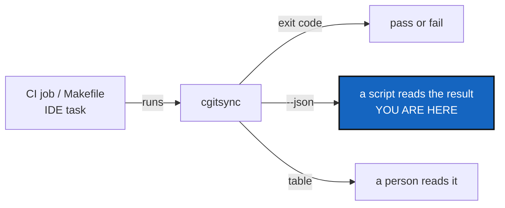

# CliContract — say what the CLI promises, in exit codes and JSON

*Created: 2026-09-11*

## Abstract — read this first

**The one-line version.** The CLI is the product, so write down what it
guarantees: which exit code means what, which commands can be read by a
machine, and which parts of the tool are allowed to change.

**What this document is.** A ticket, from an outside review of the project
on 2026-09-10. Nothing here has been built.

**Why it exists.** Early adopters wire a tool into CI, Make and IDE tasks
before they trust it. That needs two things this tool does not yet state:
a stable exit code, and output a script can read without parsing a table
meant for a human. The codes already exist by accident — `cli/*.py` holds
37 `return 0`, two `return 1` and one `return 2`, and `main` hands that
straight back — but nothing says what they mean, so nothing may rely on
them.

**What you will find.** §1 what is already there. §2 the three pieces of
the contract. §3 the decisions. §4 work packages. §5 acceptance.

**Who it is for.** Whoever picks this up, and the owner, who answers §3.

**What you need to do with it.** Answer §3, then §4 in order.

---

## 1. What is already there

| Piece | State |
|---|---|
| Exit codes | Accidental. `main` (`cli/__init__.py:76`) returns `handler(args)`, and handlers return `0`, `1` or `2`. Undocumented, so no user may depend on them |
| Machine-readable output | None. No `--json` anywhere in `cli/` |
| A clean seam for it | `status_render.py` is already pure rendering, with no I/O of its own. A second renderer belongs beside the table, not inside the command |
| Command list | `README.md` §3 lists every command, and `tests/unit/test_cli_smoke.py::test_readme_documents_every_cli_command` keeps it complete |
| A statement of what is stable | None. Nothing says whether a command name, a flag or the `.cgs` grammar may change between versions |

## 2. The three pieces

### 2.1 Exit codes

One documented meaning per code, used the same way by every command. The
codes in the tree today suggest the shape already:

| Code | Meaning |
|---|---|
| `0` | The command did what was asked |
| `1` | The command ran and the answer is no — a conflict, a tree that is not `READY`, a verification that failed |
| `2` | The command could not run — bad arguments, no workspace found, a missing file |

The distinction that matters to a script is between "I asked and the
answer is no" and "I could not ask". A CI job treats those differently.

### 2.2 JSON output

`--json` on the read-only commands, printing one object on stdout and
nothing else. Candidates, all of which already answer a question rather
than performing an operation:

- `status` — the tree, per repository: name, path, branch, scope, sync state
- `verify` — the register's chain result
- `validate` — the parsed and normalized document, and what failed
- any command run with `--dry-run` — the plan it would have carried out

**What `--json` must guarantee.** Nothing but JSON on stdout, so a pipe
never has to strip a banner; every human-facing line to stderr instead; the
same exit code as the human form, so a caller may use either signal.

### 2.3 A statement of what is stable

A short section in `README.md`. A proposal to confirm in §3:

| Surface | Promise |
|---|---|
| Command names and their documented flags | Stable within a major version |
| Exit codes | Stable within a major version |
| `--json` output | Additive only — new fields may appear, existing ones do not change meaning or vanish |
| `.cgs` and `.gts` grammar | Versioned in the file, with the version read on load |
| Python modules under `src/ComplexGitSync/` | **Not** a public interface. `ComplexGitSyncClient` is the CLI's own implementation, not a promise to importers |
| Commands marked experimental | May change or go at any time |

That last row matters. `CLAUDE.md` requires every capability to exist as a
`ComplexGitSyncClient` method with a thin CLI pair. That rule is about
where logic lives inside the project. It is not a promise to anyone
importing the package, and the README should say so plainly.

## 3. Decisions — your call

### D1. Is the three-code scheme right?

§2.1 proposes `0` / `1` / `2`. The alternative is finer grain — a distinct
code per failure kind. Finer grain helps a script react precisely and costs
a promise that is harder to keep, because every new failure needs a code
and every code is then frozen. Recommendation: three, and let `--json`
carry the detail.

### D2. Which commands get `--json` first?

§2.2 lists four. `status` and `verify` are the two a CI job actually calls,
and `verify` already exists to be asked. Recommendation: those two first,
`validate` and the `--dry-run` plans second, as a follow-on.

### D3. Where does the JSON shape live?

`status_render.py` renders the status table and holds the user-facing
wording for the `SCOPE` column. A JSON renderer beside it keeps `cli/` free
of both, which is what `CLAUDE.md`'s boundary requires. Confirm that is the
home, and that the shape is defined once rather than per command.

### D4. Does anything get marked experimental now?

The stability statement is only honest if the commands that are not settled
say so. Someone has to decide which those are. Nothing in the tree is
marked today.

## 4. Work packages

| WP | Depends on | Touches | Deliverable |
|---|---|---|---|
| **WP-C1** | D1 | `cli/*.py`, `README.md`, `docs/Text/user_guide.tex` | Every handler returns a documented code. One table in the README and the user guide. A test asserts the code for a refused merge, an unfound workspace and a clean run |
| **WP-C2** | D2, D3 | `status_render.py`, `cli/minimalist.py`, `cli/expert.py` | `--json` on `status` and `verify`. Stdout carries only JSON; everything else goes to stderr. A test parses the output with `json.loads` and asserts nothing else was printed |
| **WP-C3** | WP-C2 | same, plus `cli/expert.py` | `--json` on `validate` and on `--dry-run` plans |
| **WP-C4** | D4 | `README.md` | The stability section from §2.3, with any experimental command marked in the §3 command table |
| **WP-C5** | WP-C1 to WP-C4 | tests, docs, this ticket | `pixi run lint` and `pixi run test`; the before-committing checklist in `CLAUDE.md`; archive this ticket in the implementing commit |

## 5. Acceptance

- Every `cgitsync` command exits `0`, `1` or `2` with the documented
  meaning, and a test covers one case of each.
- `cgitsync status --json` and `cgitsync verify --json` print one JSON
  object on stdout and nothing else. `json.loads` on the captured stdout
  succeeds in a test.
- The exit code is the same whether `--json` is passed or not.
- `README.md` and `docs/Text/user_guide.tex` carry the exit-code table and
  the stability statement, and the statement says that Python modules are
  not a public interface.
- `--json` output is documented field by field, not only shown by example.
- `pixi run lint` and `pixi run test` pass.
