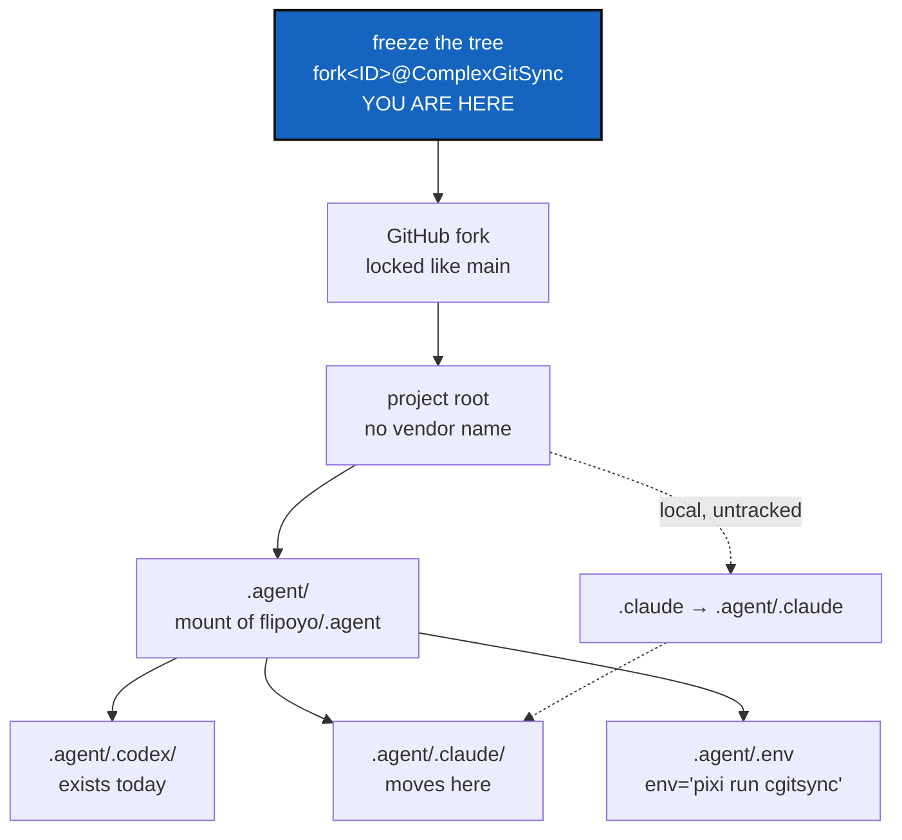

# Anonymous Agent — a neutral agent surface, delivered across a fork boundary

*Created: 2026-09-06*

> **Unblocked.** MultiBranchSync shipped on 2026-09-07 and is archived at
> `AgentSpec/archive/20260907_MultiBranchSync_DevPlanTicket.md`; it was the
> priority ticket that took from this one the mount topology its `.agent` mount depends on.
> This ticket is not cancelled and its content is unchanged.

## Abstract — read this first

**The one-line version.** No directory at a repository's root may name the
agent vendor behind it: `.claude/` becomes `.agent/.claude/`, mounted from
the `flipoyo/.agent` repository that already exists and already holds
`.codex/` the same way — and the work is done in a GitHub fork taken from a
frozen state of the tree, not on a branch of `ComplexGitSync`.

**What this document is.** A plan. Nothing in it has been started. It
replaces the first draft of this ticket, which proposed renaming `.claude`
to `.agent` on a branch called `.anonymous`. Checks against the live
remotes changed both halves of that: the container repository already
exists with a vendor subdirectory inside it, and `.anonymous` is not a name
git accepts. The delivery boundary is now a fork, decided in D1.

**Why it exists.** `flipoyo/.claude` is a public repository named in three
tracked `.cgs` files, in `.gitignore`, in `pyproject.toml`, in a tutorial,
and as the target of the tracked root symlink `CLAUDE.md`. Anyone reading
the project learns which agent tooling built it before reading a line of
it. The owner's rule is that a git's local directories must not carry a
recognisable vendor name.

**What you will find.** §1 the findings that rewrote this ticket. §2 the
target shape, including the `.agent/.env` declaration. §3 the exposure,
file by file. §4 the decisions — D1 is settled, D2 to D5 are open. §5 who
decides what. §6 the work in order, starting with the freeze. §7 risks. §8
acceptance.

**Who it is for.** The repository owner, who holds every open decision and
performs every outward-facing step, and whoever implements §6 afterwards.

**What you need to do with it.** Freeze the current state (§6 step 1),
answer D2 to D5, then do the rest of §6 in order.



---

## 1. Findings that rewrote the first draft

### 1.1 `flipoyo/.agent` already exists, and already holds a vendor subdirectory

Created 2026-07-01, public, one branch (`main`), described as
"configuration of agentic programming". Its tree:

```
.agent.cgs          AGENT.md        Manager.md      README.md
AdditionalSpecs.md  LICENSE         .gitignore      docs/usage.md
bootstrap_github_repo.sh
.codex/agents/  .codex/prompts/  .codex/templates/
```

`.codex/` sits one level inside a neutrally-named repository. **That is the
pattern this ticket applies to `.claude/` — it is the owner's own, already
in production, not a new invention.** The first draft's plan to rename
`.claude` *to* `.agent` would have collided with this repository head-on.

Two things about it are stale, and §6 has to deal with them. Its
`.agent.cgs` uses the legacy verbose `[[repos]]` grammar
(`gitprovider` / `project_owner_name` / `project_name`), not the inline
`repos = [ … ]` form `install.cgs` uses today. And it carries its own
`AdditionalSpecs.md` and `AGENT.md`, which now live in `flipoyo/.localSpec`
and `flipoyo/DevSpec` — the "no file in two repositories" rule that closed
AgenticMounts steps 1 and 2 applies here too.

### 1.2 `.anonymous` is not a valid branch name; `@` is fine

```
$ git check-ref-format --branch '.anonymous'
fatal: '.anonymous' is not a valid branch name
```

Git forbids any slash-separated component of a refname from beginning with
a dot. The dot was the whole problem: `@` is legal, and both
`refs/tags/fork20260906213000@ComplexGitSync` and its `refs/heads/`
equivalent pass `git check-ref-format`.

`@` is **not** legal in a GitHub *repository* name (letters, digits, `-`,
`_`, `.` only), and the owner's own `atCGS` and `atOEMS` repositories
already spell it `at`. That splits cleanly, and D1 uses the split: the
freeze **tag** carries `fork<ID>@ComplexGitSync` verbatim, and the fork
**repository** takes a name GitHub accepts.

### 1.3 `main` is locked by a ruleset, and a ruleset does not follow a fork

`main` has no classic branch protection. It is covered by a repository
**ruleset**, `maintainerClearance` (id 16310468), enforcement `active`:

| Field | Value |
|---|---|
| Target | `~DEFAULT_BRANCH` only |
| Rules | `deletion`, `non_fast_forward`, `pull_request` |
| Pull-request parameters | 0 approvals required; extra approval required for unattributed changes; all merge methods allowed |
| Bypass | repository role Admin, `always` — so the owner is never blocked |

Rulesets belong to a repository, so **a fork starts with none**. "Locked at
the same level as main" therefore means recreating this ruleset in the
fork, not inheriting it. For the record, `ComplexGitSync` already has one
fork, `fabien-ors/ComplexGitSync` (2026-07-16), owned by someone else.

### 1.4 The CLI exists only inside the pixi environment

```
$ which cgitsync
$ echo $?
1
```

`cgitsync` is not on `PATH`. It resolves only through `pixi run cgitsync`,
because `pixi.toml` installs the package as
`complexgitsync = { path = ".", editable = true }` and the console script
lives in that environment. There is no `cgitsync` pixi *task* either — the
declared tasks are `test`, `lint`, `bump-version` and `check-ceilings`.

An agent or a script that types bare `cgitsync` gets "command not found",
and `scripts/bump_version.py` already calls it bare through `subprocess`,
which works only because it is itself run under `pixi run`. This is what
§2's `.agent/.env` records.

### 1.5 The tree is READY and freezable right now

`pixi run cgitsync status`:

```
summary ready=true complete=true repos=7 dirty=1 staged=0 ahead=0 behind=0
        recorded_mismatch=0 errors=0
READY ready=true complete=true gittree_created=true gittree_active=true
```

All seven repositories are synced with their upstreams; the single dirty
one is `ComplexGitSync` itself, holding this ticket. §6 step 1 turns that
into the frozen origin the fork is taken from.

## 2. The target shape

```
<project root>/
├── .agent/              ← mount of flipoyo/.agent, branch ComplexGitSync
│   ├── .codex/          ← already there
│   ├── .claude/         ← CLAUDE.md, AGENT.md, settings.json move here
│   └── .env             ← env='pixi run cgitsync'
├── .agentSpec/  .localSpec/  docs/  src/  …
├── AGENT.md             ← tracked symlink → .agent/AGENT.md
└── .claude              ← LOCAL, UNTRACKED symlink → .agent/.claude
```

Nothing tracked at the project root names a vendor. The vendor name
survives one level inside a neutral container, which is the reading of the
rule the owner gave (`.claude --> .agent/.claude`) and which `.codex/`
already follows.

**The untracked symlink is load-bearing.** Claude Code reads a project's
settings from `./.claude/` and nowhere else; the path is not configurable.
Move the directory and the tool silently stops loading `settings.json` —
this project's shared permission allowlist. The symlink restores it without
anything tracked naming it, provided the exclusion lives in
`.git/info/exclude` (never pushed) rather than in the tracked `.gitignore`
— putting it in `.gitignore` would re-expose the name in the very file the
ticket is cleaning.

One supporting fact, already covered by a test: `_walk_git_repositories`
([orchestre.py:857](../src/ComplexGitSync/orchestre.py#L857)) skips `.git`
and symbolic links, so the compatibility symlink is not discovered as a
second repository.
`tests/unit/test_walk_git_repositories.py:153`,
`test_symlinked_directories_are_not_followed`, guards that behaviour
today.

**`.agent/.env` declares how the CLI is invoked here**, per §1.4:

```sh
env='pixi run cgitsync'
```

It states, in the agent-facing mount rather than in folklore, that this
project's commands are reachable only through the pixi environment. Two
facts constrain it, both verified:

- `.agent`'s own `.gitignore` currently ends with `.env` and `.env.*`, so
  the file **would not be tracked** as things stand. That has to be undone
  in the same change — a `!.env` negation, or narrowing the pattern to
  `.env.local`. ComplexGitSync's root `.gitignore:151` ignores `.env` too,
  which matters if anyone later tries to put a copy at the project root.
- Nothing under `src/ComplexGitSync/` reads `.env` today. So this file is a
  **declaration for agents and humans, not tool input.** Whether it should
  become tool input is D5.

The root `AGENT.md` symlink stays tracked and keeps its name — it is
already the neutral pointer. `CLAUDE.md` at the root is the open half of
this: see D4.

## 3. Where the vendor name is exposed today

Checked in the working tree, not assumed.

### 3.1 Tracked in ComplexGitSync

| File | Line | What it says |
|---|---|---|
| `install.cgs` | 11 | `{ repository = "github:flipoyo/.claude", default_branch = "ComplexGitSync", … }` |
| `examples/complexgitsync.cgs` | 11 | the same entry — kept byte-identical to `install.cgs` by `tests/unit/test_install_cgs.py` |
| `ComplexGitSync.cgs` | 12 | the same entry, nested mode |
| `.gitignore` | 230, 235, 244 | the root-symlink comment, `/.claude/`, and the bare `.claude` |
| `pyproject.toml` | 36 | `extend-exclude = [".claude"]` (ruff) |
| `scripts/bump_version.py` | 100 | a docstring listing the mounts |
| `tests/unit/test_walk_git_repositories.py` | 121 | a comment naming the three split mounts |
| `tutorials/03_adopting_a_real_project.md` | 371, 378, 392 | the `.cgs` snippet a reader is told to copy |
| `CLAUDE.md`, `AGENT.md` at the root | — | tracked symbolic links; `git ls-files` shows both names |

### 3.2 Tracked in the mounted repositories

| File | What it says |
|---|---|
| `.claude/README.md` | four mentions — the mount point and the two root symlinks |
| `.claude/CLAUDE.md` | 60, 80, 180–181. Line 181 still says the mount is `flipoyo/claude`, a name that has not existed since AgenticMounts step 2 corrected it; fix it in passing |
| `.claude/AGENT.md` | 9 — links to `CLAUDE.md` |
| `.claude/settings.json` | 15 — an allowlist entry whose command string contains `CLAUDE.md` |
| `.claude/.gitignore` | two comments naming the tool's temp-file behaviour |
| `.localSpec/audit.md` | 47 — names `.claude` in a branch-pinning finding |

### 3.3 What is not affected

No module under `src/ComplexGitSync/` has `.claude` logic. The single hit,
`cli/__init__.py:4`, is a docstring citing `CLAUDE.md` as the source of the
CLI-mirrors-Python-API rule. **The rename is configuration, documents and
remote names — not code.** The only code change this ticket can require is
D3's, and only under one of its options.

## 4. Decisions

### D1. The delivery boundary — **settled: a GitHub fork, taken from a frozen state**

The owner's words: *"et s'il s'agissait d'un fork de l'état de main
@timestamp ? non pas d'une branch ! Un autre type introduit une frontière
bien plus nette. `fork<ID>@ComplexGitSync`"*.

The reason holds and is already recorded elsewhere: tree-wide `branch`,
`checkout` and `pull` propagate one name across every mount, which
`agenticMountStep3-DevPlanTicket.md` says "would drag the shared
`.localSpec` and `.claude` mounts off the branch they are pinned to". A
fork has no such failure mode.

**This ticket takes a plain GitHub fork.** Concretely:

| Piece | Value |
|---|---|
| Origin | `flipoyo/ComplexGitSync` at `main`, frozen first (§6 step 1) |
| Freeze tag | `fork<ID>@ComplexGitSync`, `<ID>` = `%Y%m%d%H%M%S` — legal as a git tag (§1.2), and the same stamp family `paths.py:216` already produces |
| Fork repository | a GitHub-legal rendering of the same identifier, since `@` is rejected there (§1.2). The owner's existing `at` convention gives `fork<ID>atComplexGitSync`; confirm the exact spelling before creating it |
| Lock | a **new** ruleset in the fork reproducing `maintainerClearance` — `deletion`, `non_fast_forward`, `pull_request`, Admin bypass. Not inherited (§1.3) |
| Return path | a pull request from the fork to `flipoyo/ComplexGitSync` |

Making `fork` an object the tool itself understands — the larger and more
general idea in the owner's message — is split out as
[ForkObject_DevPlanTicket.md](ForkObject_DevPlanTicket.md). The two are
independent by construction: this ticket does not wait for it. That ticket
opens by asking whether such an object is genuinely new or is `freeze` plus
`clone` under a name, which is a question worth answering before any code
is written.

### D2. What happens to `flipoyo/.claude`, and to `.agent`'s stale content?

The `.claude` repository's `ComplexGitSync` branch content moves under
`.agent`'s `ComplexGitSync` branch at `.claude/`; its `main` baseline
merges the same way. Then `flipoyo/.claude` is archived or deleted —
archiving keeps the history reachable and is the safer default.

Separately, `.agent`'s `main` carries `AdditionalSpecs.md` and `AGENT.md`
that duplicate `flipoyo/.localSpec` and `flipoyo/DevSpec`, and an
`.agent.cgs` in the legacy grammar (§1.1). Both are pre-existing debt this
ticket inherits by adopting the repository. Cleaning them here is
recommended, because §8's "no file in two repositories" check cannot pass
otherwise.

### D3. Where does the compatibility symlink's exclusion live?

`.git/info/exclude`, per §2 — but `git_tree.sync_gitignore` maintains
`.gitignore` across the tree and must be taught not to re-add the entry.
That is the only code change in this ticket, and it needs a unit test.

The alternative is to accept a dirty `git status` in every developer
checkout, which is worse: a permanently dirty tree trains everyone to
ignore `git status`, and this repository's own `status` command reports on
it.

### D4. Does the root `CLAUDE.md` symlink stay tracked?

It is genuinely tracked — `git ls-files` lists it — and it is as
recognisable a name as the directory.

- **Narrow** — the rule says *directories*. Keep it, repoint it to
  `.agent/.claude/CLAUDE.md`. The vendor name survives at the root, in the
  one place the ticket is meant to clean.
- **Full** — track `AGENT.md` only, and make `CLAUDE.md` a second local
  untracked symlink created by the same setup step as `.claude`.

The full reading costs nothing extra once D3's mechanism exists, and is the
only one consistent with the ticket's own title. Recommended, with the
consequence stated plainly: a fresh clone has no `CLAUDE.md` until the
setup step runs, so that step must be in the bootstrap path and in
`README.md`, not folklore.

### D5. Is `.agent/.env` a declaration, or tool input?

As specified in §2 it is a declaration: a tracked file stating
`env='pixi run cgitsync'`, read by whoever — human or agent — is about to
run a command. Nothing in the codebase reads it.

The alternative is to make it tool input: `cgitsync` (or a wrapper) reads
`.agent/.env` and uses the prefix. That is a feature with real questions
attached — which process reads it, what happens when the declared
environment is absent, and whether a file that can change how commands run
belongs in a mount shared across projects. If the owner wants it, it
belongs in its own ticket, not here.

Recommended: declaration now, and a `README.md` line pointing at it, so the
fact in §1.4 stops being folklore either way.

## 5. Who decides — the owner is the only Orchestrator

`.localSpec/AGENT.md` defines Orchestration as the role owning
`DevSpecs.md`, `AdditionalSpecs.md`, `audit.md` and the planning tickets
under `AgentSpec/`. For this ticket that role is the owner's alone. In
practice:

- Every open decision in §4 is the owner's. An agent may draft options; it
  does not pick one.
- The outward-facing steps in §6 — freezing (which commits, tags and
  pushes across seven remotes), creating or forking a repository, renaming
  or archiving one, creating or editing a ruleset, merging — are the
  owner's to perform or to authorise explicitly, one at a time.
  Authorisation for one does not carry to the next.
- Agents work in the Dev, CI/CD and Editing roles: edits inside the fork,
  `pixi run lint` / `pixi run test`, and document rewrites.
- This ticket's own text is Orchestration output. An agent proposing a
  change to it says so and leaves the edit to the owner.

## 6. The work, in order

| # | Step | Role | Where |
|---|---|---|---|
| 1 | **Freeze the current state.** From the pixi environment: `pixi run cgitsync freeze 'fork<ID>@ComplexGitSync'`. Preview it first with `--dry-run`; the plan is `git add --all → git commit -m '<name>' → git tag <name> → git push`, applied leaf-first (`DocSpec → DocComplexGitSync → .localSpec → .claude → DevSpec → .agentSpec → ComplexGitSync`). Because it stages **everything**, decide first what the working tree should contain — including these ticket files | owner | CGSHOME |
| 2 | Create the fork per D1 and lock it in the same step: a new ruleset reproducing `maintainerClearance` (§1.3). Create *and* lock, not one then the other | owner | GitHub |
| 3 | Give `flipoyo/.agent` a `ComplexGitSync` branch off `main`, matching how `.claude` is branched today | owner | GitHub |
| 4 | Move `.claude`'s content into `.agent` under `.claude/`, both branches; rewrite `README.md`, `CLAUDE.md` (60, 80, 180–181, including the stale `flipoyo/claude`), `AGENT.md:9`, `settings.json:15`, `.gitignore` | Editing | `.agent` |
| 5 | Add `.agent/.env` with `env='pixi run cgitsync'`, and stop `.agent/.gitignore` from ignoring it (§2) — the file is useless if it is not tracked | Editing | `.agent` |
| 6 | Resolve D2's stale content: legacy `.agent.cgs` grammar, duplicated `AdditionalSpecs.md` / `AGENT.md` | Editing | `.agent` |
| 7 | Repoint the mount entry to `github:flipoyo/.agent` in `install.cgs`, `examples/complexgitsync.cgs` (byte-identical — `tests/unit/test_install_cgs.py`) and `ComplexGitSync.cgs` | Dev | fork |
| 8 | Rewrite `.gitignore` (230, 235, 244), `pyproject.toml:36`, `scripts/bump_version.py:100`, `tests/unit/test_walk_git_repositories.py:121`, `tutorials/03_adopting_a_real_project.md` (371, 378, 392), `.localSpec/audit.md:47` | Dev + Editing | fork, `.localSpec` |
| 9 | D3: teach `git_tree.sync_gitignore` to leave the compatibility symlink out of the tracked `.gitignore`, with a unit test; write the exclusion to `.git/info/exclude` | Dev | fork |
| 10 | Document the local setup step (the `.claude` symlink, `CLAUDE.md` under D4-full) and the `.agent/.env` invocation rule in `README.md`'s developer guide and the bootstrap walkthrough | Editing | fork |
| 11 | Regenerate the workspace runtime state. A changed `.cgs` hashes to a **new** `state(<hash>)_0`; the current one is `state(4002e33f…)_0` and still names `.claude`. Confirm the stale one is no longer preferred and remove it if it is — the same footgun as `archive/20260905_agenticMountStep2-DevPlanTicket.md` §1.3 | CI/CD | CGSHOME |
| 12 | Smoke-test `pixi run cgitsync initialise install.cgs` into a scratch directory: five mounts with `.agent/` among them, `.agentSpec/DevSpec/` present, root symlinks resolving, and the tool still reading `settings.json` | CI/CD | local |
| 13 | `pixi run lint`, `pixi run test`, `pixi run bump-version`, rebuild any `.tex` it touched | CI/CD | fork |
| 14 | Open the pull request from the fork and confirm CI is green — meaning it cloned `flipoyo/.agent` | owner | GitHub |
| 15 | Archive `flipoyo/.claude` per D2, once CI has proved nothing still clones it | owner | GitHub |
| 16 | Stamp and move this ticket to `AgentSpec/archive/` in the same change | Editing | fork |

Step 12 stays a manual smoke test rather than an integration test:
`DevSpecs.md` (*Testing*) forbids tests that need the network, and this one
clones five repositories.

## 7. Risks

| Risk | Handling |
|---|---|
| The freeze in step 1 sweeps up unintended files: its plan begins `git add --all`, in all seven repositories | Run `--dry-run` first, and check `status` shows exactly the dirt you mean to commit. Today that is one dirty repository, `ComplexGitSync` |
| The freeze pushes tags to seven remotes and cannot be quietly undone | It is an owner step (§5), and the tag name records the state deliberately rather than by accident |
| The fork is created but never locked, so "at the same level as main" is only half true | Step 2 is one step, not two. §1.3 records why the lock cannot be inherited |
| `fork<ID>@ComplexGitSync` is used verbatim as a GitHub repository name and is silently normalised | §1.2 and D1: the `@` form is the **tag**; the repository takes the `at` spelling. Confirm before creating anything |
| `.agent/.env` is added but stays ignored by `.agent/.gitignore`, so no one ever sees it | Step 5 does both halves, and §8 point 6 checks it from a fresh clone |
| The `.cgs` change lands before `flipoyo/.agent` has a `ComplexGitSync` branch, and CI clones a branch that is not there. AgenticMounts step 2 §1.1 failed exactly this way | §6's order: step 3 before step 7, and step 14 checks CI |
| Adopting `.agent` drags in its stale duplicate specs, and the tree ends with two `AdditionalSpecs.md` | D2 and §8's check |
| Every existing tree's recorded state still names `.claude`; a GitHub redirect covers a fetch URL, never a directory name | Step 11, plus a re-run of `initialise` in every other checkout after the merge |
| D3 is skipped and the exclusion goes into the tracked `.gitignore`, re-exposing the name in the file being cleaned | §8's grep catches it mechanically |
| `agenticMountStep3-DevPlanTicket.md` is still active and names `.claude` 13 times, including its branch-pinning design | Decide the order before starting. Step 3 first means one grep pass at the end; this ticket first means rewriting step 3's text mid-flight |

## 8. Acceptance

1. `grep -rIn --exclude-dir=.git -e '\.claude' -e 'CLAUDE\.md' .` returns
   nothing outside `AgentSpec/archive/`, which is historical record and is
   never edited, and outside `.agent/`, where the name is allowed one level
   in.
2. `git ls-files | grep -i claude` is empty in ComplexGitSync — with the
   root `CLAUDE.md` symlink as the single recorded exception if D4 lands
   narrow.
3. No `.cgs` in the tree names `flipoyo/.claude`, and that repository is
   archived.
4. A fresh `pixi run cgitsync initialise install.cgs` produces
   `ComplexGitSync`, `docs/`, `.agentSpec/` (containing `DevSpec/`),
   `.localSpec/` and `.agent/` (containing `.codex/`, `.claude/` and
   `.env`), with resolving root symlinks.
5. `pixi run lint` and `pixi run test` pass, and CI is green after the
   merge.
6. From a **fresh clone**, following only `README.md`, a developer ends up
   with a working `.claude` symlink, a tool that reads `settings.json`, a
   tracked and readable `.agent/.env`, and a clean `git status`.
7. No file except `LICENSE` exists in two of the mounted repositories at
   once.
8. The fork carries the same rules as `maintainerClearance`: no deletion,
   no non-fast-forward, pull request required, Admin bypass.
9. The freeze tag `fork<ID>@ComplexGitSync` exists on all seven
   repositories and names the state the fork was taken from.
10. This ticket is stamped and archived.
