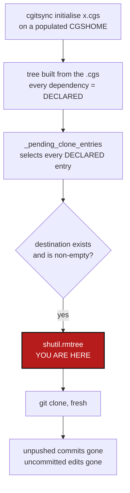

# InitialiseDestroysExistingClones — `initialise` deletes work it did not make

*Created: 2026-09-09*

## Abstract — read this first

**The one-line version.** `cgitsync initialise <file>.cgs` run on a
workspace that is already populated **deletes every nested repository and
clones it again**, destroying unpushed commits and uncommitted edits
without a warning, a prompt, or a way to get them back.

**What this document is.** A bug ticket for a data-loss path, with the
exact line that does the deleting and three ways to close it.

**Why it exists.** It happened. On 2026-09-09, `cgitsync initialise
examples/multibranch_wip.cgs` was run inside a working `$CGSHOME` to
refresh the `.gts` snapshot. It re-cloned `docs`, `.claude` and
`.localSpec` and took with them one local commit and the uncommitted edits
in two configuration repositories. Each repository's reflog was left with
a single `clone:` entry, so the old `.git` was gone and nothing was
recoverable. The work happened to be reproducible; next time it may not
be.

**What you will find.** How it happens (§1), why nothing stops it (§2),
three options with a recommendation (§3), work packages (§4), and
acceptance criteria (§5).

**Who it is for.** Whoever picks up the next safety-rail piece of work.
This is not a feature — it is a hole.

**What you need to do with it.** Read §1, pick an option in §3, then §4.

> **Read `AppendCloneMode_DevPlanTicket.md` alongside §3.** It asks a wider
> question about the same `shutil.rmtree`: whether a mount point is owned
> outright by the repository mounted there. Its §0 already audits this call
> and the second erasure site this ticket does not cover — `force_pull`
> running `git clean -fd` on every resync. The two answers have to agree.
>
> One correction of record: the incident below was reproduced with
> `examples/multibranch_wip.cgs`, which was deleted on 2026-09-09 when the
> multi-branch work landed. The path in §1 no longer exists. Nothing about
> the fault depends on that file — any `.cgs` run through `initialise` on a
> populated workspace does the same thing.



---

## 1. How it happens

Three steps, none of which looks at what is already on disk.

1. **`initialise_cgs` builds the tree from the `.cgs`.** Every dependency
   entry is born `DECLARED`. Only the root is spared:
   `_attach_existing_root` (`orchestre.py:3678`) marks it `READY`, which is
   why the docstring can promise the root "is never recloned". Nothing does
   the equivalent for the dependencies.

2. **`_pending_clone_entries` (`orchestre.py:3650`) selects every
   `DECLARED` entry.** Its docstring lists three exclusions — not
   `DECLARED`, `is_external_reference`, already in the `sync_stack`. "There
   is already a healthy checkout at that path" is not one of them, and
   nothing anywhere else asks.

3. **`_clone_registry_entry` deletes the directory.**
   `orchestre.py:3714-3716`:

   ```python
   if self._is_populated_nested_destination(entry):
       try:
           shutil.rmtree(entry.absolute_path)
   ```

   `_is_populated_nested_destination` (`orchestre.py:3782`) is satisfied by
   *any* nested entry whose directory exists and is not empty. It does not
   look for a `.git`, does not ask whether the worktree is dirty, does not
   ask whether the branch is ahead of its upstream, and does not ask
   whether the remote it is about to clone is even the same repository.

The `rmtree` is not wrong on its own — a half-written clone from an
interrupted run has to be cleared, and that is plainly what it was written
for. It is wrong because nothing distinguishes that case from a
repository somebody has been working in all week.

## 2. Why nothing catches it

Every other destructive path in this tool is guarded, which is what makes
this one stand out:

* `commit`, `push`, `tag` and `freeze-release` run
  `_run_preflight_checks`, which refuses on a detached HEAD, an unresolved
  merge, a branch behind its upstream, or a misaligned branch.
* `pull-force` and `freeze-release-force` carry `force` in the name, and
  the README says what they destroy.
* `purge` and `clean-init` say "purge"/"clean" in the name.

`initialise` says none of that. Its README line is *"Initialise a project
tree: clone(.cgs) or restore state(.gts)"* — a sentence that reads like a
no-op on a tree that already exists. The docstring's *"the root repository
at CGSHOME is treated as already existing and is never recloned"* actively
encourages the reading that existing things are left alone. It is the
opposite for everything below the root, and the docstring never says so.

There is also no preflight at all on this path: `initialise` is a
lifecycle step 1 command, and `_run_preflight_checks` is only wired into
the operations in `operations.py`.

## 3. Options

**Option A — refuse when a destination holds work that is not on a remote
(recommended).** Before the `rmtree`, check the existing directory: if it
is a Git repository, refuse when it is dirty, when its branch is ahead of
its upstream, or when it has no upstream at all. Name every repository
that blocked and what to do (commit and push, or pass the escape hatch).
Keep clearing destinations that are *not* Git repositories or that are
clean and fully pushed, so the interrupted-clone case this was written for
still works.

Recommended because it is the same shape as every other guard in the tool,
it costs one `git status` and one tracking check per entry, and it fails
closed: the only thing it can get wrong is refusing a run that would have
been harmless, which the escape hatch covers.

**Option B — adopt the existing checkout instead of re-cloning.** If the
destination is a healthy clone of the right remote, attach it the way
`_attach_existing_root` attaches the root, and skip the clone entirely.
Better behaviour and it makes `initialise` genuinely idempotent, which is
what a reader already expects it to be. Larger change: it needs the remote
compared against the entry's, and a decision about what to do when the
checkout is on the wrong branch.

**Option C — documentation only.** Say in the README and the docstring
that `initialise` re-clones dependencies. Cheapest, and not enough: a
data-loss path that is only guarded by a sentence somebody has to have
read is not guarded.

A does not preclude B. A is the safety rail; B is the improvement. Doing A
first means the hole is closed even if B never happens.

## 4. Work packages

| WP | Touches | Deliverable |
|---|---|---|
| **WP-INIT1** | `orchestre.py` | A check before `_clone_registry_entry`'s `rmtree`. For a destination that is a Git repository, collect: worktree dirty, branch ahead of upstream, branch with no upstream. Any of those blocks the run. Raise one `GitSyncError` naming every blocked repository and the state that blocked it — not one error per repo, and not just the first. Destinations that are not Git repositories keep being cleared as they are today. |
| **WP-INIT2** | `orchestre.py`, `cli/` | An explicit escape hatch — `--force-reclone` on `initialise` (and `clean-init`, which means it already) — that skips WP-INIT1's check. The flag name must contain "force", like the other destructive flags. |
| **WP-INIT3** | `README.md`, `docs/Text/user_guide.tex`, `initialise_cgs` docstring | State plainly that `initialise` re-clones every dependency, that only the root is preserved, and what WP-INIT1 refuses. The docstring sentence about the root must stop implying anything about the dependencies. |
| **WP-INIT4** | `tests/` | See §5. |

Not in scope: Option B. If it is wanted, it is its own ticket, and it
should be written after WP-INIT1 lands so the safety rail is not waiting
on the bigger change.

## 5. Acceptance criteria

- `initialise` on a workspace whose dependency has an **uncommitted
  change** refuses, names that repository, and leaves the directory
  untouched on disk.
- The same for a dependency whose branch is **ahead of its upstream**, and
  for one with **no upstream at all**.
- The error names **every** blocked repository in one message, and says
  both ways out: commit and push, or `--force-reclone`.
- `initialise` on a workspace where every dependency is clean and fully
  pushed still succeeds and still refreshes the `.gts` — the case that
  made this run happen in the first place.
- A destination that exists but is **not** a Git repository (an
  interrupted clone) is still cleared, with no flag needed. This is the
  behaviour the `rmtree` was written for and must not regress.
- `--force-reclone` reproduces today's behaviour exactly.
- A test asserts the recovered facts from 2026-09-09: a dependency with a
  local-only commit is not deleted by a plain `initialise`.
- `pixi run lint`, `pixi run test` and `pixi run check-ceilings` pass.

## 6. Where this came from

`AgentSpec/archive/20260909_MultiBranchResume_DevPlanTicket.md`,
section *Warning: `initialise` re-clones the dependency
repositories*, which records the incident as it happened. This ticket is
the fix that record asked for.
