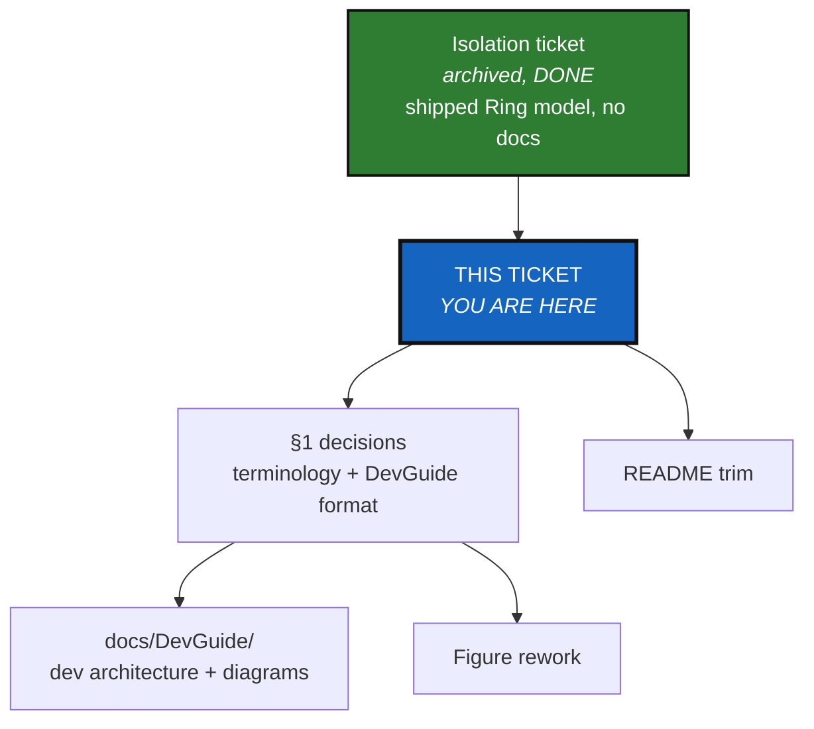

# DocRewritePlanTicket — Terminology, DevGuide, Figures, README

*Created: 2026-08-31*

## Abstract — read this first

**The one-line version.** The isolation refactor (`AgentSpecs/archive/`-bound
`20260828_Isolation_DevPlanTicket.md`) introduced a 5-level Ring model into
`src/` and `AGENT.md` without ever reconciling it against the 3-Tier model
the published architecture book already uses, and the README grew past its
own house style into a second developer manual — this ticket is the fix for
both, plus the dev-facing architecture diagrams the code split never got.

**What this document is.** A documentation-only planning ticket: no `src/`
behaviour changes, no tests. It covers four things — (1) reconcile "Ring"
vs "Tier" terminology, now inconsistent *inside the same source files*, (2)
add a `docs/DevGuide/` folder with the dev-facing architecture explanation
and diagrams the isolation work never produced, (3) rework the figures that
are stale or overcrowded, (4) cut `README.md` back to a real quickstart.

**Why it exists.** Reported directly: *"I didn't understand the ticket at
all because the rings you used are not in the doc... there is an
incompatibility between the new src/architecture and the c_architecture...
c_architecture is designed for USERS not DEVS... The README.md is also too
long."* §0 below verifies each claim against the current tree before
proposing anything — same discipline every prior ticket in this repo used.

**What you will find.** Verified evidence (§0), two terminology/format
decisions with a recommendation each, not a dictate (§1), the work-package
catalog (§2), and acceptance criteria (§3). Work packages are independent
files with no runtime import graph between them (unlike the isolation
ticket's Python modules) — parallelize freely; the only real ordering
constraint is §1's decisions landing before §2's content work quotes them.

**Who it is for.** Whoever orchestrates this next — written to be
tool-agnostic (no assumption of a specific agent framework's worktree/
subagent mechanics), since it may run under Claude Code, Mistral Vibe, or a
human alone.

**What you need to do with it.** Nothing yet — no work package below has
started.



---

## 0. Verification (2026-08-31)

| Claim | Evidence | Consequence |
|---|---|---|
| "Rings... are not in the doc" | `grep -rn Ring docs/Text/*.tex docs/figures/*.tex` → **zero hits**. `grep -rc "Tier " src/ComplexGitSync/**/*.py` → **23 hits** across 6 files, all written before the isolation work. Every module's new `Ring:` docstring header (P6-contracts) has no counterpart anywhere in `docs/`. | The Ring model exists only in `AGENT.md` and module docstrings — invisible to anyone reading the book or onboarding from `docs/`. |
| "Incompatibility between src/architecture and c_architecture" | `docs/Text/architecture.tex` (398 lines) and `docs/figures/three_tier.tex` describe a **3-Tier** model (Core State / Actions / Client-API) — the same one `git_repo.py`, `git_tree.py`, `operations.py`, and `__init__.py`'s section comments still use inline (23 occurrences, confirmed above), *right next to* those same files' new `Ring:` headers. Two vocabularies for two overlapping-but-different groupings, undocumented relationship, sometimes in the same docstring. | Needs one explicit reconciliation (§1.1), not a silent pick — Tier and Ring don't collapse 1:1 (Ring 0/1/2 all sit inside Tier 2's "Actions", split by a different axis: I/O boundary, not lifecycle role). |
| "c_architecture is for USERS not DEVS" | Confirmed by `docs/Text/architecture.tex`'s own framing (book chapter, narrative prose, built into the tracked `docs/MASTER.pdf`/`docs/c_architecture.pdf`) — no equivalent lives outside the book. `AGENT.md`'s ring table (added by the isolation ticket) is dev-facing but text-only, no diagram. | A dev-facing home with diagrams doesn't exist yet — not a rename of the book chapter, a genuinely new artifact. |
| Figures overcrowded | `wc -l` + node count per figure: `class_diagram.tex` **355 lines / 48 `\node`s** — by far the largest, and stale: it diagrams only `ComplexGitSyncClient`/`Orchestre`/`GitTree`/`GitRepo`/`GitRunner`/`RepoAddress`, six classes, against a package that now has 20+ modules post-isolation. `operations_sequence.tex` (130 lines/22 nodes) is next largest. `branch_topology.tex`/`client_gating.tex`/`gittree_nodes.tex`/`positioning_matrix.tex`/`three_tier.tex` are all under 75 lines — read them before assuming they need rework, don't batch them in by default. | `class_diagram.tex` needs regeneration, not touch-up — it's not just crowded, it no longer reflects the codebase at all. |
| README too long, `discover` section specifically | `README.md` is **333 lines** (vs `CLAUDE.md`'s 132, `AGENT.md`'s 92 — the two files DOCSTYLE.md says a README should defer *to*). §"Adopting a project that has no `.cgs` yet" alone is **55 lines** covering `discover`'s `--recurse-submodules` edge cases and `import-submodules`' exact `git rm --cached` mechanics — narrative detail already fully covered in `docs/tutorials/02_onboarding_a_real_build_tree.md` and `03_configuration_discovery_modes.md`. Separately, README's own "### Before you commit" section (`README.md` lines 231–258, 5 numbered rules) is a **near-duplicate** of `CLAUDE.md`'s "## Before committing" section — the same 5 rules, restated. | Two independent trims: (a) collapse the `.cgs`-adoption walkthrough to a short "which case are you in" pointer table + 3–4 command lines per case, full detail staying in the tutorials where it already lives; (b) delete README's "Before you commit" duplicate, point to `CLAUDE.md` instead — DOCSTYLE.md's own rule ("A root README.md never contains build internals... those move to `specs.md` or `docs/`") already forbids carrying this in the README at all. |

`DOCSTYLE.md` §3's audience-separation table is the standard this whole
ticket enforces: `README.md` → users; `docs/` → mixed, labelled per file.
Nothing here is a new rule — it's closing a gap between a rule that already
exists and a README/docs tree that drifted from it.

---

## 1. Decisions needed before work starts

Recorded here as recommendations with rationale, not dictated — confirm or
override before dispatching §2's content work, the same "decision required"
pattern the isolation ticket used for `RepoNode`/register-verify scope.

### 1.1 Terminology: keep both, make the relationship explicit

**Recommendation: do not retire either vocabulary.** Keep **Tier** as the
book's stable, narrative, user-facing "how the three layers hand off to
each other" story (`docs/Text/architecture.tex`, `three_tier.tex`) — it's
already published in `docs/MASTER.pdf` and answers a different question
than Ring does ("what role does this code play in the lifecycle" vs "what
is this code allowed to import/touch"). Keep **Ring** as the enforced,
dev-facing, import-direction/I/O-boundary model (`AGENT.md`, module
docstrings, `scripts/check_module_ceilings.py`) — it's mechanically checked
and a rename would touch every module's docstring for no functional gain.

Instead, add **one explicit mapping** (table + short prose) in the new
`docs/DevGuide/` (§1.2), stating plainly: Tier 1 (Core State) spans Ring 0
(`errors.py`, `git_repo.py`, ...) and part of Ring 1 (`git_tree.py`,
`master.py`); Tier 2 (Actions) spans Ring 1 (`paths.py`, `discovery.py`,
`state_store.py`, ...) and Ring 2 (`operations.py`, `registry.py`,
`git_runner.py`); Tier 3 (Client/API) is Ring 3 (`orchestre.py`); Ring 4
(the `cli/` package) sits outside the Tier model entirely, since Tier never
described the CLI adapter layer. This mapping is the single artifact that
resolves the reported "incompatibility" without a disruptive rename.

**If this recommendation is overridden** (e.g., decide to retire "Tier"
project-wide in favour of "Ring"), that is a much larger ticket — every
`docs/Text/*.tex` chapter, `three_tier.tex`, and the 23 in-`src/` comments
would need a coordinated rewrite, and the book's already-published
narrative would need re-justifying from scratch. Flagging the size
difference so the choice is made with that cost visible, not discovered
mid-ticket.

### 1.2 `docs/DevGuide/` format: Markdown + Mermaid, not LaTeX

**Recommendation: Markdown, not `.tex`.** `AGENT.md`, `audit.md`, and this
ticket itself are already Markdown+Mermaid, no build step, fast to update,
readable directly on GitHub and by any agent without a LaTeX toolchain. A
dev guide meant to stay current alongside a codebase that's still being
actively restructured benefits from the same zero-build-step property —
the opposite of the book, which is intentionally a slower-moving, curated
narrative. Putting DevGuide content in `.tex` would mean every future
module move requires a `latexmk` rebuild to keep the dev-facing diagram
honest; Markdown+Mermaid renders directly.

Proposed layout:

```text
docs/DevGuide/
  README.md            index — what's here, who it's for, links out
  architecture.md       the Ring model: table, rules, dependency graph,
                         current module map, Tier<->Ring mapping (§1.1)
  module_map.md         (optional, may fold into architecture.md instead
                         — see WP-DG2) one row per module: file, ring,
                         one-line contract, cross-referencing each
                         module's own docstring header rather than
                         restating it
```

`docs/DevGuide/` sits alongside `docs/Text/` (book chapters), `docs/
tutorials/` (user walkthroughs), and `docs/figures/` (TikZ sources) —
DOCSTYLE.md §3's `docs/` row ("mixed, labelled per file") already
authorizes this; each new file's own opening line states its audience,
same as every other file in this repo already does.

---

## 2. Work packages

Every package is a self-contained file (or a small file group with no
runtime dependency on any other package) — genuinely parallel, no
equivalent of the isolation ticket's shared-module sequencing problem.
`WP-DOC1` should land first only because §2's other packages *reference*
its output; it does not block anyone from *drafting* in parallel, only from
finalizing a commit that cites the mapping table before it exists.

| WP | Depends on | Writes | Deliverable |
|---|---|---|---|
| **WP-DOC1** | §1 decisions confirmed | `docs/DevGuide/README.md`, `docs/DevGuide/architecture.md` | The Tier↔Ring mapping table (§1.1), the ring table + four import rules (source: `AGENT.md`, don't restate from scratch — link and summarize), a Mermaid dependency graph of the current ~20-module set by ring (this is the "graph for explaining the software architecture to devs" asked for directly), and a one-row-per-module table (file → ring → one-line contract, pulled from each module's own docstring header, not re-authored). |
| **WP-DOC2** | WP-DOC1 (for the Tier↔Ring table it references) | `docs/figures/class_diagram.tex` | Full regeneration, not a touch-up. Read `AGENT.md`'s ring table and `docs/DevGuide/architecture.md`'s module map first. Decide (and state the choice) whether the *book* figure should show the full current module set (likely too dense for one page — this is exactly the "too crowded" complaint) or a deliberately simplified Tier-level overview with a pointer to `docs/DevGuide/architecture.md` for the full Ring-level detail. Recommendation: simplify the book figure, put full detail only in DevGuide's Mermaid graph (WP-DOC1) — a book figure that needs 48 nodes to stay accurate is the wrong deliverable for a narrative chapter. |
| **WP-DOC3** | none | `docs/figures/operations_sequence.tex` and a read-only pass over `branch_topology.tex`/`client_gating.tex`/`gittree_nodes.tex`/`positioning_matrix.tex` | Rework `operations_sequence.tex` if, after reading it against the current `operations.py`, it's found stale or overcrowded (verify first, same discipline as WP-DOC2 — don't assume). For the four smaller figures: read each, and only touch the ones actually found stale/crowded against current code; report "reviewed, no change needed" for the rest rather than silently skipping them. |
| **WP-DOC4** | WP-DOC1 (so its "read the DevGuide" pointer resolves) | `README.md` | Two independent cuts, both described in §0's last row: (a) collapse "Adopting a project that has no `.cgs` yet" from 55 lines to a short table (case → command(s) → tutorial link) with 3–4 command lines per case, no restated edge-case prose; (b) delete the "### Before you commit" section entirely, replace with one line pointing to `CLAUDE.md`'s "## Before committing" (which already has the same 5 rules — confirmed in §0, don't merge or reconcile differences, just deduplicate by deletion + pointer). Re-skim the rest of the README with the same "is this the *user* getting started, or a developer manual" question DOCSTYLE.md §3 asks — cut anything that fails it, but treat further cuts beyond (a)/(b) as optional, lower-confidence polish, same caveat the isolation ticket's own D5 used for its README pass. |
| **WP-DOC5** | WP-DOC1 through WP-DOC4 all landed | `docs/*.pdf` rebuild, final read-through | `cd docs && latexmk -pdf MASTER.tex` plus every `c_*.tex` that changed (CLAUDE.md's own "Before committing" rule #3). Confirm `tests/unit/test_cli_smoke.py::test_readme_documents_every_cli_command` and its reverse-direction sibling still pass (README trim must not drop a real command row — the command *table* stays, only the prose sections around it are in scope for WP-DOC4). Confirm every new/changed Markdown file has a DOCSTYLE.md-compliant abstract + mermaid graph (§1/§2 of that file) before calling this done. |

---

## 3. Acceptance criteria

- `grep -rn Ring docs/` returns real hits (currently zero) — the Ring model
  is documented somewhere a human or agent can find without reading
  `AGENT.md` or module source directly.
- The Tier↔Ring relationship is stated exactly once, in
  `docs/DevGuide/architecture.md` — not re-derived or restated elsewhere.
- `docs/figures/class_diagram.tex` reflects the current module set (every
  module in `src/ComplexGitSync/` either appears or is explicitly grouped
  under a labelled category the figure shows) — no longer a diagram of six
  classes from before the isolation work.
- `README.md` is materially shorter than 333 lines, contains no content
  that duplicates `CLAUDE.md`, and every remaining section answers a
  *user's* question per DOCSTYLE.md §3 — anything answering a
  *contributor's* question links out instead of restating.
- `pixi run test` and `pixi run lint` still pass (no `src/` change expected,
  but the README-command-table tests are a real gate on WP-DOC4).
- `cd docs && latexmk -pdf MASTER.tex` builds clean, and every touched
  `c_*.tex` standalone chapter rebuilds clean too.
- Every new Markdown file under `docs/DevGuide/` opens with a DOCSTYLE.md
  abstract (what/why/what-you'll-find/who/what-to-do) and a Mermaid graph
  of eight nodes or fewer.

**Out of scope for this ticket**: `docs/tutorials/*.md` content itself
(already the detailed-narrative layer WP-DOC4 defers to — no evidence they
need rework), `docs/Text/user_guide.tex`/`api_python.tex` (command/API
reference chapters, unaffected by the Tier/Ring question), and any `src/`
behaviour change (this ticket is documentation-only by design).
