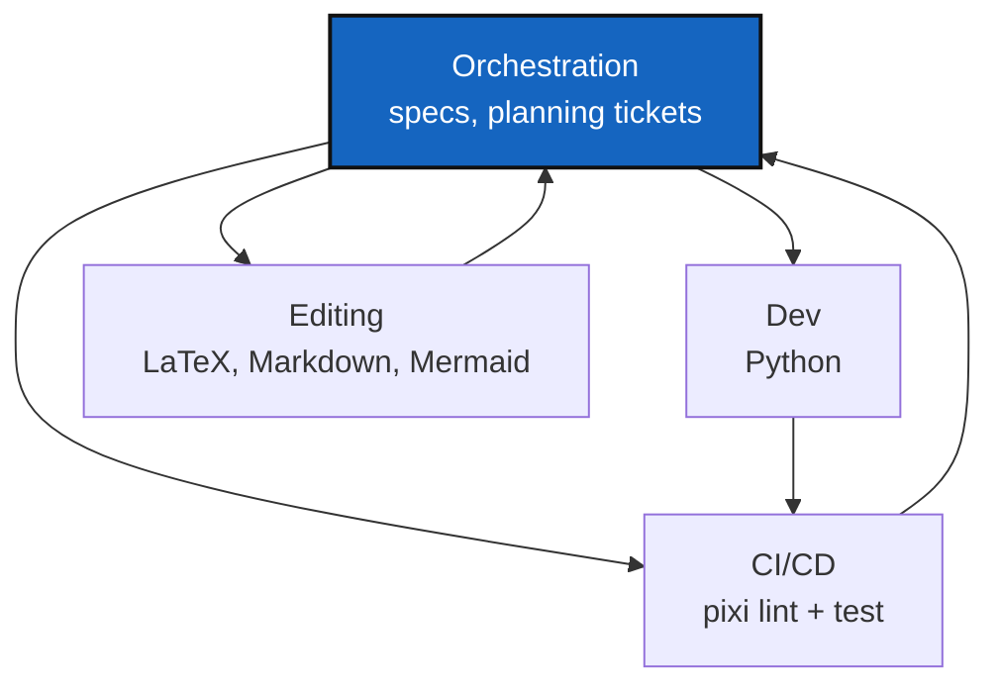

# AGENT

*Created: 2026-08-31*

## Abstract — read this first

This is ComplexGitSync's filled-in instance of the project-agnostic
multi-agent role template — see the `AGENT.md` template in
`flipoyo/DevSpec` for the full six-role roster, scope definitions, and
generic handoff rules. What follows is only what differs from, or narrows,
that template for this project specifically: which roles this project
actually exercises, and the one project-specific handoff rule
(`AgentSpecs/audit.md` binding Dev inside `src/ComplexGitSync/`).

## Roles as used in this project

| Agent | This project's scope |
|---|---|
| **Orchestration** | `DevSpecs.md`, `AgentSpecs/AdditionalSpecs.md`, `AgentSpecs/audit.md`, and the planning tickets under `AgentSpecs/`. |
| **Dev** | Python only — `src/ComplexGitSync/` and `tests/`. The template's other listed languages (C, Rust, Flex/Bison, Fortran, C++, Make) are not part of this codebase. |
| **CI/CD** | `pixi run lint` (ruff), `pixi run test` (pytest: `tests/unit` + `tests/integration`), and the Pixi environment itself. |
| **Editing** | LaTeX under `docs/`, Markdown under `AgentSpecs/` and the README, and Mermaid diagrams. This project has no Slidev decks, so that part of the template's scope is unused here. |
| **Maths** | Not used in practice — ComplexGitSync has no numerical/derivation work to route to this role. |
| **Scientific editing** | Not used in practice — no bibliography or citation content in this project. |

## Project-specific handoff rule

Rules specific to this package's own Python source — the ring model, import
boundaries, module ceilings — live in `AgentSpecs/audit.md` and bind the Dev
agent whenever it is working inside `src/ComplexGitSync/`. The template's
other handoff rules (one concern per commit, up-front decomposition of
multi-role tasks) apply here unchanged.
