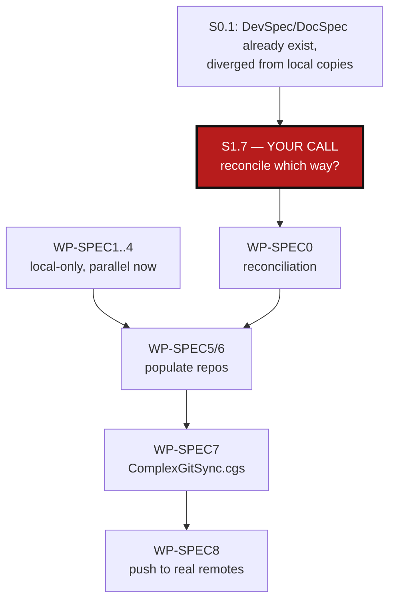

# SpecsConsolidation — extract DevSpec/DocSpec, merge audit.md

*Created: 2026-08-31*

## Abstract — read this first

**The one-line version.** `AgentSpecs/audit.md` and `docs/DocSpecs.md`'s
sibling files grew by accretion into an uncommon, hard-to-navigate spec
layout; this ticket plans their split into two reusable repos
(`flipoyo/DevSpec`, `flipoyo/DocSpec`) plus a slimmed-down, conventional
local layout, wired back in through `ComplexGitSync.cgs`.

**What this document is.** A planning-only ticket: no execution yet except
where noted. It covers four things — (1) fold `audit.md`'s architecture
reference content into `AgentSpecs/AdditionalSpecs.md`, leaving `audit.md`
as a short, genuinely audit-shaped document, (2) split `AgentSpecs/AGENT.md`
into a reusable role-taxonomy template and a project-specific instance,
(3) the same generic/project split for the `docs/DocSpecs.md` family, (4)
the `ComplexGitSync.cgs` change that declares both new repos.

**Why it exists.** `audit.md` currently mixes a static architecture
reference (Ring model, module table, format/provider ownership) with actual
audit findings (legacy references, acceptance checks) — two different
audiences in one file, and the only place in the repo describing
architecture by Ring while `AdditionalSpecs.md` describes it by Tier with
zero cross-reference between the two (verified in §0). Separately,
`DevSpecs.md` was generified this session for reuse in `flipoyo/DevSpec`,
but `AgentSpecs/AGENT.md` and `AgentSpecs/DOCSTYLE.md` — both equally
reusable in spirit — were never split from their ComplexGitSync-specific
instance.

**What you will find.** Verified evidence for every claim above (§0), the
design decisions this plan depends on, stated as recommendations rather
than dictates (§1), a work-package catalog covering both the `DevSpec` and
`DocSpec` tracks in parallel (§2), and acceptance criteria (§3).

**Who it is for.** Whoever executes this next — most work packages are
independent and can run in parallel; only `WP-SPEC7` (the `.cgs` change)
needs the two new repos to exist first.

**What you need to do with it.** Answer §1.7 — `flipoyo/DevSpec` and
`flipoyo/DocSpec` already exist with real, independently-evolved content
(§0.1), and no automated merge can safely pick a side on the
root-`AGENT.md`-vs-`AgentSpecs/AGENT.md` question. Everything else in this
plan (`WP-SPEC1`–`WP-SPEC4`, all local-only) can run in parallel while you
decide, but `WP-SPEC5` onward — and any push — waits for your answer.

---

## 0. Verification (2026-08-31)

| File | Lines | Current role | Problem found |
|---|---|---|---|
| `DevSpecs.md` | 177 | Generic dev philosophy | Already generified this session (Planning section, Document Conventions section rewritten against this repo's real practice) — ready to extract as-is. |
| `AgentSpecs/AdditionalSpecs.md` | 665 | Project architecture (Tier model), lifecycle contract, document formats, versioning | `grep -c Ring` → **0**. Describes architecture with zero awareness of the Ring model `audit.md` also describes — same subject, two vocabularies, no cross-reference. |
| `AgentSpecs/audit.md` | 210 | Ring model + module responsibility table + import rules + format ownership + provider contract + legacy references + acceptance checks | Conflates a static architecture reference with audit findings in one file; grew again this session when the Ring model moved in from the old root `AGENT.md`. No comparable file exists in either the DevSpecs.md philosophy or `AgentSpecs/DOCSTYLE.md`'s own audience table (which names `AgentSpecs/audit.md` as "decision-makers: findings, risks, decisions" only — the architecture-reference content it currently carries doesn't belong under that description). |
| `AgentSpecs/AGENT.md` | 67 | ComplexGitSync-specific parallel-agent roster (rewritten this session) | Correct in spirit, 100% project-specific — the six-role taxonomy itself (Orchestration/Dev/CI-CD/Editing/Maths/Scientific-editing) is as reusable as `DevSpecs.md`, but no template exists for another project to start from. |
| `AgentSpecs/DOCSTYLE.md` | 86 | Markdown house style (abstract-first, mermaid, audience table, length, no stale content) | Copy-pasted from a different project: says "the MOLONARI ecosystem," and its audience table names `.agent/SKILL.md`, a path that does not exist anywhere in this repo. It never mentions `DevSpecs.md`, `AgentSpecs/AdditionalSpecs.md`, or `AgentSpecs/AGENT.md` at all, despite `CLAUDE.md` pointing every Markdown document in this repo at it. |
| `docs/DocSpecs.md` | 107 | Generic documentation philosophy | Already fairly generic (spot-checked this session, no ComplexGitSync-specific leakage found) — the `docs/`-side analogue of `DevSpecs.md`, not yet extracted to its own repo. |
| `docs/AdditionalDocSpecs.md` | 4 | Project-specific doc extension | Effectively a stub — one sentence pointing at `./DocSpec/DocSpecs.md`, no actual ComplexGitSync-specific content filled in yet. |
| `docs/AGENT.md` | 9 | Doc-repo layout note | Correctly scoped and already minimal — states `./DocSpec/DocSpecs.md` (relative to `docs/`) as the expected mount point for a repo that does not exist yet. |
| `ComplexGitSync.cgs` | 11 | Repo topology for this project's own tree | Already lists `"github:flipoyo/DevSpec"` (plain-string form → default mount at `./DevSpec/`, matching `AGENT.md`-family docs before this session's rewrite) and `"github:flipoyo/DocComplexGitSync"` (the actual LaTeX book content, **not** the same thing as the planned `DocSpec` philosophy repo). No `DocSpec` entry yet. |

Root `AGENT.md` (deleted earlier this session) and `AgentSpecs/AGENT.md`'s
prior "Example project layout" section used to restate the `DevSpec` mount
point in prose; that restatement is gone, but the expectation still holds
implicitly through `ComplexGitSync.cgs`'s own default-relative-path rule —
`WP-SPEC7` makes this explicit again instead of leaving it undocumented.

### 0.1 Critical finding: `flipoyo/DevSpec` and `flipoyo/DocSpec` already exist, and have diverged

Both repos are real, already on GitHub, with independent history — this is
not a bootstrap onto empty repos:

- `flipoyo/DevSpec`: `main` (5 commits) + an `autoTest` branch (LICENSE-only
  diff). Contains `DevSpecs.md`, `README.md`, `LICENSE`.
- `flipoyo/DocSpec`: `main` + two open PRs (#2, #4, both de-branding the
  `slidev/piren-seine` theme and vendoring `create_slidev_project.sh`/
  `launch_slidev_project.sh` — unrelated to `DocSpecs.md`, not blocking).
  Contains `DocSpecs.md`, `README.md`, `LICENSE`, and a substantial
  `slidev/` tree (helper scripts + a full Slidev theme/template set).

Diffing each against ComplexGitSync's local copy shows **both files have
evolved independently in both directions** — this is a merge, not a
one-way export:

**`DevSpecs.md` — upstream has, local lacks:**
- A stated project-root `AGENT.md` ("defines the order of instruction
  reading") as part of the core philosophy — **this directly contradicts
  this session's earlier decision to delete ComplexGitSync's root
  `AGENT.md`** and move its content into `AgentSpecs/`. One of the two has
  to give: either upstream's philosophy text is updated to describe the
  new `AgentSpecs/AGENT.md` convention, or ComplexGitSync's layout goes
  back to a root `AGENT.md` to match the philosophy it claims to follow.
- A CI/PAT versioning requirement ("Versioning must be integrated in CI for
  push, merge and pull request... requires a direct push by an agent... a
  `PAT` must be configured over the `GitProvider` platform") that
  ComplexGitSync's own `CLAUDE.md`/CI setup doesn't mention.
- `docs/DocSpec/DocSpecs.md` as the stated path (nested under `docs/`) —
  this **confirms** this plan's §1.2 recommendation independently.

**`DevSpecs.md` — local has, upstream lacks:**
- This session's whole rewritten Planning section (ticket-per-file in
  `AgentSpecs/`, date-prefixed archive) and the new Document Conventions
  section — upstream still has the old `DevPlan.md`/`YYYY.XXDevPlan.md`
  scheme this session replaced as stale.

**`DocSpecs.md` — upstream has, local lacks:**
- An entire 37-line "Slidev — Presentations and Communication Objects"
  section (tooling table, repo layout, workflow) — consistent with the real
  `slidev/` tree that already lives in the `DocSpec` repo, and with this
  session's own `AgentSpecs/AGENT.md` Editing-role scope ("LaTeX, Markdown,
  Mermaid, Slidev"). ComplexGitSync's local `docs/DocSpecs.md` is simply
  missing this section, not disagreeing with it.

Pushing either side over the other as-is would destroy real content.
§1.7 below covers the reconciliation strategy this forces.

## 1. Decisions needed before work starts

### 1.1 Repo naming: `DevSpec` / `DocSpec` (repos, singular), `DevSpecs.md` / `DocSpecs.md` (files, plural)

**Confirmed.** Repos stay singular (`flipoyo/DevSpec`, `flipoyo/DocSpec`),
matching what already exists on GitHub and the already-committed
`"github:flipoyo/DevSpec"` entry in `ComplexGitSync.cgs`; the files inside
stay plural (`DevSpecs.md`, `DocSpecs.md`), matching current reality on
both the local and upstream side. No rename needed anywhere.

### 1.2 `DocSpec` mount point: nested under `docs/`, not root

**Confirmed** — independently, by two sources agreeing: `docs/AGENT.md`
already says so (`./DocSpec/DocSpecs.md`, relative to `docs/`), and
upstream `DevSpec`'s own `DevSpecs.md` (§0.1) separately states
`docs/DocSpec/DocSpecs.md` as the path. `DevSpec/`, by contrast, governs
the whole project and belongs at the root. Both repos are still declared
from the one `ComplexGitSync.cgs` file (§2, `WP-SPEC7`); only the
`relative_path` differs.

### 1.3 `audit.md`'s split: architecture moves out, audit stays

Recommendation: move the Ring model, module responsibility table,
dependency-path diagram, format ownership, and provider contract into
`AgentSpecs/AdditionalSpecs.md` (a new subsection alongside the existing
Tier model, with an explicit Tier↔Ring cross-reference — `docs/DevGuide/
architecture.md` already draws this reconciliation, so link it rather than
restating it). What stays in `audit.md`: intentional legacy references,
acceptance checks, and a short "open decisions / risks" log — the
genuinely audit-shaped content `AgentSpecs/DOCSTYLE.md`'s own audience
table already describes it as. Every place that currently points at
`audit.md` for architecture ("enforced source of truth") repoints to
`AdditionalSpecs.md` instead.

### 1.4 `AGENT.md`: generic template vs. project instance

Recommendation: the six-role taxonomy and the handoff-rules skeleton are
project-agnostic and belong in `flipoyo/DevSpec` as a template `AGENT.md`
with a blank "project specifics" column per role. Each consuming project
keeps a short `AgentSpecs/AGENT.md` that fills in only that column — e.g.
ComplexGitSync's Dev row says "Python only"; a Fortran/C++ project's Dev
row lists those languages instead — plus a one-line pointer back to the
template.

### 1.5 `DOCSTYLE.md`: generify and fold into `DevSpec`

Recommendation: rewrite to drop the "MOLONARI ecosystem" naming and fix the
audience table to the filenames this ecosystem actually uses
(`DevSpecs.md`/`AgentSpecs/AdditionalSpecs.md` for the developer row,
`AgentSpecs/AGENT.md` for the agent row, `AgentSpecs/audit.md` for the
decision-maker row), then move it into `flipoyo/DevSpec` next to
`DevSpecs.md` — "how to write a document" is exactly the kind of
project-agnostic principle `DevSpecs.md` already exists to hold, not a
reason for a third repo.

### 1.6 Planning-ticket archives are local, never synced to `DevSpec`

**Decided** (already applied to `DevSpecs.md`'s Planning section this
turn): `AgentSpecs/` — active tickets and `AgentSpecs/archive/` alike — is
local to each consuming project's own repository and is never part of the
shared `DevSpec` repo's tracked content. `DevSpec`'s own `.gitignore`
should exclude ticket-shaped paths (`AgentSpecs/`, `*_DevPlanTicket.md`) as
a second line of defense, in case a contributor ever runs project tooling
from inside the `./DevSpec/` submodule checkout by mistake — `WP-SPEC5`
adds this file.

### 1.7 Reconciliation strategy for the upstream divergence (§0.1) — **blocking, needs your answer**

Three options, none clearly better without knowing which side is meant to
win:

1. **Upstream wins, local's new sections get re-applied on top.** Pull
   `DevSpecs.md`/`DocSpecs.md` from `DevSpec`/`DocSpec` as the base, then
   re-apply this session's Planning-section rewrite and Document
   Conventions section on top of upstream's version (which also means
   deciding the root-`AGENT.md`-vs-`AgentSpecs/AGENT.md` conflict in
   upstream's favor, i.e. reverting this session's root `AGENT.md`
   deletion — or updating upstream's philosophy text instead, see option 3).
2. **Local wins, upstream's extra content gets re-applied on top.** Keep
   local's Planning/Document-Conventions rewrite as the base, and manually
   port back the Slidev section (`DocSpecs.md`) and the CI/PAT versioning
   clause (`DevSpecs.md`) — but then upstream's `AGENT.md`-at-root
   philosophy line must be edited to describe the new `AgentSpecs/AGENT.md`
   convention instead, since that's what local now does.
3. **True merge, decided section by section**, likely closest to correct
   since neither side's changes are wrong, just non-overlapping — except
   the root-`AGENT.md` question, which is a real either/or (a project's
   `AGENT.md` cannot simultaneously live at the root and inside
   `AgentSpecs/`).

This plan cannot pick for you: it changes the philosophy every project
consuming `DevSpecs.md` follows, not just ComplexGitSync's own layout.

**Decided (2026-08-31):**
- Root `AGENT.md` comes back, but minimal — its only job is to state the
  reading order (`CLAUDE.md` first, then `AgentSpecs/`). The ring-model
  content stays merged into `audit.md` (`WP-SPEC1`); it is not restored to
  the root file. This satisfies upstream's "defines the order of
  instruction reading" literally without duplicating content.
- True merge on everything else: upstream's Slidev section and CI/PAT
  clause get ported into the local copies; local's Planning-section
  rewrite, Document Conventions section, and the `AgentSpecs/`-nesting
  convention for `AdditionalSpecs.md`/`AGENT.md`/`audit.md` get pushed
  upstream. Nothing from either side is dropped.

## 2. Work packages

`WP-SPEC0` is the blocking prerequisite (§1.7's answer). `WP-SPEC1` through
`WP-SPEC4` touch only files that exist in this repo today and can start
immediately in parallel with each other (not with `WP-SPEC0`'s upstream
pull, since both may touch the same Planning/Slidev sections).
`WP-SPEC5`/`WP-SPEC6` populate the two real repos once their content is
ready. `WP-SPEC7` needs both repos' new content decided; `WP-SPEC8` is the
actual push to `git@github.com:flipoyo/DevSpec`/`DocSpec` and runs last.

| WP | Depends on | Writes | Deliverable |
|---|---|---|---|
| **WP-SPEC0** | §1.7 answer | local scratch clones of `DevSpec`/`DocSpec` (already made this session for inspection) | Apply the §1.7 answer: reconcile `DevSpecs.md`/`DocSpecs.md` so neither side's real content is lost — in particular resolve the root-`AGENT.md`-vs-`AgentSpecs/AGENT.md` conflict one way, consistently, in both the philosophy text and ComplexGitSync's own layout. |
| **WP-SPEC1** | §1.3 | `AgentSpecs/AdditionalSpecs.md`, `AgentSpecs/audit.md`, `CLAUDE.md`, `docs/DevGuide/architecture.md`, `docs/DevGuide/README.md` | Move the Ring model, module table, format ownership, and provider contract from `audit.md` into a new subsection of `AdditionalSpecs.md`. Slim `audit.md` to legacy references + acceptance checks + a new "Open decisions / risks" section. Repoint every cross-reference that currently sends a reader to `audit.md` for architecture to `AdditionalSpecs.md` instead. |
| **WP-SPEC2** | §1.4, `WP-SPEC1` (so the merged section exists to link from) | new `AGENT.md` (for `flipoyo/DevSpec`); `AgentSpecs/AGENT.md` (trimmed) | Extract the six-role table's generic columns into a `DevSpec`-bound template with a blank "project specifics" column. Trim ComplexGitSync's own `AgentSpecs/AGENT.md` to just that filled column plus a pointer to the template. |
| **WP-SPEC3** | §1.5 | `AgentSpecs/DOCSTYLE.md` (rewritten, then relocated) | Drop MOLONARI-specific naming; fix the audience table to this ecosystem's real file names; move the result into `flipoyo/DevSpec`. |
| **WP-SPEC4** | none — parallel `DocSpec` track | `docs/DocSpecs.md` (relocated as-is), `docs/AdditionalDocSpecs.md` (expanded past its 4-line stub), `docs/AGENT.md` (path check) | Confirm `docs/DocSpecs.md` needs no edits before extraction beyond `WP-SPEC0`'s reconciliation. Fill `docs/AdditionalDocSpecs.md` with ComplexGitSync's actual doc specifics (chapter list, glossary) — currently missing entirely. Confirm `docs/AGENT.md`'s stated path matches §1.2's mount point once decided. |
| **WP-SPEC5** | `WP-SPEC0`–`WP-SPEC3` | new `flipoyo/DevSpec` repo content | Populate with the reconciled `DevSpecs.md`, the `AGENT.md` template (`WP-SPEC2`), `DOCSTYLE.md` (`WP-SPEC3`), a blank `AdditionalSpecs.md` skeleton — section headers only, matching `DevSpecs.md`'s own section list — and a `.gitignore` per §1.6. |
| **WP-SPEC6** | `WP-SPEC0`, `WP-SPEC4` | new `flipoyo/DocSpec` repo content | Populate with the reconciled `DocSpecs.md` and a blank `AdditionalDocSpecs.md` skeleton, without touching the existing `slidev/` tree or its two open PRs. |
| **WP-SPEC7** | `WP-SPEC5`, `WP-SPEC6` | `ComplexGitSync.cgs` | Add a `DocSpec` entry using the explicit-table form (needed to set `relative_path = "docs/DocSpec"` per §1.2 — the plain-string form always mounts at the repo name). Confirm the existing plain-string `"github:flipoyo/DevSpec"` entry still correctly implies `./DevSpec/` per §1.1. Validate the edited `.cgs` parses (`cgs_format.py`'s own parser, via the existing test suite or a one-off `configure()` call) — both repos existing for real is not a precondition for the file being syntactically valid. |
| **WP-SPEC8** | `WP-SPEC5`, `WP-SPEC6`, `WP-SPEC7` | `git@github.com:flipoyo/DevSpec` (`main`), `git@github.com:flipoyo/DocSpec` (`main`) | Commit and push the reconciled `DevSpecs.md`/`AGENT.md`/`DOCSTYLE.md`/`.gitignore` to `DevSpec`, and the reconciled `DocSpecs.md`/`AdditionalDocSpecs.md` skeleton to `DocSpec` — each as its own commit, `DocSpec`'s push scoped to avoid the two open PRs' files. Runs last, and only after the reconciliation (`WP-SPEC0`) is something you've reviewed, since it changes philosophy every other project consuming these repos follows. |

## 3. Acceptance criteria

- `grep -c Ring AgentSpecs/AdditionalSpecs.md` returns a nonzero count, and
  `AgentSpecs/audit.md` no longer contains the Ring table, module
  responsibility table, format ownership, or provider contract sections —
  moved, not duplicated.
- `AgentSpecs/audit.md` is under roughly 80 lines: legacy references,
  acceptance checks, and open decisions only.
- `AgentSpecs/DOCSTYLE.md`'s audience table names this ecosystem's actual
  files; zero remaining mentions of "MOLONARI" or `.agent/SKILL.md`.
- `AgentSpecs/AGENT.md` (ComplexGitSync's instance) is shorter than its
  current 67 lines and points at the `DevSpec` template rather than
  restating the generic role descriptions.
- `docs/AdditionalDocSpecs.md` is no longer a 4-line stub.
- `ComplexGitSync.cgs` contains a `DocSpec` entry that round-trips through
  `cgs_format.py`'s parser without error.
- Every doc that cross-referenced the moved content (`CLAUDE.md`,
  `docs/DevGuide/architecture.md`, `docs/DevGuide/README.md`) points at its
  new location; `pixi run lint && pixi run test` still pass.
- Neither `DevSpecs.md` nor `DocSpecs.md` loses content in the merge: the
  Slidev section, the CI/PAT versioning clause, and this session's Planning
  rewrite are all present in the reconciled version pushed in `WP-SPEC8`.
- The root-`AGENT.md`-vs-`AgentSpecs/AGENT.md` question has exactly one
  answer, stated the same way in the pushed `DevSpecs.md` and in
  ComplexGitSync's own layout — not one thing in the philosophy and another
  in practice.
- `git log` on `flipoyo/DevSpec`/`DocSpec` after `WP-SPEC8` shows one commit
  per concern (matching this repo's own commit discipline), and `DocSpec`'s
  two open PRs still apply cleanly (untouched by the push).
