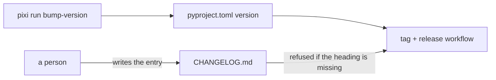

# Changelog

*Created: 2026-10-01*

## Abstract — read this first

**What this document is.** What changed in each published version of ComplexGitSync, newest first, for someone deciding whether to upgrade.

**Why it exists.** A user upgrading a tool from a package index has no other way to learn what changed.

**What you will find.** One heading per published version, `## <version>`, each followed by plain-English lines on what a user can now do or no longer needs to do.

**Who it is for.** Users of `cgitsync`, not contributors. The reasoning behind a change lives in the development specs, not here.

**What you need to do with it.** Nothing, as a reader. As a maintainer: a person writes the entry for a version before tagging it. `pixi run bump-version` never touches this file, and the release workflow refuses a tag whose version has no heading here.

---

## 3.9.1

First version published for installation with `pipx install complexgitsync`: no clone and no Pixi needed to run it, only Git and Python 3.11 or newer.

- A tree is now a user's or a developer's by what it holds: `status` prints `profile=user` or `profile=dev`, and `status --json` carries the same `profile` field.
- A developer's tree whose `.cgs` declares no memory is offered one, in a terminal and only once. The new `cgitsync memory setup` command, which you can run at any time, creates the memory repository with your provider's own tool, adds it to the `.cgs` and adopts the memory already on disk. Everywhere else it only warns that the work has no memory back-up.
- A workspace whose `.cgs` declares no memory gets a local one, never published, so a user install records its work without any setup.
- `initialise` is the nested install and `bootstrap` the standalone one; each refuses the other's job by name before touching the disk, and both accept a `.cgs` or a `.gts` snapshot.
- Every command's machine-readable answer (`status --json`, `verify --json`) is one JSON object with a `schema_version`; fields are only ever added.
- `bootstrap` now tells you to run `cgitsync <command>` in the new workspace, instead of assuming Pixi.
