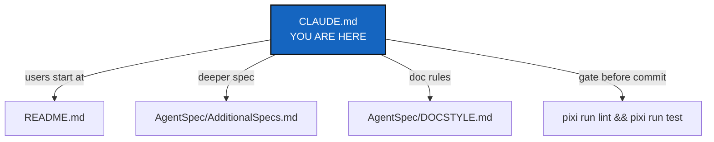

# ComplexGitSync

## Abstract — read this first

**What this document is.** The instructions for anyone — human or coding
agent — doing development work in this repo: commands, the before-committing
checklist, and the architecture boundary.

**Why it exists.** `pixi run lint`/`test`/`bump-version`, the module
responsibility table, and the ring-import rules must be followed identically
by every contributor; this file is the one place that states them.

**What you will find.** The Pixi command set, how to bootstrap a
live-editable checkout, a before-committing checklist, the module
responsibility table and architecture boundary, file formats, repo layout,
and document conventions.

**Who it is for.** Anyone changing code or docs in this repo. End users only
need [README.md](README.md); this file is for development, not usage.

**What you need to do with it.** Follow it as written — it overrides default
behavior — before making any change, and run its before-committing checklist
before every commit.



---

CLI (`cgitsync`) that synchronises a multi-repository Git workspace (a tree of
nested repos) from a hand-written `.cgs` spec and a generated `.gts` state
snapshot. See [README.md](README.md) for user-facing docs and CLI usage.

## Commands

This project uses Pixi, not bare `pip`/`venv`.

```bash
pixi install         # create/update the environment (run after touching pixi.toml or dependencies)
pixi run test        # pytest, tests/unit + tests/integration
pixi run lint        # ruff check .
pixi run bump-version  # bump YYYY.XX and sync every manifest and doc (see below)
```

CI (`.github/workflows/ci.yml`) runs both `lint` and `test` on push/PR to
`main`/`lechat`. Run both locally before pushing.

### Bootstrapping a working checkout

ComplexGitSync manages itself as a multi-repo tree (`install.cgs`, this
project's root file): a fresh `git clone` alone gets you the code but not
`docs/` or `DevSpec/`. Use `bootstrap`, pointed at `install.cgs`, to get a
fully populated, independently live-editable checkout:

```bash
git clone https://github.com/flipoyo/ComplexGitSync.git
cd ComplexGitSync
pixi install

pixi run cgitsync bootstrap install.cgs ComplexGitSync
# Copy the export command from bootstrap's own output, or use:
export CGSHOME=/home/user/.cgs/CGS20260831131233/ComplexGitSync

cd "$CGSHOME"       # this *is* the freshly cloned ComplexGitSync checkout —
pixi install        # bootstrap clones a plain checkout, so it needs its own
                     # pixi environment before you can run cgitsync from here
```

`$CGSHOME` now holds `ComplexGitSync` (mounted at its own root — the tree's
project entry), `docs/` (`DocComplexGitSync`), and `DevSpec` cloned side by
side. `pixi.toml`'s `complexgitsync = { path = ".", editable = true }` makes
this checkout self-editable the moment that second `pixi install` finishes:
edit any file under `src/ComplexGitSync/`, then `pixi run cgitsync ...` from
inside `$CGSHOME` picks up the change immediately — no reinstall step, no
separate `pip install -e .`.

## Before committing

Do all of these as part of the change, not as a follow-up:

1. **`pixi run lint` and `pixi run test` must both pass.** The full suite
   must pass before any merge to main (`DevSpecs.md`, *Testing*).
2. **Run `pixi run bump-version`** when wrapping up a feature branch, ahead
   of the auto-increment CI performs on merge to main (`DevSpecs.md`,
   *Versioning*; `AgentSpec/AdditionalSpecs.md`). `pyproject.toml` holds the
   authoritative `YYYY.XX` version; the one command syncs `pixi.toml`,
   `src/ComplexGitSync/__init__.py`, the README title, and the
   `\cgsversion` macro in `docs/Setup/Shortcuts.tex` and
   `docs/preamble.tex`. DevSpecs requires a single command for this —
   never hand-edit those version fields. `--dry-run` previews it.
3. **Rebuild the docs if you changed them.** `bump-version` rewrites `.tex`
   sources but does *not* regenerate the tracked PDFs:
   `cd docs && latexmk -pdf MASTER.tex` (plus each `c_*.tex` you touched).
4. **Update `AgentSpec/AdditionalSpecs.md`'s architecture section** if
   module responsibility moved (see below).
5. **Document any new CLI command** in the README command table *and*
   `docs/Text/user_guide.tex`, and its client method in
   `docs/Text/api_python.tex`. The README half is enforced by
   `tests/unit/test_cli_smoke.py::test_readme_documents_every_cli_command`.

## Architecture boundary

The module responsibilities are strict and audited — see
[AgentSpec/AdditionalSpecs.md](AgentSpec/AdditionalSpecs.md)'s
"Architectural Overview" section for the full write-up, including the
"Ring" vocabulary (`Ring-0`…`Ring-4`, an import-direction/I/O-boundary
grouping) the table below already uses. Summary:

Update `AgentSpec/AdditionalSpecs.md`'s responsibility table and
dependency-path diagram whenever a task adds, removes, or moves module
responsibility (new module, changed delegation, changed boundary) — before
committing, as part of that task's change, not as a separate follow-up.

| Module | Responsibility |
|---|---|
| `cgs_format.py` | `.cgs` TOML parsing/authoring grammar, normalization, static validation, `CgsDocument`, serialization. Deterministic and offline at its core — no `subprocess`, no Git, no remote calls; its `ConfigDocumentIOMixin`-derived file I/O is the one explicit Ring-1 exception. |
| `git_repo.py` | Canonical repository identity, provider registry, remote URL construction, per-repository runtime state. |
| `git_tree.py` | Tree structures (`GitTree`/`WorkingGitTree`), traversal, lifecycle state; `to_cgs()` only delegates to `cgs_format.py`. Also maintains `.gitignore` across the tree (`sync_gitignore`) — filesystem-only, no Git/subprocess. |
| `gts_document.py` | `.gts` runtime state-snapshot parsing/validation; the one canonical content-hash builder. |
| `git_runner.py` | Git subprocess wrapper — the sole `import subprocess` module. |
| `operations.py` | Leaf/parent-first Git operations over a `WorkingGitTree` + `GitRunner`. |
| `registry.py` | Translates `.cgs`/`.gts` documents to/from `WorkingGitTree`. |
| `paths.py`, `state_store.py`, `discovery.py`, `status_render.py`, `snapshot_resolver.py` | Path/CGSHOME resolution, state-directory allocation, nested-config/`.gitmodules` discovery, pure status-table rendering, and default-`.gts`-snapshot resolution — each extracted from `orchestre.py`/`cli/` during the isolation work (`AgentSpec/20260828_Isolation_DevPlanTicket.md`). |
| `ledger_entry.py`, `integrity.py`, `ledger_store.py` | Hash-chained register mechanics (entry construction, chain verification, atomic per-entry persistence) backing `cgitsync verify` — not yet wired into `SyncLedger`'s actual write path. |
| `orchestre.py` | The `ComplexGitSyncClient` public facade and `Orchestre` coordination layer; delegates to every module above rather than re-implementing them; still owns run logging and the `.lgr` register/sync ledger directly. |
| `config_document.py` / `config_document_io.py` | Format-neutral `ConfigDocument` base (pure) and its file-I/O mixin (Ring 1), shared by `CgsDocument`/`GtsDocument`. |
| `master.py` | Workspace-local Git identity (`MasterConfig`) for ComplexGitSync's own automated commits; defaults to local git config, overridable/persisted per `CGSHOME` via `.cgitsync/master.toml` — not part of the `.cgs`/`.gts` project spec. |
| `cli/` | Argument/prompt collection only; delegates all `.cgs`/`.gts` semantics downstream. `_shared.py` (cross-command helpers) + `minimalist.py`/`expert.py`/`configuration.py` (one module per command group, README's own grouping) + `__init__.py` (assembles the parser, exposes `main`). |

See [AgentSpec/AdditionalSpecs.md](AgentSpec/AdditionalSpecs.md) for the
full module/ring table and its ring-import rules (downward-only imports,
`subprocess` confinement, Ring-0 purity, the ceiling ratchet) this boundary
is checked against; [AgentSpec/audit.md](AgentSpec/audit.md) tracks actual
audit findings, not the architecture reference itself.

Data flow: `CLI / Python caller → ComplexGitSyncClient.configure() → cgs_format.py → CgsDocument → GitTree → orchestre.py → registry.py / operations.py → GitRepo / git_runner.py`.

`parse_repo_id()` in `cgs_format.py` is the *only* repo-identifier parser —
don't add another one in `cli/`, `git_tree.py`, `git_repo.py`, or
`orchestre.py`. Keep parsing/validation offline-safe; only explicit runtime
Git operations may touch the network.

**The CLI mirrors the Python API.** End users only use the CLI, so every
capability must exist in both layers: implement it as a
`ComplexGitSyncClient` method carrying all the semantics, then wire a thin
`_handle_*` → `_execute_*` pair in the owning `cli/<group>.py` module (per
README's Minimalist/Expert/Configuration grouping) that collects arguments,
calls that one method, and prints. A client method with no CLI surface is
unreachable for users; a CLI command with logic of its own breaks the
mirror. `cli/` must never touch `subprocess`/Git or parse repository
identifiers.

## File formats

- `.cgs` ("ComplexGitSync") — hand-written project topology/spec (TOML).
- `.gts` ("GitTreeState") — generated workspace snapshot.
- `.lgr` ("LocalGitRegister") — generated local register / append-only sync ledger.

## Layout

- `src/ComplexGitSync/` — package source.
- `tests/unit/`, `tests/integration/` — pytest suites (`pixi run test` runs both).
- `examples/*.cgs`, `*.gts` — sample specs used in docs/tests.
- `ComplexGitSync.cgs` (nested-mode) and `install.cgs` (standalone/bootstrap
  mode, a plain copy of `examples/complexgitsync.cgs` — kept in sync by
  `tests/unit/test_install_cgs.py`) — the two root-level `.cgs` files that
  make ComplexGitSync manage itself as a multi-repo tree; see README.md's
  Developer guide.
- `docs/` — LaTeX-built reference docs; generated `.aux`/`.log`/etc. are gitignored, the built PDFs are tracked.
- `AGENT.md` — a minimal root pointer stating the reading order (this file, then `AgentSpec/`); carries no rules of its own.
- `AgentSpec/AdditionalSpecs.md`, `AgentSpec/DevSpec/DevSpecs.md` — deeper spec/authoring references beyond this file (`AgentSpec/DevSpec/` is a plain nested clone, gitignored, not tracked by this repo).
- `AgentSpec/` — active planning tickets and project-specific specs; `AgentSpec/archive/` — completed/superseded plans, kept as historical record.
- `AgentSpec/TICKETLIFECYCLE.md` — how a planning ticket is named and filed: plain name while active, `YYYYMMDD_` stamp plus a move to `AgentSpec/archive/` once implemented.
- `AgentSpec/AGENT.md` — the roster of specialized agent roles for parallel multi-agent work on this project (Dev, CI/CD, Editing, Orchestration, Maths, Scientific editing) and how they hand off work.

## Document conventions

Follow [AgentSpec/DOCSTYLE.md](AgentSpec/DOCSTYLE.md) for how any Markdown
document in this repo is written — abstract first, mermaid graph, audience
separation, length, one authoritative file per purpose. It applies to every
`README.md`, spec, and file under `docs/`.

Write in straightforward English, not IT-entangled sentences — favour
common words over jargon, expand acronyms on first use, and keep sentences
short enough to read once. This bar is strictest for `tutorials/`,
`README.md`, and `docs/Text/*.tex`, since their reader has no other
context to lean on; see DOCSTYLE.md §5 for the full rule, worked examples,
and where it loosens.

Every created document — specs (`AgentSpec/DevSpec/DevSpecs.md`, `AgentSpec/AdditionalSpecs.md`),
planning tickets (`DevPlan*.md`, `DevPlanTickets*.md`, `CorPlan.md`-style
plans), `AgentSpec/audit.md`, `README.md`, and `docs/tutorials/*.md` — opens with a
`*Created: YYYY-MM-DD*` line directly under its `# ` title, set once at
authoring time and never rewritten on later edits. It records when the
document was written, not when it was last touched: a "last updated" claim
rots the moment someone forgets to bump it, which `AgentSpec/DOCSTYLE.md`
§6 already forbids ("no stale-by-design content"); a creation date is a
historical fact and cannot go stale the same way.

Planning tickets additionally carry a filename lifecycle:
active work lives as a plain-named file directly under `AgentSpec/`; once
the ticket's work is implemented, it is renamed with a `YYYYMMDD_` stamp
and moved to `AgentSpec/archive/`, in the same commit that implements it.
[AgentSpec/TICKETLIFECYCLE.md](AgentSpec/TICKETLIFECYCLE.md) is the
authoritative statement of that rule — read it before finishing a ticket.

Standalone LaTeX documents (`docs/*.tex` with their own `\documentclass`)
already carry `\date{\today}` on the title page — keep this on any new one.
