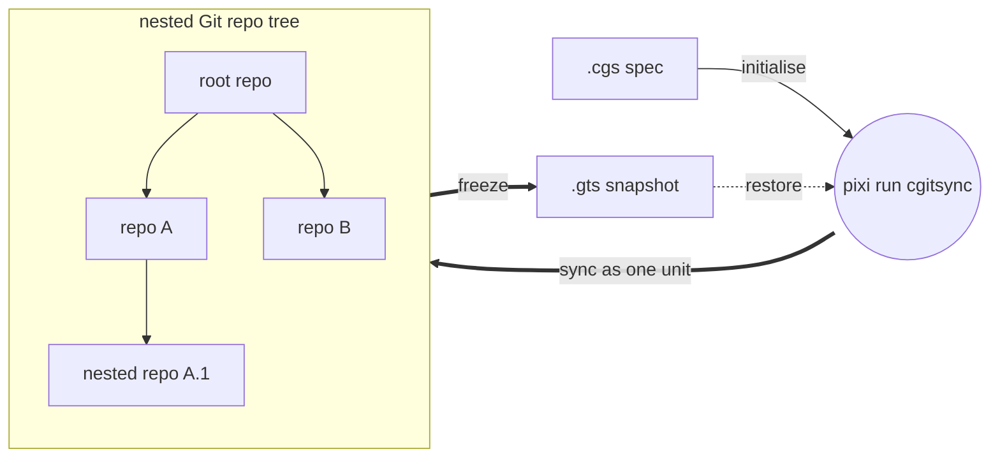
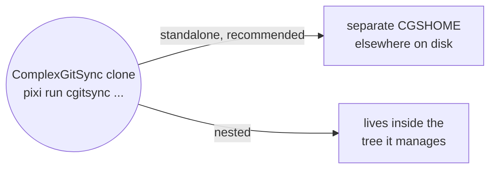

# ComplexGitSync v0002.45
__An alternative to git submodules for complex multi git-repo project management and synchronization__

*Created: 2026-05-12*


## 1. Must Know

### 1.1 What is ComplexGitSync for?

ComplexGitSync is a CLI (command-line tool) for synchronising a multi git-repository 
workspace — in the form of a GitTree — from one local `.cgs`
specification (ASCII file) or one tracked `.gts` workspace snapshot (ASCII file describing the GitTree State). It is a Python package for which the API is exposed through the CLI only.

The CLI is used to operate the same git command on all repos that compose the project. It is a robust and convenient alternative to git submodules, offering a straightforward development experience.

### Two kinds of repository

A tree holds two kinds of Git repos, and telling them apart is most of what you need to
know:

- **Project repos** — the work itself. Whatever the project is for: the
  code, the documents, public data. These follow the project's branch.
- **Private repos** — how the project is run: the pipelines, the agent
  instructions, the rules, private data. These are shared with your other projects, so
  they stay on their own branch instead of following yours.

ComplexGitSync considers Private repos as read-only by default. Private repos come in two kinds, and the difference is who may write:

| | What it is | You may |
|---|---|---|
| **private/local** | your own settings, on a branch named after this project | read and write, with `--private` |
| **private/distant** | someone else's repository | read only |

`--private` points a command at your private/local repos instead of the
project's own. Eleven commands take it — `pull`, `pull-force`, `checkout`,
`branch`, `add`, `rm`, `commit`, `merge`, `push`, `tag` and `freeze`; the
table in section 3 marks each one. ComplexGitSync never writes to a
private/distant repo.

```toml
repos = [
    "github:you/my-app",                                                    # project
    { repository = "github:you/.myRules",  private = true, writable = true },  # private/local
    { repository = "github:them/.theirs",  private = true },                   # private/distant
]
```

### 1.2 How to run ComplexGitSync ?

ComplexGitSync is developed and run with [Pixi](https://pixi.sh) only —
`pip install -e .` is not a supported workflow. There is no global install:
every invocation is `pixi run cgitsync ...`, run from inside the clone below.

```bash
git clone https://github.com/flipoyo/ComplexGitSync.git
cd ComplexGitSync
pixi install
pixi run cgitsync --help
```




## 2. Standalone or nested configuration for project management and sync

ComplexGitSync manages a multi-repo project in two ways, among which the end user chooses:



**Standalone (recommended):** user runs `pixi run cgitsync ...` from the
ComplexGitSync clone. `cgitsync`  affects the project workspace (`CGSHOME`) elsewhere on
disk.

**Nested:** ComplexGitSync clones itself as one node inside the tree it
manages, instead of standing outside it. Covered after standalone.

### 2.1 Standalone configuration

ComplexGitSync offers multiple possibilities for initiating the management of a project.

### 2.1.1 The project already has a `.cgs`

Initialising the project sync uses `bootstrap`, that clones the project's full tree, root included, into its own isolated `CGSHOME`. ComplexGitSync can check itself out as a multi-repo tree:

```bash
pixi run cgitsync bootstrap install.cgs ComplexGitSync
```

`bootstrap` prints the workspace path and a `CGSHOME` export line at the end
of its output. Since `pixi run` must be executed from the ComplexGitSync
directory (where `pixi.lock` is), point subsequent commands at the new
workspace by exporting it:

```bash
# Copy the export command from bootstrap output, or use:
export CGSHOME=/home/user/.cgs/CGS<Timestamp>/ComplexGitSync
pixi run cgitsync status
pixi run cgitsync view-tree

# Minimalist changes propagation sequence
pixi run cgitsync add
pixi run cgitsync commit "<MESSAGE>"
pixi run cgitsync push
```
Run any command with `--help` for its full option list.

`CGSHOME` outranks the directory you are standing in. If you bootstrap a
second workspace later, the export from the first one is still in that shell
and every command keeps acting on the old tree — which looks fine, because
both trees hold the same repositories. Every command that discovers its own
workspace now prints which one it picked and where that choice came from:

```text
cgshome=/home/user/.cgs/CGS<Timestamp>/ComplexGitSync (from $CGSHOME)
source=/home/user/.cgs/.../install.gts (from register)
```

If that is not the workspace you meant, the command also warns and tells you
the two ways out: `unset CGSHOME`, or `--search-dir <the directory you want>`.

Full walkthrough: [tutorials/02_onboarding_a_real_build_tree.md](tutorials/02_onboarding_a_real_build_tree.md)


### 2.1.2 The project is checked out on disk, but has no `.cgs` yet

Initialising the project sync requires `discover`, that scans a directory for git repositories and drafts a `.cgs` from what is already checked out:

```bash
pixi run cgitsync discover ~/work/project --write draft.cgs
pixi run cgitsync validate draft.cgs
```

Read-only until `--write` is passed — always review the draft before using
it. 

A repository found *inside* another repository is drafted as that
repository's child, not the project root's: the report marks it
`inside: <path>` and prints the tree it will write. Only what is checked
out can be found. The scan has no depth limit by default; pass
`--max-depth N` to bound it, and `discover` warns when that bound stopped
the scan early, rather than presenting a partial answer as a complete one.

Full walkthrough: [tutorials/03_adopting_a_real_project.md](tutorials/03_adopting_a_real_project.md).

### 2.1.3 The project uses git submodules

A project may already use git submodules. ComplexGitSync converts them to plain nested repositories using
`import-submodules`, that reports on, or converts, each submodule's gitlink into a plain clone:

```bash
pixi run cgitsync import-submodules ~/work/project           # dry run
pixi run cgitsync import-submodules ~/work/project --apply   # convert
```

That's the whole job — turning gitlinks into plain clones on disk. It does
not also write a `.cgs`: `.gitmodules` never records the root's own
identity, and a checkout worth converting already has a `.cgs` (hand-authored)
or can get one from `discover`, run before or after `--apply`.

Add `--recursive` when a submodule has submodules of its own, so every
level is converted rather than just the top one. The report prints each
path from the directory you pointed the command at, and names the
`.gitmodules` file that declared it.

**Order matters: convert *after* `initialise`, never before.** `initialise`
adopts the root in place but deletes and re-clones every other repository
straight from its remote, and those remotes still declare submodules — so
a conversion run first is undone for every repository except the root. A
second `--recursive` pass cannot repair it either: that walk follows the
submodule graph declared by the root's own `.gitmodules`, which the first
pass removed.

`init-from-submodules` does the whole adoption in that one working order —
`discover`, write the `.cgs`, `initialise`, then convert — against a
checkout you cloned and `git submodule update --init --recursive`'d
yourself:

```bash
pixi run cgitsync init-from-submodules ~/work/project --dry-run  # show the plan
pixi run cgitsync init-from-submodules ~/work/project            # adopt and convert
```

It ends at a `READY` tree with the conversion staged but **not** committed
— the conversion touches every repository that held a submodule, and some
of those may not be yours — then prints the `branch`/`checkout`/`add`/
`commit` steps to run next. The directory must be named after the project
(`discover` derives that from the root repository's own address), since
`CGSHOME` is resolved as `<parent>/<project-name>`.

Full walkthrough over `discover`, `import-submodules`, and `initialise`: [tutorials/03_adopting_a_real_project.md](tutorials/03_adopting_a_real_project.md).

### 2.2 Nested Configuration

Run ComplexGitSync from *inside* the project tree it manages instead of
standalone, using `initialise` in place of `bootstrap`, from
`$CGSHOME/ComplexGitSync`. `CGSPATH` (the parent of `CGSHOME =
CGSPATH/<project-name>`) then defaults to `../..` relative to the current
directory, with no `export` needed. The example below uses the CGSil1
reference topology (<https://gitlab.com/CGS_test/CGSil1>):

```bash
git clone https://gitlab.com/CGS_test/CGSil1.git
cd CGSil1
git clone https://github.com/flipoyo/ComplexGitSync.git
cd ComplexGitSync
pixi install

# Initialise: clone the tree from a .cgs spec, or restore it from a .gts snapshot
pixi run cgitsync initialise ../CGSil1.cgs
pixi run cgitsync status
pixi run cgitsync view-tree
```

Full walkthrough: [tutorials/01_first_multi_repo_workspace.md](tutorials/01_first_multi_repo_workspace.md)

## 3. `cgitsync` command list

Every command below is a real subcommand of `cgitsync`; the list is
complete. "Arguments and key options" gives the shape of the call — angle
brackets are required, square brackets optional — and the flags that change
what the command does. Run `cgitsync <command> --help` for the full set.

| Group | Command | Arguments and key options | Description |
|---|---|---|---|
| Minimalist | `initialise` | `[source]` `--output-path` `--force-protocol` `--commit-gitignore` | Initialise a project tree: clone(.cgs) or restore state(.gts). |
| Minimalist | `bootstrap` | `<source> <project-name>` `--cgs-path` `--force-protocol` | Clone a brand-new project tree into an isolated CGSHOME, for running ComplexGitSync standalone (not nested inside the project). |
| Minimalist | `clean-init` | `<source>` `--output-path` `--force-protocol` `--commit-gitignore` | Purge generated clone state, then initialise from a .cgs spec. |
| Minimalist | `freeze-release` | `<name> <message>` `--gts` `--dry-run` `--force-protocol` | Run add, commit, pull, push, and freeze from a READY tree. |
| Minimalist | `freeze-release-force` | `<name> <message>` `--gts` `--dry-run` `--force-protocol` | Run add, commit, pull-force, push, and freeze from a READY tree. |
| Minimalist | `status` | `--gts` `--search-dir` | Summarize tree readiness and sync state. |
| Minimalist | `view-tree` | `[source]` `--depth` `--collapse` `--discover-nested` | Render a topology-focused tree view in terminal. |
| Minimalist | `launch-release` | `<release>` `--gts` `--search-dir` | Check out a frozen release tag from a READY tree. |
| Expert | `purge` | `<source>` `--output-path` | Remove generated clone state for a .cgs workspace. |
| Expert | `validate` | `<source>` `--discover-nested` | Parse, normalize, and validate a .cgs or validate a .gts topology. |
| Expert | `clone` | `<source>` `--target-dir` `--output-path` | Clone a nested project tree from .cgs. |
| Expert | `pull` | `[source]` `--private` `--force-protocol` `--commit-gitignore` | Resynchronise an existing project tree from .cgs or .gts. |
| Expert | `pull-force` | `[source]` `--private` `--force-protocol` | Destructively resynchronise an existing project tree from .cgs or .gts. |
| Expert | `checkout` | `<branch>` `--private` `--ref-kind` `--gts` | Synchronize the tree to a branch or tag. |
| Expert | `branch` | `<branch>` `--private` `--gts` | Create a branch across the full READY tree without checkout. |
| Expert | `add` | `[PATH ...]` `--private` `--dry-run` `--gts` | Stage all changes across a READY tree. |
| Expert | `rm` | `<PATH ...>` `--private` `--dry-run` `--gts` | Remove one or more tracked files, each from the repo that owns it. |
| Expert | `commit` | `[message]` `--message` `--private` `--no-stage` `--dry-run` | Commit dirty repositories from a READY tree. |
| Expert | `merge` | `<branch>` `--private` `--ff-only` `--no-ff` `--dry-run` | Merge a project branch across a READY tree, leaf-first. |
| Expert | `push` | `--private` `--dry-run` `--force-protocol` `--gts` | Push repositories from a READY tree. |
| Expert | `tag` | `<name>` `--private` `--gts` | Create and push a tag across a READY tree. |
| Expert | `freeze` | `<name>` `--private` `--dry-run` `--gts` | Freeze a versioned state and emit a .gts snapshot. |
| Expert | `import-submodules` | `<repo-root>` `--apply` `--recursive` | Report or convert git submodules to plain ComplexGitSync nested repositories. |
| Expert | `init-from-submodules` | `<repo-root>` `--cgs` `--max-depth` `--dry-run` `--force` | Adopt a submodule-based checkout: discover, initialise, then convert its submodules. |
| Expert | `verify` | `--repair` `--search-dir` | Verify the hash-chained .cgitsync/lgr register for tamper-evidence. |
| Configuration | `discover` | `[root]` `--write` `--max-depth` | Scan a directory for git repositories and draft a .cgs from what is checked out. |
| Configuration | `configure` | `--output` | Create a concise .cgs specification for GitHub, GitLab, Codeberg, or a custom provider. |
| Configuration | `create-cgs` | `--project` `--repo` `--output` | Create a validated .cgs specification from CLI project definitions. |

### Options that recur

A few flags mean the same thing wherever they appear:

| Option | Meaning |
|---|---|
| `--private` | Run on your **private/local** repos instead of the project's own. Exclusive, not additive. Available on `pull`, `pull-force`, `checkout`, `branch`, `add`, `rm`, `commit`, `merge`, `push`, `tag` and `freeze` — and on nothing else. |
| `--gts <snapshot.gts>` | Act on an explicit snapshot rather than the one found automatically. |
| `--search-dir <dir>` | Where to start looking for the tree. Accepted by every command that finds a tree on its own. |
| `--dry-run` | Print the plan and change nothing. |
| `--force-protocol {ssh,https}` | Rewrite remotes to that protocol while cloning or pushing. Unrelated to `pull-force`, which is the destructive one. |

## 4. Further reading

[tutorials/](tutorials/) — four tutorials, simplest to most advanced:

1. [01_first_multi_repo_workspace.md](tutorials/01_first_multi_repo_workspace.md) — full CLI lifecycle walkthrough on a synthetic sandbox tree.
2. [02_onboarding_a_real_build_tree.md](tutorials/02_onboarding_a_real_build_tree.md) — hand-author a `.cgs` for a real 19-repo project, then hand off to its existing `make` build.
3. [03_adopting_a_real_project.md](tutorials/03_adopting_a_real_project.md) — a real project with no `.cgs` of its own that still uses git submodules: one `init-from-submodules` command, what it runs underneath, and on to a pushed `READY` tree.
4. [04_private_repos.md](tutorials/04_private_repos.md) — the repos that configure your project rather than being it: what `private = true` protects, when to add `writable = true`, and how their branches follow yours.

[docs/MASTER.pdf](docs/MASTER.pdf) (source: [docs/Text/](docs/Text/)) — reference
book: full command details, expert-mode primitives (`add`/`commit`/`push`/...),
safety/preflight checks, `--force-protocol` for CI, and the Python API
(`ComplexGitSyncClient`).

[docs/DevGuide/](docs/DevGuide/) — the Ring model and module architecture,
for contributors changing `src/ComplexGitSync/` itself.

[CLAUDE.md](CLAUDE.md) — developer commands (`pixi run test`/`lint`/
`bump-version`), bootstrapping a live-editable checkout of ComplexGitSync
itself, and the before-committing checklist, for contributors.

## Authorship

- Contact: nicolas.flipo@minesparis.psl.eu
- AUTH: Nicolas Flipo
<!-- - Contributors (ongoing): Simone Mazzarelli, Tristan Bourgeois, Nicolas Gallois, Pierre Guillou, Fabien Ors -->
- AI assistance: Claude, ChatGPT, Copilot@github, Mistral Vibe 

## License

Apache 2.0
