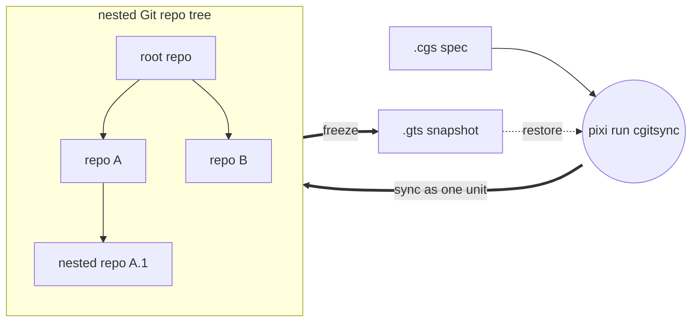
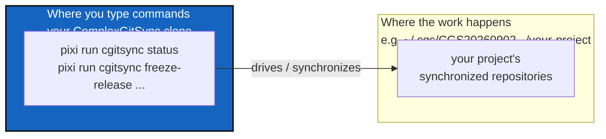

# ComplexGitSync v0002.24

*Created: 2026-05-12*

ComplexGitSync is a command-line tool for synchronising a multi-repository Git
workspace — a tree of nested repositories — from one local `.cgs`
specification (file or CLI specs) or one tracked `.gts` workspace-state snapshot. The public
entry point is `cgitsync`, exposed as a **Pixi task** — there is no global
install, so every invocation in this README and in the docs is
`pixi run cgitsync ...`, never a bare `cgitsync ...`.



## Install & run

Clone ComplexGitSync once — this one clone is reused across every project
you point it at, standalone (below), never nested inside any of them:

```bash
git clone https://github.com/flipoyo/ComplexGitSync.git
cd ComplexGitSync
pixi install
pixi run cgitsync --help
```

This project is developed with Pixi only; `pip install -e .` is not a
supported development workflow.

## How it works

Two different folders are involved when you use ComplexGitSync standalone
(the common case, below): the folder where you actually type commands, and
the folder that actually gets synchronized. They are not the same place —
ComplexGitSync, standing in its own clone, drives a separate project folder
elsewhere on disk:



Concretely: you always run `pixi run cgitsync ...` from inside the
ComplexGitSync clone (that's where `pixi.lock` lives, so `pixi run` needs
it) — but the project folder those commands act on can be anywhere else,
and only that second folder changes from one project to the next. The
Quickstart below shows how to point a command at that other folder
(`CGSHOME`, or `--search-dir` for a single command).

## Quickstart

The common case: you already have (or will hand-author) a `.cgs` spec for
your own project — see ["Adopting a project"](#adopting-a-project-that-has-no-cgs-yet)
below if you don't yet. `bootstrap` clones that project's full tree, root
included, into its own isolated `CGSHOME` — separate from the ComplexGitSync
clone above, so the same clone can bootstrap as many of your projects as you
like, one at a time:

```bash
pixi run cgitsync bootstrap /path/to/your-project.cgs your-project-name
```

**Important:** `bootstrap` prints the workspace path and a `CGSHOME` setup
line at the end of its output. Since `pixi run` must be executed from the
ComplexGitSync directory (where `pixi.lock` is located), tell subsequent
commands where to find your workspace by setting `CGSHOME`:

```bash
# Copy the export command from bootstrap output, or use:
export CGSHOME=/home/user/.cgs/CGS20260831131233/your-project-name
pixi run cgitsync status
pixi run cgitsync view-tree

# Minimalist sync/release cycle
pixi run cgitsync freeze-release release-2026.05 "release 2026.05"
pixi run cgitsync launch-release release-2026.05
```

Pass `--cgs-path` to place `CGSHOME` somewhere else instead of the
`$HOME/.cgs/CGS<timestamp>/` default. For a single command, you can also
use the `--search-dir` flag instead of exporting `CGSHOME`:

```bash
pixi run cgitsync status --search-dir /home/user/.cgs/CGS20260831131233/your-project-name
```

Run any command with `--help` for its full option list (`--dry-run`, explicit
`--gts` paths, `--project`/`--repo` direct authoring, etc.).

### Nested mode (alternative)

If you'd rather have ComplexGitSync live *inside* the project tree it
manages instead of standalone, use `initialise` in place of `bootstrap`, run
from `$CGSHOME/ComplexGitSync`. `CGSPATH` (the parent of `CGSHOME =
CGSPATH/<project-name>`) then defaults to `../..` relative to the current
directory with no `export` needed. The example below uses the CGSil1
reference topology (<https://gitlab.com/CGS_test/CGSil1>):

```bash
git clone https://gitlab.com/CGS_test/CGSil1.git
cd CGSil1
git clone https://github.com/flipoyo/ComplexGitSync.git
cd ComplexGitSync
pixi install

# Initialise: clone the tree from a .cgs spec, or restore it from a .gts snapshot
pixi run cgitsync initialise ../CGSil1.cgs
pixi run cgitsync status
pixi run cgitsync view-tree
```

### Forcing a clone protocol (CI)

`initialise`, `bootstrap`, and `clean-init` accept an expert
`--force-protocol {ssh,https}` flag. It overrides `access_protocol` in
memory for every repo the run clones — including ones discovered later from
a nested `.cgs` in a different, separately-cloned repo — without reading or
writing any `.cgs` file differently. Meant for CI, where forcing `https`
avoids depending on an SSH key/agent being present on the runner (a
dependency that differs between `push` and `pull_request`, especially from
forks, since those don't receive repository secrets):

```bash
pixi run cgitsync initialise examples/complexgitsync.cgs --output-path .. --force-protocol https
```

Leave it unset for normal use — each repo then follows whatever protocol
its own `.cgs` entry actually declares, exactly as without the flag.

## Command reference

| Group | Command | Description |
|---|---|---|
| Minimalist | `initialise` | Initialise a project tree: clone(.cgs) or restore state(.gts). |
| Minimalist | `bootstrap` | Clone a brand-new project tree into an isolated CGSHOME, for running ComplexGitSync standalone (not nested inside the project). |
| Minimalist | `clean-init` | Purge generated clone state, then initialise from a .cgs spec. |
| Minimalist | `freeze-release` | Run add, commit, pull, push, and freeze from a READY tree. |
| Minimalist | `freeze-release-force` | Run add, commit, pull-force, push, and freeze from a READY tree. |
| Minimalist | `status` | Summarize tree readiness and sync state. |
| Minimalist | `view-tree` | Render a topology-focused tree view in terminal. |
| Minimalist | `launch-release` | Check out a frozen release tag from a READY tree. |
| Expert | `purge` | Remove generated clone state for a .cgs workspace. |
| Expert | `validate` | Parse, normalize, and validate a .cgs or validate a .gts topology. |
| Expert | `clone` | Clone a nested project tree from .cgs. |
| Expert | `pull` | Resynchronise an existing project tree from .cgs or .gts. |
| Expert | `pull-force` | Destructively resynchronise an existing project tree from .cgs or .gts. |
| Expert | `checkout` | Synchronize the tree to a branch or tag. |
| Expert | `branch` | Create a branch across the full READY tree without checkout. |
| Expert | `add` | Stage all changes across a READY tree. |
| Expert | `rm` | Remove one or more tracked files, each from the repo that owns it. |
| Expert | `commit` | Commit dirty repositories from a READY tree. |
| Expert | `push` | Push repositories from a READY tree. |
| Expert | `tag` | Create and push a tag across a READY tree. |
| Expert | `freeze` | Freeze a versioned state and emit a .gts snapshot. |
| Expert | `import-submodules` | Report or convert git submodules to plain ComplexGitSync nested repositories. |
| Expert | `verify` | Verify the hash-chained .cgitsync/lgr register for tamper-evidence. |
| Configuration | `discover` | Scan a directory for git repositories and draft a .cgs from what is checked out. |
| Configuration | `configure` | Create a concise .cgs specification for GitHub, GitLab, Codeberg, or a custom provider. |
| Configuration | `create-cgs` | Create a validated .cgs specification from CLI project definitions. |

## Adopting a project that has no `.cgs` yet

The Quickstart above assumes a `.cgs` already exists. Pick the row that
matches the project:

| Situation | Commands | Full walkthrough |
|---|---|---|
| Checked out on disk already | `pixi run cgitsync discover ~/work/project --write draft.cgs`<br>`pixi run cgitsync validate draft.cgs` | [03_configuration_discovery_modes.md](tutorials/03_configuration_discovery_modes.md) |
| Uses git submodules | `pixi run cgitsync import-submodules ~/work/project` (dry run)<br>`pixi run cgitsync import-submodules ~/work/project --apply --output project.cgs` | [03_configuration_discovery_modes.md](tutorials/03_configuration_discovery_modes.md) |
| Neither — topology lives in a build script or in developers' heads | `pixi run cgitsync configure` (interactive) or `create-cgs` (flags) | [02_onboarding_a_real_build_tree.md](tutorials/02_onboarding_a_real_build_tree.md) |

`discover` and `import-submodules` compose: `discover` a checkout to get the
topology for free, then `import-submodules --apply` to retire any
submodules it found. Both are read-only until you pass `--write`/`--apply`
— always review the draft before using it.

## Safety checks

Before `commit`, `push`, and `freeze`, the CLI runs workspace preflight
validation. It reports actionable warnings such as dirty worktrees, ahead
branches, or stale recorded snapshot SHAs, and blocks unsafe states such as
detached HEADs, unresolved merges, missing remotes, or branch divergence.
`freeze` also requires a release tag name that does not already exist.

Each generated `.gts` snapshot lives under its own content-addressed
`$CGSHOME/.cgitsync/state(<hash>)_<n>/` directory and is recorded in the
project's `.lgr` register, which always points at the current snapshot.
Commands that accept a `.gts` source resolve it automatically via that
register when no explicit path is given — pass `--gts FILE` (or a positional
source, depending on the command) only to override that discovery.

`initialise`/`clean-init`/`pull` also keep `.gitignore` in sync across the
whole tree: every repo with children (root or any nested repo that itself
has nested children) gets the relative path of each immediate child added
to its `.gitignore`, since nested repos are plain clones rather than
gitlinks. By default this only writes the file and prints what changed —
nothing is staged, committed, or pushed automatically. Pass
`--commit-gitignore` to explicitly approve staging, committing, and
pushing just that file (never `--force`). If a repo can't be safely pulled
before the sync, the command errors out rather than guessing; pass
`--force-gitignore-sync` to fall back to a pull-force recovery for that
repo instead (force-*pushing* remains unavailable everywhere). The commit
identity defaults to local git config; pass `--git-user-name`/
`--git-user-email` to override it — the override is persisted to
`$CGSHOME/.cgitsync/master.toml`, so later invocations on the same
workspace pick it up without repeating the flags.

## Developer guide

This section is about developing ComplexGitSync itself, not about using it
on your own project (that's the Quickstart above).

This project uses Pixi exclusively — `pip install -e .`, `python -m pip`, and
`python -m venv` are not supported workflows. See [CLAUDE.md](CLAUDE.md) for
the full command list (`pixi install`, `pixi run test`, `pixi run lint`,
`pixi run bump-version`) and its
["Before committing"](CLAUDE.md#before-committing) checklist — the same
rules govern every change in this repo, so this README doesn't restate them.

### Bootstrapping a working checkout

ComplexGitSync manages itself as a multi-repo tree (`install.cgs`, this
project's root file): a fresh `git clone` alone gets you the code but not
`docs/` or `DevSpec/`. Use the same `bootstrap` command Quickstart uses,
pointed at `install.cgs`, to get a fully populated, independently
live-editable checkout:

```bash
git clone https://github.com/flipoyo/ComplexGitSync.git
cd ComplexGitSync
pixi install

pixi run cgitsync bootstrap install.cgs ComplexGitSync
# Copy the export command from bootstrap's own output, or use:
export CGSHOME=/home/user/.cgs/CGS20260831131233/ComplexGitSync

cd "$CGSHOME"       # this *is* the freshly cloned ComplexGitSync checkout —
pixi install        # bootstrap clones a plain checkout, so it needs its own
                     # pixi environment before you can run cgitsync from here
```

`$CGSHOME` now holds `ComplexGitSync` (mounted at its own root — the tree's
project entry), `docs/` (`DocComplexGitSync`), and `DevSpec` cloned
side by side. `pixi.toml`'s `complexgitsync = { path = ".", editable = true }`
makes this checkout self-editable the moment that second `pixi install`
finishes: edit any file under `src/ComplexGitSync/`, then
`pixi run cgitsync ...` from inside `$CGSHOME` picks up the change
immediately — no reinstall step, no separate `pip install -e .`. From here
on, follow [CLAUDE.md](CLAUDE.md) for lint/test/bump-version and the
before-committing checklist.

### Expert mode

The minimalist commands (`initialise`, `freeze-release`, `launch-release`)
each chain several primitives. Expert mode is those primitives exposed
individually, for when you need to inspect or intervene between steps.

`freeze-release` is exactly `add → commit → pull → push → freeze`. Run it
step by step when you want to check state in between:

```bash
pixi run cgitsync pull
pixi run cgitsync add
pixi run cgitsync commit "feat: ..."
pixi run cgitsync push
pixi run cgitsync freeze release-2026.05
```

Useful habits in expert mode:

- **`--dry-run` first.** `add`, `commit`, `push`, `tag`, and `freeze` all
  accept it and print the leaf-first execution plan without touching any
  repository.
- **`status` between steps** to see per-repo branch, upstream, worktree
  state, ahead/behind counts, and drift against the recorded snapshot.
- **Order is not arbitrary.** Mutations run **leaf-first** (`add`, `commit`,
  `push`, `tag`, `freeze`); tree-shaping runs **parent-first** (`clone`,
  `pull`, `checkout`). A parent must never be committed before the children
  it references.
- **`--gts FILE` pins the snapshot.** Every READY-tree command resolves the
  current snapshot through the project's `.lgr` register; pass `--gts` only
  to override that discovery.
- **Recovery.** `pull` refusing on local changes is the safe path — it tells
  you to consider `pull-force`, which resets each repo to its remote branch
  and **discards uncommitted work**. `clean-init` purges generated clone
  state and re-initialises (it preserves `.cgitsync/master.toml`). Nothing
  in the tool ever force-*pushes*.
- **Targeting one file.** `add <path> [<path> ...]` stages only the given
  path(s), each in the one repo that owns it, instead of every repo in
  full. `rm <path> [<path> ...]` does the same for removing a tracked file.
  Both resolve a relative path against `CGSHOME` — not the shell's current
  directory — so this works the same whether you're standing inside the
  tree or invoking `cgitsync` from elsewhere per standalone mode above; an
  absolute path is used as-is. Either way, a path outside every repo in
  the tree errors clearly.

### Architecture boundary

The module boundaries are strict and audited — see
[AgentSpec/AdditionalSpecs.md](AgentSpec/AdditionalSpecs.md) for
the responsibility table and [CLAUDE.md](CLAUDE.md#architecture-boundary)
for the full rule set (the `cli/` package only collects arguments and
delegates, `parse_repo_id()` is the sole repo-identifier parser,
`cgs_format.py` stays offline, every capability lands as a Python client
method before a CLI flag). For the ring-by-ring module map and import
graph, see [docs/DevGuide/architecture.md](docs/DevGuide/architecture.md).

## Further reading

[tutorials/](tutorials/) — three tutorials, simplest to most advanced:

1. [01_first_multi_repo_workspace.md](tutorials/01_first_multi_repo_workspace.md) — full CLI lifecycle walkthrough on a synthetic sandbox tree.
2. [02_onboarding_a_real_build_tree.md](tutorials/02_onboarding_a_real_build_tree.md) — hand-author a `.cgs` for a real 19-repo project, then hand off to its existing `make` build.
3. [03_configuration_discovery_modes.md](tutorials/03_configuration_discovery_modes.md) — a real project with no `.cgs` of its own, reached three ways: by hand, `discover`, `import-submodules`.

[docs/MASTER.pdf](docs/MASTER.pdf) (source: [docs/Text/](docs/Text/)) — reference book, including the Python API (`ComplexGitSyncClient`) and complete command details.

## Authorship

- Contact: nicolas.flipo@minesparis.psl.eu
- Project Manager: Nicolas Flipo
- Main Developer: Nicolas Flipo
<!-- - Contributors (ongoing): Simone Mazzarelli, Tristan Bourgeois, Nicolas Gallois, Pierre Guillou, Fabien Ors -->
- AI assistance: Claude, ChatGPT, Copilot@github, Mistral Vibe 
