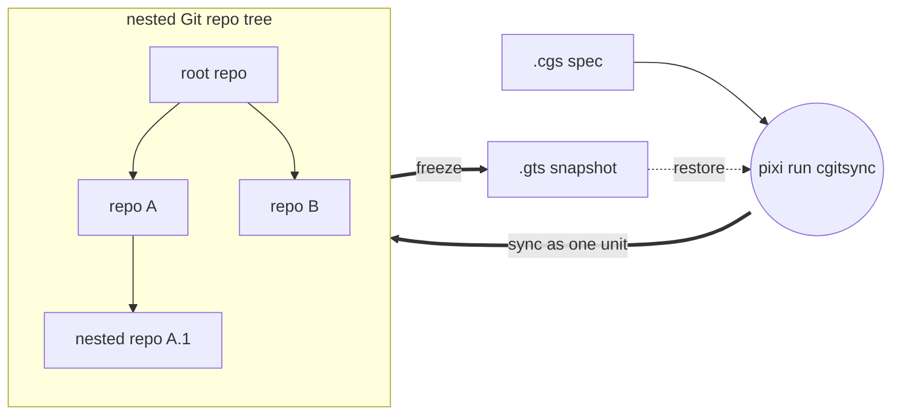
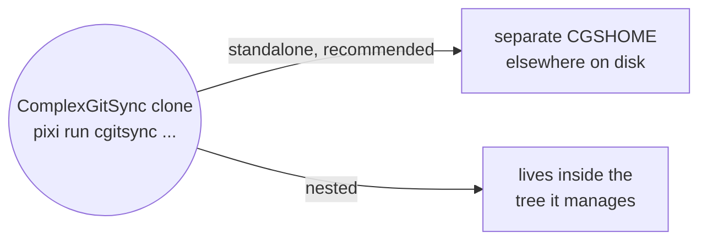

# ComplexGitSync v0002.24

*Created: 2026-05-12*

ComplexGitSync is a command-line tool for synchronising a multi-repository Git
workspace — a tree of nested repositories — from one local `.cgs`
specification (file or CLI specs) or one tracked `.gts` workspace-state snapshot.




## Install

This project is developed and run with [Pixi](https://pixi.sh) only —
`pip install -e .` is not a supported workflow. There is no global install:
every invocation is `pixi run cgitsync ...`, run from inside the clone below.

```bash
git clone https://github.com/flipoyo/ComplexGitSync.git
cd ComplexGitSync
pixi install
pixi run cgitsync --help
```

This one clone is reused across every project you point it at — you don't
re-clone ComplexGitSync per project.

## Standalone or nested

ComplexGitSync drives a project tree two ways:



**Standalone (recommended):** you run `pixi run cgitsync ...` from the
ComplexGitSync clone, pointed at a project workspace (`CGSHOME`) elsewhere on
disk. The same clone drives as many project workspaces as you like, one at a
time. Three cases below, depending on what the target project already has.

**Nested:** ComplexGitSync clones itself as one node inside the tree it
manages, instead of standing outside it. Covered after standalone.

## Standalone

### The project already has a `.cgs`

`bootstrap` clones the project's full tree, root included, into its own
isolated `CGSHOME`. The example below uses this repo's own `install.cgs` —
the same file ComplexGitSync uses to check itself out as a multi-repo tree —
so you can try it without any other project on hand:

```bash
pixi run cgitsync bootstrap install.cgs ComplexGitSync
```

`bootstrap` prints the workspace path and a `CGSHOME` export line at the end
of its output. Since `pixi run` must be executed from the ComplexGitSync
directory (where `pixi.lock` is), point subsequent commands at the new
workspace by exporting it:

```bash
# Copy the export command from bootstrap output, or use:
export CGSHOME=/home/user/.cgs/CGS20260831131233/ComplexGitSync
pixi run cgitsync status
pixi run cgitsync view-tree

# Minimalist sync/release cycle
pixi run cgitsync freeze-release release-2026.05 "release 2026.05"
pixi run cgitsync launch-release release-2026.05
```

Pass `--cgs-path` to place `CGSHOME` somewhere else instead of the
`$HOME/.cgs/CGS<timestamp>/` default. For a single command, use `--search-dir`
instead of exporting `CGSHOME`:

```bash
pixi run cgitsync status --search-dir /home/user/.cgs/CGS20260831131233/ComplexGitSync
```

Run any command with `--help` for its full option list.

### The project is checked out on disk, but has no `.cgs` yet

`discover` scans a directory for git repositories and drafts a `.cgs` from
what is already checked out:

```bash
pixi run cgitsync discover ~/work/project --write draft.cgs
pixi run cgitsync validate draft.cgs
```

Read-only until `--write` is passed — always review the draft before using
it. Full walkthrough: [tutorials/03_configuration_discovery_modes.md](tutorials/03_configuration_discovery_modes.md).

### The project uses git submodules

`import-submodules` reports on, or converts, git submodules into plain
ComplexGitSync nested repositories:

```bash
pixi run cgitsync import-submodules ~/work/project                                   # dry run
pixi run cgitsync import-submodules ~/work/project --apply --output project.cgs      # convert
```

Composes with `discover`: run `discover` first to get the topology for free,
then `import-submodules --apply` to retire the submodules it found. Full
walkthrough: [tutorials/04_submodules_to_ready.md](tutorials/04_submodules_to_ready.md).

If the topology instead lives only in a build script or in developers'
heads, use `configure` (interactive) or `create-cgs` (flags) to author a
`.cgs` from scratch — see [tutorials/02_onboarding_a_real_build_tree.md](tutorials/02_onboarding_a_real_build_tree.md).

## Nested

Run ComplexGitSync from *inside* the project tree it manages instead of
standalone, using `initialise` in place of `bootstrap`, from
`$CGSHOME/ComplexGitSync`. `CGSPATH` (the parent of `CGSHOME =
CGSPATH/<project-name>`) then defaults to `../..` relative to the current
directory, with no `export` needed. The example below uses the CGSil1
reference topology (<https://gitlab.com/CGS_test/CGSil1>):

```bash
git clone https://gitlab.com/CGS_test/CGSil1.git
cd CGSil1
git clone https://github.com/flipoyo/ComplexGitSync.git
cd ComplexGitSync
pixi install

# Initialise: clone the tree from a .cgs spec, or restore it from a .gts snapshot
pixi run cgitsync initialise ../CGSil1.cgs
pixi run cgitsync status
pixi run cgitsync view-tree
```

## Command reference

| Group | Command | Description |
|---|---|---|
| Minimalist | `initialise` | Initialise a project tree: clone(.cgs) or restore state(.gts). |
| Minimalist | `bootstrap` | Clone a brand-new project tree into an isolated CGSHOME, for running ComplexGitSync standalone (not nested inside the project). |
| Minimalist | `clean-init` | Purge generated clone state, then initialise from a .cgs spec. |
| Minimalist | `freeze-release` | Run add, commit, pull, push, and freeze from a READY tree. |
| Minimalist | `freeze-release-force` | Run add, commit, pull-force, push, and freeze from a READY tree. |
| Minimalist | `status` | Summarize tree readiness and sync state. |
| Minimalist | `view-tree` | Render a topology-focused tree view in terminal. |
| Minimalist | `launch-release` | Check out a frozen release tag from a READY tree. |
| Expert | `purge` | Remove generated clone state for a .cgs workspace. |
| Expert | `validate` | Parse, normalize, and validate a .cgs or validate a .gts topology. |
| Expert | `clone` | Clone a nested project tree from .cgs. |
| Expert | `pull` | Resynchronise an existing project tree from .cgs or .gts. |
| Expert | `pull-force` | Destructively resynchronise an existing project tree from .cgs or .gts. |
| Expert | `checkout` | Synchronize the tree to a branch or tag. |
| Expert | `branch` | Create a branch across the full READY tree without checkout. |
| Expert | `add` | Stage all changes across a READY tree. |
| Expert | `rm` | Remove one or more tracked files, each from the repo that owns it. |
| Expert | `commit` | Commit dirty repositories from a READY tree. |
| Expert | `push` | Push repositories from a READY tree. |
| Expert | `tag` | Create and push a tag across a READY tree. |
| Expert | `freeze` | Freeze a versioned state and emit a .gts snapshot. |
| Expert | `import-submodules` | Report or convert git submodules to plain ComplexGitSync nested repositories. |
| Expert | `verify` | Verify the hash-chained .cgitsync/lgr register for tamper-evidence. |
| Configuration | `discover` | Scan a directory for git repositories and draft a .cgs from what is checked out. |
| Configuration | `configure` | Create a concise .cgs specification for GitHub, GitLab, Codeberg, or a custom provider. |
| Configuration | `create-cgs` | Create a validated .cgs specification from CLI project definitions. |

## Further reading

[tutorials/](tutorials/) — four tutorials, simplest to most advanced:

1. [01_first_multi_repo_workspace.md](tutorials/01_first_multi_repo_workspace.md) — full CLI lifecycle walkthrough on a synthetic sandbox tree.
2. [02_onboarding_a_real_build_tree.md](tutorials/02_onboarding_a_real_build_tree.md) — hand-author a `.cgs` for a real 19-repo project, then hand off to its existing `make` build.
3. [03_configuration_discovery_modes.md](tutorials/03_configuration_discovery_modes.md) — a real project with no `.cgs` of its own, reached two ways: by hand, `discover`.
4. [04_submodules_to_ready.md](tutorials/04_submodules_to_ready.md) — the same project's third way (`import-submodules`), plus taking any of the three `.cgs` drafts to a `READY` tree.

[docs/MASTER.pdf](docs/MASTER.pdf) (source: [docs/Text/](docs/Text/)) — reference
book: full command details, expert-mode primitives (`add`/`commit`/`push`/...),
safety/preflight checks, `--force-protocol` for CI, and the Python API
(`ComplexGitSyncClient`).

[docs/DevGuide/](docs/DevGuide/) — the Ring model and module architecture,
for contributors changing `src/ComplexGitSync/` itself.

[CLAUDE.md](CLAUDE.md) — developer commands (`pixi run test`/`lint`/
`bump-version`), bootstrapping a live-editable checkout of ComplexGitSync
itself, and the before-committing checklist, for contributors.

## Authorship

- Contact: nicolas.flipo@minesparis.psl.eu
- Project Manager: Nicolas Flipo
- Main Developer: Nicolas Flipo
<!-- - Contributors (ongoing): Simone Mazzarelli, Tristan Bourgeois, Nicolas Gallois, Pierre Guillou, Fabien Ors -->
- AI assistance: Claude, ChatGPT, Copilot@github, Mistral Vibe 
