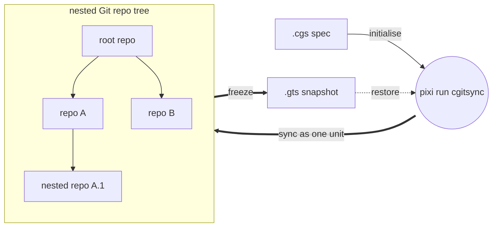
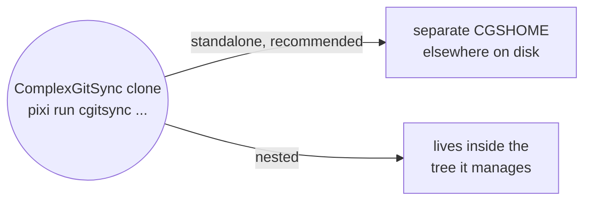

# ComplexGitSync v0002.85
__An alternative to git submodules for complex multi git-repo project management and synchronization__

*Created: 2026-05-12*


## 1. Must Know

### 1.1 What is ComplexGitSync for?

ComplexGitSync is a CLI (command-line tool) for synchronising a multi git-repository 
workspace — in the form of a GitTree — from one local `.cgs`
specification (ASCII file) or one tracked `.gts` workspace snapshot (ASCII file describing the GitTree State). It is a Python package for which the API is exposed through the CLI only.

The CLI is used to operate the same git command on all repos that compose the project. It is a robust and convenient alternative to git submodules, offering a straightforward development experience.

### Two kinds of repository

A tree holds two kinds of Git repos, and telling them apart is most of what you need to
know:

- **Project repos** — the work itself. Whatever the project is for: the
  code, the documents, public data. These follow the project's branch.
- **Private repos** — how the project is run: the pipelines, the agent
  instructions, the rules, private data. These are shared with your other projects, so
  they stay on their own branch instead of following yours.

ComplexGitSync considers Private repos as read-only by default. Private repos come in two kinds, and the difference is who may write:

| | What it is | You may |
|---|---|---|
| **private/local** | your own settings, on a branch named after this project | read and write, with `--private` |
| **private/distant** | someone else's repository | read only |

`--private` points a command at your private/local repos instead of the
project's own. Eleven commands take it — `pull`, `pull-force`, `checkout`,
`branch`, `add`, `rm`, `commit`, `merge`, `push`, `tag` and `freeze`; the
table in section 3 marks each one. ComplexGitSync never writes to a
private/distant repo.

```toml
repos = [
    "github:you/my-app",                                                    # project
    { repository = "github:you/.myRules",  private = true, writable = true },  # private/local
    { repository = "github:them/.theirs",  private = true },                   # private/distant
]
```

### 1.2 How to run ComplexGitSync ?

ComplexGitSync is developed and run with [Pixi](https://pixi.sh) only —
`pip install -e .` is not a supported workflow. There is no global install:
every invocation is `pixi run cgitsync ...`, run from inside the clone below.

```bash
git clone https://github.com/flipoyo/ComplexGitSync.git
cd ComplexGitSync
pixi install
pixi run cgitsync --help
```




## 2. Standalone or nested configuration for project management and sync

ComplexGitSync manages a multi-repo project in two ways, among which the end user chooses:



**Standalone (recommended):** user runs `pixi run cgitsync ...` from the
ComplexGitSync clone. `cgitsync`  affects the project workspace (`CGSHOME`) elsewhere on
disk.

**Nested:** ComplexGitSync clones itself as one node inside the tree it
manages, instead of standing outside it. Covered after standalone.

### 2.1 Standalone configuration

ComplexGitSync offers multiple possibilities for initiating the management of a project.

### 2.1.1 The project already has a `.cgs`

Initialising the project sync uses `bootstrap`, that clones the project's full tree, root included, into its own isolated `CGSHOME`. ComplexGitSync can check itself out as a multi-repo tree:

```bash
pixi run cgitsync bootstrap install.cgs ComplexGitSync
```

`bootstrap` prints the workspace path and a `CGSHOME` export line at the end
of its output. Since `pixi run` must be executed from the ComplexGitSync
directory (where `pixi.lock` is), point subsequent commands at the new
workspace by exporting it:

```bash
# Copy the export command from bootstrap output, or use:
export CGSHOME=/home/user/.cgs/CGS<Timestamp>/ComplexGitSync
pixi run cgitsync status
pixi run cgitsync view-tree

# Minimalist changes propagation sequence
pixi run cgitsync add
pixi run cgitsync commit "<MESSAGE>"
pixi run cgitsync push
```
Run any command with `--help` for its full option list.

`CGSHOME` outranks the directory you are standing in. If you bootstrap a
second workspace later, the export from the first one is still in that shell
and every command keeps acting on the old tree — which looks fine, because
both trees hold the same repositories. Every command that discovers its own
workspace now prints which one it picked and where that choice came from:

```text
cgshome=/home/user/.cgs/CGS<Timestamp>/ComplexGitSync (from $CGSHOME) use_case=nested
source=/home/user/.cgs/.../install.gts (from register)
```

If that is not the workspace you meant, the command also warns and tells you
the two ways out: `unset CGSHOME`, or `--search-dir <the directory you want>`.

`use_case` says which of the two ways of running (§2) is in force:
`nested` when the ComplexGitSync you are running lives inside the workspace
it is managing, `standalone` otherwise. It is reported, never obeyed —
nothing behaves differently because of it. It is there so that believing
you are in one case while standing in the other does not go unnoticed.

Full walkthrough: [tutorials/02_onboarding_a_real_build_tree.md](tutorials/02_onboarding_a_real_build_tree.md)

### 2.1.2 The project is checked out on disk, but has no `.cgs` yet

Initialising the project sync requires `discover`, that scans a directory for git repositories and drafts a `.cgs` from what is already checked out:

```bash
pixi run cgitsync discover ~/work/project --write draft.cgs
pixi run cgitsync validate draft.cgs
```

Read-only until `--write` is passed — always review the draft before using
it. 

A repository found *inside* another repository is drafted as that
repository's child, not the project root's: the report marks it
`inside: <path>` and prints the tree it will write. Only what is checked
out can be found. The scan has no depth limit by default; pass
`--max-depth N` to bound it, and `discover` warns when that bound stopped
the scan early, rather than presenting a partial answer as a complete one.

Full walkthrough: [tutorials/03_adopting_a_real_project.md](tutorials/03_adopting_a_real_project.md).

### 2.1.3 The project uses git submodules

A project may already use git submodules. ComplexGitSync converts them to plain nested repositories using
`import-submodules`, that reports on, or converts, each submodule's gitlink into a plain clone:

```bash
pixi run cgitsync import-submodules ~/work/project           # dry run
pixi run cgitsync import-submodules ~/work/project --apply   # convert
```

That's the whole job — turning gitlinks into plain clones on disk. It does
not also write a `.cgs`: `.gitmodules` never records the root's own
identity, and a checkout worth converting already has a `.cgs` (hand-authored)
or can get one from `discover`, run before or after `--apply`.

Add `--recursive` when a submodule has submodules of its own, so every
level is converted rather than just the top one. The report prints each
path from the directory you pointed the command at, and names the
`.gitmodules` file that declared it.

**Order matters: convert *after* `initialise`, never before.** `initialise`
adopts the root in place but deletes and re-clones every other repository
straight from its remote, and those remotes still declare submodules — so
a conversion run first is undone for every repository except the root. A
second `--recursive` pass cannot repair it either: that walk follows the
submodule graph declared by the root's own `.gitmodules`, which the first
pass removed.

`init-from-submodules` does the whole adoption in that one working order —
`discover`, write the `.cgs`, `initialise`, then convert — against a
checkout you cloned and `git submodule update --init --recursive`'d
yourself:

```bash
pixi run cgitsync init-from-submodules ~/work/project --dry-run  # show the plan
pixi run cgitsync init-from-submodules ~/work/project            # adopt and convert
```

It ends at a `READY` tree with the conversion staged but **not** committed
— the conversion touches every repository that held a submodule, and some
of those may not be yours — then prints the `branch`/`checkout`/`add`/
`commit` steps to run next. The directory must be named after the project
(`discover` derives that from the root repository's own address), since
`CGSHOME` is resolved as `<parent>/<project-name>`.

Full walkthrough over `discover`, `import-submodules`, and `initialise`: [tutorials/03_adopting_a_real_project.md](tutorials/03_adopting_a_real_project.md).


### 2.1.4 When nothing has been set up yet

`cgitsync status` typed on a machine that has never run the tool used to end
in a Python traceback: no `.cgs`, no `.cgitsync` anywhere above you, nothing
exported, and therefore nothing to stand on.

There is now always somewhere to stand. When none of the three inputs finds a
workspace, commands fall back to an empty one of their own under
`$HOME/.cgs`, and `status` says so:

```text
cgshome=/home/user/.cgs/CGS<Timestamp>/cgitsync (from default workspace) use_case=standalone
no living project yet use_case=standalone cgshome=/home/user/.cgs/CGS<Timestamp>/cgitsync
nothing has been cloned into this workspace. To start a project:
  cgitsync bootstrap <project.cgs> <ProjectName>  — clone a tree into a workspace of its own
  cgitsync initialise <project.cgs>               — build the tree a .cgs describes, here
  cgitsync discover <directory> --write           — draft a .cgs from repositories already on disk
```

An empty workspace is a project that has not started, not a failure: the
command exits `0`.

Three things about it are worth knowing:

- **It is created once and reused.** The path is recorded in
  `$HOME/.cgs/default`, so running `status` from the wrong directory four
  times leaves you with one empty workspace, not four.
- **It never guesses.** If you already have workspaces under `$HOME/.cgs`,
  they are listed with the `export CGSHOME=...` line for each — and none of
  them is selected for you.
- **It never overrides `--search-dir`.** If you name a directory and it holds
  no workspace, that is an error, not an invitation to work somewhere else.

Set `CGSPATH` to keep workspaces somewhere other than `$HOME/.cgs`.

### 2.2 Nested Configuration

Run ComplexGitSync from *inside* the project tree it manages instead of
standalone, using `initialise` in place of `bootstrap`, from
`$CGSHOME/ComplexGitSync`. `CGSPATH` (the parent of `CGSHOME =
CGSPATH/<project-name>`) then defaults to `../..` relative to the current
directory, with no `export` needed. The example below uses the CGSil1
reference topology (<https://gitlab.com/CGS_test/CGSil1>):

```bash
git clone https://gitlab.com/CGS_test/CGSil1.git
cd CGSil1
git clone https://github.com/flipoyo/ComplexGitSync.git
cd ComplexGitSync
pixi install

# Initialise: clone the tree from a .cgs spec, or restore it from a .gts snapshot
pixi run cgitsync initialise ../CGSil1.cgs
pixi run cgitsync status
pixi run cgitsync view-tree
```

Full walkthrough: [tutorials/01_first_multi_repo_workspace.md](tutorials/01_first_multi_repo_workspace.md)

## 3. `cgitsync` command list

Every command below is a real subcommand of `cgitsync`; the list is
complete. "Arguments and key options" gives the shape of the call — angle
brackets are required, square brackets optional — and the flags that change
what the command does. Run `cgitsync <command> --help` for the full set.

| Group | Command | Arguments and key options | Description |
|---|---|---|---|
| Minimalist | `initialise` | `[source]` `--output-path` `--force-protocol` `--force-reclone` `--commit-gitignore` | Initialise a project tree: clone(.cgs) or restore state(.gts). Re-clones every dependency; refuses when one holds unpushed work. |
| Minimalist | `bootstrap` | `<source> <project-name>` `--cgs-path` `--force-protocol` | Clone a brand-new project tree into an isolated CGSHOME, for running ComplexGitSync standalone (not nested inside the project). |
| Minimalist | `clean-init` | `<source>` `--output-path` `--force-protocol` `--commit-gitignore` | Purge generated clone state, then initialise from a .cgs spec. |
| Minimalist | `freeze-release` | `<name> <message>` `--gts` `--dry-run` `--force-protocol` | Run add, commit, pull, push, and freeze from a READY tree. Its own `push` and `freeze` steps each fold and send the memory, same as running them separately. |
| Minimalist | `freeze-release-force` | `<name> <message>` `--gts` `--dry-run` `--force-protocol` | Run add, commit, pull-force, push, and freeze from a READY tree. Its own `push` and `freeze` steps each fold and send the memory, same as running them separately. |
| Minimalist | `status` | `--gts` `--search-dir` `--json` | Summarize tree readiness and sync state. |
| Minimalist | `view-tree` | `[source]` `--depth` `--collapse` `--discover-nested` | Render a topology-focused tree view in terminal. |
| Minimalist | `launch-release` | `<release>` `--gts` `--search-dir` | Check out a frozen release tag from a READY tree. |
| Expert | `purge` | `<source>` `--output-path` | Remove generated clone state for a .cgs workspace. |
| Expert | `validate` | `<source>` `--discover-nested` | Parse, normalize, and validate a .cgs or validate a .gts topology. |
| Expert | `clone` | `<source>` `--target-dir` `--output-path` | Clone a nested project tree from .cgs. |
| Expert | `pull` | `[source]` `--private` `--force-protocol` `--commit-gitignore` | Resynchronise an existing project tree from .cgs or .gts. |
| Expert | `pull-force` | `[source]` `--private` `--force-protocol` | Destructively resynchronise an existing project tree from .cgs or .gts. |
| Expert | `checkout` | `<branch>` `--private` `--ref-kind` `--gts` | Synchronize the tree to a branch or tag. A branch that exists on the remote is joined, not recreated — fetching it first if this workspace has never seen it, so a prior `pull` is not required. |
| Expert | `branch` | `<branch>` `--private` `--gts` | Create a branch across the full READY tree without checkout. Joins a branch that already exists on the remote, fetching it on demand if needed, instead of creating a second one at HEAD. |
| Expert | `add` | `[PATH ...]` `--private` `--dry-run` `--gts` | Stage all changes across a READY tree. |
| Expert | `rm` | `<PATH ...>` `--private` `--dry-run` `--gts` | Remove one or more tracked files, each from the repo that owns it. |
| Expert | `commit` | `[message]` `--message` `--private` `--no-stage` `--dry-run` | Commit dirty repositories from a READY tree. |
| Expert | `merge` | `<branch>` `--into` `--private` `--ff-only` `--no-ff` `--dry-run` `--resolve` | Merge a project branch across a READY tree, leaf-first. Names every conflicting file when it refuses. `--into <target>` checks out the target and merges into it in one command. |
| Expert | `push` | `--private` `--dry-run` `--force-protocol` `--gts` | Push repositories from a READY tree. Folds and sends this project's own memory first, when one is mounted and adopted. |
| Expert | `tag` | `<name>` `--private` `--gts` | Create and push a tag across a READY tree. Folds and sends the memory first, same as `push`. |
| Expert | `freeze` | `<name>` `--private` `--dry-run` `--gts` | Freeze a versioned state and emit a .gts snapshot. Folds and sends the memory first, same as `push`. |
| Expert | `import-submodules` | `<repo-root>` `--apply` `--recursive` | Report or convert git submodules to plain ComplexGitSync nested repositories. |
| Expert | `init-from-submodules` | `<repo-root>` `--cgs` `--max-depth` `--dry-run` `--force` | Adopt a submodule-based checkout: discover, initialise, then convert its submodules. |
| Expert | `verify` | `--repair` `--search-dir` `--json` | Say whether this workspace's recorded history is verified, absent, legacy or corrupt. |
| Expert | `memory` | `status` `list` `show <state>` `explore` `init` `mount` `adopt [--reboot]` `branch` `clone` `push` `reboot` | Look at what this workspace remembers, and keep it somewhere safer than one disk. Each subcommand takes `--search-dir`. |
| Configuration | `discover` | `[root]` `--write` `--max-depth` | Scan a directory for git repositories and draft a .cgs from what is checked out. |
| Configuration | `configure` | `--output` | Create a concise .cgs specification for GitHub, GitLab, Codeberg, or a custom provider. |
| Configuration | `create-cgs` | `--project` `--repo` `--output` | Create a validated .cgs specification from CLI project definitions. |
| Configuration | `repo` | `create <provider:owner/name>` | Create a repository on its provider, without leaving cgitsync. `create` takes `--public` and `--description`; repositories are private otherwise. |

> **`initialise` re-clones your dependencies.** Only the root repository at
> CGSHOME is kept as it is. Every repository below it whose directory already
> holds files is **deleted and cloned again** — the old `.git` goes too, so
> nothing in it can be recovered afterwards.
>
> Before deleting anything, `initialise` checks each destination and stops the
> whole run if one holds work that exists nowhere else: uncommitted changes,
> commits you have not pushed, or a branch with no upstream. It names every
> repository that blocked it and deletes none of them. Commit and push, or
> pass `--force-reclone` to delete the work on purpose.
>
> A directory that is not a Git checkout — what a clone interrupted halfway
> leaves behind — is still cleared with no flag needed.

> **`merge` names the files that block it.** `merge` checks every repository
> before it merges any, so a conflict anywhere leaves the whole tree
> untouched. When it refuses, it now names each blocked repository and every
> conflicting file under it, so you do not have to go looking:
>
> ```text
> merge refused; no repository was merged: ComplexGitSync: tests/unit/test_documents.py
> ```
>
> `merge --dry-run` shows the same list without merging anything.
>
> `merge --resolve` is the way out when you want to fix the conflict rather
> than read about it. It merges one repository at a time and stops at the
> first that conflicts, then opens that repository in your merge tool. This
> gives up the all-or-nothing guarantee: repositories merged before the
> conflict stay merged, so the tree can be left partly merged. The command
> says so before it writes anything, and names what it merged, where it
> stopped, and what it never reached.
>
> Your own `merge.tool` is used if you configured one. Otherwise VS Code is
> suggested when it is available, for that one call only — your Git
> configuration is never written. With no tool available, the command prints
> what to run by hand instead of failing.

### What `status` tells you

#### Which branch you are on: `cgitsync_branch`

The `summary` line starts with `cgitsync_branch=<branch>` — the branch your
project is on, which is the branch its root repository is on. It is the one
`cgitsync branch` and `cgitsync checkout` set, and the one every other
repository follows.

The table below it shows a branch per repository, and they are not all the
same on purpose: a **private/local** repository keeps your settings on a
branch named after your project, so with the project on `apoub` you will see
`ComplexGitSync_apoub` there. That is the rule working, not a repository out
of step. `cgitsync_branch` is the one line that answers "which branch am I
on?" without you having to know which row to read.

Two values are not branch names:

| Value | Meaning |
|---|---|
| `detached` | The root repository is parked on a commit rather than a branch. `cgitsync checkout <branch>` puts the tree back. |
| `unknown` | There is no branch to report — no project has been loaded, or Git could not be asked. |

#### One row per repository

`cgitsync status` prints one row per repository. Two columns answer "is this
repository up to date?", and they answer it against the branch each
repository is actually on:

| Column | Meaning |
|---|---|
| `UPSTREAM_BRANCH` | The remote branch this one tracks, e.g. `origin/main`. `-` means the branch tracks nothing. |
| `LOCAL` | `clean`, `dirty`, `staged`, or `staged+dirty` — your working tree, independent of any remote. |
| `SYNC` | How this branch stands against its upstream. |

`SYNC` has six values:

| Value | Meaning |
|---|---|
| `synced` | Level with the upstream. |
| `ahead(+N)` | `N` commits here that the remote does not have. `push` sends them. |
| `behind(-N)` | `N` commits on the remote that are not here. `pull` fetches them. |
| `diverged(+N/-M)` | Both, from a common ancestor. `merge` or `pull-force` resolves it. |
| `no-upstream` | This branch was never pushed, so there is nothing to compare it to. Normal for a branch you just made, and for a **private/local** repository that only `push --private` ever sends. |
| `unknown` | The branch names an upstream that does not resolve. `pull` or `push` repairs it; if it persists, the remote is unreachable or the ref was deleted. |

`pull` fetches every branch of each remote before pulling your own, so
`checkout <a branch a colleague pushed>` finds their work rather than
starting a new branch of the same name where you happen to stand. `checkout`
does not depend on a prior `pull` for this: a branch it has neither locally
nor cached from the remote gets one on-demand check with the remote before
it is treated as new — found, it is fetched and joined; not found, it is
created fresh at HEAD, exactly as before.

The `summary` line counts `no-upstream` and `unknown` rows as `unmeasured`,
separately from `ahead` and `behind`. A repository nobody could measure is
not the same as one that is level, and the summary never reports the second
when it means the first.

### Options that recur

A few flags mean the same thing wherever they appear:

| Option | Meaning |
|---|---|
| `--private` | Run on your **private/local** repos instead of the project's own. Exclusive, not additive. Available on `pull`, `pull-force`, `checkout`, `branch`, `add`, `rm`, `commit`, `merge`, `push`, `tag` and `freeze` — and on nothing else. |
| `--all` | Run on both halves at once — your own repos **and** your **private/local** ones, sharing one commit message. Available on `add`, `commit`, `push` and `merge`. Cannot be combined with `--private`. Read-only configuration repos are never written to. |
| `--gts <snapshot.gts>` | Act on an explicit snapshot rather than the one found automatically. |
| `--search-dir <dir>` | Where to start looking for the tree. Accepted by every command that finds a tree on its own. |
| `--dry-run` | Print the plan and change nothing. |
| `--force-protocol {ssh,https}` | Rewrite remotes to that protocol while cloning or pushing. Unrelated to `pull-force`, which is the destructive one. |

`rm` is the one command you hand a path to rather than a scope, so
`--private` works as a filter there: it refuses a path that belongs to one
of your own repos, and removes only from your **private/local** ones.
Without the flag, `rm` still reaches whatever repo owns the path — a
configuration repo included — and now says so when it does, naming the repo
so you can see that the file you removed is shared with other projects.

### Git speaks English here

If your machine runs in another language, you will notice one thing: when a
Git command fails, the message `cgitsync` shows you is in English, even
though running the same command yourself would show it in your own language.

That is deliberate. `cgitsync` reads those messages to work out what went
wrong and what to suggest — whether a failed `push` was an authentication
problem, for instance, and whether switching to `--force-protocol ssh` would
help. Git translates its messages, so on a French machine `cgitsync` could
not recognise its own errors and the suggestion never appeared.

Only the messages change language. Your file names, sorting and number
formats are untouched, and nothing about your own shell changes — only what
`cgitsync` asks Git for while it runs.

### Merging into a branch you are not on

`cgitsync merge <branch>` merges into whatever is checked out. `--into` names
the target instead, and does both halves in one command:

```bash
cgitsync merge memory-dev --into main --dry-run   # what it would do, per repo
cgitsync merge memory-dev --into main
```

This matters most when the tree you are merging **contains the ComplexGitSync
you are running** — the developer checkout, which installs itself editable. A
separate `cgitsync checkout main` would replace that build, and the merge you
typed next would run under the older one, against a workspace the newer one
wrote. One command cannot be caught that way: it finishes under the build it
started with.

Every repository is checked before any is touched, so a conflict or a missing
target leaves the whole tree where it was — still on the source branch, with
nothing checked out and nothing merged. A fast-forward is reported as one,
which is usually why a repository looks untouched afterwards.

A `--private` or `--all` `--into` call is only ever about part of the tree
until you run it; the branches it did not touch are meant to still be
somewhere else. So a second scoped call — `--private` after the plain form,
or `--all` after either — finishes the rest rather than refusing it for not
having moved yet.

`checkout` warns when it is about to install a different build of the tool and
still does it: looking at an older branch is legitimate, being surprised by it
is not.

### What the workspace remembers

`cgitsync` keeps a record of what it synchronised: a **State** per distinct
tree it saw, and a **ledger** with one entry per operation. `memory` is how
you look at it.

```bash
cgitsync memory status          # how much is remembered, and does it verify
cgitsync memory list            # every State, newest recording first
cgitsync memory show 2acdc98b   # one State, what was committed, who published it
cgitsync memory show 2acdc98b --full   # whole commit messages, not first lines
```

`memory status` prints the tool versions the records carry — cgitsync, git,
pixi, and dvc or git-lfs where they were used. It shows the latest entry's,
and the first entry's beside it when the two differ, so a chain that spans
an upgrade says where the upgrade fell.

A State named by `list` with no timestamp is one nobody recorded: history
from before the ledger existed, or a file that arrived some other way.
`verify` reports those, and does not call them corruption.

`memory show` also prints what each `commit` wrote — the message, the
repository, and whether anybody but this machine has ever seen it. A commit
marked `unpushed` exists only here. That answer survives the repository
itself: a deleted branch or an archived project takes `git log` with it, and
this record stays. Editing one of these messages afterwards is something
`verify` reports, because the ledger entry that recorded them carries their
fingerprint.

None of the three above is organised by branch, and a memory holds one
branch per project. `memory explore` is the read for a person who does not
already have a hash to give `memory show`:

```bash
cgitsync memory explore              # published commits on this memory's branch, newest push first
cgitsync memory explore --timeline   # every ledger entry in order — checkout, merge, push included
```

`explore`'s default view is what a colleague pulling this branch would
see: one row per commit this memory recorded as published, not every
commit ever made here. `--timeline` reads the ledger straight through
instead, so operations a commit-only view drops still show up.
`--branch NAME` asks for a memory branch other than the one checked out on
this disk; today that only works for the one actually checked out, and
names `memory clone --branch NAME` when it is not.

### Keeping a memory when the disk does not

A memory lives at `.cgitsync/.memory`, which can be a repository of its
own — the same kind of private mount `.localSpec` is. `.cgitsync` itself
stays the workspace's own live state — States, the ledger, logs — and only
what a `memory push` has folded in ever sits inside `.memory`, which is
what lets that mount be checked out and merged like any other. One
repository holds every project's memory, on a branch per project, so
nothing new has to be learned to use it:

```bash
cgitsync memory init     # the .cgs entry to add, and the branch it uses
cgitsync memory clone    # bring this project's memory onto a new machine
cgitsync memory push     # fold what accumulated, commit it, and push it
```

`init` proposes and stops. **It never creates the repository for you**:
`cgitsync` speaks Git and nothing else, so it prints the one command that
creates it and waits.

Once mounted and adopted, nothing needs to be pushed by hand any more:
`push`, `tag`, and `freeze` each fold and send this project's own memory
first, before doing anything else — the same frontier `memory push` always
crossed, crossed automatically by every command that was already about to
reach a remote for an unrelated reason. `cgitsync memory push` remains the
way to settle the memory on its own, with nothing else to publish. A
machine with no network, or a memory that cannot reach its remote for any
other reason, still keeps a complete, verifiable memory: the fold warns
and the command it was folding for finishes anyway, offline being the
normal case, not a failure.

A memory mounted before `cgitsync memory migrate` existed sat directly at
`.cgitsync` instead. Running `cgitsync memory migrate` once moves it onto
the layout above — nothing but the mount's own path changes.

### Starting a memory's history over

A project's shape changes — repositories added, removed, restructured —
and a memory built for the old shape stops being a clean answer to "what
does this project look like." `cgitsync memory reboot` closes the current
chapter and opens an empty one, without losing the old one:

```bash
cgitsync memory reboot
```

```
folded=12 pending record(s)
archived=ComplexGitSync -> ComplexGitSync.archived-20260917
exported=.cgitsync/.memory/.cgs/ComplexGitSync-v2.cgs
branch=ComplexGitSync (fresh, empty)
next: use the tool as normal — the next command writes this branch's first State
```

Nothing is ever deleted or force-pushed. The old branch is renamed —
locally and on origin — to `<branch>.archived-<date>`, still fetchable
with every State, ledger entry and commit message it ever held; a fresh,
empty branch takes the original name, so nothing about how the memory is
mounted changes. The tree's current shape is exported to a permanent,
versioned `.cgs` (`.cgitsync/.memory/.cgs/<project>-v<N>.cgs`, `N`
incrementing once per reboot — never overwritten, never reused) rather
than read from any hand-authored file. `cgitsync memory adopt --reboot`
is the same fresh start for a mount being adopted for the very first time:
it adopts the repository identity but starts its content empty instead of
carrying forward whatever the fallback branch already holds. Appending —
the ordinary `memory adopt` — stays the default either way.

**What a memory carries off your machine.** One path: the tree's own root,
with `$HOME` substituted. Everything else it records — every repository
path, every path in a command line it logged — is written against the tree
as `$CGSTREE/...`, so nothing about your directory layout, and no user
name, travels with it.

## 3.1 What `cgitsync` promises a script

### Exit codes

Every command uses the same three, and they mean the same thing everywhere:

| Code | Meaning |
|---|---|
| `0` | The command did what was asked. |
| `1` | It ran, and the answer is no — a merge conflict, a tree that is not `READY`, a verification that found something. |
| `2` | It could not run — bad arguments, no workspace, a missing or unreadable file. |

The distinction that matters is between "I asked and the answer is no" and
"I could not ask". A CI job treats those differently: the first is a result
to act on, the second is an invocation to fix.

One command reads a document rather than acting on one. `cgitsync validate`
exits `1` when the document is invalid, because saying so is its job; every
other command exits `2` on the same document, because it could not run at
all.

One failure exits `2` even under `validate`: a `.gts` written by a newer
`cgitsync` than the one running. That is not a verdict this build can
reach — it cannot check a format it has never seen — so it says so by name
(`this snapshot was written by a newer ComplexGitSync ...`) rather than
guessing and reporting a hash mismatch that reads as corruption. If you hit
this on a self-managing checkout (this project's own workspace, for
example) before this message existed, the fix is plain Git: `git checkout
<the branch you were on>` in the repository that is the running tool, then
try again — the snapshot was never corrupt, and deleting it loses history
for nothing.

A failure prints one line on stderr — `cgitsync status: Unable to locate
CGSHOME` — and no traceback. **If you ever see a traceback, it is a bug in
this tool, not a problem with your input.** That is deliberate: the errors
the tool expects are reported as messages, so the ones it does not expect
stay visible.

### `--json`

`status` and `verify` accept `--json`. Each prints **one JSON object on
stdout and nothing else**, so a pipe never has to strip a banner:

```bash
cgitsync status --json | jq -r '.cgitsync_branch'
cgitsync verify --json | jq -e '.status == "clean"'
```

Everything a person would read — the workspace that was resolved, the log
file, any warning — goes to stderr instead. The exit code is the same as
without the flag, so either signal may be used. A failure also prints one
object, with `"status": "error"` and the exit code in it, rather than
leaving your pipe with nothing to parse.

Two exceptions, both deliberate: `--help` and `--version` print text, and a
command line that does not parse is argparse's answer (usage on stderr, exit
`2`, nothing on stdout) — `--json` cannot be honoured for an invocation that
never parsed, since the flag itself may be what failed.

### What is stable, and what is not

| Surface | Promise |
|---|---|
| Command names and their documented flags | Stable within a major version. |
| Exit codes | Stable within a major version. |
| `--json` output | **Additive only** — new fields may appear; existing ones do not change meaning and do not vanish. `schema_version` says which generation you are reading. |
| `.cgs` and `.gts` grammar | Versioned in the file, and the version is read on load. |
| Python modules under `src/ComplexGitSync/` | **Not a public interface.** `ComplexGitSyncClient` is the CLI's own implementation. Import it and a refactor may break you; no deprecation is owed. |
| `verify` | **Experimental.** The register it reads is being rewritten, so its output and its findings may change. Everything else in the command table is covered by the promises above. |

`cgitsync verify` answers one of four things, and the difference matters if
you gate a build on it:

| Answer | Exit | Means |
|---|---|---|
| `verified` | `0` | A chain was read and every link held. |
| `no-history` | `0` | Nothing recorded here yet. A new workspace is not a broken one. |
| `legacy` | `1` | History exists, in the old single-file register, which carries no chain. Readable, not verifiable. |
| `corrupt` | `1` | A chain was read and it does not hold. |

`legacy` exits non-zero on purpose: "I cannot tell" is not a yes.

Every command that writes a snapshot now records it in a hash-chained
ledger under `.cgitsync/lgr/`, so a workspace you have used since then
answers `verified`. Each record also carries the versions that produced it —
cgitsync, git, pixi, and dvc or git-lfs where they were used — so a memory
says what made it, not just when. A workspace whose only history predates
that answers `legacy`: the older single-file register is still read, and is
no longer written.

The Python row is worth stating plainly: this project requires every
capability to exist as a `ComplexGitSyncClient` method with a thin CLI pair,
but that is a rule about where logic lives inside the project — not a
promise to anyone importing the package. The CLI is the product.

## 4. Further reading

[tutorials/](tutorials/) — five tutorials, simplest to most advanced:

1. [01_first_multi_repo_workspace.md](tutorials/01_first_multi_repo_workspace.md) — full CLI lifecycle walkthrough on a synthetic sandbox tree.
2. [02_onboarding_a_real_build_tree.md](tutorials/02_onboarding_a_real_build_tree.md) — hand-author a `.cgs` for a real 19-repo project, then hand off to its existing `make` build.
3. [03_adopting_a_real_project.md](tutorials/03_adopting_a_real_project.md) — a real project with no `.cgs` of its own that still uses git submodules: one `init-from-submodules` command, what it runs underneath, and on to a pushed `READY` tree.
4. [04_private_repos.md](tutorials/04_private_repos.md) — the repos that configure your project rather than being it: what `private = true` protects, when to add `writable = true`, and how their branches follow yours.
5. [05_memory.md](tutorials/05_memory.md) — your project's memory: the five commands, run once per project, that turn what `cgitsync` remembers into a repository of its own, so it outlives the disk it was made on.

[docs/MASTER.pdf](docs/MASTER.pdf) (source: [docs/Text/](docs/Text/)) — reference
book: full command details, expert-mode primitives (`add`/`commit`/`push`/...),
safety/preflight checks, `--force-protocol` for CI, and the Python API
(`ComplexGitSyncClient`).

[docs/DevGuide/](docs/DevGuide/) — the Ring model and module architecture,
for contributors changing `src/ComplexGitSync/` itself.

[CLAUDE.md](CLAUDE.md) — developer commands (`pixi run test`/`lint`/
`bump-version`), bootstrapping a live-editable checkout of ComplexGitSync
itself, and the before-committing checklist, for contributors.

## Authorship

- Contact: nicolas.flipo@minesparis.psl.eu
- AUTH: Nicolas Flipo
<!-- - Contributors (ongoing): Simone Mazzarelli, Tristan Bourgeois, Nicolas Gallois, Pierre Guillou, Fabien Ors -->

## LLM assistance

Parts of this project were written with the help of large language models,
used as a paid service under the author's direction. They are acknowledged
here rather than credited as co-authors on commits, merges or pull
requests, following the convention that paid assistance is acknowledged
and not co-signed.

- **Claude** (Anthropic) — including Claude Code with Claude Opus 5
- **ChatGPT** (OpenAI)
- **GitHub Copilot**
- **Mistral Vibe**

Responsibility for everything in this repository rests with the author.

## License

Apache 2.0
