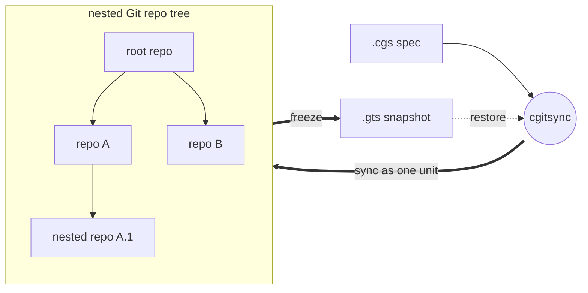

# ComplexGitSync v0002.05

ComplexGitSync is a command-line tool for synchronising a multi-repository Git
workspace — a tree of nested repositories — from one local `.cgs`
specification (file or CLI specs) or one tracked `.gts` workspace-state snapshot. The public
entry point is `cgitsync`.



## Install & run

```bash
pixi install
pixi run cgitsync --help
```

This project is developed with Pixi only; `pip install -e .` is not a
supported development workflow.

## Quickstart

The example below uses the CGSil1 reference topology
(<https://gitlab.com/CGS_test/CGSil1>). Commands run from
`$CGSHOME/ComplexGitSync`; `CGSHOME=$CGSPATH/<project-name>`, and `CGSPATH`
defaults to `../..` relative to the current directory.

```bash
git clone https://gitlab.com/CGS_test/CGSil1.git
cd CGSil1
git clone https://github.com/flipoyo/ComplexGitSync.git
cd ComplexGitSync
export CGSPATH="${CGSPATH:-../..}"
export CGSHOME="${CGSHOME:-$CGSPATH/CGSil1}"

# Initialise: clone the tree from a .cgs spec, or restore it from a .gts snapshot
pixi run cgitsync initialise ../CGSil1.cgs

# Inspect the synchronised tree
pixi run cgitsync status
pixi run cgitsync view-tree

# Minimalist sync/release cycle
pixi run cgitsync freeze-release release-2026.05 "release 2026.05"
pixi run cgitsync launch-release release-2026.05

# Equivalent expert, step-by-step form
pixi run cgitsync pull
pixi run cgitsync add
pixi run cgitsync commit "feat: update CGSil1"
pixi run cgitsync push
pixi run cgitsync freeze release-2026.05
```

Run any command with `--help` for its full option list (`--dry-run`, explicit
`--gts` paths, `--project`/`--repo` direct authoring, etc.).

## Command reference

| Group | Command | Description |
|---|---|---|
| Minimalist | `initialise` | Initialise a project tree: clone(.cgs) or restore state(.gts). |
| Minimalist | `clean-init` | Purge generated clone state, then initialise from a .cgs spec. |
| Minimalist | `freeze-release` | Run add, commit, pull, push, and freeze from a READY tree. |
| Minimalist | `freeze-release-force` | Run add, commit, pull-force, push, and freeze from a READY tree. |
| Minimalist | `status` | Summarize tree readiness and sync state. |
| Minimalist | `view-tree` | Render a topology-focused tree view in terminal. |
| Minimalist | `launch-release` | Check out a frozen release tag from a READY tree. |
| Expert | `purge` | Remove generated clone state for a .cgs workspace. |
| Expert | `validate` | Parse, normalize, and validate a .cgs or validate a .gts topology. |
| Expert | `clone` | Clone a nested project tree from .cgs. |
| Expert | `pull` | Resynchronise an existing project tree from .cgs or .gts. |
| Expert | `pull-force` | Destructively resynchronise an existing project tree from .cgs or .gts. |
| Expert | `checkout` | Synchronize the tree to a branch or tag. |
| Expert | `branch` | Create a branch across the full READY tree without checkout. |
| Expert | `add` | Stage all changes across a READY tree. |
| Expert | `commit` | Commit dirty repositories from a READY tree. |
| Expert | `push` | Push repositories from a READY tree. |
| Expert | `tag` | Create and push a tag across a READY tree. |
| Expert | `freeze` | Freeze a versioned state and emit a .gts snapshot. |
| Configuration | `configure` | Create a concise .cgs specification for GitHub, GitLab, Codeberg, or a custom provider. |
| Configuration | `create-cgs` | Create a validated .cgs specification from CLI project definitions. |
| Memory | `remember` | Bind a .cgs artefact to its external SSH-Git Memory endpoint. |
| Memory | `memorize` | Persist a finalized local Memory State to the configured SSH-Git remote. |
| Memory | `retrieve` | Retrieve an external SSH-Git Memory repository into a clean CGSHOME. |
| Memory | `reload` | Retrieve external Memory and restore the ComplexGitSync execution context. |

## Safety checks

Before `commit`, `push`, and `freeze`, the CLI runs workspace preflight
validation. It reports actionable warnings such as dirty worktrees, ahead
branches, or stale recorded snapshot SHAs, and blocks unsafe states such as
detached HEADs, unresolved merges, missing remotes, or branch divergence.
`freeze` also requires a release tag name that does not already exist.

Each generated `.gts` snapshot lives under its own content-addressed
`$CGSHOME/.cgitsync/state(<hash>)_<n>/` directory and is recorded in the
project's `.lgr` register, which always points at the current snapshot.
Commands that accept a `.gts` source resolve it automatically via that
register when no explicit path is given — pass `--gts FILE` (or a positional
source, depending on the command) only to override that discovery.

`initialise`/`clean-init`/`pull` also keep `.gitignore` in sync across the
whole tree: every repo with children (root or any nested repo that itself
has nested children) gets the relative path of each immediate child added
to its `.gitignore`, since nested repos are plain clones rather than
gitlinks. By default this only writes the file and prints what changed —
nothing is staged, committed, or pushed automatically. Pass
`--commit-gitignore` to explicitly approve staging, committing, and
pushing just that file (never `--force`). If a repo can't be safely pulled
before the sync, the command errors out rather than guessing; pass
`--force-gitignore-sync` to fall back to a pull-force recovery for that
repo instead (force-*pushing* remains unavailable everywhere). The commit
identity defaults to local git config; pass `--git-user-name`/
`--git-user-email` to override it — the override is persisted to
`$CGSHOME/.cgitsync/master.toml`, so later invocations on the same
workspace pick it up without repeating the flags.

## Further reading

- [docs/tutorial_cgsi1.md](docs/tutorial_cgsi1.md) — full CGSil1 walkthrough, step by step.
- [docs/MASTER.pdf](docs/MASTER.pdf) (source: [docs/Text/](docs/Text/)) — reference book, including the Python API (`ComplexGitSyncClient`) and complete command details.

## Authorship

- Contact: nicolas.flipo@minesparis.psl.eu
- Project Manager: Nicolas Flipo
- Main Developer: Nicolas Flipo
- Contributors (ongoing): Simone Mazzarelli, Tristan Bourgeois, Nicolas Gallois, Pierre Guillou, Fabien Ors
- AI assistance: ChatGPT, Copilot@github, Mistral Vibe, Claude
