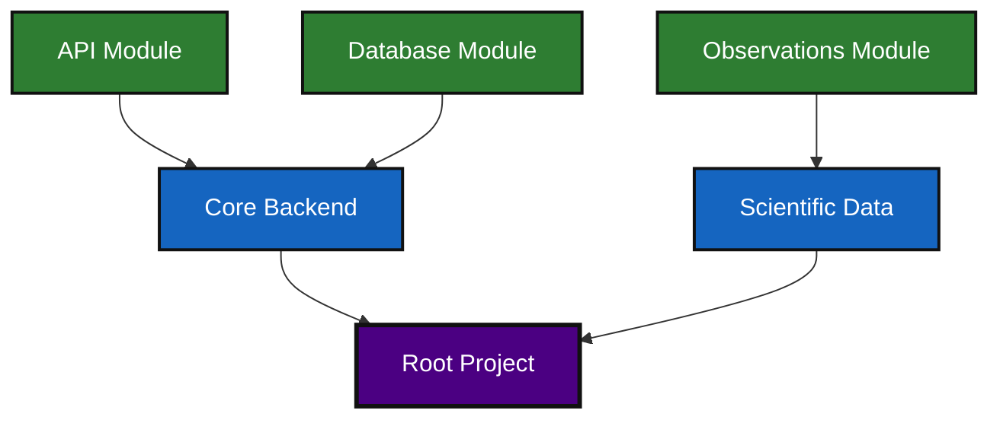
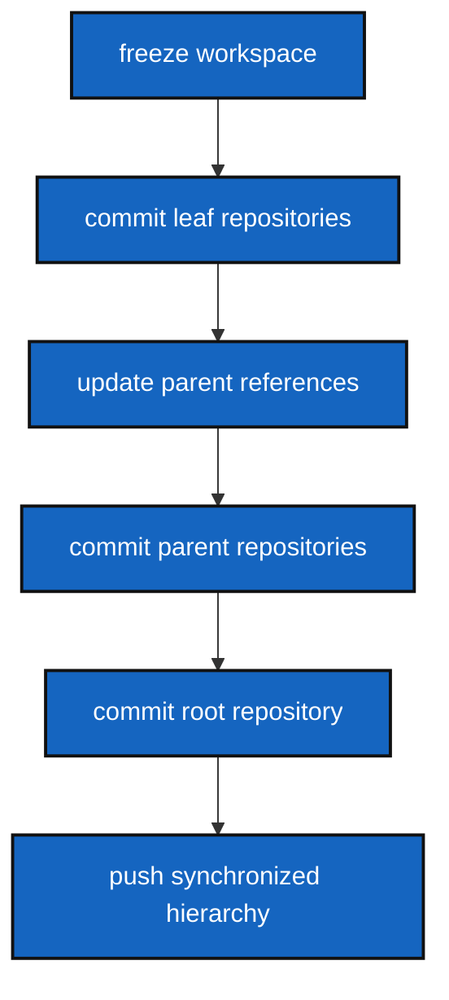

# ComplexGitSync

## 1. Purpose - Key Concepts

ComplexGitSync keeps one root Git repository and its nested Git repositories in
sync from a single local specification and a tracked local tree state.


### 1.1 Why ComplexGitSync?

Modern scientific and engineering projects rarely live inside a single repository.

A real project often contains:

- core libraries
- APIs
- infrastructure repositories
- datasets
- simulation engines
- visualization frontends
- shared modules
- nested dependencies

Git submodules partially solve linking problems, but they do not provide:

- deterministic workspace synchronization
- orchestration lifecycle
- snapshot reproducibility
- dependency-aware propagation
- workspace-level state identity
- multi-repository freeze/restore workflows

ComplexGitSync introduces a deterministic synchronization layer on top of Git.

### 1.2 Core Concept

ComplexGitSync models a project as a `GitTree`:

- one root repository
- multiple parent repositories
- multiple leaf repositories
- deterministic dependency propagation

The workspace behaves as a coherent directed repository graph rather than isolated repositories.



ComplexGitSync then applies deterministic lifecycle operations across the entire tree.

### 1.3 Deterministic Synchronization

Synchronization is performed through deterministic propagation rules.

Mutations propagate leaf-first.

Reference targeting propagates parent-first.

Workspace states are materialized into canonical snapshots.



This allows the entire workspace to behave as a reproducible and traceable system.

### 1.4 Runtime model

- `GitRepo` represents a single Git repository
- `GitTree` represents the complete repository dependency graph
- `ComplexGitSyncClient` exposes synchronization lifecycle operations through a high-level Python API 
- `Orchestre` is the internal orchestration engine that coordinates deterministic transitions accross the tree

### 1.5 Deterministic Documents

ComplexGitSync introduces deterministic workspace documents. 

#### `.cgs` — ComplexGitSync Specification

Describes the project topology and synchronization specification.

#### `.gts` — GitTreeState

Canonical deterministic workspace snapshot.

A `.gts` snapshot contains:

- repository states
- branch targeting
- synchronization metadata
- lifecycle state
- deterministic SHA-256 identity

Identical workspace states generate identical hashes.

This enables:

- reproducibility
- integrity verification
- deterministic restoration
- synchronization replay

#### `.lgr` — LocalGitRegister

Append-only local synchronization ledger.

Tracks:

- stable local snapshot ids
- current workspace pointer
- synchronization history

#### `.goc` — GitOrchestrationCommand

Higher-level orchestration plans and lifecycle commands.


### 1.6 Architectural positioning

ComplexGitSync is a deterministic synchronization layer built on top of Git, designed to manage complex multi-repository projects as a single, versioned workspace. 
It introduces the GitTree concept: a dependency graph that links root, parent, and leaf repositories, treating the entire workspace as a Directed Acyclic Graph (DAG)—just like Git does for individual repositories.
This allows synchronized operations (e.g., commit, push, tag) across the entire tree, with deterministic snapshots (.gts) for reproducibility and traceability.
Think of it as a fluid Git submodules manager: instead of static links, ComplexGitSync provides lifecycle orchestration, cycle resolution, and deterministic state tracking for complex workflows. It can be viewed as a synchronisation package of complex processes involving unitary DAG as a topology for subprocesses.


The action layer propagates state on the GitTree DAG (parent-first for branch
targeting, leaf-first for mutations), and emits deterministic `.gts`
checkpoints hashed by SHA-256. `.lgr` records stable local snapshot ids and an
append-only sync ledger, so local evolution remains replayable.

This differs from:

- plain Git (single-repo history only),
- monorepos (single repository storage boundary),
- submodule-only workflows (linking primitive without lifecycle orchestration),
- generic distributed synchronization tools (not Git-native nor `.gts`/`.lgr`
  deterministic by contract).

For `.gts` metadata:

- `document.format_version` is the broad document generation line (stable compatibility family).
- `document.schema_version` is the concrete `.gts` field contract version used by validators and canonical hashing.
- `document.hash_algorithm` and `document.snapshot_hash` provide deterministic state identity so identical workspace states map to the same digest, enabling integrity checks and `.lgr` deduplication.
- freeze snapshots (`command_origin` = `freeze*`) also include a `freeze_manifest` section that records deterministic freeze invariants and the canonical restore operation (`launch_state`).


### 1.7 Single API exposure

The lifecycle is exposed through:

- Python: `ComplexGitSyncClient`
- CLI: `cgitsync`


### 1.8 Authentication


ComplexGitSync delegates authentication to native Git.

Supported workflows:

- SSH keys
- HTTPS + tokens
- Git credential helpers
- local Git identities

If Git authentication works locally, ComplexGitSync uses it directly.


## 2. Authorship

* Contact: nicolas.flipo@minesparis.psl.eu
* Project Manager: Nicolas Flipo
* Main Developper: Nicolas Flipo
* Contributors (ongoing): Simone Mazzarelli, Tristan Bourgeois, Nicolas Gallois, Pierre Guillou, Fabien Ors
* AI assistance: Copilot@github - chatGPT 5.4, Claude Sonnet4.6


## 3. How to use

Install the repository environment with Pixi:

```bash
git clone https://github.com/flipoyo/ComplexGitSync.git
cd ComplexGitSync
pixi install
```

### 3.1 Real-case setup (project `CGSil1`)

When ComplexGitSync is used from another project workspace, run commands from the
ComplexGitSync clone, but keep `.cgitsync` paths relative to your current
directory:

```bash
# 1) clone your project workspace
git clone git@gitlab.com:your-group/CGSil1.git
cd CGSil1

# 2) clone ComplexGitSync inside that workspace
git clone https://github.com/<owner>/ComplexGitSync.git
cd ComplexGitSync

# 3) initialise from the bundled example
pixi run cgitsync initialise examples/complexgitsync.cgs

# then inspect state with a path relative to the current directory
pixi run cgitsync view_tree .cgitsync/state/complexgitsync.gts
```

From `CGSil1/ComplexGitSync`, do **not** call
`pixi run cgitsync view_tree CGSil1/.cgitsync/state/complexgitsync.gts` because
that resolves to `CGSil1/ComplexGitSync/CGSil1/.cgitsync/...` and fails with
`No such file or directory`.

### Lifecycle

ComplexGitSync follows this simplified lifecycle:

1. `initialise(.cgs)` → clone all repos → `READY`  *(new project)*  
   `initialise(.gts)` → restore from snapshot → `READY`  *(existing project)*
2. `pull(.cgs/.gts)` → resync an existing tree
3. `checkout` / `add` / `commit` / `push` / `tag` — git operations on the tree
4. `freeze` → emit the next `.gts` snapshot id and update the project-local `.lgr`

Before `commit`, `push`, `tag`, and `freeze`, ComplexGitSync now runs a
workspace preflight validation pass. It reports warnings for actionable states
such as ahead branches or stale recorded snapshot SHAs, and blocks unsafe
states such as detached HEADs, unresolved merges, missing remotes, branch
divergence, or missing submodule links. `tag` additionally requires a clean
workspace and a non-existing tag name.

When a project has parents that cross-reference each other (e.g. parent A's
nested `.cgs` lists parent B as a leaf), `expand` and `clone` automatically
call `fix_circularities` to resolve the dependency graph into a valid DAG
before proceeding.

`fix_circularities` is a two-phase **Cycle Breaking Engine**:

- **Phase 1 — SCC detection (Tarjan's algorithm)**:  A directed dependency
  graph is built from the registry (edges: parent → child, keyed by absolute
  path).  Strongly Connected Components (SCCs) are identified using Tarjan's
  algorithm.  For each non-trivial SCC (a genuine cycle such as A→B→A), an
  *Anchor* node is selected using three heuristics applied in order:
  (1) most incoming edges from outside the SCC, (2) closest to the project
  root (fewest `:` segments in `repo_id`), (3) smallest SHA-256 hash for
  deterministic tie-breaking.  Back-edge entries — registry entries that
  resolve to the anchor's path but are parented inside the SCC — are flagged
  `is_external_reference = True` and removed.
- **Phase 2 — hash-compatibility deduplication**: residual duplicate entries
  sharing the same physical path (e.g., loaded from an older `.gts`) are
  removed when their synchronisation state is compatible with the canonical
  entry.

The clone engine tracks a **sync stack** (the set of absolute paths already
entered into the clone pipeline during the current run) so that any residual
reference to a path that is already being cloned is treated as a mount point
rather than a recursive clone target.

A `topological_sort(registry)` utility is also provided; it uses Kahn's
algorithm (BFS-based) to return registry entries in parent-first order, which
is the safe sequential order for clone/pull operations.

For `.cgs` repository refs, you can declare either `branch` (or
`default_branch`) or `tag`. If both `branch` and `tag` are declared on the same
repo, validation now checks hash compatibility and raises:
`incompatibilities between branch (hash) and tag(val) in .cgs`
when they do not resolve to the same commit.

Roadmap follow-up work tracked in the repository now moves past the delivered
`.lgr` ledger (`T32`), workspace preflight validation engine (`T33`),
deterministic freeze semantics (`T34`), and branch topology propagation
rules (`T35`) toward the remaining workflow-hardening tickets.

`validate_branch_topology(registry, git_runner)` (T35) formalises coherent
multi-repository branch propagation: the root's active branch is the reference;
all repos must match it, unless they carry a tag reference (frozen state).
The result is a `BranchTopologyReport` — a deterministic, inspectable snapshot
exposing `is_coherent`, per-repo `repo_branches`, and any `conflicts`
categorised as `misaligned_branch`, `detached_head`, or `tag_divergence`.

### 3.1 Python API

```python
from ComplexGitSync import ComplexGitSyncClient

client = ComplexGitSyncClient()

# 1a. initialise(.cgs) -> clone all repos -> READY  (new project)
client.initialise("examples/complexgitsync.cgs")

# 1b. initialise(.gts) -> restore from snapshot -> READY  (existing project)
client.initialise(".cgitsync/state/complexgitsync.gts")

# 1c. load(.cgs/.gts) -> Python API smart load (cgs: expand+validate; gts: direct)
client.load("examples/complexgitsync.cgs")

# pull(.cgs/.gts) -> resync existing tree
client.pull("examples/complexgitsync.cgs")

# print(.gts/.cgs) lifecycle summary
print(client.print("examples/complexgitsync.cgs"))

# minimalist project/parent/leaf tree outline
print(client.format_repo_tree())

# checkout
client.checkout("feature/my-branch")

# add
client.add()

# git(tree, "commit") -> updates all repos leaf-first
registry = client.get_dependency_registry()
client.git(registry, "commit", "feat: update project CGS#1")

# git(tree, "push") -> update hash in GitTree
client.git(registry, "push")

# git(tree, "tag") -> update tag in GitTree
client.git(registry, "tag", "v1.2.3")

# freeze -> .gts ++id
client.freeze("release-2026.05", output_gts=".cgitsync/releases/release-2026.05.gts")

# validate branch topology -> BranchTopologyReport
report = client.validate_branch_topology()
print(report.format())    # human-readable: coherent/incoherent, per-repo branches, conflicts
assert report.is_coherent # True when all repos are on the same branch

# execute a .goc orchestration plan
client.orchestrate("examples/deploy.goc")
```

### 3.2 CLI

```bash
# 1a. initialise(.cgs) -> clone all repos -> READY  (new project)
pixi run cgitsync initialise examples/complexgitsync.cgs

# 1b. initialise(.gts) -> restore from snapshot -> READY  (existing project)
pixi run cgitsync initialise .cgitsync/state/complexgitsync.gts

# pull(.cgs/.gts) -> resync existing tree
pixi run cgitsync pull examples/complexgitsync.cgs

# print(.gts)
pixi run cgitsync print .cgitsync/state/complexgitsync.gts

# view_tree(.cgs/.gts) -> topology + branch/local/sync state
pixi run cgitsync view_tree examples/complexgitsync.cgs
pixi run cgitsync view_tree .cgitsync/state/complexgitsync.gts --depth 2 --collapse parent_2

# view_operation(.cgs/.gts) -> runtime operation table
pixi run cgitsync view_operation .cgitsync/state/complexgitsync.gts

# checkout
pixi run cgitsync checkout feature/my-branch --gts .cgitsync/state/complexgitsync.gts

# add
pixi run cgitsync add --gts .cgitsync/state/complexgitsync.gts
pixi run cgitsync add --gts .cgitsync/state/complexgitsync.gts --dry-run

# commit -> git(tree, "commit", msg)
pixi run cgitsync commit "feat: update project CGS#1" --gts .cgitsync/state/complexgitsync.gts
pixi run cgitsync commit "feat: update project CGS#1" --gts .cgitsync/state/complexgitsync.gts --dry-run

# push -> git(tree, "push"), updates hash in GitTree
pixi run cgitsync push --gts .cgitsync/state/complexgitsync.gts
pixi run cgitsync push --gts .cgitsync/state/complexgitsync.gts --dry-run

# tag -> git(tree, "tag", name), updates tag in GitTree
pixi run cgitsync tag v1.2.3 --gts .cgitsync/state/complexgitsync.gts
pixi run cgitsync tag v1.2.3 --gts .cgitsync/state/complexgitsync.gts --dry-run

# freeze -> .gts ++id
pixi run cgitsync freeze release-2026.05 --gts .cgitsync/state/complexgitsync.gts
pixi run cgitsync freeze release-2026.05 --gts .cgitsync/state/complexgitsync.gts --dry-run

# validate-topology -> inspect branch alignment (exits 0 if coherent, 1 if not)
pixi run cgitsync validate-topology --gts .cgitsync/state/complexgitsync.gts
```

CLI output is intentionally concise and explicit:

- prints the per-command `log_file=<...>` path
- prints the workflow line for lifecycle commands (for example
  `workflow=load->expand->validate->clone` during `initialise <spec>.cgs`)
- prints explicit git commands for git actions (`git add`, `git commit`,
  `git push`, `git tag`, `git checkout`)
- prints dry-run execution plans (`dry_run=true`, `plan_actions=...`,
  `plan_order=...`) for `add|commit|push|tag|freeze --dry-run`
- prints a minimal repo-only tree view (`project / parent / leaf`) for
  `initialise` flows

The integration suite exercises full local lifecycle coverage:
`expand → clone → launch_release` plus the git action cycle
`add → commit → push → tag → freeze`, with CLI usage as the primary path and
matching Python API coverage via `client.git(...)`.
