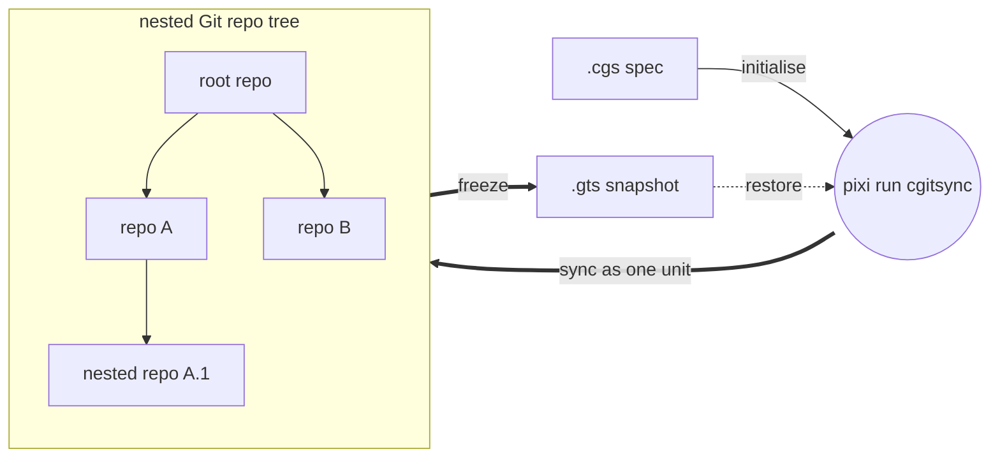
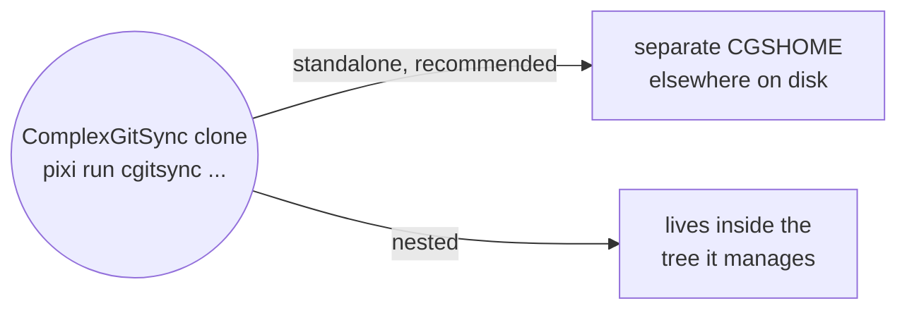

# ComplexGitSync v0002.31
__An alternative to git submodules for complex multi git-repo project management and synchronization__

*Created: 2026-05-12*

## 1. What is ComplexGitSync for?

ComplexGitSync is a CLI (command-line tool) for synchronising a multi git-repository 
workspace — in the form of a GitTree — from one local `.cgs`
specification (ASCII file) or one tracked `.gts` workspace snapshot (ASCII file describing the GitTree State). It is a Python package for which the API is exposed through the CLI only.

The CLI is used to operate the same git command on all repos that compose the project. It is a robust and convenient alternative to git submodules, offering a straightforward development experience.


ComplexGitSync is developed and run with [Pixi](https://pixi.sh) only —
`pip install -e .` is not a supported workflow. There is no global install:
every invocation is `pixi run cgitsync ...`, run from inside the clone below.

```bash
git clone https://github.com/flipoyo/ComplexGitSync.git
cd ComplexGitSync
pixi install
pixi run cgitsync --help
```




## 2. Standalone or nested configuration for project management and sync

ComplexGitSync manages a multi-repo project in two ways, among which the end user chooses:



**Standalone (recommended):** user runs `pixi run cgitsync ...` from the
ComplexGitSync clone. `cgitsync`  affects the project workspace (`CGSHOME`) elsewhere on
disk.

**Nested:** ComplexGitSync clones itself as one node inside the tree it
manages, instead of standing outside it. Covered after standalone.

### 2.1 Standalone configuration

ComplexGitSync offers multiple possibilities for initiating the management of a project.

### 2.1.1 The project already has a `.cgs`

Initialising the project sync uses `bootstrap`, that clones the project's full tree, root included, into its own isolated `CGSHOME`. ComplexGitSync can check itself out as a multi-repo tree:

```bash
pixi run cgitsync bootstrap install.cgs ComplexGitSync
```

`bootstrap` prints the workspace path and a `CGSHOME` export line at the end
of its output. Since `pixi run` must be executed from the ComplexGitSync
directory (where `pixi.lock` is), point subsequent commands at the new
workspace by exporting it:

```bash
# Copy the export command from bootstrap output, or use:
export CGSHOME=/home/user/.cgs/CGS<Timestamp>/ComplexGitSync
pixi run cgitsync status
pixi run cgitsync view-tree

# Minimalist changes propagation sequence
pixi run cgitsync add
pixi run cgitsync commit "<MESSAGE>"
pixi run cgitsync push
```
Run any command with `--help` for its full option list.

Full walkthrough: [tutorials/02_onboarding_a_real_build_tree.md](tutorials/02_onboarding_a_real_build_tree.md)


### 2.1.2 The project is checked out on disk, but has no `.cgs` yet

Initialising the project sync requires `discover`, that scans a directory for git repositories and drafts a `.cgs` from what is already checked out:

```bash
pixi run cgitsync discover ~/work/project --write draft.cgs
pixi run cgitsync validate draft.cgs
```

Read-only until `--write` is passed — always review the draft before using
it. 

A repository found *inside* another repository is drafted as that
repository's child, not the project root's: the report marks it
`inside: <path>` and prints the tree it will write. Only what is checked
out can be found, and only down to `--max-depth` (default 5) — `discover`
warns when that limit stopped the scan early, rather than presenting a
partial answer as a complete one.

Full walkthrough: [tutorials/03_adopting_a_real_project.md](tutorials/03_adopting_a_real_project.md).

### 2.1.3 The project uses git submodules

A project may already use git submodules. ComplexGitSync converts them to plain nested repositories using
`import-submodules`, that reports on, or converts, each submodule's gitlink into a plain clone:

```bash
pixi run cgitsync import-submodules ~/work/project           # dry run
pixi run cgitsync import-submodules ~/work/project --apply   # convert
```

That's the whole job — turning gitlinks into plain clones on disk. It does
not also write a `.cgs`: `.gitmodules` never records the root's own
identity, and a checkout worth converting already has a `.cgs` (hand-authored)
or can get one from `discover`, run before or after `--apply`.

Add `--recursive` when a submodule has submodules of its own, so every
level is converted rather than just the top one. The report prints each
path from the directory you pointed the command at, and names the
`.gitmodules` file that declared it.
Full walkthrough over `discover`, `import-submodules`, and `initialise`: [tutorials/03_adopting_a_real_project.md](tutorials/03_adopting_a_real_project.md).

### 2.2 Nested Configuration

Run ComplexGitSync from *inside* the project tree it manages instead of
standalone, using `initialise` in place of `bootstrap`, from
`$CGSHOME/ComplexGitSync`. `CGSPATH` (the parent of `CGSHOME =
CGSPATH/<project-name>`) then defaults to `../..` relative to the current
directory, with no `export` needed. The example below uses the CGSil1
reference topology (<https://gitlab.com/CGS_test/CGSil1>):

```bash
git clone https://gitlab.com/CGS_test/CGSil1.git
cd CGSil1
git clone https://github.com/flipoyo/ComplexGitSync.git
cd ComplexGitSync
pixi install

# Initialise: clone the tree from a .cgs spec, or restore it from a .gts snapshot
pixi run cgitsync initialise ../CGSil1.cgs
pixi run cgitsync status
pixi run cgitsync view-tree
```

Full walkthrough: [tutorials/01_first_multi_repo_workspace.md](tutorials/01_first_multi_repo_workspace.md)

## 3. `cgitsync` command list

| Group | Command | Description |
|---|---|---|
| Minimalist | `initialise` | Initialise a project tree: clone(.cgs) or restore state(.gts). |
| Minimalist | `bootstrap` | Clone a brand-new project tree into an isolated CGSHOME, for running ComplexGitSync standalone (not nested inside the project). |
| Minimalist | `clean-init` | Purge generated clone state, then initialise from a .cgs spec. |
| Minimalist | `freeze-release` | Run add, commit, pull, push, and freeze from a READY tree. |
| Minimalist | `freeze-release-force` | Run add, commit, pull-force, push, and freeze from a READY tree. |
| Minimalist | `status` | Summarize tree readiness and sync state. |
| Minimalist | `view-tree` | Render a topology-focused tree view in terminal. |
| Minimalist | `launch-release` | Check out a frozen release tag from a READY tree. |
| Expert | `purge` | Remove generated clone state for a .cgs workspace. |
| Expert | `validate` | Parse, normalize, and validate a .cgs or validate a .gts topology. |
| Expert | `clone` | Clone a nested project tree from .cgs. |
| Expert | `pull` | Resynchronise an existing project tree from .cgs or .gts. |
| Expert | `pull-force` | Destructively resynchronise an existing project tree from .cgs or .gts. |
| Expert | `checkout` | Synchronize the tree to a branch or tag. |
| Expert | `branch` | Create a branch across the full READY tree without checkout. |
| Expert | `add` | Stage all changes across a READY tree. |
| Expert | `rm` | Remove one or more tracked files, each from the repo that owns it. |
| Expert | `commit` | Commit dirty repositories from a READY tree. |
| Expert | `push` | Push repositories from a READY tree. |
| Expert | `tag` | Create and push a tag across a READY tree. |
| Expert | `freeze` | Freeze a versioned state and emit a .gts snapshot. |
| Expert | `import-submodules` | Report or convert git submodules to plain ComplexGitSync nested repositories. |
| Expert | `verify` | Verify the hash-chained .cgitsync/lgr register for tamper-evidence. |
| Configuration | `discover` | Scan a directory for git repositories and draft a .cgs from what is checked out. |
| Configuration | `configure` | Create a concise .cgs specification for GitHub, GitLab, Codeberg, or a custom provider. |
| Configuration | `create-cgs` | Create a validated .cgs specification from CLI project definitions. |

## 4. Further reading

[tutorials/](tutorials/) — three tutorials, simplest to most advanced:

1. [01_first_multi_repo_workspace.md](tutorials/01_first_multi_repo_workspace.md) — full CLI lifecycle walkthrough on a synthetic sandbox tree.
2. [02_onboarding_a_real_build_tree.md](tutorials/02_onboarding_a_real_build_tree.md) — hand-author a `.cgs` for a real 19-repo project, then hand off to its existing `make` build.
3. [03_adopting_a_real_project.md](tutorials/03_adopting_a_real_project.md) — a real project with no `.cgs` of its own that still uses git submodules: `discover`, `import-submodules`, `initialise`, and on to a pushed `READY` tree, one verified ten-step procedure.

[docs/MASTER.pdf](docs/MASTER.pdf) (source: [docs/Text/](docs/Text/)) — reference
book: full command details, expert-mode primitives (`add`/`commit`/`push`/...),
safety/preflight checks, `--force-protocol` for CI, and the Python API
(`ComplexGitSyncClient`).

[docs/DevGuide/](docs/DevGuide/) — the Ring model and module architecture,
for contributors changing `src/ComplexGitSync/` itself.

[CLAUDE.md](CLAUDE.md) — developer commands (`pixi run test`/`lint`/
`bump-version`), bootstrapping a live-editable checkout of ComplexGitSync
itself, and the before-committing checklist, for contributors.

## Authorship

- Contact: nicolas.flipo@minesparis.psl.eu
- Project Manager: Nicolas Flipo
- Main Developer: Nicolas Flipo
<!-- - Contributors (ongoing): Simone Mazzarelli, Tristan Bourgeois, Nicolas Gallois, Pierre Guillou, Fabien Ors -->
- AI assistance: Claude, ChatGPT, Copilot@github, Mistral Vibe 

## License

Apache 2.0
