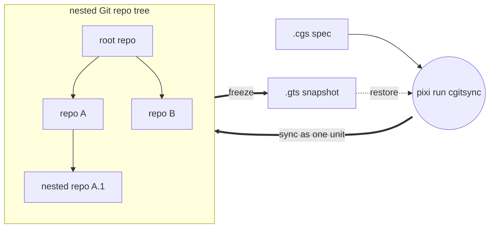

# ComplexGitSync v0002.12

*Created: 2026-05-12*

ComplexGitSync is a command-line tool for synchronising a multi-repository Git
workspace — a tree of nested repositories — from one local `.cgs`
specification (file or CLI specs) or one tracked `.gts` workspace-state snapshot. The public
entry point is `cgitsync`, exposed as a **Pixi task** — there is no global
install, so every invocation in this README and in the docs is
`pixi run cgitsync ...`, never a bare `cgitsync ...`.



## Install & run

```bash
pixi install
pixi run cgitsync --help
```

This project is developed with Pixi only; `pip install -e .` is not a
supported development workflow.

## Quickstart

ComplexGitSync locates its workspace through two variables, `CGSPATH` and
`CGSHOME` (`CGSHOME = CGSPATH/<project-name>`) — but you don't need to set
either by hand for the common cases below; both have defaults baked into
`orchestre.py`, so the `export` lines only matter if you want to override
them.

- **Nested mode** (`initialise`, below): ComplexGitSync is cloned *inside*
  the project tree it manages. Run from `$CGSHOME/ComplexGitSync` and
  `CGSPATH` defaults to `../..` relative to the current directory — i.e. the
  parent of `$CGSHOME` — with no export needed. Set `CGSPATH`/`CGSHOME`
  explicitly only to point at a different location.
- **Standalone mode** (`bootstrap`, further down): ComplexGitSync is cloned
  once, on its own, and reused across projects — never nested inside any of
  them. `CGSPATH` defaults to a fresh `$HOME/.cgs/CGS<timestamp>/`
  directory (created automatically) so project state never lands inside the
  ComplexGitSync clone itself.

The example below uses the CGSil1 reference topology
(<https://gitlab.com/CGS_test/CGSil1>) in nested mode.

```bash
git clone https://gitlab.com/CGS_test/CGSil1.git
cd CGSil1
git clone https://github.com/flipoyo/ComplexGitSync.git
cd ComplexGitSync

# Initialise: clone the tree from a .cgs spec, or restore it from a .gts snapshot
pixi run cgitsync initialise ../CGSil1.cgs

# Inspect the synchronised tree
pixi run cgitsync status
pixi run cgitsync view-tree

# Minimalist sync/release cycle
pixi run cgitsync freeze-release release-2026.05 "release 2026.05"
pixi run cgitsync launch-release release-2026.05

# Equivalent expert, step-by-step form
pixi run cgitsync pull
pixi run cgitsync add
pixi run cgitsync commit "feat: update CGSil1"
pixi run cgitsync push
pixi run cgitsync freeze release-2026.05
```

Run any command with `--help` for its full option list (`--dry-run`, explicit
`--gts` paths, `--project`/`--repo` direct authoring, etc.).

### Standalone mode

To use ComplexGitSync without cloning it inside the project it manages —
e.g. one ComplexGitSync clone reused across many projects — use `bootstrap`
instead of `initialise`. It requires an explicit `project_name` and clones
the full tree, root included, into an isolated `CGSHOME` under
`$HOME/.cgs/` by default:

```bash
git clone https://github.com/flipoyo/ComplexGitSync.git
cd ComplexGitSync
pixi run cgitsync bootstrap examples/CGSil1.cgs CGSil1
```

Pass `--cgs-path` to place `CGSHOME` somewhere else instead of the
`$HOME/.cgs/CGS<timestamp>/` default. Every other command (`status`,
`pull`, `freeze-release`, ...) then works the same way once `CGSHOME` is
set (either export it, or run from inside the bootstrapped tree).

## Command reference

| Group | Command | Description |
|---|---|---|
| Minimalist | `initialise` | Initialise a project tree: clone(.cgs) or restore state(.gts). |
| Minimalist | `bootstrap` | Clone a brand-new project tree into an isolated CGSHOME, for running ComplexGitSync standalone (not nested inside the project). |
| Minimalist | `clean-init` | Purge generated clone state, then initialise from a .cgs spec. |
| Minimalist | `freeze-release` | Run add, commit, pull, push, and freeze from a READY tree. |
| Minimalist | `freeze-release-force` | Run add, commit, pull-force, push, and freeze from a READY tree. |
| Minimalist | `status` | Summarize tree readiness and sync state. |
| Minimalist | `view-tree` | Render a topology-focused tree view in terminal. |
| Minimalist | `launch-release` | Check out a frozen release tag from a READY tree. |
| Expert | `purge` | Remove generated clone state for a .cgs workspace. |
| Expert | `validate` | Parse, normalize, and validate a .cgs or validate a .gts topology. |
| Expert | `clone` | Clone a nested project tree from .cgs. |
| Expert | `pull` | Resynchronise an existing project tree from .cgs or .gts. |
| Expert | `pull-force` | Destructively resynchronise an existing project tree from .cgs or .gts. |
| Expert | `checkout` | Synchronize the tree to a branch or tag. |
| Expert | `branch` | Create a branch across the full READY tree without checkout. |
| Expert | `add` | Stage all changes across a READY tree. |
| Expert | `commit` | Commit dirty repositories from a READY tree. |
| Expert | `push` | Push repositories from a READY tree. |
| Expert | `tag` | Create and push a tag across a READY tree. |
| Expert | `freeze` | Freeze a versioned state and emit a .gts snapshot. |
| Expert | `import-submodules` | Report or convert git submodules to plain ComplexGitSync nested repositories. |
| Configuration | `discover` | Scan a directory for git repositories and draft a .cgs from what is checked out. |
| Configuration | `configure` | Create a concise .cgs specification for GitHub, GitLab, Codeberg, or a custom provider. |
| Configuration | `create-cgs` | Create a validated .cgs specification from CLI project definitions. |
| Memory | `remember` | Bind a .cgs artefact to its external SSH-Git Memory endpoint. |
| Memory | `memorize` | Persist a finalized local Memory State to the configured SSH-Git remote. |
| Memory | `retrieve` | Retrieve an external SSH-Git Memory repository into a clean CGSHOME. |
| Memory | `reload` | Retrieve external Memory and restore the ComplexGitSync execution context. |

## Adopting a project that has no `.cgs` yet

The Quickstart above assumes a `.cgs` already exists. For a project that is
already running but was never described as a ComplexGitSync tree, there are
three starting points depending on what that project already carries.

**1. It is checked out on disk — `discover` it.** Point `discover` at the
working copy and it drafts a `.cgs` from what is actually there, reading
each repository's `origin` and taking every `relative_path` straight from
the filesystem:

```bash
pixi run cgitsync discover ~/work/cawaqsviz                   # dry run: report only
pixi run cgitsync discover ~/work/cawaqsviz --write draft.cgs # save the draft
pixi run cgitsync validate draft.cgs
```

`discover` is read-only and offline — it clones nothing, changes nothing,
and contacts no remote. It reports only what is **checked out at scan
time**: a repository cloned without `--recurse-submodules` leaves its
submodule paths as empty directories, and those are deliberately not
reported (run `git submodule update --init` first if you want them). A
repository with no `origin`, or whose remote is not a recognised
`provider:owner/repository`, is listed as a warning rather than guessed at,
for you to fill in by hand. Always review the draft before using it.

**2. It uses git submodules — `import-submodules` to retire them.**
ComplexGitSync models nested repositories as plain independent clones plus a
maintained `.gitignore`, not as gitlinks, so a submodule-based project needs
a one-time migration. Dry-run first, then apply:

```bash
pixi run cgitsync import-submodules ~/work/cawaqsviz              # report only
pixi run cgitsync import-submodules ~/work/cawaqsviz --apply \
    --output cawaqsviz.cgs
```

`--apply` runs `git rm --cached` per submodule (dropping the gitlink while
keeping the child's working tree and history), removes its `.gitmodules`
stanza, and adds the path to `.gitignore`. It never force-pushes.

The two compose: `discover` a checkout to get the topology for free,
cross-check it against `.gitmodules`, then `--apply` to retire the
submodules. `examples/cawaqsviz.cgs` is the worked result of exactly that
path — see
[docs/tutorials/03_configuration_discovery_modes.md](docs/tutorials/03_configuration_discovery_modes.md).

**3. Neither — write it from what the developers know.** Some projects
never exist as one directory tree until a `.cgs` already lists them; their
topology lives in a build script or in documentation. `cawaqs` is that case
(17 C libraries fetched by a shell script across 5 GitLab groups) — see
[docs/tutorials/02_onboarding_a_real_build_tree.md](docs/tutorials/02_onboarding_a_real_build_tree.md).
Use `configure` (interactive) or `create-cgs` (flags) to author the spec
directly.

## Safety checks

Before `commit`, `push`, and `freeze`, the CLI runs workspace preflight
validation. It reports actionable warnings such as dirty worktrees, ahead
branches, or stale recorded snapshot SHAs, and blocks unsafe states such as
detached HEADs, unresolved merges, missing remotes, or branch divergence.
`freeze` also requires a release tag name that does not already exist.

Each generated `.gts` snapshot lives under its own content-addressed
`$CGSHOME/.cgitsync/state(<hash>)_<n>/` directory and is recorded in the
project's `.lgr` register, which always points at the current snapshot.
Commands that accept a `.gts` source resolve it automatically via that
register when no explicit path is given — pass `--gts FILE` (or a positional
source, depending on the command) only to override that discovery.

`initialise`/`clean-init`/`pull` also keep `.gitignore` in sync across the
whole tree: every repo with children (root or any nested repo that itself
has nested children) gets the relative path of each immediate child added
to its `.gitignore`, since nested repos are plain clones rather than
gitlinks. By default this only writes the file and prints what changed —
nothing is staged, committed, or pushed automatically. Pass
`--commit-gitignore` to explicitly approve staging, committing, and
pushing just that file (never `--force`). If a repo can't be safely pulled
before the sync, the command errors out rather than guessing; pass
`--force-gitignore-sync` to fall back to a pull-force recovery for that
repo instead (force-*pushing* remains unavailable everywhere). The commit
identity defaults to local git config; pass `--git-user-name`/
`--git-user-email` to override it — the override is persisted to
`$CGSHOME/.cgitsync/master.toml`, so later invocations on the same
workspace pick it up without repeating the flags.

## Developer guide

### Environment and checks

This project uses Pixi exclusively — `pip install -e .`, `python -m pip`, and
`python -m venv` are not supported workflows (`DevSpecs.md`, *Python
Environment and Package Management*).

```bash
pixi install          # create/update the environment (after touching pixi.toml)
pixi run lint         # ruff check .
pixi run test         # pytest: tests/unit + tests/integration
pixi run bump-version # bump YYYY.XX and sync every manifest and doc
```

### Before you commit

1. **`pixi run lint` and `pixi run test` must both pass.** CI
   (`.github/workflows/ci.yml`) runs both on push/PR to `main`/`lechat`, and
   the full suite must pass before any merge to the main branch
   (`DevSpecs.md`, *Testing*).
2. **Run `pixi run bump-version` when wrapping up a feature branch**, ahead of
   the auto-increment CI performs on merge to main. Versions are `YYYY.XX`
   calendar versions: `XX` increments per release, and rolls into `YYYY` after
   99 (`0000.99 → 0001.01`).
   `pyproject.toml` is the authoritative manifest; the one command syncs
   `pixi.toml`, `src/ComplexGitSync/__init__.py`, the README title, and the
   `\cgsversion` macro in `docs/Setup/Shortcuts.tex` and `docs/preamble.tex`.
   Never edit those by hand — DevSpecs requires a single command that bumps
   the reference and syncs the rest.
   Use `pixi run bump-version --dry-run` to preview without writing.
3. **Rebuild the docs if you changed them.** The `.tex` sources live in
   `docs/Text/`; the built PDFs are tracked, and `bump-version` does *not*
   regenerate them:
   ```bash
   cd docs && latexmk -pdf MASTER.tex   # plus each c_*.tex you touched
   ```
4. **Update `audit.md`** whenever a change adds, moves, or removes module
   responsibility — as part of that change, not as a follow-up.
5. **Document any new CLI command** in both the README command table and
   `docs/Text/user_guide.tex`. This is enforced:
   `tests/unit/test_cli_smoke.py::test_readme_documents_every_cli_command`
   fails if a command in `_PLANNED_COMMANDS` is missing from the README.

### Expert mode

The minimalist commands (`initialise`, `freeze-release`, `launch-release`)
each chain several primitives. Expert mode is those primitives exposed
individually, for when you need to inspect or intervene between steps.

`freeze-release` is exactly `add → commit → pull → push → freeze`. Run it
step by step when you want to check state in between:

```bash
pixi run cgitsync pull
pixi run cgitsync add
pixi run cgitsync commit "feat: ..."
pixi run cgitsync push
pixi run cgitsync freeze release-2026.05
```

Useful habits in expert mode:

- **`--dry-run` first.** `add`, `commit`, `push`, `tag`, and `freeze` all
  accept it and print the leaf-first execution plan without touching any
  repository.
- **`status` between steps** to see per-repo branch, upstream, worktree
  state, ahead/behind counts, and drift against the recorded snapshot.
- **Order is not arbitrary.** Mutations run **leaf-first** (`add`, `commit`,
  `push`, `tag`, `freeze`); tree-shaping runs **parent-first** (`clone`,
  `pull`, `checkout`). A parent must never be committed before the children
  it references.
- **`--gts FILE` pins the snapshot.** Every READY-tree command resolves the
  current snapshot through the project's `.lgr` register; pass `--gts` only
  to override that discovery.
- **Recovery.** `pull` refusing on local changes is the safe path — it tells
  you to consider `pull-force`, which resets each repo to its remote branch
  and **discards uncommitted work**. `clean-init` purges generated clone
  state and re-initialises (it preserves `.cgitsync/master.toml`). Nothing
  in the tool ever force-*pushes*.

### Architecture boundary

The module boundaries are strict and audited — see [audit.md](audit.md). The
short version for contributors:

- **`cli.py` collects arguments and delegates. Nothing else.** Every command
  is a thin `_handle_*` → `_execute_*` pair calling one
  `ComplexGitSyncClient` method. The CLI mirrors the Python API; it never
  implements `.cgs`/`.gts` semantics, never touches git or `subprocess`, and
  never parses repository identifiers.
- **`parse_repo_id()` in `cgs_format.py` is the only repo-identifier
  parser.** Do not add a second one in `cli.py`, `git_tree.py`,
  `git_repo.py`, or `orchestre.py`.
- **`cgs_format.py` is deterministic and offline** — no `subprocess`, no
  git, no network. Only explicit runtime git operations in `orchestre.py` /
  `operations.py` may touch the network.
- **Every new capability is a client method first**, then a CLI flag. A
  Python method with no CLI surface is unusable by end users, who only use
  the CLI; a CLI command with logic of its own breaks the mirror.

## Further reading

[docs/tutorials/](docs/tutorials/) — three tutorials, simplest to most advanced:

1. [01_first_multi_repo_workspace.md](docs/tutorials/01_first_multi_repo_workspace.md) — full CLI lifecycle walkthrough on a synthetic sandbox tree.
2. [02_onboarding_a_real_build_tree.md](docs/tutorials/02_onboarding_a_real_build_tree.md) — hand-author a `.cgs` for a real 19-repo project, then hand off to its existing `make` build.
3. [03_configuration_discovery_modes.md](docs/tutorials/03_configuration_discovery_modes.md) — a real project with no `.cgs` of its own, reached three ways: by hand, `discover`, `import-submodules`.

[docs/MASTER.pdf](docs/MASTER.pdf) (source: [docs/Text/](docs/Text/)) — reference book, including the Python API (`ComplexGitSyncClient`) and complete command details.

## Authorship

- Contact: nicolas.flipo@minesparis.psl.eu
- Project Manager: Nicolas Flipo
- Main Developer: Nicolas Flipo
<!-- - Contributors (ongoing): Simone Mazzarelli, Tristan Bourgeois, Nicolas Gallois, Pierre Guillou, Fabien Ors -->
- AI assistance: Claude, ChatGPT, Copilot@github, Mistral Vibe 
