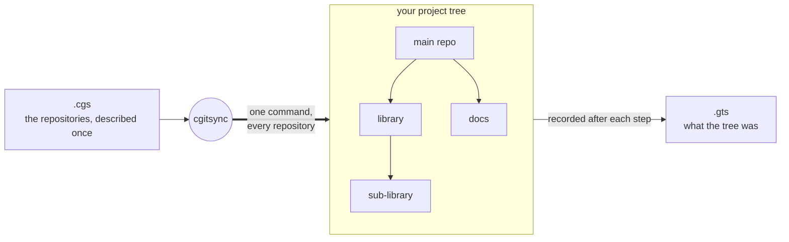

# ComplexGitSync v4.2.1

**One project, many Git repositories, kept in step.**

ComplexGitSync (`cgitsync`) is a command-line tool for projects made of
several Git repositories: a main repository plus the libraries, documents
and data repositories it needs. You describe the repositories once, in a
small text file (a `.cgs`), and then one command checks out, commits,
pushes, merges or tags all of them together. After each step it records
what the whole tree looked like, so you can come back to it later.

It is an alternative to git submodules. Every repository stays a plain,
independent clone, with no gitlinks to keep in sync by hand.


```mermaid
flowchart LR
    CGS[".cgs<br/>the repositories, described once"] --> CLI(("cgitsync"))
    CLI ==>|"one command,<br/>every repository"| TREE
    subgraph TREE["your project tree"]
        direction TB
        Root["main repo"] --> A["library"]
        Root --> B["docs"]
        A --> A1["sub-library"]
    end
    TREE -->|"recorded after each step"| GTS[".gts<br/>what the tree was"]
```

## What it is for

| Purpose | Status |
|---|---|
| **Developing a multi-repo project:** branches, commits, merges and releases across every repository at once | **Available now.** Everything in this documentation is about this. |
| **Synchronising and orchestrating simulations** whose models, data and configuration live in separate Git repositories, so a run can be reproduced from the exact state of every repository | **Planned.** This is a founding goal of ComplexGitSync and the next feature to be implemented. |

## Two ways to install it

Where you put the ComplexGitSync clone decides which install command you
use. It does not decide what you use the tool for: both ways serve the
development purpose above.

| | Where the tool sits | Install command | Use it when |
|---|---|---|---|
| **Standalone** (recommended) | Its own clone, outside your project | `bootstrap` | Almost always. One clone serves all your projects. |
| **Nested** | Cloned *inside* the project tree it manages | `initialise` | The tool should live with the tree, or you are adopting a project already checked out on disk (see [guide B](guide/B-bringing-in-a-project.md)). |

## Quickstart (standalone)

You need [Git](https://git-scm.com) and [Pixi](https://pixi.sh). Every
command is run from inside the ComplexGitSync clone, as `pixi run cgitsync ...`.

```bash
git clone https://github.com/flipoyo/ComplexGitSync.git
cd ComplexGitSync
pixi install

pixi run cgitsync bootstrap my-project.cgs my-project   # clone the whole tree
export CGSHOME=<the path bootstrap printed>             # point cgitsync at it
pixi run cgitsync status                                # where every repository stands
```

Don't have a `.cgs` yet? [Guide A](guide/A-getting-started.md) shows how
to write one in a few lines, and [guide B](guide/B-bringing-in-a-project.md)
how to draft one from repositories you already have.

## Where to go next

| I want to… | Read |
|---|---|
| Install it, learn the few ideas it rests on, and build a first tree | [guide/A-getting-started.md](guide/A-getting-started.md) |
| Use it on a project I already have, with or without submodules | [guide/B-bringing-in-a-project.md](guide/B-bringing-in-a-project.md) |
| Work day to day: status, commits, branches, merges, releases | [guide/C-working-day-to-day.md](guide/C-working-day-to-day.md) |
| Understand what the workspace remembers, and back it up | [guide/D-memory.md](guide/D-memory.md) |
| Look up a command, an option, an exit code or the `--json` output | [guide/E-reference.md](guide/E-reference.md) |
| Learn by doing, step by step | [tutorials/](tutorials/README.md) (five worked examples) |
| Work on ComplexGitSync itself | [CONTRIBUTING.md](CONTRIBUTING.md) |
| See what changed between versions | [CHANGELOG.md](CHANGELOG.md) |

Every command also explains itself: `pixi run cgitsync <command> --help`,
or `pixi run cgitsync help --all` for every command and option on one page.

## Authorship

- Contact: nicolas.flipo@minesparis.psl.eu
- AUTH: Nicolas Flipo
<!-- - Contributors (ongoing): Simone Mazzarelli, Tristan Bourgeois, Nicolas Gallois, Pierre Guillou, Fabien Ors -->

Parts of this project were written with the help of large language models;
see [CONTRIBUTING.md](CONTRIBUTING.md#llm-assistance).

## License

Apache 2.0
