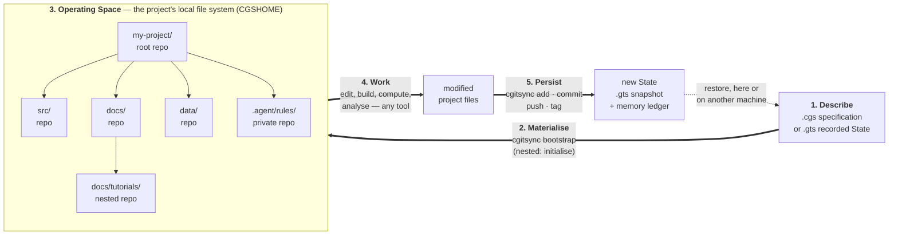
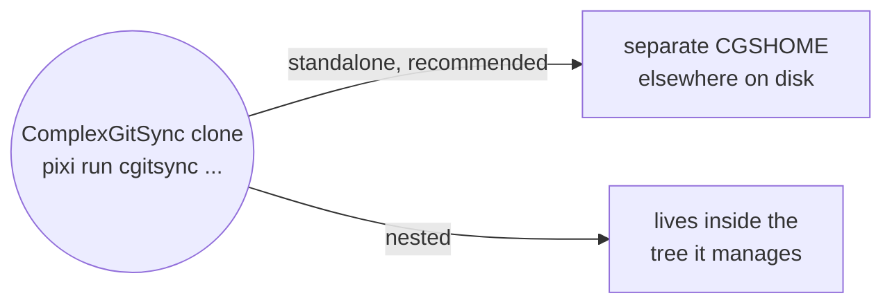

# ComplexGitSync v4.4.3
## A distributed git-native Operating Space

*Created: 2026-05-12*

Scientific projects are becoming more complex: beyond source code, they rely
on documentation, tutorials, data, continuous integration and deployment, and
the persistence of their results — each often held in a repository of its
own. ComplexGitSync manages such a project as a distributed, git-native
operating space, in the form of a **GitTree**: a tree of nested Git
repositories that is synchronised, versioned and restored as one unit.

A project can couple **public and private repositories**, so that
intellectual property is preserved even when the project is developed
collaboratively. Private repositories can also carry the configuration of
**agentic assistance** for different parts of the project. Finally, every
state the project goes through is recorded, which gives the project
**persistence and reproducibility**: any recorded state can be rebuilt,
exactly, on another machine.

## The project lifecycle


```mermaid
flowchart LR
    SRC["<b>1. Describe</b><br/>.cgs specification<br/>or .gts recorded State"]
    SRC ==>|"<b>2. Materialise</b><br/>cgitsync bootstrap<br/>(nested: initialise)"| OS

    subgraph OS["<b>3. Operating Space</b> — the project's local file system (CGSHOME)"]
        direction TB
        Root["my-project/<br/>root repo"] --> Src["src/<br/>repo"]
        Root --> Doc["docs/<br/>repo"]
        Root --> Data["data/<br/>repo"]
        Root --> Agent[".agent/rules/<br/>private repo"]
        Doc --> Tuto["docs/tutorials/<br/>nested repo"]
    end

    OS ==>|"<b>4. Work</b><br/>edit, build, compute,<br/>analyse — any tool"| WORK["modified<br/>project files"]
    WORK ==>|"<b>5. Persist</b><br/>cgitsync add · commit<br/>push · tag"| STATE["new State<br/>.gts snapshot<br/>+ memory ledger"]
    STATE -.->|"restore, here or<br/>on another machine"| SRC
```

1. **Describe.** The project's topology — which repositories it is made of,
   where each one sits, which are private — is written once in a `.cgs`
   specification, a short TOML file. A `.gts` snapshot recorded earlier can
   be used instead, to obtain the project exactly as it was.
2. **Materialise.** `cgitsync bootstrap`, the generic command for any
   kind of project, clones every repository and places it at its path in
   the tree. In the nested mode, `initialise` does the same from inside the
   project (see *Installation* below).
3. **Operating Space.** The result is an ordinary directory tree on the
   local disk, the project's `CGSHOME`, in which each sub-directory may be a
   Git repository of its own, public or private.
4. **Work.** The project files are used with any tool, as in any other
   directory: editors, compilers, notebooks, simulation codes. ComplexGitSync
   does not intervene.
5. **Persist.** `cgitsync` runs each Git operation — `pull`, `checkout`,
   `commit`, `push`, `merge`, `tag` — across the whole tree, in the right
   order, checking every repository before changing any of them. Each
   resulting State is recorded as a `.gts` snapshot holding the exact commit
   of every repository, and logged in the project's memory, from which it can
   be restored.

ComplexGitSync is a robust alternative to git submodules: repositories are
plain clones, each on its own branch, and nothing about Git itself is hidden.

## Public and private repositories, memory and persistence

A GitTree holds two kinds of repositories:

- **Project repositories** — the work itself: code, documents, public data.
  They follow the project's branch.
- **Private repositories** — how the project is run: pipelines, agent
  instructions, internal rules, private data. They are often shared between
  several projects, keep their own branch, and are read-only unless declared
  writable.

```toml
repos = [
    "github:you/my-app",                                                    # project
    { repository = "github:you/.myRules",  private = true, writable = true },  # private, yours to write
    { repository = "github:them/.theirs",  private = true },                   # private, read-only
]
```

The project's **memory** records every state the tree goes through, the
operations that produced it, and the environment it ran in, in a
hash-chained ledger that can be verified. The memory can itself be kept in a
private repository, so the project's history outlives any single machine
and can be consulted at any past moment.

## Use cases

Each use case is covered by a tutorial, from the simplest to the most
advanced.

| Use case | Main commands | Tutorial |
|---|---|---|
| Install a small sample tree, and see the two install modes | `bootstrap` (or `initialise`) | [01 — first workspace](tutorials/01_first_multi_repo_workspace.md) |
| Work on a tree: commit and push every repository at once, release it, go back to a release | `add`, `commit`, `push`, `tag`, `freeze-release` | [02 — working with a tree](tutorials/02_working_with_a_tree.md) |
| Install any project that provides a `.cgs` — the usual case | `bootstrap` | [03 — a real build tree](tutorials/03_onboarding_a_real_build_tree.md) |
| Adopt an existing project with no `.cgs`, or built on git submodules | `discover`, `submodules init` | [04 — adopting a real project](tutorials/04_adopting_a_real_project.md) |
| Couple public and private repositories | `private = true`, `--private` | [05 — private repositories](tutorials/05_private_repos.md) |
| Give the project a persistent, verifiable memory | `memory setup` | [06 — memory](tutorials/06_memory.md) |

## Installation: standalone or nested

ComplexGitSync requires [Git](https://git-scm.com) and
[Pixi](https://pixi.sh), and runs only through Pixi:

```bash
git clone https://github.com/flipoyo/ComplexGitSync.git
cd ComplexGitSync
pixi install
```

It can then manage a project in one of two ways:


```mermaid
flowchart LR
    CLONE(("ComplexGitSync clone<br/>pixi run cgitsync ...")) -->|standalone, recommended| SA["separate CGSHOME<br/>elsewhere on disk"]
    CLONE -->|nested| NE["lives inside the<br/>tree it manages"]
```

**Standalone (recommended).** ComplexGitSync stays outside the project and
clones the whole tree, root included, into a workspace of its own
(`CGSHOME`):

```bash
pixi run cgitsync bootstrap <project.cgs>
export CGSHOME=...   # the exact line is printed by bootstrap
pixi run cgitsync status
```

**Nested.** ComplexGitSync is cloned inside the project it manages, next to
the project's own root, and `initialise` builds the rest of the tree from
there. This suits projects that ship the tool along with their own content,
such as digital twins:

```bash
pixi run cgitsync initialise ../<project.cgs>
pixi run cgitsync status
```

## Getting help

```bash
pixi run cgitsync --help            # every command, grouped by purpose
pixi run cgitsync <command> --help  # one command: what it does, its options, examples
pixi run cgitsync help --all        # every command and option on one page
```

`-h` is accepted wherever `--help` is.

## Further reading

- [docs/c_getting_started.pdf](docs/c_getting_started.pdf) — the getting
  started guide: this page in more detail, from installation to a first
  persisted State.
- [docs/MASTER.pdf](docs/MASTER.pdf) — the reference manual: every command
  and option, the `.cgs` and `.gts` formats, exit codes and `--json` output,
  and the stability promises between versions.
- [tutorials/](tutorials/) — the six tutorials listed above.
- [docs/DevGuide/](docs/DevGuide/) — the architecture, for contributors.

## Authorship

- Contact: nicolas.flipo@minesparis.psl.eu
- AUTH: Nicolas Flipo
<!-- - Contributors (ongoing): Simone Mazzarelli, Tristan Bourgeois, Nicolas Gallois, Pierre Guillou, Fabien Ors -->

## LLM assistance

Parts of this project were written with the help of large language models,
used as a paid service under the author's direction. They are acknowledged
here rather than credited as co-authors on commits, merges or pull
requests, following the convention that paid assistance is acknowledged
and not co-signed.

Main assistance as of august 2026:
- **Claude** (Anthropic) —  including Claude Code with Claude Opus 5 and
  Claude Sonnet 5

Initial Assistance between may and august 2026:
- **GitHub Copilot**
- **ChatGPT** (OpenAI)
- **Mistral Vibe** (mistralAI)

Responsibility for everything in this repository rests under the license terms.

## License

ComplexGitSync is open-source software, distributed under the
[Apache License 2.0](LICENSE). In short:

- **Free to use, modify and redistribute**, including for commercial
  purposes, provided the license and copyright notices are kept and
  modified files are marked as changed.
- **Provided "as is", without warranty of any kind**, express or implied,
  including any warranty that it is fit for a particular purpose
  (sections 7 and 8 of the license).
- **No liability.** The author and contributors are not accountable for any
  damage, data loss or other consequence arising from its use. You are
  responsible for how you use it, and for keeping your own backups.
- **No trademark rights** are granted to the project's name.

This summary is for convenience only; the [LICENSE](LICENSE) file is the
binding text.
