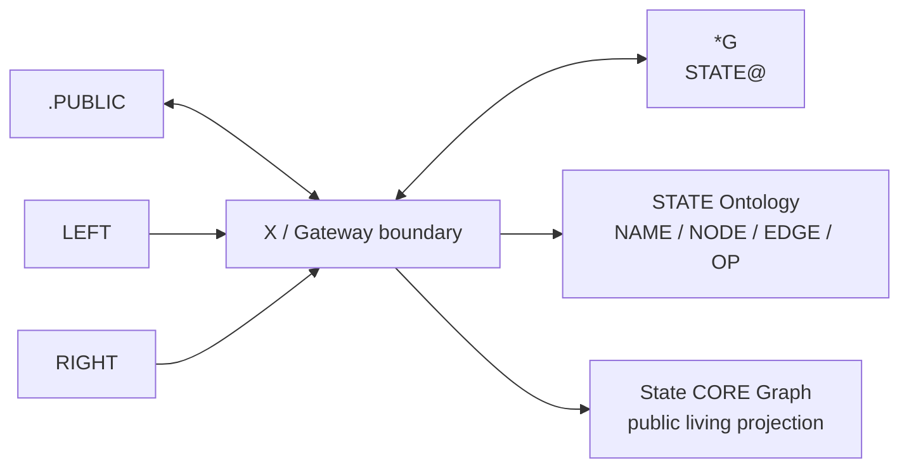

# STATE CORE Public Projection

This document is the safe public view of a living Graph and its Gateway. It is
distinct from the static four-field State Ontology. Private anchor data,
credentials, runtime variables, private RIGHT content, raw execution memory,
and Gateway internals are excluded.

