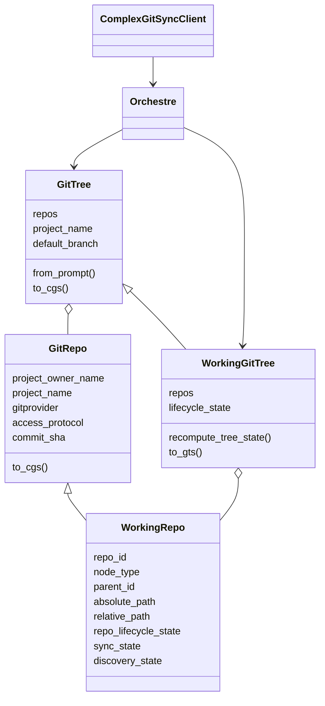
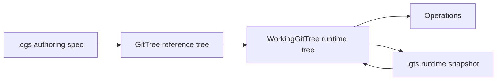

# ComplexGitSync Architecture

ComplexGitSync now uses one class hierarchy for repository identity and runtime
state. Reference data lives in `GitRepo` and `GitTree`; runtime commands add
mutable state through `WorkingRepo` and `WorkingGitTree`.

## Documents And Trees

`CgsDocument` is the authoring format. It describes the static repository
topology and is converted into a reference `GitTree`. The `configure` command
builds that reference tree from prompts, validates the generated `.cgs`
document, and writes it to disk.

`WorkingGitTree` is the runtime form. It inherits reference-tree metadata from
`GitTree` and stores `WorkingRepo` nodes keyed by runtime `repo_id`. Operations
such as checkout, branch, add, commit, push, tag, and freeze act on
`WorkingGitTree`.

`GtsDocument` is generated runtime state. It stores resolved paths, commit
SHAs, lifecycle state, and sync state for a workspace snapshot. It is loaded
back into `WorkingGitTree` when commands resume from an existing workspace.

## Cleanup Boundary

Phase 5 keeps the runtime registry surface focused. `WorkingGitTree` and
`WorkingRepo` are the runtime types; `GitTree` and `GitRepo` remain the
reference types used to create and validate `.cgs` documents.

## Tree Lifecycle States

`WorkingGitTree.lifecycle_state` describes the state of the whole runtime tree.

| State | Meaning |
| --- | --- |
| `UNLOADED` | No runtime tree is available. |
| `DECLARED` | Repositories are declared from `.cgs`, but not resolved. |
| `DISCOVERING` | Nested `.cgs` discovery is in progress. |
| `PENDING` | At least one repo still needs clone, validation, or resolution. |
| `READY` | Every reachable repo has paths, refs, and commit state resolved. |
| `PARTIAL` | The tree has mixed non-error states and is not fully ready. |
| `ERROR` | At least one repo entered an error lifecycle state. |

## Repository Lifecycle States

`WorkingRepo.repo_lifecycle_state` describes one runtime repository node.

| State | Meaning |
| --- | --- |
| `DECLARED` | The repo exists in configuration only. |
| `PENDING` | The repo is known but not fully resolved. |
| `READY` | The repo is reachable, checked out, and resolved. |
| `FALLBACK_READY` | The repo is ready through its fallback branch. |
| `MISSING` | The expected repository path or remote content is absent. |
| `ERROR` | Validation, discovery, or git interaction failed. |

## Sync States

`WorkingRepo.sync_state` describes local repository drift relative to the
recorded target and remote state.

| State | Meaning |
| --- | --- |
| `ALIGNED` | Local state matches the expected target. |
| `FALLBACK_APPLIED` | The fallback branch was used successfully. |
| `DETACHED_EXACT` | The repo is detached at the exact expected commit. |
| `DIRTY` | Local uncommitted changes are present. |
| `AHEAD` | Local commits are ahead of the remote branch. |
| `BEHIND` | Local branch is behind the remote branch. |
| `DIVERGED` | Local and remote histories have diverged. |
| `ERROR` | Sync inspection failed. |
| `PENDING` | Sync state has not yet been resolved. |
