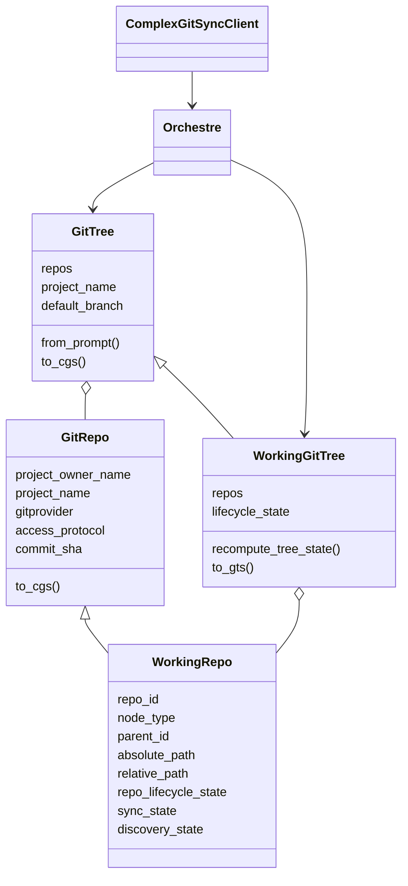
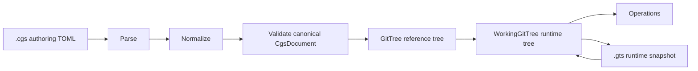

# ComplexGitSync Architecture

ComplexGitSync now uses one class hierarchy for repository identity and runtime
state. Reference data lives in `GitRepo` and `GitTree`; runtime commands add
mutable state through `WorkingRepo` and `WorkingGitTree`.

## Documents And Trees

`CgsDocument`, defined in `cgs.py`, is the authoring-format boundary. It owns
`.cgs` parsing, serialization, constants, and validation. Its static
repository topology is converted into a reference `GitTree`. The shared
format-neutral `ConfigDocument` base remains in `config_document.py` because
runtime `.gts` and `.goc` documents use it too. The `configure` command builds
the reference tree from prompts, validates the generated `.cgs` document, and
writes it to disk; `orchestre.py` owns that orchestration rather than the
authoring-format definition.

The boundary is an explicit `PARSE -> NORMALIZE -> VALIDATE` pipeline. Parsing
uses Python's TOML parser and produces authoring data; normalization expands
repository shorthand and deterministic defaults into a canonical
`CgsDocument`; validation checks only that canonical representation. The
authoring syntax and internal representation are therefore deliberately
different.

The two representations are kept as an executable example pair:
[`examples/template.cgs`](../examples/template.cgs) is the concise file users
can copy, while
[`examples/normalized_template.cgs`](../examples/normalized_template.cgs) is
its complete canonical expansion for developers. Tests require both files to
normalize to the same `CgsDocument`.

Repository paths are parent-relative. At the top level the base is the project
root; while expanding a nested `.cgs`, the base is the repository whose config
is being expanded. Resolution uses `(parent.absolute_path / relative_path)` and
normalizes `..`, which lets a nested document refer to an already-registered
sibling or ancestor. If that absolute path is already in the registry,
discovery keeps the existing entry instead of creating a duplicate.

`nested_config` controls traversal independently of placement. `auto` searches
the referenced repository root for exactly one `*.cgs`; `disabled` stops at
that reference; and a relative `.cgs` filename selects an exact config inside
the repository. Explicit config paths are not allowed to escape the repository
root.

Provider identity is centralized in `git_repo.py`. `GitProvider`,
`CANONICAL_GIT_PROVIDERS`, `KNOWN_PROVIDER_HOSTS`,
`parse_repository_identifier()`, and `RepoAddress` are the single definitions
used by `.cgs`, interactive configuration, and runtime remote composition. The
known-host map is `github -> github.com`, `gitlab -> gitlab.com`, and
`codeberg -> codeberg.org`. `custom` is deliberately absent: it requires an
explicit `gitprovider_url` and never falls back to a guessed host.

`WorkingGitTree` is the runtime form. It inherits reference-tree metadata from
`GitTree` and stores `WorkingRepo` nodes keyed by runtime `repo_id`. Operations
such as checkout, branch, add, commit, push, freeze, and launch_release act on
`WorkingGitTree`.

`GtsDocument` is generated runtime state. It stores resolved paths, commit
SHAs, lifecycle state, and sync state for a workspace snapshot. It is loaded
back into `WorkingGitTree` when commands resume from an existing workspace.

`pull(.cgs|.gts)` uses that runtime tree as the input registry and
resynchronises parent-first: `ROOT -> PARENT -> LEAF`. The project root
repository is pulled first, then child repositories are updated from their
parent submodule links. Mutation commands (`add`, `commit`, `push`, `freeze`)
use the opposite order: `LEAF -> PARENT -> ROOT`.

`pull-force(.cgs|.gts)` keeps the same traversal but is explicitly
destructive: the root is checked out onto the selected remote branch and
cleaned before child submodules are force-updated.

## Cleanup Boundary

Phase 5 keeps the runtime registry surface focused. `WorkingGitTree` and
`WorkingRepo` are the runtime types; `GitTree` and `GitRepo` remain the
reference types used to create and validate `.cgs` documents.

## Tree Lifecycle States

`WorkingGitTree.lifecycle_state` describes the state of the whole runtime tree.

| State | Meaning |
| --- | --- |
| `UNLOADED` | No runtime tree is available. |
| `DECLARED` | Repositories are declared from `.cgs`, but not resolved. |
| `DISCOVERING` | Nested `.cgs` discovery is in progress. |
| `PENDING` | At least one repo still needs clone, validation, or resolution. |
| `READY` | Every reachable repo has paths, refs, and commit state resolved. |
| `PARTIAL` | The tree has mixed non-error states and is not fully ready. |
| `ERROR` | At least one repo entered an error lifecycle state. |

## Repository Lifecycle States

`WorkingRepo.repo_lifecycle_state` describes one runtime repository node.

| State | Meaning |
| --- | --- |
| `DECLARED` | The repo exists in configuration only. |
| `PENDING` | The repo is known but not fully resolved. |
| `READY` | The repo is reachable, checked out, and resolved. |
| `FALLBACK_READY` | The repo is ready through its fallback branch. |
| `MISSING` | The expected repository path or remote content is absent. |
| `ERROR` | Validation, discovery, or git interaction failed. |

## Sync States

`WorkingRepo.sync_state` describes local repository drift relative to the
recorded target and remote state.

| State | Meaning |
| --- | --- |
| `ALIGNED` | Local state matches the expected target. |
| `FALLBACK_APPLIED` | The fallback branch was used successfully. |
| `DETACHED_EXACT` | The repo is detached at the exact expected commit. |
| `DIRTY` | Local uncommitted changes are present. |
| `AHEAD` | Local commits are ahead of the remote branch. |
| `BEHIND` | Local branch is behind the remote branch. |
| `DIVERGED` | Local and remote histories have diverged. |
| `ERROR` | Sync inspection failed. |
| `PENDING` | Sync state has not yet been resolved. |
