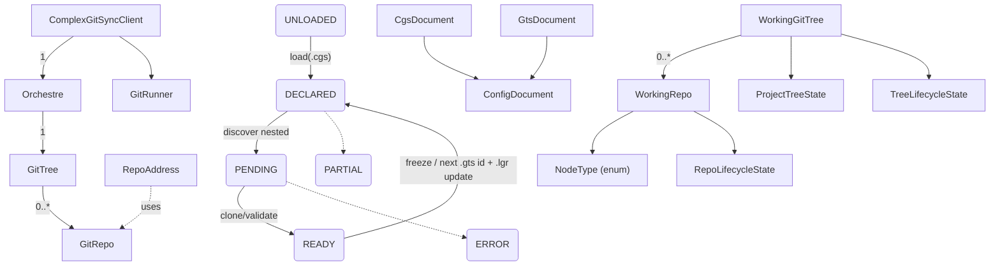

# class_diagram.tex  — TikZ source for the ComplexGitSync class overview figure.

*Source: `docs/figures/class_diagram.tex`*

```mermaid
graph TD
    client["ComplexGitSyncClient"]
    orchestre["Orchestre"]
    gittree["GitTree"]
    gitrepo["GitRepo"]
    runner["GitRunner"]
    repoaddr["RepoAddress"]
    unloaded("UNLOADED")
    declared("DECLARED")
    pending("PENDING")
    ready("READY")
    partial("PARTIAL")
    error("ERROR")
    base["ConfigDocument"]
    cgs["CgsDocument"]
    gts["GtsDocument"]
    registry["WorkingGitTree"]
    entry["WorkingRepo"]
    treestate["ProjectTreeState"]
    nodetype["NodeType (enum)"]
    tlc["TreeLifecycleState"]
    rlc["RepoLifecycleState"]
    client -->|"1"| orchestre
    client --> runner
    orchestre -->|"1"| gittree
    gittree -->|"0..*"| gitrepo
    repoaddr -.->|"uses"| gitrepo
    unloaded -->|"load(.cgs)"| declared
    declared -->|"discover nested"| pending
    pending -->|"clone/validate"| ready
    declared -.-> partial
    pending -.-> error
    ready -->|"freeze / next .gts id + .lgr update"| declared
    cgs --> base
    gts --> base
    registry -->|"0..*"| entry
    registry --> treestate
    entry --> nodetype
    entry --> rlc
    registry --> tlc
```
