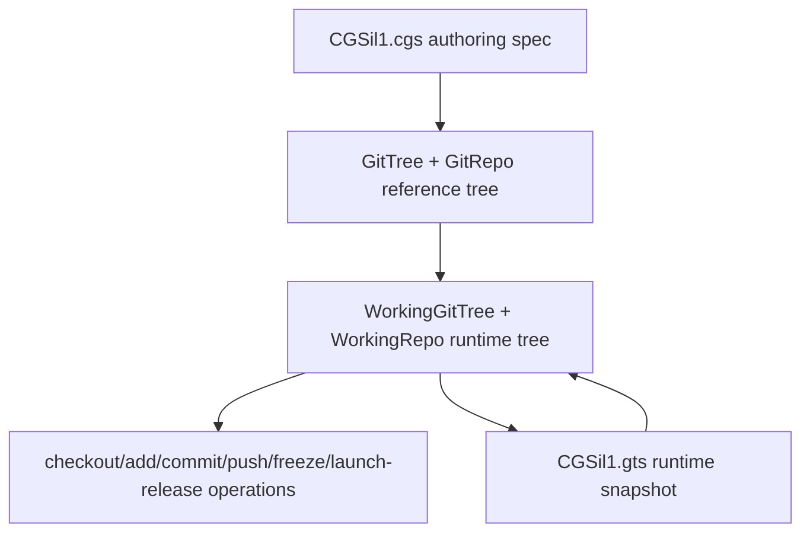

# Minimalist Tutorial — CGSil1 CLI Workflow

This tutorial walks through the complete CLI workflow for the **CGSil1** test
topology, using the reference project at
<https://gitlab.com/CGS_test/CGSil1>.

It covers every step from topology validation through initialisation to the full
git cycle (add → commit → push → tag → freeze).

> **Sandbox / CI note**
> The companion test file
> `tests/integration/test_tuto_cgsi1.py` reproduces every step below using
> local bare-repo remotes so that the tutorial can be verified in CI without
> any network access.

---

## 1. Topology overview

The CGSil1 project demonstrates a minimal mixed-provider setup:

```
CGSil1  (GitLab, root)
  ├── CGSil2  (GitLab, child)    [nested_config = "auto"]
  └── CGSih1  (GitHub, child)    [nested_config = "auto"]
        └── CGSih2  (GitHub, leaf)  [nested_config = "auto", discovered transitively]
```

The current architecture separates the authoring topology from the runtime
workspace state:



`CGSil1.cgs` remains the source of truth for the reference tree. Runtime
commands load that reference into a `WorkingGitTree`, update repository
lifecycle and sync state there, and persist each generated `.gts` snapshot
under its own content-addressed `$CGSHOME/.cgitsync/state(<hash>)_<n>/`
directory, recorded in the project's `.lgr` register.

---

## 2. Project spec — CGSil1.cgs

Place the following file at the root of the CGSil1 repository:

```toml
project = "CGSil1"

repos = [
    "gitlab:CGS_test/CGSil1",
    "gitlab:CGS_test/CGSil2",
    "github:flipoyo/CGSih1",
]
```

The parser normalizes this authoring form before validation. It supplies
`main`, `ssh`, and `auto`, uses repository names as child paths, and infers
`CGSil1` as the root at `.` because its repository name uniquely matches the
project name.

### Paths and nested configuration

For a non-root repository, `relative_path` is resolved from its parent
repository directory—not from the shell's current directory. In a nested
`.cgs`, that parent is the repository described by the nested file. Omitting
the option places a repository at its repository name.

For example, `CGSil2.cgs` contains:

```toml
{ repository = "github:flipoyo/CGSih1", relative_path = "../CGSih1", nested_config = "disabled" }
```

The file describes children of `CGSil2`, so if `CGSil2` is at
`<CGSHOME>/CGSil2`, the path resolves as follows:

```text
<CGSHOME>/CGSil2/../CGSih1  ->  <CGSHOME>/CGSih1
```

This points to the existing `CGSih1` sibling already declared by
`CGSil1.cgs`; it does not request another clone inside `CGSil2`. The duplicate
absolute path is recognized and the canonical root-level entry is retained.

`nested_config` controls whether discovery continues inside the referenced
repository:

- `"auto"` (default) loads the sole root-level `*.cgs` file, if present; more
  than one is ambiguous and rejected.
- `"disabled"` does not inspect that repository for another `.cgs` file.
- A relative `.cgs` path, such as `"config/children.cgs"`, loads that exact file
  from inside the repository and may not escape it.

Thus the CGSil2 cross-reference uses `"disabled"`: the canonical `CGSih1`
entry from `CGSil1.cgs`, not this duplicate route, owns discovery of
`CGSih1.cgs` and its `CGSih2` child.

For a new project, the interactive equivalent is:

```bash
pixi run cgitsync configure --output ../CGSil1.cgs
```

The command builds a `GitTree` reference tree from prompts, validates the
generated `CgsDocument`, and writes the `.cgs` file. The checked-in tutorial
fixture is shown explicitly above so the CI sandbox can reproduce the same
topology without interactive input.

---

## 3. Step-by-step CLI walkthrough

Before starting, keep in mind that `CGSHOME=$CGSPATH/CGSil1`,
`CWD=$CGSHOME/ComplexGitSync`, and commands are run from `$CWD`.
When `--output-path` is omitted, `cgitsync initialise` behaves as if
`--output-path $CGSPATH` had been passed, with the default `CGSPATH=../..`
relative to `$CWD`. The `.cgs` file is read first, then `CGSHOME` is derived
from the project name; child repositories such as `CGSil2` and `CGSih1` are
cloned under that project root.

### Step 1 — Validate the topology

Install the project repo:
```bash
git clone https://gitlab.com/CGS_test/CGSil1
cd CGSil1
git clone https://github.com/flipoyo/ComplexGitSync
cd ComplexGitSync
```


Parses the spec and checks consistency without cloning anything:

```bash
pixi run cgitsync validate ../CGSil1.cgs
```

Expected output (tree not yet cloned, so `DECLARED`):

```
DECLARED ready=false complete=true
```

---

### Step 2 — View a tree summary

Renders the project tree with lifecycle state:

```bash
pixi run cgitsync view-tree ../CGSil1.cgs
```

---

### Step 3 — Initialise the workspace

Uses `$CGSHOME` as the existing root project, clones all child repositories
under that root, and writes the first runtime `.gts` snapshot:

```bash
pixi run cgitsync initialise ../CGSil1.cgs
```

The explicit equivalent is:

```bash
pixi run cgitsync initialise ../CGSil1.cgs --output-path "$CGSPATH"
```

Expected output (all repos cloned, tree is `READY`):

```
operation_sequence=GT-LOAD->GT-DISCOVER->GT-VALIDATE->GT-CLONE->GT-GITIGNORE
workflow=load->expand->validate->clone->gitignore
git_command=git clone (executed per repo)
READY ready=true complete=true root=/path/to/CGSil1
```

`GT-GITIGNORE` is the `.gitignore` lifecycle sync: every repo with children
(root, or any nested repo with further nested children) is safely pulled
and has its `.gitignore` updated with the relative path of each immediate
child, since nested repos are plain independent clones, not gitlinks. By
default this only writes the file and reports what changed
(`.gitignore updated (not committed): ...`) — pass `--commit-gitignore` to
also stage/commit/push it, and `--git-user-name`/`--git-user-email` to
override the commit identity (persisted to `$CGSHOME/.cgitsync/master.toml`
for later invocations on this workspace). If a repo's safe pull fails here,
`initialise` errors out unless `--force-gitignore-sync` is passed.

A runtime snapshot is written under `$CGSHOME/.cgitsync/` and recorded in
the project's `.lgr` register. Subsequent commands resolve this snapshot
automatically — no explicit `.gts` path is required.

If a previous failed run left partial child checkouts, `initialise` fails
explicitly and prints:

```
Try clean-init method
```

In that case, rerun the same setup with a cleanup step inserted between
validation and cloning:

```bash
pixi run cgitsync clean-init ../CGSil1.cgs
```

`clean-init` prints
`operation_sequence=GT-LOAD->GT-DISCOVER->GT-VALIDATE->FS-PURGE->GT-CLONE->GT-GITIGNORE`
and `workflow=load->expand->validate->purge->clone->gitignore`. The `purge`
phase removes generated clone state from `$CGSHOME`: repositories declared
directly under the root and project `*.lgr` files — a persisted
`.cgitsync/master.toml` identity override, if any, is workspace
configuration, not clone state, and is left in place. The cleanup can also
be run alone:

```bash
pixi run cgitsync purge ../CGSil1.cgs
```

---

### Step 4 — Pull

Resynchronise the existing workspace from the current root branch:

```bash
pixi run cgitsync pull
```

`pull` includes the project root repository. It runs parent-first:
`ROOT -> PARENT -> LEAF`, pulling every repository — root, parent, and leaf
alike — as its own plain `git pull`.
If local files block this safe pull, the CLI suggests `cgitsync pull-force`.
Use that recovery command only when discarding local uncommitted and untracked
work is acceptable.

`pull` also runs the same `.gitignore` lifecycle sync as `initialise` (Step 3
above) once the tree-wide pull completes, and accepts the same
`--commit-gitignore`/`--force-gitignore-sync`/`--git-user-name`/
`--git-user-email` flags. `pull-force` does not run this sync — it is a
destructive recovery command, not a lifecycle path the sync is wired into.

---

### Step 5 — Stage changes

Stage all uncommitted file changes across every repository in the tree:

```bash
pixi run cgitsync add
```

The command discovers the `.gts` snapshot automatically via the project's
`.lgr` register under `$CGSHOME/.cgitsync/`. Use `--gts` to pass the path
explicitly:

```bash
pixi run cgitsync add --gts "/path/to/workspace/.cgitsync/state(<hash>)_<n>/CGSil1.gts"
```

Mutation commands run leaf-first: `LEAF -> PARENT -> ROOT`.

---

### Step 6 — Commit

Commit staged changes with a shared message across all dirty repositories:

```bash
pixi run cgitsync commit "my commit message"
```

Equivalent form:

```bash
pixi run cgitsync commit -m "my commit message"
```

---

### Step 7 — Push

Push every repository to its configured remote, leaf-first:

```bash
pixi run cgitsync push
```

Optional inspection after push:

```bash
pixi run cgitsync status
```

---

### Step 8 — Freeze

Minimalist release workflow: stage, commit, pull, push, freeze, and emit a
versioned `.gts` snapshot:

```bash
pixi run cgitsync freeze-release v1.1.0 "release v1.1.0"
```

Expert equivalent for the final freeze step:

```bash
pixi run cgitsync freeze v1.1.0
```

The `.lgr` ledger file in the project root is updated with the new
snapshot entry.

---

### Step 9 — Launch Release

Check out the frozen release tag across the READY tree:

```bash
pixi run cgitsync launch-release v1.1.0
```

---

## 4. Summary

| Step | Command | Description |
|------|---------|-------------|
| 1 | `cgitsync validate ../CGSil1.cgs` | Parse and check the topology |
| 2 | `cgitsync view-tree ../CGSil1.cgs` | Render the tree summary |
| 3 | `cgitsync initialise ../CGSil1.cgs` | Attach the root repo and clone child repos |
| recovery | `cgitsync clean-init ../CGSil1.cgs` | Purge generated clone state, then initialise |
| cleanup | `cgitsync purge ../CGSil1.cgs` | Remove root-level generated clone state |
| 4 | `cgitsync pull` | Resync root, parent, and leaf repos |
| 5 | `cgitsync add` | Stage all changes |
| 6 | `cgitsync commit "message"` | Commit across the tree |
| 7 | `cgitsync push` | Push to remotes |
| optional | `cgitsync status` | Inspect local cleanliness and recorded snapshot drift |
| 8 | `cgitsync freeze-release v1.1.0 "release v1.1.0"` | Minimalist release workflow |
| expert | `cgitsync freeze v1.1.0` | Expert release commit + tag + snapshot |
| 9 | `cgitsync launch-release v1.1.0` | Check out the frozen release tag |

See `tests/integration/test_tuto_cgsi1.py` for a runnable sandbox that
exercises the full workflow against local bare-repo remotes.

## 5. A real-world example: `examples/cawaqsviz.cgs`

CGSil1 above is a synthetic reference topology built to exercise every CLI
step. `examples/cawaqsviz.cgs` is a second, real-world one:
[gitlab.com/cawaqs/gviz/cawaqsviz](https://gitlab.com/cawaqs/gviz/cawaqsviz),
a GitLab project nested three levels deep (`cawaqs/gviz/cawaqsviz` — a
subgroup, not just an owner/repo pair), with two GitHub children mounted at
non-default paths:

```
CaWaQS-Viz  (GitLab: cawaqs/gviz/cawaqsviz, root, mounted at ".")
  ├── HydrologicalTwinAlphaSeries  (GitHub, at external/HydrologicalTwinAlphaSeries)
  └── user_guide_CaWaQS-Viz        (GitHub, at docs/CWV_user_guide)
```

Neither child has a `.cgs` of its own, so both set
`nested_config = "disabled"` — worth noting because that's an easy mistake
to make (see `planning/Onboarding_DevPlanTicket.md`, Phase 1: the file
originally shipped without those overrides, and without them ComplexGitSync
tries to auto-discover a nested `.cgs` that doesn't exist and fails).

Try it the same way as CGSil1's Quickstart, just with `bootstrap` (see
[README.md](../README.md)'s Standalone mode section) since this example
doesn't require ComplexGitSync to be cloned inside the tree it manages:

```bash
pixi run cgitsync bootstrap examples/cawaqsviz.cgs cawaqsviz-demo
pixi run cgitsync view-tree --search-dir <the path bootstrap printed>
```

`tests/integration/test_cgsi_topology.py::
TestCloneAndLaunchReleaseLifecycle::
test_cawaqsviz_example_clones_into_corrected_nested_layout` exercises this
exact file (not a copy) against local bare-repo remotes in CI; it was also
run once against the real live repositories on 2026-08-25 and reached a
`READY` tree with both children at their correct nested paths.


---

## 5. A real-world example: `examples/cawaqsviz.cgs`

`examples/cawaqsviz.cgs` documents the **CaWaQS-Viz** project
(<https://gitlab.com/cawaqs/gviz/cawaqsviz>).  It was corrected in 2026-08-25
as part of the `Onboarding_DevPlanTicket` and serves as the primary real-world
adoption reference for ComplexGitSync.

### 5.1 Topology

```
CaWaQS-Viz  (GitLab, root)
  ├── HydrologicalTwinAlphaSeries  (GitHub, child)  → external/HydrologicalTwinAlphaSeries
  └── user_guide_CaWaQS-Viz        (GitHub, child)  → docs/CWV_user_guide
```

Both children are declared as plain independent clones (`nested_config =
"disabled"`) — they have no `.cgs` of their own, and ComplexGitSync should
not attempt nested discovery on them.

### 5.2 Corrected `.cgs` spec

```toml
# examples/cawaqsviz.cgs — corrected 2026-08-25 (Onboarding_DevPlanTicket)
# Three findings drove the correction:
#   - root repo path was wrong (gviz/cawaqsviz/CaWaQS-Viz → cawaqs/gviz/cawaqsviz)
#   - child relative_paths were missing (submodule paths, not bare repo names)
#   - third repo name was wrong (CWV_user_guide → user_guide_CaWaQS-Viz)
#   - nested_config omitted on both children → explicit "disabled" required

project = { name = "CaWaQS-Viz", default_branch = "main" }

repos = [
    { repository = "gitlab:cawaqs/gviz/cawaqsviz", relative_path = ".", fallback_branch = "main" },
    { repository = "github:flipoyo/HydrologicalTwinAlphaSeries", relative_path = "external/HydrologicalTwinAlphaSeries", fallback_branch = "main", nested_config = "disabled" },
    { repository = "github:flipoyo/user_guide_CaWaQS-Viz", relative_path = "docs/CWV_user_guide", fallback_branch = "main", nested_config = "disabled" },
]
```

**Key lessons (avoid repeating these mistakes):**

1. **Always use `relative_path = "."` on the root repo** — do not rely on
   the name-matching auto-mount convention; it only works when the identifier's
   last segment is an exact string-match for `project.name`.
2. **`relative_path` must mirror the actual submodule paths** declared in
   `.gitmodules`, not the bare repo name.
3. **`nested_config = "disabled"` is required** for any child that has no
   `.cgs` of its own; the default `"auto"` discovery fails with
   `GitSyncError: Nested configuration … is not resolved: MISSING`.

### 5.3 Automated test

`tests/integration/test_cgsi_topology.py::
TestCloneAndLaunchReleaseLifecycle::
test_cawaqsviz_example_clones_into_corrected_nested_layout`
loads the real `examples/cawaqsviz.cgs` and routes its three repos to local
bare-repo fixtures, asserting `READY` state and correct `relative_path`s.

---

## 6. Migrating off git submodules with `import-submodules`

`cawaqsviz` originally used two git submodules
(`external/HydrologicalTwinAlphaSeries` and `docs/CWV_user_guide`).
ComplexGitSync's model is **plain independent clones** rather than gitlinks —
the `import-submodules` command converts an existing submodule setup to that
model.

> **ComplexGitSync works with public projects only.**  No credentials or
> tokens are stored; authentication relies entirely on the ambient environment
> (`ssh-agent`, HTTPS credential helper, etc.).  If any submodule's upstream
> is private and the environment does not already have access, the subsequent
> `cgitsync initialise` or `cgitsync pull` will fail at the clone step.

### 6.1 Workflow

```
cawaqsviz/          ← parent repo
  .gitmodules       ← declares two submodules
  external/
    HydrologicalTwinAlphaSeries/   ← gitlink today
  docs/
    CWV_user_guide/                ← gitlink today
```

**Before:** both child directories are tracked as gitlinks in the parent's
index.  Cloning the parent does not automatically populate them.

**After:** both child directories are plain independent git repositories.
ComplexGitSync populates them via its own `clone`/`pull` commands, and the
parent's `.gitignore` lists both paths so they are invisible to the parent's
own `git status`.

### 6.2 Dry-run first (safe, no changes)

```bash
cgitsync import-submodules /path/to/cawaqsviz
```

Output:

```
Dry run — 2 submodule(s) in /path/to/cawaqsviz/.gitmodules
Pass --apply to perform the conversion.

  submodule: external/HydrologicalTwinAlphaSeries
    path:    external/HydrologicalTwinAlphaSeries
    url:     https://github.com/flipoyo/HydrologicalTwinAlphaSeries.git
    branch:  main

  submodule: docs/CWV_user_guide
    path:    docs/CWV_user_guide
    url:     https://github.com/flipoyo/user_guide_CaWaQS-Viz
    branch:  main
```

### 6.3 Apply the conversion

```bash
cgitsync import-submodules /path/to/cawaqsviz --apply --output cawaqsviz_submodules.cgs
```

What happens under the hood (per submodule):

1. **Preflight** — `git status --porcelain` in the child directory must be
   empty. Dirty working trees are rejected immediately.
2. **`git rm --cached <path>`** — removes the gitlink from the parent's
   index; the child's working tree and `.git` directory are untouched.
3. **`.gitmodules` updated** — the submodule's stanza is removed.  When all
   submodules are converted, `.gitmodules` is deleted and its removal is
   staged.
4. **`.gitignore` updated** — `<path>` is appended to the parent's
   `.gitignore` (using the same `_update_gitignore_file` helper that
   ComplexGitSync's own `.gitignore` lifecycle sync uses).
5. A `cawaqsviz_submodules.cgs` snippet is written with one `[[repos]]`
   entry per converted submodule.

After applying, **review and commit** the staged changes:

```bash
cd /path/to/cawaqsviz
git status            # shows: deleted .gitmodules, modified .gitignore, removed gitlinks
git commit -m "chore: retire git submodules in favour of ComplexGitSync"
```

### 6.4 Before/after comparison

| File / object | Before | After |
|---|---|---|
| Parent index | `160000` gitlink entries for both paths | No gitlink entries |
| `.gitmodules` | Declares two submodules | Deleted |
| `.gitignore` | May not mention child paths | Both paths appended |
| Child `.git` | Present (if already cloned) | Unchanged — no re-clone needed |

### 6.5 Automated test

`tests/integration/test_cgsi_topology.py::
TestImportSubmodules::
test_import_submodules_converts_gitlinks_to_plain_clones`
creates a local bare "parent" repo with a real `git submodule add` of a
local bare "child" repo, runs `import_submodules(..., apply=True)`, and
asserts the gitlink is gone, the child's working tree is intact, `.gitignore`
contains the child's path, and the emitted `.cgs` validates.

> **Live migration note:** running `import-submodules --apply` against the
> real `cawaqsviz` GitLab project is a visible, permanent change to a shared
> repository. Build and test the tool against local fixtures first (the
> automated test above), then open a pull/merge request on `cawaqsviz` itself
> for maintainer review before merging.
