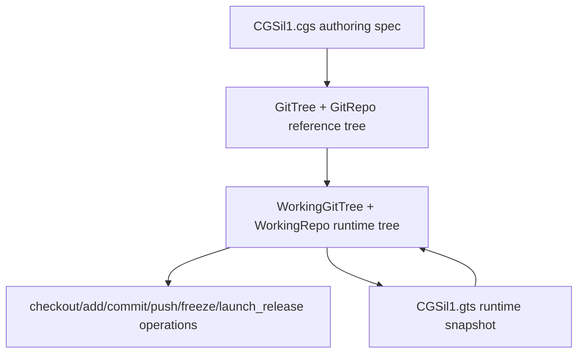

# Minimalist Tutorial — CGSil1 CLI Workflow

This tutorial walks through the complete CLI workflow for the **CGSil1** test
topology, using the reference project at
<https://gitlab.com/CGS_test/CGSil1>.

It covers every step from topology validation through initialisation to the full
git cycle (add → commit → push → tag → freeze).

> **Sandbox / CI note**
> The companion test file
> `tests/integration/test_tuto_cgsi1.py` reproduces every step below using
> local bare-repo remotes so that the tutorial can be verified in CI without
> any network access.

---

## 1. Topology overview

The CGSil1 project demonstrates a minimal mixed-provider setup:

```
CGSil1  (GitLab, root)
  ├── CGSil2  (GitLab, child)    [nested_config = "auto"]
  └── CGSih1  (GitHub, child)    [nested_config = "auto"]
        └── CGSih2  (GitHub, leaf)  [nested_config = "auto", discovered transitively]
```

The current architecture separates the authoring topology from the runtime
workspace state:



`CGSil1.cgs` remains the source of truth for the reference tree. Runtime
commands load that reference into a `WorkingGitTree`, update repository
lifecycle and sync state there, and persist generated `.gts` snapshots under
`$CGSHOME/.cgitsync/state/`.

---

## 2. Project spec — CGSil1.cgs

Place the following file at the root of the CGSil1 repository:

```toml
[document]
format_version = "1.0"

[project]
name           = "CGSil1"
default_branch = "main"

[[repos]]
gitprovider        = "gitlab"
project_owner_name = "CGS_test"
project_name       = "CGSil1"
default_branch     = "main"
fallback_branch    = "main"
access_protocol    = "ssh"
relative_path      = "."

[[repos]]
gitprovider        = "gitlab"
project_owner_name = "CGS_test"
project_name       = "CGSil2"
default_branch     = "main"
fallback_branch    = "main"
access_protocol    = "ssh"
relative_path      = "CGSil2"
nested_config      = "auto"

[[repos]]
gitprovider        = "github"
project_owner_name = "CGS_test"
project_name       = "CGSih1"
default_branch     = "main"
fallback_branch    = "main"
access_protocol    = "ssh"
relative_path      = "CGSih1"
nested_config      = "auto"
```

For a new project, the interactive equivalent is:

```bash
pixi run cgitsync configure --output ../CGSil1.cgs
```

The command builds a `GitTree` reference tree from prompts, validates the
generated `CgsDocument`, and writes the `.cgs` file. The checked-in tutorial
fixture is shown explicitly above so the CI sandbox can reproduce the same
topology without interactive input.

---

## 3. Step-by-step CLI walkthrough

Before starting, keep in mind that `CGSHOME=$CGSPATH/CGSil1`,
`CWD=$CGSHOME/ComplexGitSync`, and commands are run from `$CWD`.
When `--output-path` is omitted, `cgitsync initialise` behaves as if
`--output-path $CGSPATH` had been passed, with the default `CGSPATH=../..`
relative to `$CWD`. The `.cgs` file is read first, then `CGSHOME` is derived
from the project name; child repositories such as `CGSil2` and `CGSih1` are
cloned under that project root.

### Step 1 — Validate the topology

Install the project repo:
```bash
git clone https://gitlab.com/CGS_test/CGSil1
cd CGSil1
git clone https://github.com/flipoyo/ComplexGitSync
cd ComplexGitSync
```


Parses the spec and checks consistency without cloning anything:

```bash
pixi run cgitsync validate ../CGSil1.cgs
```

Expected output (tree not yet cloned, so `DECLARED`):

```
DECLARED ready=false complete=true
```

---

### Step 2 — Print a tree summary

Renders the project tree with lifecycle state:

```bash
pixi run cgitsync print ../CGSil1.cgs
```

---

### Step 3 — Initialise the workspace

Uses `$CGSHOME` as the existing root project, clones all child repositories
under that root, and writes the first runtime `.gts` snapshot:

```bash
pixi run cgitsync initialise ../CGSil1.cgs
```

The explicit equivalent is:

```bash
pixi run cgitsync initialise ../CGSil1.cgs --output-path "$CGSPATH"
```

Expected output (all repos cloned, tree is `READY`):

```
operation_sequence=GT-LOAD->GT-DISCOVER->GT-VALIDATE->GT-CLONE
workflow=load->expand->validate->clone
git_command=git clone (executed per repo)
READY ready=true complete=true root=/path/to/CGSil1
```

A runtime snapshot is written to
`$CGSHOME/.cgitsync/state/CGSil1.gts`. Subsequent commands load this
snapshot automatically.

If a previous failed run left partial child checkouts or stale submodule
metadata, `initialise` fails explicitly and prints:

```
Try clean-init method
```

In that case, rerun the same setup with a cleanup step inserted between
validation and cloning:

```bash
pixi run cgitsync clean-init ../CGSil1.cgs
```

`clean-init` prints
`operation_sequence=GT-LOAD->GT-DISCOVER->GT-VALIDATE->FS-PURGE->GT-CLONE`
and `workflow=load->expand->validate->purge->clone`. The `purge` phase removes
generated clone state from `$CGSHOME`: repositories declared directly under the
root, project `*.lgr` files, and the root `.gitmodules` file. The cleanup can
also be run alone:

```bash
pixi run cgitsync purge ../CGSil1.cgs
```

---

### Step 4 — Pull

Resynchronise the existing workspace from the current root branch:

```bash
pixi run cgitsync pull
```

`pull` includes the project root repository. It runs parent-first:
`ROOT -> PARENT -> LEAF`, pulling the root repo before updating parent and
leaf submodules through their parent repositories.
If local files block this safe pull, the CLI suggests `cgitsync pull-force`.
Use that recovery command only when discarding local uncommitted and untracked
work is acceptable.

---

### Step 5 — Stage changes

Stage all uncommitted file changes across every repository in the tree:

```bash
pixi run cgitsync add
```

The command discovers the `.gts` snapshot automatically from
`$CGSHOME/.cgitsync/state/`. Use `--gts` to pass the path explicitly:

```bash
pixi run cgitsync add --gts /path/to/workspace/.cgitsync/state/CGSil1.gts
```

Mutation commands run leaf-first: `LEAF -> PARENT -> ROOT`.

---

### Step 6 — Commit

Commit staged changes with a shared message across all dirty repositories:

```bash
pixi run cgitsync commit "my commit message"
```

Equivalent form:

```bash
pixi run cgitsync commit -m "my commit message"
```

---

### Step 7 — Push

Push every repository to its configured remote, leaf-first:

```bash
pixi run cgitsync push
```

Optional inspection after push:

```bash
pixi run cgitsync status
```

---

### Step 8 — Freeze

Bundle outstanding changes into a release commit, tag, and push, then
emit a versioned `.gts` snapshot:

```bash
pixi run cgitsync freeze v1.1.0
```

The `.lgr` ledger file in the project root is updated with the new
snapshot entry.

---

### Step 9 — Launch Release

Check out the frozen release tag across the READY tree:

```bash
pixi run cgitsync launch_release v1.1.0
```

---

## 4. Summary

| Step | Command | Description |
|------|---------|-------------|
| 1 | `cgitsync validate ../CGSil1.cgs` | Parse and check the topology |
| 2 | `cgitsync print ../CGSil1.cgs` | Render the tree summary |
| 3 | `cgitsync initialise ../CGSil1.cgs` | Attach the root repo and clone child repos |
| recovery | `cgitsync clean-init ../CGSil1.cgs` | Purge generated clone state, then initialise |
| cleanup | `cgitsync purge ../CGSil1.cgs` | Remove root-level generated clone state |
| 4 | `cgitsync pull` | Resync root, parent, and leaf repos |
| 5 | `cgitsync add` | Stage all changes |
| 6 | `cgitsync commit "message"` | Commit across the tree |
| 7 | `cgitsync push` | Push to remotes |
| optional | `cgitsync status` | Inspect local cleanliness and recorded snapshot drift |
| 8 | `cgitsync freeze v1.1.0` | Release commit + tag + snapshot |
| 9 | `cgitsync launch_release v1.1.0` | Check out the frozen release tag |

See `tests/integration/test_tuto_cgsi1.py` for a runnable sandbox that
exercises the full workflow against local bare-repo remotes.
