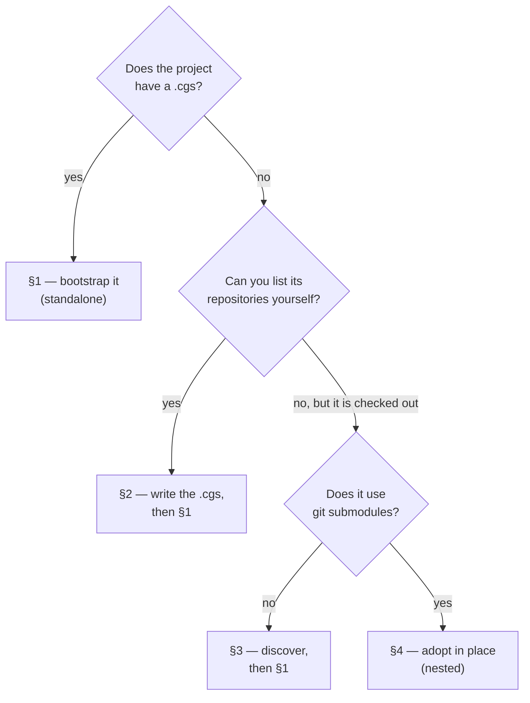

# B — Bringing in a project you already have

*Created: 2026-10-06*

**What this is.** How to put an existing project under ComplexGitSync,
whatever state it is in: it already has a `.cgs`, it is checked out on
disk without one, or it uses git submodules.

**Who it is for.** Anyone who has read [A — Getting started](A-getting-started.md)
and has a real project to adopt.

**Next.** [C — Working day to day](C-working-day-to-day.md).

---

## Which case are you in?



| Your project… | Do this | Install | Tutorial |
|---|---|---|---|
| has a `.cgs` | `bootstrap` it | standalone | [01](../tutorials/01_first_multi_repo_workspace.md), [02](../tutorials/02_onboarding_a_real_build_tree.md) |
| has none, but you know its repositories | write the `.cgs` by hand, then `bootstrap` | standalone | [02](../tutorials/02_onboarding_a_real_build_tree.md) |
| is checked out on disk, no submodules | `discover` drafts the `.cgs`, then `bootstrap` | standalone | — |
| is checked out on disk and uses submodules | `discover`, then `submodules init` from a nested clone | **nested** | [03](../tutorials/03_adopting_a_real_project.md) |

## 1. The project has a `.cgs`

That is the case [guide A](A-getting-started.md#4-your-first-tree-standalone)
already covers:

```bash
pixi run cgitsync validate path/to/project.cgs
pixi run cgitsync bootstrap path/to/project.cgs my-project
export CGSHOME=<the path bootstrap printed>
```

`bootstrap` also accepts a `.gts` snapshot instead of a `.cgs`. It then
rebuilds the tree at the exact commits the snapshot recorded, which is how
you return to a past release on a new machine. Its target must be empty or
absent.

## 2. Writing a `.cgs` by hand

When the project's own documentation or build scripts already say which
repositories it needs, writing the `.cgs` yourself is often the quickest
and clearest route. It is also the only route when the repositories never
sit together in one checkout. Start from
[`examples/template.cgs`](../examples/template.cgs), or copy a real
example: [`examples/cawaqs.cgs`](../examples/cawaqs.cgs) declares 19
repositories without a single `relative_path`.

Two fields come up in almost every real project:

- **`default_branch`**: the branch the tree follows. Set it once under
  `project`. A repository can override it.
- **`fallback_branch`**: the branch to use for a repository that has no
  branch of that name. This lets `checkout my-feature` move the whole tree
  while repositories that never got the branch stay on `main`.

## 3. The project is checked out, without a `.cgs`

`discover` scans a directory and drafts a `.cgs` from what is checked out:

```bash
pixi run cgitsync discover ~/work/project                    # print what it finds
pixi run cgitsync discover ~/work/project --write draft.cgs  # write the draft
pixi run cgitsync validate draft.cgs
```

It changes nothing until you pass `--write`, and you should read the draft
before using it:

- **Nesting is kept.** A repository found inside another is drafted as
  that repository's child (the report marks it `inside: <path>`).
- **Only what is checked out is found.** Check out everything first.
- **The scan has no depth limit.** `--max-depth N` bounds it, and
  `discover` warns when that bound cut the scan short.
- **Check the branch.** The root's checked-out branch becomes
  `project.default_branch`. Make sure it is the branch you mean to adopt.
- **Remove the ComplexGitSync clone** if it sits inside the scanned
  directory. `discover` lists it like any other repository, but it is the
  tool, not part of your project.

Then build the tree from the draft with `bootstrap` (§1), into a new
workspace. Your original checkout stays as it was.

## 4. The project uses git submodules

ComplexGitSync turns each submodule into a plain, independent clone. Its
gitlink is removed and its path is added to the parent's `.gitignore`.
Because this adopts the checkout **in place**, it is done from a
**nested** ComplexGitSync clone.

> **Known limitation: this needs the nested install.** Adopting a
> checkout in place goes through `initialise`, which only runs from a
> ComplexGitSync cloned *inside* the project. Run from a standalone clone,
> `submodules init` prints a plan with `--dry-run` but then refuses, and
> leaves the drafted `.cgs` behind. `bootstrap` doesn't help either: it
> wants an empty target and would clone a fresh copy, not adopt yours.

```bash
# 1. your checkout, with every submodule, at every level
git clone https://gitlab.com/you/project.git ~/work/project
cd ~/work/project && git submodule update --init --recursive

# 2. the tool, inside it, and ignored by it
git clone https://github.com/flipoyo/ComplexGitSync.git
echo "ComplexGitSync/" >> .gitignore
cd ComplexGitSync && pixi install

# 3. draft the .cgs, then delete the ComplexGitSync line from it
pixi run cgitsync discover ~/work/project --write ~/work/project/project.cgs

# 4. adopt the root in place, clone the rest, convert every submodule
pixi run cgitsync submodules init ~/work/project --cgs ~/work/project/project.cgs --dry-run
pixi run cgitsync submodules init ~/work/project --cgs ~/work/project/project.cgs
```

> **Step 3's edit is not optional.** Left in the `.cgs`, the
> ComplexGitSync clone counts as a dependency, and step 4 deletes it to
> re-clone it while it is running. That fails halfway, with no submodule
> converted and the tool's directory gone.

`submodules init` ends at a `READY` tree with the conversion **staged but
not committed**. Some of the repositories it touched may not be yours, so
it leaves the decision to you and prints what to run next: `branch create`,
`checkout`, `add`, `commit`.

Other rules:

- **The directory must be named after the project**, the name `discover`
  derives from the root repository's address (`gitlab:you/project` →
  `project`). The workspace is resolved as `<parent>/<project name>`.
- **The conversion must come after the tree is built, never before.**
  Building the tree re-clones every non-root repository from its remote,
  and those remotes still declare submodules. Converted first, they would
  come back unconverted. `submodules init` runs the steps in the right
  order for you.
- **To look before changing anything**, `submodules report <dir>` says what
  converting would change. `submodules import <dir> --recursive` performs
  the conversion step on its own. `--recursive` reaches submodules of
  submodules.

[Tutorial 3](../tutorials/03_adopting_a_real_project.md) adopts a real
two-level submodule project this way, from `git clone` to a pushed tree.
