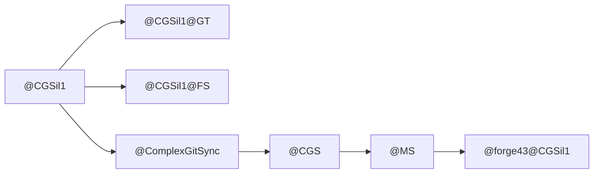

# CGSil1 Graph

This document describes the CGSil1 project Graph as defined in DevPlanTicket.md.

## Static Graph Definition

```text
CGSil1 := G {
    NAME := CGSil1
    NODE := GitTree
    EDGE := FileSystem
    OP   := ComplexGitSync
}
```

This is an instantiation of the PRIME `G` defined in `@CGS.CORE.md`.
It has no active State member - `STATE@ ∉ G`.

## Living Graph

```text
*CGSil1 := @CGS(
    CGSil1,
    G(CGSil1),
    MS(CGSil1),
    @ComplexGitSync
)
```

The living Graph `*CGSil1` owns `STATE@`.

## Consumer-Only Invariant

CGSil1 is a consumer of `@CGS` infrastructure. It does not own:
- PRIME G
- @L0
- authoritative StateId
- generic @MS
- the physical Gateway service

## Graph Relationships



## Project Positioning

```text
@CGSil1
↔ @CGSil1@FS
↔ @ComplexGitSync
↔ @CGS
↔ @MS
↔ @forge43@CGSil1
```

CGSil1 is at the center of its Graph, connected to:
1. Its FileSystem specialization (`@CGSil1@FS`)
2. The ComplexGitSync operator (`@ComplexGitSync`)
3. The infrastructure service (`@CGS`)
4. The Memory System (`@MS`)
5. The remote Memory endpoint (`@forge43@CGSil1`)
