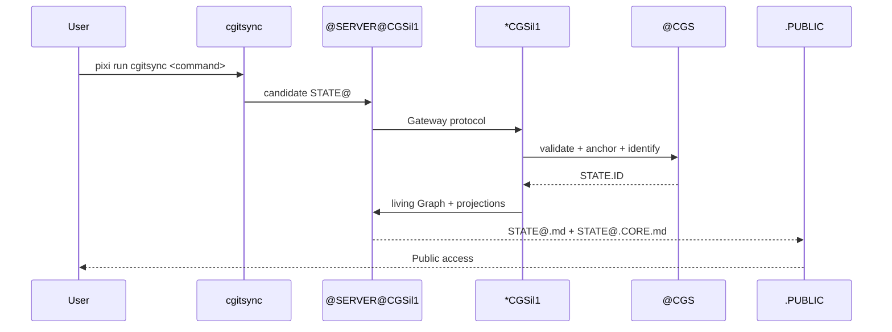

# CGSil1 STATE@.CORE.md

This is the **public Mermaid projection** of the living Gateway for CGSil1.

According to `@CGS.CORE.md`:
- `STATE@.CORE.md := PUBLIC Mermaid Graph(*G)`
- Canonical representation: `.PUBLIC <----X++++> *G`
- This is a public projection, not the complete living State
- It must not expose `.@`, credentials, private runtime variables, or Gateway internals

## Public Projection

```mermaid
flowchart LR
    PUBLIC[\".PUBLIC\\nSTATE@.md\\nSTATE@.CORE.md\"]
    X[\"X\\n@SERVER@CGSil1 Gateway\"]
    LIVING[\"*CGSil1\\nowns STATE@\"]
    LEFT[\"LEFT\\nGitTree\"]
    RIGHT[\"RIGHT\\nFileSystem\"]
    CGS[\"@CGS\\nvalidate + anchor + identify\"]
    L0[\"@L0\\nprivate .@\"]
    ID[\"STATE.ID\\nHASH(.@)\"]
    MS[\"@MS@CGSil1\\nvalidated persistence\"]

    PUBLIC <--> X
    X <--> LIVING
    LEFT --> X
    RIGHT --> X
    CGS --> X
    CGS --> L0
    L0 --> ID
    CGS --> MS
```

## Canonical Representation

```text
.PUBLIC <----X++++> *CGSil1
```

Where:
- `.PUBLIC` = accessible static projection (STATE@.md, STATE@.CORE.md)
- `X` = Gateway boundary (@SERVER@CGSil1)
- `++++>` = active living Graph (*CGSil1) behind the boundary

## Projection Components

### .PUBLIC
The accessible static projection containing:
- `CGSil1.STATE@.md` - Static public Ontology
- `CGSil1.STATE@.CORE.md` - Public Mermaid projection

### X (Gateway Boundary)
The `@SERVER@CGSil1` physical Gateway that controls all crossings between LEFT and RIGHT.

### *CGSil1
The living Graph that owns `STATE@`. It is activated through the Gateway.

### LEFT ↔ *G ↔ RIGHT
- LEFT: GitTree interpretation
- RIGHT: FileSystem interpretation
- All crossings pass through the Gateway

### @CGS Infrastructure
- `@CGS` provides validation, anchoring, and identity services
- `@L0` is the Time Layer with private `.@`
- `STATE.ID := HASH(.@)` is the public State identity
- `@MS@CGSil1` provides validated Memory persistence

## Excluded from Projection

This projection does NOT show:
- ❌ `.@` (private execution anchor)
- ❌ credentials
- ❌ private runtime variables
- ❌ private RIGHT content
- ❌ raw execution memory
- ❌ Gateway internals
- ❌ unvalidated transient State

## Service Flow



## Validation

This projection is valid because:
1. ✅ Shows `.PUBLIC` access path
2. ✅ Shows Gateway boundary `X`
3. ✅ Shows `*CGSil1`
4. ✅ Shows LEFT and RIGHT
5. ✅ Excludes all private data
6. ✅ Uses Mermaid graph notation
