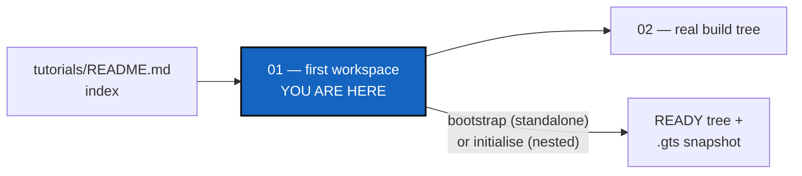
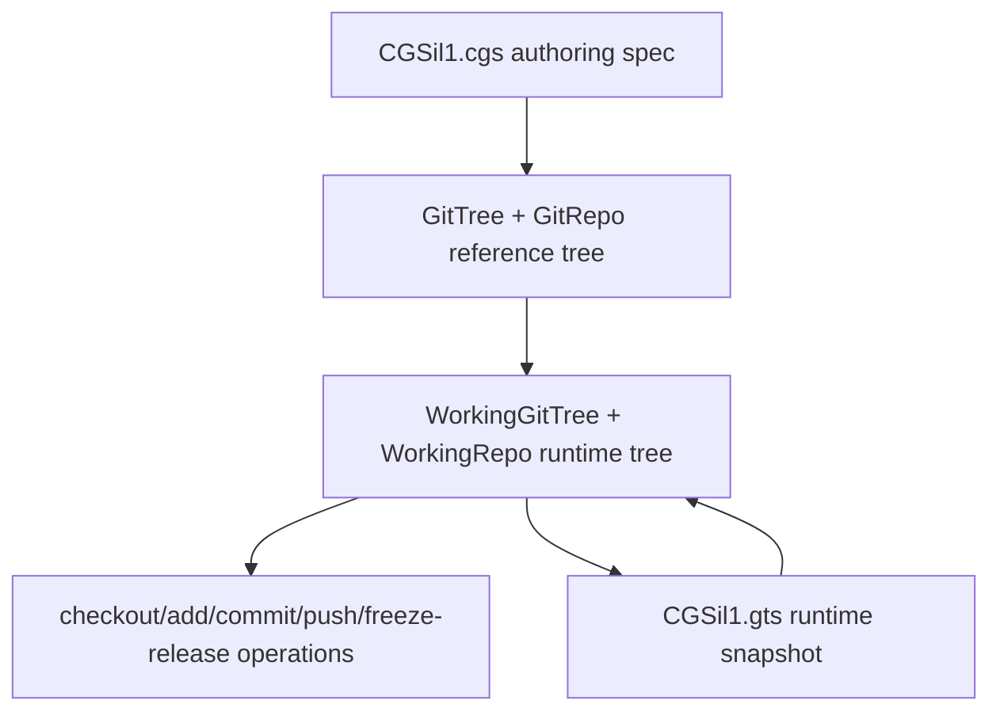

# Tutorial 1 of 5 — Your First Multi-Repo Workspace

*Created: 2026-06-30*

## Abstract — read this first

**What this document is.** The first of five worked tutorials in
[`tutorials/`](README.md): the complete `cgitsync` CLI lifecycle —
validate, install, and the full git cycle (add → commit → push → tag →
freeze) — on a small, synthetic, mixed-provider sandbox tree (`CGSil1`).
It installs that tree both ways ComplexGitSync offers: standalone with
`bootstrap`, the usual way for any kind of project, and nested with
`initialise`, and explains the difference.

**Why it exists.** Every other tutorial and the root README assume the
vocabulary and lifecycle this one establishes first: `.cgs` authoring, the
two install modes, the READY state, tree-wide git operations,
freeze/release.

**What you will find.** A topology overview, the `CGSil1.cgs` spec
explained field by field, the two install modes compared, a standalone
walkthrough with `bootstrap`, the nested alternative with `initialise`, the
git cycle common to both, from `pull` through `checkout <tag> --ref-kind
tag`, and a command summary table.

**Who it is for.** Anyone new to `cgitsync`, regardless of their own
project's shape. Nothing here requires a private repository, real
credentials, or an existing project to adopt.

**What you need to do with it.** Work it top to bottom once, then move on
to [Tutorial 2](02_onboarding_a_real_build_tree.md) to see the same
authoring style applied to a real project.



---

**Start here.** This is the easiest of the five tutorials in
[`tutorials/`](README.md): it walks through the complete `cgitsync` CLI
lifecycle — validate, install, and the full git cycle
(add → commit → push → tag → freeze) — on a small, synthetic, mixed-provider
tree with every field left at its default. Nothing here requires a private
repository, real credentials, or an existing project to adopt.

The reference project is **CGSil1**, at
<https://gitlab.com/CGS_test/CGSil1>. It exists purely as a sandbox for this
tutorial; the topology it demonstrates is deliberately minimal so every
concept introduced here — `.cgs` authoring, the READY lifecycle, tree-wide
git operations, freeze/release — carries over unchanged to real projects.

> **Every command below is a Pixi task.** `cgitsync` is not a globally
> installed executable — always run it as `pixi run cgitsync ...`, never as
> a bare `cgitsync ...` (run `pixi install` once per checkout first).

> **Sandbox / CI note**
> The companion test file
> `tests/integration/test_tuto_cgsi1.py` reproduces every step below using
> local bare-repo remotes so that the tutorial can be verified in CI without
> any network access.

**Next:** once you're comfortable with the lifecycle above, move on to
[Tutorial 2 — Onboarding a Real Build Tree](02_onboarding_a_real_build_tree.md)
to see the same `.cgs` authoring style applied to a real, much larger
project.

---

## 1. Topology overview

The CGSil1 project demonstrates a minimal mixed-provider setup:

```
CGSil1  (GitLab, root)
  ├── CGSil2  (GitLab, child)    [nested_config = "auto"]
  └── CGSih1  (GitHub, child)    [nested_config = "auto"]
        └── CGSih2  (GitHub, leaf)  [nested_config = "auto", discovered transitively]
```

The current architecture separates the authoring topology from the runtime
workspace state:



`CGSil1.cgs` remains the source of truth for the reference tree. Runtime
commands load that reference into a `WorkingGitTree`, update repository
lifecycle and sync state there, and persist each generated `.gts` snapshot
as a content-addressed State, `$CGSHOME/.cgitsync/state/<hash>.gts`,
recorded in the project's hash-chained ledger under
`$CGSHOME/.cgitsync/lgr/`.

---

## 2. Project spec — CGSil1.cgs

Place the following file at the root of the CGSil1 repository:

```toml
project = "CGSil1"

repos = [
    "gitlab:CGS_test/CGSil1",
    "gitlab:CGS_test/CGSil2",
    "github:flipoyo/CGSih1",
]
```

The parser normalizes this authoring form before validation. It supplies
`main`, `ssh`, and `auto`, uses repository names as child paths, and infers
`CGSil1` as the root at `.` because its repository name uniquely matches the
project name.

### Paths and nested configuration

For a non-root repository, `relative_path` is resolved from its parent
repository directory—not from the shell's current directory. In a nested
`.cgs`, that parent is the repository described by the nested file. Omitting
the option places a repository at its repository name.

For example, `CGSil2.cgs` contains:

```toml
{ repository = "github:flipoyo/CGSih1", relative_path = "../CGSih1" }
```

The file describes children of `CGSil2`, so if `CGSil2` is at
`<CGSHOME>/CGSil2`, the path resolves as follows:

```text
<CGSHOME>/CGSil2/../CGSih1  ->  <CGSHOME>/CGSih1
```

This points to the existing `CGSih1` sibling already declared by
`CGSil1.cgs`; it does not request another clone inside `CGSil2`. The duplicate
absolute path is recognized and the canonical root-level entry is retained.

`nested_config` controls whether discovery continues inside the referenced
repository:

- `"auto"` (default) loads the sole root-level `*.cgs` file, if present;
  finding none resolves the repository as a normal leaf; more than one is
  ambiguous and rejected.
- `"disabled"` does not inspect that repository for another `.cgs` file.
- A relative `.cgs` path, such as `"config/children.cgs"`, loads that exact
  file from inside the repository, failing if it does not exist there, and
  may not escape it.

The CGSil2 cross-reference above needs no `nested_config` override at all:
discovery's absolute-path dedup guard already recognizes `CGSih1`'s
absolute path as already registered (by `CGSil1.cgs`'s own entry) and
retains that canonical entry before `"auto"` ever gets a chance to reopen
`CGSih1.cgs` through this duplicate route.

For a new project installed in the nested mode (§3), you can skip the file
and name the repositories on the command line instead:

```bash
pixi run cgitsync initialise --project CGSil1 \
    --repo gitlab:CGS_test/CGSil1 \
    --repo codeberg:GX4G/GX4G
```

The command builds a `GitTree` reference tree from those values, validates
the generated `CgsDocument`, and initialises it. To write a `.cgs` from a
checkout that already exists, use `discover --write FILE`. The checked-in
tutorial fixture is shown explicitly above so the CI sandbox can reproduce
the same topology without any of that.

---

## 3. Two ways to install: `bootstrap` or `initialise`

ComplexGitSync can manage a project from **outside** it or from **inside**
it. The choice is made once, by the command that builds the tree, and
everything after that — `pull`, `add`, `commit`, `push`, `freeze-release` —
works the same way in both.

```text
Standalone — bootstrap                       Nested — initialise

~/tools/ComplexGitSync/    the tool          ~/work/CGSil1/             CGSHOME = root repo
                                               ├── ComplexGitSync/      the tool, inside
~/.cgs/CGS<timestamp>/CGSil1/   CGSHOME        ├── CGSil2/
  ├── CGSil2/                                  └── CGSih1/
  └── CGSih1/                                        └── CGSih2/
        └── CGSih2/
```

| | **Standalone: `bootstrap`** | **Nested: `initialise`** |
|---|---|---|
| Where the tool lives | Its own clone, anywhere on disk, outside every project | A clone inside the project's root repository |
| Who clones the project's root | `bootstrap` clones it, with everything else | You do, by hand, before cloning the tool into it |
| Where the tree is built | A new, empty workspace, `$HOME/.cgs/CGS<timestamp>/<name>` by default | Around the root you cloned, `../..` from the tool |
| How later commands find the tree | `export CGSHOME=...`, the line `bootstrap` prints | No export: they find it from where the tool sits |
| One tool for several projects | Yes, one export per project | No, one copy of the tool per project |
| Use it for | **Any kind of project — the usual choice** | Projects that ship the tool with their own content, such as digital twins |

Each command refuses the other's job by name, before touching the disk:
`initialise` run by a tool that is not inside a checked-out root tells you to
use `bootstrap`, and `bootstrap` into a directory that already holds a
checkout tells you to use `initialise`. `status`, and every command that
looks for its workspace, reports which mode is in force, as
`use_case=standalone` or `use_case=nested`.

Section 4 installs CGSil1 standalone; section 5 installs it nested. Do the
first; read the second to see what changes. The git cycle in section 6 is
the same whichever you chose.

> **SSH or HTTPS.** Repositories are cloned over SSH by default. If you have
> no SSH key registered on GitLab and GitHub, add `--force-protocol https` to
> `bootstrap` or `initialise`; the sandbox repositories are public, so HTTPS
> needs no credentials to clone them.

---

## 4. Standalone install with `bootstrap`

### Step 1 — Install the tool

Clone ComplexGitSync anywhere outside the project, once:

```bash
git clone https://github.com/flipoyo/ComplexGitSync.git ~/tools/ComplexGitSync
cd ~/tools/ComplexGitSync
pixi install
```

Every `pixi run cgitsync ...` below is typed from this directory.

### Step 2 — Get the project's `.cgs`

`bootstrap` reads a local `.cgs`. CGSil1 publishes its own; download it, or
write the file from section 2 by hand:

```bash
curl -L -o ~/CGSil1.cgs https://gitlab.com/CGS_test/CGSil1/-/raw/main/CGSil1.cgs
```

### Step 3 — Validate the topology

Parses the spec and checks consistency without cloning anything:

```bash
pixi run cgitsync validate ~/CGSil1.cgs
```

Expected output (tree not yet cloned, so `DECLARED`):

```
DECLARED ready=false complete=true
```

`pixi run cgitsync view-tree ~/CGSil1.cgs` draws the tree the file
describes, also without cloning anything.

### Step 4 — Bootstrap the workspace

```bash
pixi run cgitsync bootstrap ~/CGSil1.cgs CGSil1
```

The second argument names the workspace: it is the last part of `CGSHOME`.
`bootstrap` creates a fresh `$HOME/.cgs/CGS<timestamp>/` directory (pass
`--cgs-path DIR` to choose another parent), clones the root repository into
`CGSil1/` inside it, then every child at its path, writes the `.gitignore`
entries that keep each child out of its parent's history, and records the
first State. It ends with:

```
READY ready=true complete=true gittree_created=true gittree_active=true root=/home/you/.cgs/CGS<timestamp>/CGSil1

To use this workspace, run:
  export CGSHOME=/home/you/.cgs/CGS<timestamp>/CGSil1

Or for the current command:
  CGSHOME=/home/you/.cgs/CGS<timestamp>/CGSil1 pixi run cgitsync <command>
log_file=/home/you/.cgs/CGS<timestamp>/CGSil1/.cgitsync/logs/clone-<timestamp>.log
```

The target must be empty or absent: `bootstrap` never writes over an
existing checkout.

### Step 5 — Point the tool at the workspace

The tool and the tree are in different places, so tell the tool where the
tree is. Copy the `export` line `bootstrap` printed:

```bash
export CGSHOME=/home/you/.cgs/CGS<timestamp>/CGSil1
pixi run cgitsync status
```

Every command prints the workspace it is acting on and where that choice came
from (`from $CGSHOME`). If you bootstrap a second project later in the same
shell, export its `CGSHOME` too: an old export keeps every command pointed at
the old tree, and the warning the command prints is the sign of it.

Now continue with the git cycle, section 6.

---

## 5. Nested install with `initialise`

The same tree, built from inside. Nothing here is needed if you did section
4; it is shown so that the difference is concrete.

### Step 1 — Clone the root, then the tool inside it

```bash
git clone https://gitlab.com/CGS_test/CGSil1
cd CGSil1
git clone https://github.com/flipoyo/ComplexGitSync
cd ComplexGitSync
pixi install
```

Here you clone the project's root yourself, and its `CGSil1.cgs` comes with
it, one directory up. `CGSHOME` is the root, `CWD=$CGSHOME/ComplexGitSync`,
and commands are run from `$CWD`.

### Step 2 — Validate the topology

```bash
pixi run cgitsync validate ../CGSil1.cgs
pixi run cgitsync view-tree ../CGSil1.cgs
```

### Step 3 — Initialise the workspace

Uses `$CGSHOME` as the existing root project, clones all child repositories
under that root, and writes the first runtime `.gts` snapshot:

```bash
pixi run cgitsync initialise ../CGSil1.cgs
```

When `--output-path` is omitted, `initialise` behaves as if `--output-path
$CGSPATH` had been passed, with the default `CGSPATH=../..` relative to
`$CWD`: the `.cgs` is read first, then `CGSHOME` is derived as
`$CGSPATH/<project name>`, which is the root you cloned. No `export` is
needed afterwards.

Expected output (all repos cloned, tree is `READY`):

```
operation_sequence=GT-LOAD->GT-DISCOVER->GT-VALIDATE->GT-CLONE->GT-GITIGNORE
workflow=load->expand->validate->clone->gitignore
git_command=git clone (executed per repo)
READY ready=true complete=true root=/path/to/CGSil1
```

`GT-GITIGNORE` is the `.gitignore` lifecycle sync: every repo with children
(root, or any nested repo with further nested children) is safely pulled
and has its `.gitignore` updated with the relative path of each immediate
child, since nested repos are plain independent clones, not gitlinks. By
default this only writes the file and reports what changed
(`.gitignore updated (not committed): ...`) — pass `--commit-gitignore` to
also stage/commit/push it, and `--git-user-name`/`--git-user-email` to
override the commit identity (persisted to `$CGSHOME/.cgitsync/master.toml`
for later invocations on this workspace). If a repo's safe pull fails here,
`initialise` errors out; run `pull --force`, then `initialise` again.

`initialise` keeps the root you cloned but re-clones every dependency whose
directory already holds files, so before deleting anything it checks each
one. If a destination holds work that exists nowhere else (uncommitted
changes, or commits no remote has), it stops, names the directories, and
changes nothing. No flag overrides that. Commit and push the work, or move
those directories aside yourself, then run `initialise` again. There is no
clean-up command.

---

## 6. The git cycle — the same in both modes

From here on, commands are typed exactly the same way whichever mode you
installed with: from `~/tools/ComplexGitSync` with `CGSHOME` exported
(standalone), or from `CGSil1/ComplexGitSync` (nested).

Every command that changes the tree records a State under
`$CGSHOME/.cgitsync/` and enters it in the project's ledger. Later commands
find the latest one on their own — no explicit `.gts` path is required.

### Step 6 — Pull

Resynchronise the existing workspace from the current root branch:

```bash
pixi run cgitsync pull
```

`pull` includes the project root repository. It runs parent-first:
`ROOT -> PARENT -> LEAF`, pulling every repository — root, parent, and leaf
alike — as its own plain `git pull`.
If local files block this safe pull, the CLI suggests `pixi run cgitsync pull --force`.
`pull --force` never discards work: it sets uncommitted and untracked files
aside with `git stash push -u`, and it refuses, before changing anything,
while a commit exists that no remote has. Push or merge that commit first.

`pull` also runs the same `.gitignore` lifecycle sync as `initialise`
(section 5) once the tree-wide pull completes, and accepts the same
`--commit-gitignore`/`--git-user-name`/`--git-user-email` flags.
`pull --force` does not run this sync, and does not take those three
flags — it is a recovery command, not a
lifecycle path the sync is wired into.

---

### Step 7 — Stage changes

Stage all uncommitted file changes across every repository in the tree:

```bash
pixi run cgitsync add
```

The command finds the latest State on its own. Use `--gts` to name one
explicitly:

```bash
pixi run cgitsync add --gts "$CGSHOME/.cgitsync/state/<hash>.gts"
```

Mutation commands run leaf-first: `LEAF -> PARENT -> ROOT`.

---

### Step 8 — Commit

Commit staged changes with a shared message across all dirty repositories:

```bash
pixi run cgitsync commit "my commit message"
```

Equivalent form:

```bash
pixi run cgitsync commit -m "my commit message"
```

---

### Step 9 — Push

Push every repository to its configured remote, leaf-first:

```bash
pixi run cgitsync push
```

Optional inspection after push:

```bash
pixi run cgitsync status
```

---

### Step 10 — Freeze

Minimalist release workflow: stage, commit, pull, push, tag, and emit a
versioned `.gts` snapshot:

```bash
pixi run cgitsync freeze-release v1.1.0 "release v1.1.0"
```

`freeze-release` is the one freeze procedure; there is no separate
`freeze` command. If your branch has fallen behind, run `pull --force` first,
then `freeze-release`.

The release is entered in the project's ledger like every other State.

---

### Step 11 — Return to the Release

Check out the frozen release tag across the READY tree:

```bash
pixi run cgitsync checkout v1.1.0 --ref-kind tag
```

That snapshot is also what rebuilds this exact release elsewhere:
`bootstrap <snapshot.gts> CGSil1` on another machine clones every
repository at the commit it recorded.

---

## 7. Summary

| Step | Command | Description |
|------|---------|-------------|
| **Standalone** | | |
| 3 | `pixi run cgitsync validate ~/CGSil1.cgs` | Parse and check the topology |
| 4 | `pixi run cgitsync bootstrap ~/CGSil1.cgs CGSil1` | Clone the whole tree, root included, into a new workspace |
| 5 | `export CGSHOME=...` | Point the tool at that workspace |
| **Nested** | | |
| 2 | `pixi run cgitsync validate ../CGSil1.cgs` | Parse and check the topology |
| 3 | `pixi run cgitsync initialise ../CGSil1.cgs` | Keep the root you cloned and clone the child repos around it |
| **Both** | | |
| 6 | `pixi run cgitsync pull` | Resync root, parent, and leaf repos |
| 7 | `pixi run cgitsync add` | Stage all changes |
| 8 | `pixi run cgitsync commit "message"` | Commit across the tree |
| 9 | `pixi run cgitsync push` | Push to remotes |
| optional | `pixi run cgitsync status` | Inspect local cleanliness and recorded snapshot drift |
| 10 | `pixi run cgitsync freeze-release v1.1.0 "release v1.1.0"` | Minimalist release workflow |
| 11 | `pixi run cgitsync checkout v1.1.0 --ref-kind tag` | Check out the frozen release tag |

See `tests/integration/test_tuto_cgsi1.py` for a runnable sandbox that
exercises the full workflow against local bare-repo remotes.

