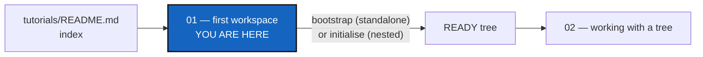

# Tutorial 1 of 6 — Your First Multi-Repo Workspace

*Created: 2026-06-30*

## Abstract — read this first

**What this document is.** The first of six tutorials in
[`tutorials/`](README.md): how to install a small sample project,
`CGSil1`, as a GitTree — standalone with `bootstrap`, the usual way, or
nested with `initialise` — and what the difference is.

**Why it exists.** Every other tutorial starts from a READY tree. This one
gets you there, on a project where nothing of your own is at risk.

**What you will find.** The sample tree, its `.cgs`, the two install modes
side by side, then each install in a few commands.

**Who it is for.** Anyone new to `cgitsync`.

**What you need to do with it.** Install the tree once, standalone. Then go
on to [Tutorial 2](02_working_with_a_tree.md), which works on that tree.



---

## 1. The sample project

`CGSil1` (<https://gitlab.com/CGS_test/CGSil1>) is a sandbox: four small
repositories, on GitLab and GitHub, nested inside each other.

```text
CGSil1        the root (GitLab)
├── CGSil2    a child (GitLab)
└── CGSih1    a child (GitHub)
    └── CGSih2    a child of CGSih1, declared in CGSih1's own .cgs
```

Its whole description, `CGSil1.cgs`, is three lines:

```toml
project = "CGSil1"

repos = [
    "gitlab:CGS_test/CGSil1",
    "gitlab:CGS_test/CGSil2",
    "github:flipoyo/CGSih1",
]
```

Everything else has a default: branch `main`, SSH access, and each
repository placed at its own name. `CGSil1` matches the project name, so it
is the root. `CGSih2` is not listed: it comes from the `.cgs` that `CGSih1`
carries itself. The user guide (`docs/MASTER.pdf`, *Local Authoring Spec*)
describes every field.

---

## 2. Two ways to install

ComplexGitSync manages a project from **outside** it (standalone) or from
**inside** it (nested). The choice is made once, by the command that builds
the tree. Everything after that works the same way.

```text
Standalone — bootstrap                       Nested — initialise

~/tools/ComplexGitSync/    the tool          ~/work/CGSil1/             the root = CGSHOME
                                               ├── ComplexGitSync/      the tool, inside
~/.cgs/CGS<timestamp>/CGSil1/   CGSHOME        ├── CGSil2/
  ├── CGSil2/                                  └── CGSih1/
  └── CGSih1/                                        └── CGSih2/
        └── CGSih2/
```

| | **Standalone: `bootstrap`** | **Nested: `initialise`** |
|---|---|---|
| The tool | One clone, outside every project | A clone inside the project's root |
| The root repository | Cloned by `bootstrap`, with the rest | Cloned by you, before the tool |
| Later commands find the tree by | `export CGSHOME=...` | Where the tool sits |
| One tool for several projects | Yes | No |
| Use it for | **Any project — the usual choice** | Projects that ship the tool with their content, such as hydrological digital twins |

Each command refuses the other's job and names the right one.

> **SSH or HTTPS.** Repositories are cloned over SSH by default. Without an
> SSH key on GitLab and GitHub, add `--force-protocol https` to `bootstrap`
> or `initialise`.

---

## 3. Standalone install with `bootstrap`

**Install the tool**, once, anywhere outside the project:

```bash
git clone https://github.com/flipoyo/ComplexGitSync.git ~/tools/ComplexGitSync
cd ~/tools/ComplexGitSync
pixi install
```

Every `pixi run cgitsync ...` is typed from this directory.

**Get the project's `.cgs`**, and check it without cloning anything:

```bash
curl -L -o ~/CGSil1.cgs https://gitlab.com/CGS_test/CGSil1/-/raw/main/CGSil1.cgs
pixi run cgitsync validate ~/CGSil1.cgs
pixi run cgitsync view-tree ~/CGSil1.cgs
```

**Build the tree:**

```bash
pixi run cgitsync bootstrap ~/CGSil1.cgs CGSil1
```

`CGSil1`, the second argument, names the workspace. `bootstrap` creates a
new directory under `$HOME/.cgs/`, clones every repository into it, and
ends with:

```
READY ready=true complete=true gittree_created=true gittree_active=true root=/home/you/.cgs/CGS<timestamp>/CGSil1

To use this workspace, run:
  export CGSHOME=/home/you/.cgs/CGS<timestamp>/CGSil1
```

**Point the tool at it**, with the line it printed:

```bash
export CGSHOME=/home/you/.cgs/CGS<timestamp>/CGSil1
pixi run cgitsync status
```

Every command prints the workspace it is acting on. When you start another
project in the same shell, export its `CGSHOME` too.

---

## 4. Nested install with `initialise`

The same tree, built from inside. Skip this if you did section 3; it is here
so the difference is concrete.

```bash
git clone https://gitlab.com/CGS_test/CGSil1
cd CGSil1
git clone https://github.com/flipoyo/ComplexGitSync
cd ComplexGitSync
pixi install
pixi run cgitsync initialise ../CGSil1.cgs
pixi run cgitsync status
```

You cloned the root yourself, and its `CGSil1.cgs` came with it.
`initialise` clones the other repositories around it. No export is needed:
the tool finds the tree from where it sits.

---

## 5. What you have now

A READY tree: every repository cloned, on its branch, and a first State
recorded in `$CGSHOME/.cgitsync/`. [Tutorial 2](02_working_with_a_tree.md)
works on it — changing files, committing, pushing, releasing, and going
back to an earlier State.

| Command | What it does |
|---|---|
| `pixi run cgitsync validate <file.cgs>` | Check a description, clone nothing |
| `pixi run cgitsync view-tree <file.cgs>` | Draw the tree it describes |
| `pixi run cgitsync bootstrap <file.cgs> <name>` | Standalone: clone the whole tree into a new workspace |
| `pixi run cgitsync initialise <file.cgs>` | Nested: clone the tree around a root you cloned |
| `pixi run cgitsync status` | Where every repository stands |

`tests/integration/test_tuto_cgsi1.py` runs both installs against local
copies of these repositories.
