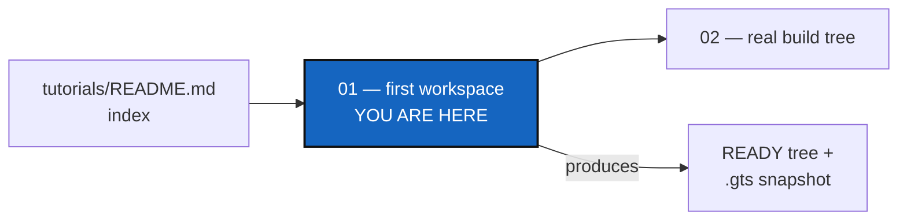
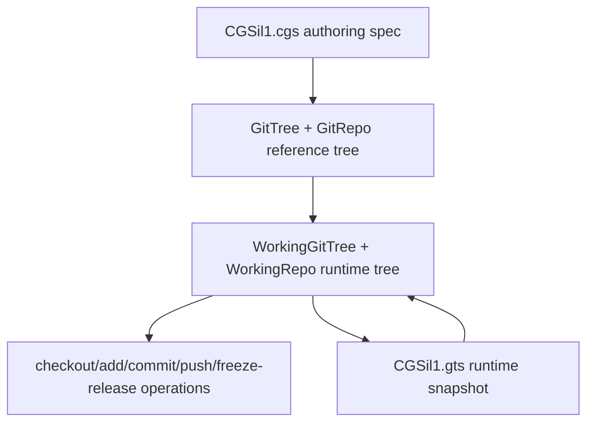

# Tutorial 1 of 5 — Your First Multi-Repo Workspace

*Created: 2026-06-30*

## Abstract — read this first

**What this document is.** The first of five worked tutorials in
[`tutorials/`](README.md): the complete `cgitsync` CLI lifecycle —
validate, initialise, and the full git cycle (add → commit → push → tag →
freeze) — on a small, synthetic, mixed-provider sandbox tree (`CGSil1`).

**Why it exists.** Every other tutorial and the root README's Quickstart
assume the vocabulary and lifecycle this one establishes first: `.cgs`
authoring, the READY state, tree-wide git operations, freeze/release.

**What you will find.** A topology overview, the `CGSil1.cgs` spec
explained field by field, a 9-step CLI walkthrough from `validate` through
`checkout <tag> --ref-kind tag`, and a command summary table.

**Who it is for.** Anyone new to `cgitsync`, regardless of their own
project's shape. Nothing here requires a private repository, real
credentials, or an existing project to adopt.

**What you need to do with it.** Work it top to bottom once, then move on
to [Tutorial 2](02_onboarding_a_real_build_tree.md) to see the same
authoring style applied to a real project.



---

**Start here.** This is the easiest of the five tutorials in
[`tutorials/`](README.md): it walks through the complete `cgitsync` CLI
lifecycle — validate, initialise, and the full git cycle
(add → commit → push → tag → freeze) — on a small, synthetic, mixed-provider
tree with every field left at its default. Nothing here requires a private
repository, real credentials, or an existing project to adopt.

The reference project is **CGSil1**, at
<https://gitlab.com/CGS_test/CGSil1>. It exists purely as a sandbox for this
tutorial; the topology it demonstrates is deliberately minimal so every
concept introduced here — `.cgs` authoring, the READY lifecycle, tree-wide
git operations, freeze/release — carries over unchanged to real projects.

> **Every command below is a Pixi task.** `cgitsync` is not a globally
> installed executable — always run it as `pixi run cgitsync ...`, never as
> a bare `cgitsync ...` (run `pixi install` once per checkout first).

> **Sandbox / CI note**
> The companion test file
> `tests/integration/test_tuto_cgsi1.py` reproduces every step below using
> local bare-repo remotes so that the tutorial can be verified in CI without
> any network access.

> **You can read CGSil1, not write to it.** Steps 1–6 work for anyone.
> Steps 7–9 publish to the sandbox's remotes, which only their owners can
> push to: run them with `--dry-run` to see the plan, or point the `.cgs`
> at repositories of your own.

**Next:** once you're comfortable with the lifecycle above, move on to
[Tutorial 2 — Onboarding a Real Build Tree](02_onboarding_a_real_build_tree.md)
to see the same `.cgs` authoring style applied to a real, much larger
project.

---

## 1. Topology overview

The CGSil1 project demonstrates a minimal mixed-provider setup:

```
CGSil1  (GitLab, root)
  ├── CGSil2  (GitLab, child)    [nested_config = "auto"]
  └── CGSih1  (GitHub, child)    [nested_config = "auto"]
        └── CGSih2  (GitHub, leaf)  [nested_config = "auto", discovered transitively]
```

The current architecture separates the authoring topology from the runtime
workspace state:



`CGSil1.cgs` remains the source of truth for the reference tree. Runtime
commands load that reference into a `WorkingGitTree`, update repository
lifecycle and sync state there, and persist each generated `.gts` snapshot
under its own content-addressed `$CGSHOME/.cgitsync/state(<hash>)_<n>/`
directory, recorded in the project's `.lgr` register.

---

## 2. Project spec — CGSil1.cgs

Place the following file at the root of the CGSil1 repository:

```toml
project = "CGSil1"

repos = [
    "gitlab:CGS_test/CGSil1",
    "gitlab:CGS_test/CGSil2",
    "github:flipoyo/CGSih1",
]
```

The parser normalizes this authoring form before validation. It supplies
`main`, `ssh`, and `auto`, uses repository names as child paths, and infers
`CGSil1` as the root at `.` because its repository name uniquely matches the
project name.

### Paths and nested configuration

For a non-root repository, `relative_path` is resolved from its parent
repository directory—not from the shell's current directory. In a nested
`.cgs`, that parent is the repository described by the nested file. Omitting
the option places a repository at its repository name.

For example, `CGSil2.cgs` contains:

```toml
{ repository = "github:flipoyo/CGSih1", relative_path = "../CGSih1" }
```

The file describes children of `CGSil2`, so if `CGSil2` is at
`<CGSHOME>/CGSil2`, the path resolves as follows:

```text
<CGSHOME>/CGSil2/../CGSih1  ->  <CGSHOME>/CGSih1
```

This points to the existing `CGSih1` sibling already declared by
`CGSil1.cgs`; it does not request another clone inside `CGSil2`. The duplicate
absolute path is recognized and the canonical root-level entry is retained.

`nested_config` controls whether discovery continues inside the referenced
repository:

- `"auto"` (default) loads the sole root-level `*.cgs` file, if present;
  finding none resolves the repository as a normal leaf; more than one is
  ambiguous and rejected.
- `"disabled"` does not inspect that repository for another `.cgs` file.
- A relative `.cgs` path, such as `"config/children.cgs"`, loads that exact
  file from inside the repository, failing if it does not exist there, and
  may not escape it.

The CGSil2 cross-reference above needs no `nested_config` override at all:
discovery's absolute-path dedup guard already recognizes `CGSih1`'s
absolute path as already registered (by `CGSil1.cgs`'s own entry) and
retains that canonical entry before `"auto"` ever gets a chance to reopen
`CGSih1.cgs` through this duplicate route.

For a new project, you can skip the file and name the repositories on the
command line instead:

```bash
pixi run cgitsync initialise --project CGSil1 \
    --repo gitlab:CGS_test/CGSil1 \
    --repo codeberg:GX4G/GX4G
```

The command builds a `GitTree` reference tree from those values, validates
the generated `CgsDocument`, and initialises it. To write a `.cgs` from a
checkout that already exists, use `discover --write FILE`. The checked-in
tutorial fixture is shown explicitly above so the CI sandbox can reproduce
the same topology without any of that.

---

## 3. Step-by-step CLI walkthrough

Before starting, keep in mind that `CGSHOME=$CGSPATH/CGSil1`,
`CWD=$CGSHOME/ComplexGitSync`, and commands are run from `$CWD`.
When `--output-path` is omitted, `pixi run cgitsync initialise` behaves as if
`--output-path $CGSPATH` had been passed, with the default `CGSPATH=../..`
relative to `$CWD`. The `.cgs` file is read first, then `CGSHOME` is derived
from the project name; child repositories such as `CGSil2` and `CGSih1` are
cloned under that project root.

### Step 1 — Validate the topology

Install the project repo:
```bash
git clone https://gitlab.com/CGS_test/CGSil1
cd CGSil1
git clone https://github.com/flipoyo/ComplexGitSync
cd ComplexGitSync
```


Parses the spec and checks consistency without cloning anything:

```bash
pixi run cgitsync validate ../CGSil1.cgs
```

Expected output (tree not yet cloned, so `DECLARED`):

```
DECLARED ready=false complete=true
```

---

### Step 2 — View a tree summary

Renders the project tree with lifecycle state:

```bash
pixi run cgitsync view-tree ../CGSil1.cgs
```

---

### Step 3 — Initialise the workspace

Uses `$CGSHOME` as the existing root project, clones all child repositories
under that root, and writes the first runtime `.gts` snapshot:

```bash
pixi run cgitsync initialise ../CGSil1.cgs
```

The explicit equivalent is:

```bash
pixi run cgitsync initialise ../CGSil1.cgs --output-path "$CGSPATH"
```

Expected output (all repos cloned, tree is `READY`):

```
operation_sequence=GT-LOAD->GT-DISCOVER->GT-VALIDATE->GT-CLONE->GT-GITIGNORE
workflow=load->expand->validate->clone->gitignore
git_command=git clone (executed per repo)
READY ready=true complete=true root=/path/to/CGSil1
```

> **The same tree, standalone.** This tutorial installs ComplexGitSync
> *inside* the tree it manages (the nested install). To keep one
> ComplexGitSync clone outside your projects instead (the standalone
> install, recommended in
> [guide A](../guide/A-getting-started.md#3-standalone-or-nested-where-the-tool-sits)),
> save `CGSil1.cgs` anywhere outside the clone, build the whole tree with
> `bootstrap`, and point the following commands at it:
>
> ```bash
> pixi run cgitsync bootstrap ~/CGSil1.cgs CGSil1   # no SSH key? add --force-protocol https
> export CGSHOME=<the path bootstrap printed>
> ```
>
> Every later step is identical. [Tutorial 2](02_onboarding_a_real_build_tree.md)
> uses this install throughout.

`GT-GITIGNORE` is the `.gitignore` lifecycle sync: every repo with children
(root, or any nested repo with further nested children) is safely pulled
and has its `.gitignore` updated with the relative path of each immediate
child, since nested repos are plain independent clones, not gitlinks. By
default this only writes the file and reports what changed
(`.gitignore updated (not committed): ...`) — pass `--commit-gitignore` to
also stage/commit/push it, and `--git-user-name`/`--git-user-email` to
override the commit identity (persisted to `$CGSHOME/.cgitsync/master.toml`
for later invocations on this workspace). If a repo's safe pull fails here,
`initialise` errors out; run `pull --force`, then `initialise` again.

A runtime snapshot is written under `$CGSHOME/.cgitsync/` and recorded in
the project's `.lgr` register. Subsequent commands resolve this snapshot
automatically — no explicit `.gts` path is required.

`initialise` re-clones every dependency whose directory already holds
files, so before deleting anything it checks each one. If a destination
holds work that exists nowhere else (uncommitted changes, or commits no
remote has), it stops, names the directories, and changes nothing. No flag
overrides that. Commit and push the work, or move those directories aside
yourself, then run `initialise` again. There is no clean-up command.

> **Commit the `.gitignore` before branching.** Unless you passed
> `--commit-gitignore`, the `.gitignore` written above is not committed.
> Commit it on the main branch now (`add`, then `commit`), before any
> feature branch. Otherwise it exists only on the branch where you first
> commit, and back on `main` the child repositories look like untracked
> files, so `merge` refuses.

---

### Step 4 — Pull

Resynchronise the existing workspace from the current root branch:

```bash
pixi run cgitsync pull
```

`pull` includes the project root repository. It runs parent-first:
`ROOT -> PARENT -> LEAF`, pulling every repository — root, parent, and leaf
alike — as its own plain `git pull`.
If local files block this safe pull, the CLI suggests `pixi run cgitsync pull --force`.
`pull --force` never discards work: it sets uncommitted and untracked files
aside with `git stash push -u`, and it refuses, before changing anything,
while a commit exists that no remote has. Push or merge that commit first.

`pull` also runs the same `.gitignore` lifecycle sync as `initialise` (Step 3
above) once the tree-wide pull completes, and accepts the same
`--commit-gitignore`/`--git-user-name`/`--git-user-email` flags.
`pull --force` does not run this sync, and does not take those three
flags — it is a recovery command, not a
lifecycle path the sync is wired into.

---

### Step 5 — Stage changes

Stage all uncommitted file changes across every repository in the tree:

```bash
pixi run cgitsync add
```

The command discovers the `.gts` snapshot automatically via the project's
`.lgr` register under `$CGSHOME/.cgitsync/`. Use `--gts` to pass the path
explicitly:

```bash
pixi run cgitsync add --gts "/path/to/workspace/.cgitsync/state(<hash>)_<n>/CGSil1.gts"
```

Mutation commands run leaf-first: `LEAF -> PARENT -> ROOT`.

---

### Step 6 — Commit

Commit staged changes with a shared message across all dirty repositories:

```bash
pixi run cgitsync commit "my commit message"
```

Equivalent form:

```bash
pixi run cgitsync commit -m "my commit message"
```

---

### Step 7 — Push

Push every repository to its configured remote, leaf-first:

```bash
pixi run cgitsync push
```

Optional inspection after push:

```bash
pixi run cgitsync status
```

---

### Step 8 — Freeze

Minimalist release workflow: stage, commit, pull, push, tag, and emit a
versioned `.gts` snapshot:

```bash
pixi run cgitsync freeze-release v1.1.0 "release v1.1.0"
```

`freeze-release` is the one freeze procedure; there is no separate
`freeze` command. If your branch has fallen behind, run `pull --force` first,
then `freeze-release`.

The `.lgr` ledger file in the project root is updated with the new
snapshot entry.

---

### Step 9 — Return to the Release

Check out the frozen release tag across the READY tree:

```bash
pixi run cgitsync checkout v1.1.0 --ref-kind tag
```

---

## 4. Summary

| Step | Command | Description |
|------|---------|-------------|
| 1 | `pixi run cgitsync validate ../CGSil1.cgs` | Parse and check the topology |
| 2 | `pixi run cgitsync view-tree ../CGSil1.cgs` | Render the tree summary |
| 3 | `pixi run cgitsync initialise ../CGSil1.cgs` | Attach the root repo and clone child repos |
| 4 | `pixi run cgitsync pull` | Resync root, parent, and leaf repos |
| 5 | `pixi run cgitsync add` | Stage all changes |
| 6 | `pixi run cgitsync commit "message"` | Commit across the tree |
| 7 | `pixi run cgitsync push` | Push to remotes |
| optional | `pixi run cgitsync status` | Inspect local cleanliness and recorded snapshot drift |
| 8 | `pixi run cgitsync freeze-release v1.1.0 "release v1.1.0"` | Minimalist release workflow |
| 9 | `pixi run cgitsync checkout v1.1.0 --ref-kind tag` | Check out the frozen release tag |

See `tests/integration/test_tuto_cgsi1.py` for a runnable sandbox that
exercises the full workflow against local bare-repo remotes.

