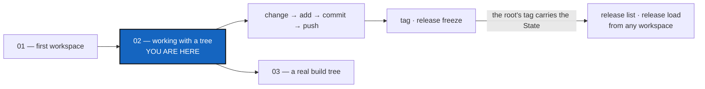

# Tutorial 2 of 7 — Working with a Tree

*Created: 2026-10-06*

## Abstract — read this first

**What this document is.** The second of seven tutorials in
[`tutorials/`](README.md): the commands you use on a READY tree, every
day. Change a few files in the `CGSil1` tree from Tutorial 1, then `add`,
`commit` and `push` them across every repository at once, mark the result
with `tag`, release it with `release freeze`, and finally load that release
in a colleague's workspace that never saw it.

**Why it exists.** Installing a tree is done once; working on it is done
every day. This is the part of the lifecycle where ComplexGitSync replaces
running the same Git command in each repository by hand.

**What you will find.** Eight short steps on the sandbox tree, each with the
command and what it prints, and a summary table.

**Who it is for.** Anyone who has done
[Tutorial 1](01_first_multi_repo_workspace.md) and has a READY `CGSil1`
tree.

**What you need to do with it.** Work through it once, top to bottom.



---

## Before you start

You need the READY `CGSil1` tree from Tutorial 1, and `CGSHOME` exported
in your shell. Every command is typed from your ComplexGitSync clone.

> **You need write access to push.** `push`, `tag` and `release freeze`
> write to the remote repositories, and the `CGS_test` sandbox is read-only
> for everybody but its author. To run every step for real, fork `CGSil1`
> and `CGSil2` on GitLab and `CGSih1` on GitHub into your own account, put
> your account's name in your copy of `CGSil1.cgs`, and bootstrap that.
> Without a fork, steps 1 to 4 work unchanged, `push --dry-run` shows what
> step 5 would send, and steps 6 to 8 can only be read.

---

## Step 1 — See where the tree stands

```bash
pixi run cgitsync status
```

```
cgshome=/home/you/.cgs/CGSil1-<timestamp> (from $CGSHOME) use_case=standalone
summary ready=true complete=true use_case=standalone profile=user cgitsync_branch=main repos=3 dirty=0 staged=0 ahead=0 behind=0 unmeasured=0 recorded_mismatch=0 errors=0
REPOSITORY  PATH    SCOPE    LOCAL_BRANCH  UPSTREAM_BRANCH  LOCAL  SYNC    HEAD      RECORDED
CGSil2      CGSil2  project  main          origin/main      clean  synced  438b2956  438b2956
CGSih1      CGSih1  project  main          origin/main      clean  synced  b44ecb2c  b44ecb2c
CGSil1      .       project  main          origin/main      clean  synced  8b10a333  8b10a333
```

One row per repository. `LOCAL` says whether its files changed; `SYNC`
whether it is level with its remote. The `summary` line adds them up, and
names the branch the whole tree is on.

## Step 2 — Change something

Anything will do. Add a file in one repository and a line in another:

```bash
echo "a first note" > "$CGSHOME/CGSil2/notes.txt"
echo "A line added in the tutorial." >> "$CGSHOME/CGSih1/README.md"
pixi run cgitsync status
```

`CGSil2` and `CGSih1` now read `dirty`. You worked on plain files, with
plain tools: ComplexGitSync only comes in when you record the work.

## Step 3 — Stage: `add`

```bash
pixi run cgitsync add
```

```
staged CGSil2: staged 1 change(s)
staged CGSih1: staged 1 change(s)
staged CGSil1: staged 1 change(s)
staged=3 skipped=0
```

One `git add --all` in every repository. The root has a change too: the
`.gitignore` `bootstrap` wrote there, listing its child repositories so the
root never records their files. It goes into your first commit.

## Step 4 — Commit: `commit`

```bash
pixi run cgitsync commit "tutorial: a first note and a README line"
```

```
committed CGSil2: 80d7784e...
committed CGSih1: 9715f74e...
committed CGSil1: 009e67ca...
committed=3 skipped=0
```

One message, one commit in each repository that had something staged,
leaves first. A repository with nothing staged is listed as `skipped`.

## Step 5 — Publish: `push`

```bash
pixi run cgitsync push
```

```
pushed CGSil2: origin/main (+1)
pushed CGSih1: origin/main (+1)
pushed CGSil1: origin/main (+1)
pushed=3 skipped=0
```

`status` now shows every row `clean` and `synced` again. Someone else
updates their copy of the tree with `pixi run cgitsync pull`.

## Step 6 — Mark the tree: `tag`

```bash
pixi run cgitsync tag v0.9
```

Creates the tag `v0.9` in every repository and pushes it. The tree can now
be found again under that name.

## Step 7 — Release: `release freeze`

```bash
pixi run cgitsync release freeze "first release of the sandbox"
```

```
release=CGSil1-1 from=next number
READY ready=true complete=true ... release=CGSil1-1 message='first release of the sandbox' snapshot=/home/you/.cgs/CGSil1-<timestamp>/.cgitsync/state/b2149c25...
```

One command for a whole release: `add`, `commit`, `pull`, `push`, a tag in
every repository, and the release's State, the exact commit of every
repository.

**The release names itself: `<project-name>-<version>`.** The version is the
one in the root repository's `pixi.toml`, as written. `CGSil1` has none, so
its releases are numbered instead: `CGSil1-1`, then `CGSil1-2`. A version
already released is refused, so bump it in `pixi.toml` before the next
release. To choose the name yourself, `--force-tag beta` releases
`CGSil1-beta`; the project's name is always in front. That is because one
repository can belong to several projects, and each project's releases
must keep their own names in it. `--dry-run` shows the tag before anything
moves.

**The release travels with the project.** The root repository's tag carries
the release's State, so anyone who can clone `CGSil1` can find the release
and load it, whoever made it and on whatever disk. A private repository is
never written into that tag.

## Step 8 — Load a release someone else made

A `.cgs` names **branches**, so an install from it always gives the latest
work. A release names **commits**. To see the difference, play a colleague
who installs the project long after your release, never saw it, and finds
`main` has moved on.

**Install the latest, and spoil it.** Bootstrap the `.cgs` into a second
workspace, as the colleague would:

```bash
pixi run cgitsync bootstrap ~/CGSil1.cgs CGSil1-latest
export CGSHOME=/home/you/.cgs/CGSil1-latest-<timestamp>   # printed by bootstrap
echo "something we will regret" >> "$CGSHOME/CGSil2/notes.txt"
pixi run cgitsync add
pixi run cgitsync commit "tutorial: a change we will regret"
pixi run cgitsync push
```

The remotes now hold the regrettable line, and any new install from the
`.cgs` gets it.

**Find the release.** Nothing on this disk recorded it, yet:

```bash
pixi run cgitsync release list
```

```
TAG                       VERSION     RECORDED                   BY                  SOURCE
CGSil1-1                  -           2026-10-09T10:40:15+02:00  You                 tag  (made with cgitsync 6.0.0)
```

`SOURCE` says where each release was read: `tag` is the root repository's
tag, so the colleague sees every release of the project. In the workspace
that made it, the same row reads `ledger+tag`: that disk recorded it too.

**Load it.**

```bash
pixi run cgitsync release load 1
cat "$CGSHOME/CGSil2/notes.txt"
```

```
a first note
```

`1` is enough: `release load` adds the project's name. Every repository is
back at the commit the release recorded, whatever happened on its branch
since, and the same command does the same on any machine: that is what
makes a release reproducible. Nothing moved a branch. Each repository is
detached at the release, `main` still holds the regrettable line, and one
command takes you back to work:

```bash
pixi run cgitsync checkout main
```

A repository with uncommitted changes stops the load, by name, before
anything moves. To keep your workspace as it is and look at the release
beside it, load it into a new one instead:

```bash
pixi run cgitsync release load 1 --workspace CGSil1-1
```

Tutorial 6 shows how to keep every State in a memory repository of its own.

---

## Summary

| Step | Command | What it does |
|---|---|---|
| 1 | `pixi run cgitsync status` | Where every repository stands |
| 3 | `pixi run cgitsync add` | Stage every change, in every repository |
| 4 | `pixi run cgitsync commit "message"` | One commit per changed repository, one message |
| 5 | `pixi run cgitsync push` | Publish every repository that is ahead |
| — | `pixi run cgitsync pull` | Bring every repository up to date |
| 6 | `pixi run cgitsync tag <name>` | Tag every repository and push the tag |
| 7 | `pixi run cgitsync release freeze "message"` | Add, commit, pull, push, tag `<project>-<version>` and record the release's State |
| 8 | `pixi run cgitsync release list` | Every release of the project, whoever made it |
| 8 | `pixi run cgitsync release load <version>` | Put the tree back at a release; `--workspace NAME` in a new one |

Every command takes `--help`. Next:
[Tutorial 3 — Onboarding a Real Build Tree](03_onboarding_a_real_build_tree.md)
applies the same commands to a real, 19-repository project.
