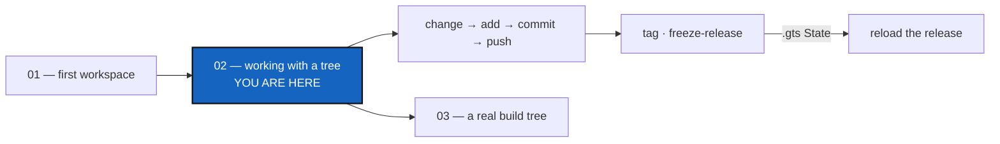

# Tutorial 2 of 7 — Working with a Tree

*Created: 2026-10-06*

## Abstract — read this first

**What this document is.** The second of seven tutorials in
[`tutorials/`](README.md): the commands you use on a READY tree, every
day. Change a few files in the `CGSil1` tree from Tutorial 1, then `add`,
`commit` and `push` them across every repository at once, mark the result
with `tag`, release it with `freeze-release`, and finally go back to that
release from its `.gts` State.

**Why it exists.** Installing a tree is done once; working on it is done
every day. This is the part of the lifecycle where ComplexGitSync replaces
running the same Git command in each repository by hand.

**What you will find.** Eight short steps on the sandbox tree, each with the
command and what it prints, and a summary table.

**Who it is for.** Anyone who has done
[Tutorial 1](01_first_multi_repo_workspace.md) and has a READY `CGSil1`
tree.

**What you need to do with it.** Work through it once, top to bottom.



---

## Before you start

You need the READY `CGSil1` tree from Tutorial 1, and `CGSHOME` exported
in your shell. Every command is typed from your ComplexGitSync clone.

> **You need write access to push.** `push`, `tag` and `freeze-release`
> write to the remote repositories, and the `CGS_test` sandbox is read-only
> for everybody but its author. To run every step for real, fork `CGSil1`
> and `CGSil2` on GitLab and `CGSih1` on GitHub into your own account, put
> your account's name in your copy of `CGSil1.cgs`, and bootstrap that.
> Without a fork, steps 1 to 4 work unchanged, `push --dry-run` shows what
> step 5 would send, and steps 6 to 8 can only be read.

---

## Step 1 — See where the tree stands

```bash
pixi run cgitsync status
```

```
cgshome=/home/you/.cgs/CGSil1-<timestamp> (from $CGSHOME) use_case=standalone
summary ready=true complete=true use_case=standalone profile=user cgitsync_branch=main repos=3 dirty=0 staged=0 ahead=0 behind=0 unmeasured=0 recorded_mismatch=0 errors=0
REPOSITORY  PATH    SCOPE    LOCAL_BRANCH  UPSTREAM_BRANCH  LOCAL  SYNC    HEAD      RECORDED
CGSil2      CGSil2  project  main          origin/main      clean  synced  438b2956  438b2956
CGSih1      CGSih1  project  main          origin/main      clean  synced  b44ecb2c  b44ecb2c
CGSil1      .       project  main          origin/main      clean  synced  8b10a333  8b10a333
```

One row per repository. `LOCAL` says whether its files changed; `SYNC`
whether it is level with its remote. The `summary` line adds them up, and
names the branch the whole tree is on.

## Step 2 — Change something

Anything will do. Add a file in one repository and a line in another:

```bash
echo "a first note" > "$CGSHOME/CGSil2/notes.txt"
echo "A line added in the tutorial." >> "$CGSHOME/CGSih1/README.md"
pixi run cgitsync status
```

`CGSil2` and `CGSih1` now read `dirty`. You worked on plain files, with
plain tools: ComplexGitSync only comes in when you record the work.

## Step 3 — Stage: `add`

```bash
pixi run cgitsync add
```

```
staged CGSil2: staged 1 change(s)
staged CGSih1: staged 1 change(s)
staged CGSil1: staged 1 change(s)
staged=3 skipped=0
```

One `git add --all` in every repository. The root has a change too: the
`.gitignore` `bootstrap` wrote there, listing its child repositories so the
root never records their files. It goes into your first commit.

## Step 4 — Commit: `commit`

```bash
pixi run cgitsync commit "tutorial: a first note and a README line"
```

```
committed CGSil2: 80d7784e...
committed CGSih1: 9715f74e...
committed CGSil1: 009e67ca...
committed=3 skipped=0
```

One message, one commit in each repository that had something staged,
leaves first. A repository with nothing staged is listed as `skipped`.

## Step 5 — Publish: `push`

```bash
pixi run cgitsync push
```

```
pushed CGSil2: origin/main (+1)
pushed CGSih1: origin/main (+1)
pushed CGSil1: origin/main (+1)
pushed=3 skipped=0
```

`status` now shows every row `clean` and `synced` again. Someone else
updates their copy of the tree with `pixi run cgitsync pull`.

## Step 6 — Mark the tree: `tag`

```bash
pixi run cgitsync tag v0.9
```

Creates the tag `v0.9` in every repository and pushes it. The tree can now
be found again under that name.

## Step 7 — Release: `freeze-release`

```bash
pixi run cgitsync freeze-release v1.0 "first release of the sandbox"
```

```
READY ready=true complete=true ... name=v1.0 message='first release of the sandbox' snapshot=/home/you/.cgs/CGSil1-<timestamp>/.cgitsync/state/b2149c25...
```

One command for a whole release: `add`, `commit`, `pull`, `push`, `tag
v1.0`, and the release's State. That State is a `.gts` file holding the
exact commit of every repository. `memory list` shows it with every State
recorded so far, newest first:

```bash
pixi run cgitsync memory list
```

```
STATE             RECORDED               COMMANDS
b2149c25f8dec016  2026-10-06T10:40:15Z   freeze_release
fe530a3d13a328f8  2026-10-06T10:40:14Z   push, pull, push
a7f622e12bec6eda  2026-10-06T10:40:14Z   commit
d2e9067c29d19e50  2026-10-06T10:40:13Z   clone
```

Keep the release's file somewhere: it is a small text file, and it is all
you need to rebuild this exact release.

```bash
cp "$CGSHOME"/.cgitsync/state/b2149c25*.gts ~/CGSil1-v1.0.gts
```

## Step 8 — Go back to a State

A `.cgs` names **branches**, so it always gives the latest work. A `.gts`
names **commits**, so it gives the tree exactly as it was. To see the
difference, load the project from its `.cgs`, make a change you will
regret, then reload the release.

**Load the latest, and spoil it.** Bootstrap the `.cgs` again into a second
workspace, as a colleague would:

```bash
pixi run cgitsync bootstrap ~/CGSil1.cgs CGSil1-latest
export CGSHOME=/home/you/.cgs/CGSil1-latest-<timestamp>   # printed by bootstrap
echo "something we will regret" >> "$CGSHOME/CGSil2/notes.txt"
pixi run cgitsync add
pixi run cgitsync commit "tutorial: a change we will regret"
pixi run cgitsync push
```

The remotes now hold the regrettable line, and any new install from the
`.cgs` gets it.

**Reload the release.** Bootstrap the `.gts` you kept:

```bash
pixi run cgitsync bootstrap ~/CGSil1-v1.0.gts CGSil1-v1.0
cat /home/you/.cgs/CGSil1-v1.0-<timestamp>/CGSil2/notes.txt
```

```
a first note
```

Every repository is back at the commit the release recorded, whatever
happened on its branch since. The same file does the same on any machine:
that is what makes a release reproducible. Tutorial 6 shows how to keep
every State in a memory repository of its own, so none of them depends on
one disk.

**Or look at the release in place.** In the workspace you already have,
the tag does the same for every repository that carries it:

```bash
pixi run cgitsync checkout v1.0 --ref-kind tag    # every repository at the release
pixi run cgitsync checkout main                   # back to work
```

---

## Summary

| Step | Command | What it does |
|---|---|---|
| 1 | `pixi run cgitsync status` | Where every repository stands |
| 3 | `pixi run cgitsync add` | Stage every change, in every repository |
| 4 | `pixi run cgitsync commit "message"` | One commit per changed repository, one message |
| 5 | `pixi run cgitsync push` | Publish every repository that is ahead |
| — | `pixi run cgitsync pull` | Bring every repository up to date |
| 6 | `pixi run cgitsync tag <name>` | Tag every repository and push the tag |
| 7 | `pixi run cgitsync freeze-release <name> "message"` | Add, commit, pull, push, tag and record the release's State |
| 7 | `pixi run cgitsync memory list` | Every recorded State, newest first |
| 8 | `pixi run cgitsync bootstrap <state.gts> [name]` | Rebuild the tree exactly as a State recorded it |

Every command takes `--help`. Next:
[Tutorial 3 — Onboarding a Real Build Tree](03_onboarding_a_real_build_tree.md)
applies the same commands to a real, 19-repository project.
