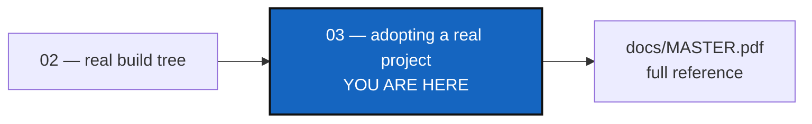

# Tutorial 3 of 3 — Adopting a Real Project: CaWaQS-Viz

*Created: 2026-09-02*

## Abstract — read this first

**What this document is.** One real, tested, end-to-end procedure for
bringing an existing project — **`cawaqsviz`**
(<https://gitlab.com/cawaqs/gviz/cawaqsviz>), which has no `.cgs` of its
own and still uses git submodules — under ComplexGitSync: clone it, adopt
the whole tree with one command, and commit/push the result. Four
repositories on two levels, because one of `cawaqsviz`'s submodules has a
submodule of its own.

**Why it exists.** Tutorials 1 and 2 hand-author a `.cgs` from scratch for
a project you already fully understand. This one instead starts from a
real project you don't control the source of and walks every step in the
order you'd actually run them — no branching "modes" to choose between,
one path, verified against the live repositories.

**What you will find.** Seven steps: clone, check out the submodules,
adopt the tree with `init-from-submodules`, then `branch`, `checkout`,
`add`/`commit`, and `push`/`freeze-release`. Step 3 is three commands in
one; §3.1 opens it up and explains why their order cannot be changed.

**Who it is for.** Anyone adopting a real project that both lacks a `.cgs`
and still uses git submodules — the combination Tutorials 1 and 2 don't
cover, and the messiest of the three tutorials' starting points.

**What you need to do with it.** Read it after Tutorials 1 and 2. Follow
the steps in order — the directory-naming detail in step 1 is easy to get
wrong and is the one thing worth reading twice.



---

> **Every command below is a Pixi task.** Always run `pixi run cgitsync
> ...`, never a bare `cgitsync ...` — see the note in
> [Tutorial 1](01_first_multi_repo_workspace.md) if this is new to you.
> Every command runs from inside the ComplexGitSync clone (standalone
> mode) and takes an absolute path to `cawaqsviz` — never `cd` into
> `cawaqsviz` itself and run `cgitsync` from there.

> **`cgitsync` works with public projects only.** No credentials or tokens
> are stored; authentication relies entirely on the ambient environment
> (`ssh-agent`, an HTTPS credential helper, etc.).

`cawaqsviz` is a GitLab project made of four git repositories on two
levels. The root, `cawaqs/gviz/cawaqsviz`, has two GitHub children tracked
as git submodules. One of those children,
`HydrologicalTwinAlphaSeries`, holds a submodule of its own:

```
cawaqsviz  (GitLab: cawaqs/gviz/cawaqsviz, root)
  ├── HydrologicalTwinAlphaSeries  (GitHub submodule, at external/HydrologicalTwinAlphaSeries)
  │     └── hydrological_twin      (GitHub submodule, at docs/hydrological_twin)
  └── user_guide_CaWaQS-Viz        (GitHub submodule, at docs/CWV_user_guide)
```

`HydrologicalTwinAlphaSeries` is therefore a **parent**, not a leaf: it
contains another repository. That second level is what the `--recursive`
flags below are for, and the reason a tree like this is worth a tutorial
of its own.

Set up a working directory for the examples below (any empty parent
directory works):

```bash
export WORK=/home/user/work
mkdir -p "$WORK"
```

---

## 1. Clone the project

**Name the clone directory `cawaqsviz` — not `cawaqsviz-scan`, not
anything else.** Step 3 derives the project name from the root
repository's identifier (`cawaqs/gviz/cawaqsviz` → `cawaqsviz`), not from
the directory name, and then resolves the workspace root as
`<parent>/<project name>` — so a directory named anything else sends it
looking for a sibling that doesn't exist. It refuses up front and tells
you to rename, but naming it right from the start saves the round trip:

```bash
git clone https://gitlab.com/cawaqs/gviz/cawaqsviz.git "$WORK/cawaqsviz"
```

## 2. Update the submodules

```bash
cd "$WORK/cawaqsviz"
git submodule update --init --recursive
```

`--recursive` matters here. Without it git checks out the two direct
submodules and stops, leaving `hydrological_twin` an empty directory
inside `HydrologicalTwinAlphaSeries`. `discover` reads the filesystem, so
a repository that is not checked out is a repository it cannot find.

> **If this prompts for a GitHub username/password and then fails with
> `error: RPC failed; HTTP 401` / `expected flush after ref listing`:**
> the submodules are genuinely public repositories, but GitHub can still
> `401` the anonymous object-fetch a real clone needs. The reliable fix is
> to authenticate the request. If you already have an SSH key registered
> with GitHub (check with `ssh -T git@github.com`), rewrite the submodule
> URLs to SSH for this clone only:
> ```bash
> git -c url."git@github.com:".insteadOf="https://github.com/" submodule update --init --recursive
> ```
> Otherwise, create a GitHub [personal access
> token](https://github.com/settings/tokens) and use it as the password
> when prompted — GitHub dropped account-password auth for git operations
> in 2021.

Back at the ComplexGitSync clone for every command from here on:

```bash
cd /path/to/ComplexGitSync
```

## 3. Adopt the tree with `init-from-submodules`

One command does the whole adoption: draft the `.cgs`, build the tree,
and convert every submodule at both levels.

```bash
pixi run cgitsync init-from-submodules "$WORK/cawaqsviz" --dry-run   # show the plan
pixi run cgitsync init-from-submodules "$WORK/cawaqsviz"             # do it
```

The dry run prints what it found and what it would convert, touching
nothing:

```
Found 4 git repository(ies) under /home/user/work/cawaqsviz
project name: cawaqsviz

Dry run — nothing written, cloned, or converted.
  would write:  /home/user/work/cawaqsviz/cawaqsviz.cgs
  would adopt:  /home/user/work/cawaqsviz (CGSHOME)
  would convert 3 submodule(s):
    - docs/CWV_user_guide  (declared in .gitmodules)
    - external/HydrologicalTwinAlphaSeries  (declared in .gitmodules)
    - external/HydrologicalTwinAlphaSeries/docs/hydrological_twin  (declared in external/HydrologicalTwinAlphaSeries/.gitmodules)
```

Two things to read here. Every path is counted from the directory you
pointed the command at, and `declared in` names the `.gitmodules` file it
came from — which matters, because the root also has a child at
`docs/CWV_user_guide`, so two of the three submodules are called `docs/...`
by their own repository. And `hydrological_twin` is found at all only
because it is four directories down and the scan goes five deep by
default: **do not pass `--max-depth 3`**, which stops just above it.
Whenever a depth does cut the walk short, the command says so in a warning
rather than presenting a partial answer as a complete one.

The real run ends at a `READY` tree:

```
.cgs written to: /home/user/work/cawaqsviz/cawaqsviz.cgs
CGSHOME: /home/user/work/cawaqsviz
Converted 3 submodule(s) to plain nested clones:
  ✓ docs/CWV_user_guide  (docs/CWV_user_guide)
  ✓ external/HydrologicalTwinAlphaSeries  (external/HydrologicalTwinAlphaSeries)
  ✓ docs/hydrological_twin  (external/HydrologicalTwinAlphaSeries/docs/hydrological_twin)
repos:
cawaqsviz (project)
├── HydrologicalTwinAlphaSeries (parent)
│   └── hydrological_twin (leaf)
└── user_guide_CaWaQS-Viz (leaf)

The conversion is staged but not committed. Review it, then:
  export CGSHOME=/home/user/work/cawaqsviz
  cgitsync branch <name> && cgitsync checkout <name>
  cgitsync add && cgitsync commit "<message>"
```

`HydrologicalTwinAlphaSeries (parent)` with `hydrological_twin` under it is
the whole point of the two levels: `cgitsync` now knows which repository
holds which. That is what keeps `docs/hydrological_twin` in
`HydrologicalTwinAlphaSeries`' own `.gitignore`, and therefore out of its
index. Without it, the next `cgitsync add` would quietly turn the nested
clone back into a submodule and undo the conversion.

Set `CGSHOME` as the output tells you; every command from here on resolves
the workspace automatically:

```bash
export CGSHOME="$WORK/cawaqsviz"
pixi run cgitsync status
```

### 3.1 What it runs underneath, and why the order is fixed

`init-from-submodules` is three commands you can also run by hand:

```bash
pixi run cgitsync discover "$WORK/cawaqsviz" --write "$WORK/cawaqsviz/cawaqsviz.cgs"
pixi run cgitsync initialise "$WORK/cawaqsviz/cawaqsviz.cgs" --output-path "$WORK"
pixi run cgitsync import-submodules "$WORK/cawaqsviz" --recursive --apply
```

1. **`discover`** reads the filesystem and drafts the `.cgs`. It sees
   `hydrological_twin` sitting *inside* `HydrologicalTwinAlphaSeries` and
   drafts it as that repository's child, not the root's. Only what is
   checked out can be found — which is what step 2 was for.
2. **`initialise`** *adopts* the root already on disk at
   `CGSHOME = --output-path/<project-name>` in place, without touching it,
   and clones everything else. `--output-path "$WORK"` plus
   `project = "cawaqsviz"` from the `.cgs` is what resolves `CGSHOME` to
   the exact `$WORK/cawaqsviz` already there; a directory named anything
   else would send it looking for a sibling that doesn't exist. That is the
   step-1 naming rule, and `init-from-submodules` checks it up front rather
   than letting `initialise` fail halfway.
3. **`import-submodules --recursive --apply`** turns each submodule's
   gitlink into a plain, independent clone: `git rm --cached <path>`,
   remove its `.gitmodules` stanza (deleting the file once every stanza is
   gone), and append `<path>` to that repository's own `.gitignore`.
   `--recursive` is what reaches the second level; without it,
   `HydrologicalTwinAlphaSeries` would keep its own `.gitmodules`.

> **The conversion has to come last, and cannot be moved.** `initialise`
> adopts the root in place but **deletes and re-clones every other
> repository** straight from its remote — and those remotes still use
> submodules, since the conversion is a local, uncommitted change. Convert
> first and `HydrologicalTwinAlphaSeries` comes back from GitHub with its
> `.gitmodules` and its gitlink intact: a half-converted tree that looks
> finished. Running `import-submodules` again afterwards does **not** fix
> it either — the recursive walk follows the submodule graph declared by
> the *root's* `.gitmodules`, which the first pass deleted, so it reports
> "nothing to import" and never reaches the second level.

> **Why not `bootstrap`?** `bootstrap` always clones the *whole* tree
> fresh, root included, into an empty destination — pointed at
> `$WORK/cawaqsviz`, which already has content from steps 1–2, it fails
> outright with `Clone destination already exists and is not empty`. Worse,
> pointed anywhere else it would clone the root fresh from GitLab, and you
> would be adopting a copy rather than the checkout in front of you.

## 4. Branch

```bash
pixi run cgitsync branch retire-submodules
```

Creates a purely local branch across the whole tree — nothing pushed yet.

## 5. Checkout

```bash
pixi run cgitsync checkout retire-submodules
```

## 6. Stage and commit

```bash
pixi run cgitsync add
pixi run cgitsync commit "chore: retire git submodules in favour of ComplexGitSync"
```

Two repositories have something to commit, because step 3 converted
submodules at two levels. Both hold the same kind of change: the staged
`.gitmodules` removal, the dropped gitlinks, and the new `.gitignore`.

```
$ git -C "$WORK/cawaqsviz" status --porcelain
D  .gitmodules
D  docs/CWV_user_guide
D  external/HydrologicalTwinAlphaSeries
?? .gitignore
?? cawaqsviz.cgs

$ git -C "$WORK/cawaqsviz/external/HydrologicalTwinAlphaSeries" status --porcelain
D  .gitmodules
D  docs/hydrological_twin
?? .gitignore
```

`hydrological_twin` and `CWV_user_guide` are unchanged, so they have
nothing to stage.

The root also has the `.cgs` step 3 wrote, still untracked. `add` stages it
along with the rest, which is what you want: from this commit on, the
project carries its own topology description, and anyone can rebuild the
tree from it with `initialise` alone. The new `.gitignore` next to it holds
`.cgitsync/` and `cawaqsviz.lgr` — ComplexGitSync's own generated state,
which stays out of the repository — plus one line per child repository.

`HydrologicalTwinAlphaSeries` is a repository you may not own. Its half of
this commit lands on *its* remote, not on `cawaqsviz`'s — see the live
migration note in step 7 before pushing.

## 7. Push, or freeze a release

```bash
pixi run cgitsync push
```

`branch`+`checkout` created a purely local branch with no upstream yet;
`push` publishes it, the same way `git push -u` would.

> **If `push` fails with `could not read Username` / `terminal prompts
> disabled` (or, on an older `cgitsync` build, hangs until you `Ctrl+C`
> it):** the root was cloned over HTTPS in step 1, and pushing needs write
> credentials that plain HTTPS anonymous access doesn't have. `push` prints
> this exact fix itself the moment it hits the failure — `hint: this looks
> like an HTTPS authentication failure — pass --force-protocol ssh to
> 'push' if you have an SSH key registered with the provider, or configure
> an HTTPS credential helper otherwise.` Follow it:
> ```bash
> pixi run cgitsync push --force-protocol ssh
> ```
> (only if you have an SSH key registered with GitLab — check with `ssh -T
> git@gitlab.com`; otherwise, a GitLab [personal access
> token](https://gitlab.com/-/user_settings/personal_access_tokens) used
> as the HTTPS password works too.) `--force-protocol` persists the
> rewrite, so it applies to every command after this one too — no need to
> repeat the flag on `freeze-release` below.

For a versioned snapshot instead of a plain push, use the minimalist
cycle:

```bash
pixi run cgitsync freeze-release retire-submodules-v1 "retire git submodules"
```

`freeze-release` (`add → commit → pull → push → freeze`) skips the `pull`
step when the current branch has no upstream — there is nothing to pull
for a branch that was never published — so no manual `push` beforehand is
needed either way.

> **Live migration note:** pushing `import-submodules`' conversion to the
> real `cawaqsviz` project on GitLab is a visible, permanent change to a
> shared repository. Open a merge request for maintainer review rather
> than pushing straight to `main`.

---

## 8. Summary

| Step | Command | Description |
|------|---------|-------------|
| 1 | `git clone .../cawaqsviz.git "$WORK/cawaqsviz"` | Clone, named to match the project name `discover` will derive |
| 2 | `git submodule update --init --recursive` | Check out all three submodules, both levels |
| 3 | `pixi run cgitsync init-from-submodules "$WORK/cawaqsviz"` | Draft the `.cgs`, adopt the root in place, clone the rest, convert every submodule |
| 4 | `pixi run cgitsync branch retire-submodules` | Create a local branch |
| 5 | `pixi run cgitsync checkout retire-submodules` | Switch to it |
| 6 | `pixi run cgitsync add` / `commit "..."` | Stage and commit the conversion |
| 7 | `pixi run cgitsync push` (or `freeze-release NAME MSG`) | Publish the branch, or cut a versioned release |

If your own project already has a `.cgs`, or you'd rather write one by
hand than let step 3 draft it, pass it with `--cgs FILE` — the rest of the
sequence is unchanged. See `examples/cawaqsviz.cgs` in this repository for
a worked, hand-authored example of the same topology, and
[Tutorial 2](02_onboarding_a_real_build_tree.md) for the habits behind it.
