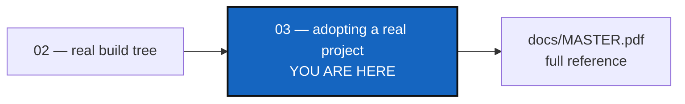

# Tutorial 3 of 3 — Adopting a Real Project: CaWaQS-Viz

*Created: 2026-09-02*

## Abstract — read this first

**What this document is.** One real, tested, end-to-end procedure for
bringing an existing project — **`cawaqsviz`**
(<https://gitlab.com/cawaqs/gviz/cawaqsviz>), which has no `.cgs` of its
own and still uses git submodules — under ComplexGitSync: clone it,
convert its submodules to plain clones, draft and check a `.cgs`, reach a
`READY` tree, and commit/push the result. Four repositories on two
levels, because one of `cawaqsviz`'s submodules has a submodule of its
own.

**Why it exists.** Tutorials 1 and 2 hand-author a `.cgs` from scratch for
a project you already fully understand. This one instead starts from a
real project you don't control the source of and walks every step in the
order you'd actually run them — no branching "modes" to choose between,
one path, verified against the live repositories.

**What you will find.** Ten steps, in order: clone, convert submodules,
`discover`, `import-submodules`, reach `READY` with `initialise` (**not**
`bootstrap` — the section below explains exactly why, and the directory
naming that makes it work), `branch`, `checkout`, `add`, `commit`, and
`push`/`freeze-release`. Each step shows the exact command and real output.

**Who it is for.** Anyone adopting a real project that both lacks a `.cgs`
and still uses git submodules — the combination Tutorials 1 and 2 don't
cover, and the messiest of the three tutorials' starting points.

**What you need to do with it.** Read it after Tutorials 1 and 2. Follow
the steps in order — the directory-naming detail in step 5 is easy to get
wrong and is the one thing worth reading twice.



---

> **Every command below is a Pixi task.** Always run `pixi run cgitsync
> ...`, never a bare `cgitsync ...` — see the note in
> [Tutorial 1](01_first_multi_repo_workspace.md) if this is new to you.
> Every command runs from inside the ComplexGitSync clone (standalone
> mode) and takes an absolute path to `cawaqsviz` — never `cd` into
> `cawaqsviz` itself and run `cgitsync` from there.

> **`cgitsync` works with public projects only.** No credentials or tokens
> are stored; authentication relies entirely on the ambient environment
> (`ssh-agent`, an HTTPS credential helper, etc.).

`cawaqsviz` is a GitLab project made of four git repositories on two
levels. The root, `cawaqs/gviz/cawaqsviz`, has two GitHub children tracked
as git submodules. One of those children,
`HydrologicalTwinAlphaSeries`, holds a submodule of its own:

```
cawaqsviz  (GitLab: cawaqs/gviz/cawaqsviz, root)
  ├── HydrologicalTwinAlphaSeries  (GitHub submodule, at external/HydrologicalTwinAlphaSeries)
  │     └── hydrological_twin      (GitHub submodule, at docs/hydrological_twin)
  └── user_guide_CaWaQS-Viz        (GitHub submodule, at docs/CWV_user_guide)
```

`HydrologicalTwinAlphaSeries` is therefore a **parent**, not a leaf: it
contains another repository. That second level is why every command below
is run with `--recursive`.

Set up a working directory for the examples below (any empty parent
directory works):

```bash
export WORK=/home/user/work
mkdir -p "$WORK"
```

---

## 1. Clone the project

**Name the clone directory `cawaqsviz` — not `cawaqsviz-scan`, not
anything else.** `discover` (step 3) derives the project name from the
root repository's identifier (`cawaqs/gviz/cawaqsviz` → `cawaqsviz`), not
from the directory name — but `initialise` (step 5) later needs the
directory to already be named exactly that, or it will try to place the
tree somewhere else. Naming it right from the start avoids a rename later:

```bash
git clone https://gitlab.com/cawaqs/gviz/cawaqsviz.git "$WORK/cawaqsviz"
```

## 2. Update the submodules

```bash
cd "$WORK/cawaqsviz"
git submodule update --init --recursive
```

`--recursive` matters here. Without it git checks out the two direct
submodules and stops, leaving `hydrological_twin` an empty directory
inside `HydrologicalTwinAlphaSeries`. `discover` reads the filesystem, so
a repository that is not checked out is a repository it cannot find.

> **If this prompts for a GitHub username/password and then fails with
> `error: RPC failed; HTTP 401` / `expected flush after ref listing`:**
> the submodules are genuinely public repositories, but GitHub can still
> `401` the anonymous object-fetch a real clone needs. The reliable fix is
> to authenticate the request. If you already have an SSH key registered
> with GitHub (check with `ssh -T git@github.com`), rewrite the submodule
> URLs to SSH for this clone only:
> ```bash
> git -c url."git@github.com:".insteadOf="https://github.com/" submodule update --init --recursive
> ```
> Otherwise, create a GitHub [personal access
> token](https://github.com/settings/tokens) and use it as the password
> when prompted — GitHub dropped account-password auth for git operations
> in 2021.

Back at the ComplexGitSync clone for every command from here on:

```bash
cd /path/to/ComplexGitSync
```

## 3. Draft a `.cgs` with `discover`

```bash
pixi run cgitsync discover "$WORK/cawaqsviz"
```

```
Found 4 git repository(ies) under /home/user/work/cawaqsviz
proposed project name: cawaqsviz

  - .
      remote: https://gitlab.com/cawaqs/gviz/cawaqsviz.git
      id:     gitlab:cawaqs/gviz/cawaqsviz
      branch: main
      nested: auto (no .cgs of its own)

  - docs/CWV_user_guide
      remote: https://github.com/flipoyo/user_guide_CaWaQS-Viz
      id:     github:flipoyo/user_guide_CaWaQS-Viz
      branch: (detached)
      nested: auto (no .cgs of its own)

  - external/HydrologicalTwinAlphaSeries
      remote: https://github.com/flipoyo/HydrologicalTwinAlphaSeries.git
      id:     github:flipoyo/HydrologicalTwinAlphaSeries
      branch: (detached)
      nested: auto (no .cgs of its own)

  - external/HydrologicalTwinAlphaSeries/docs/hydrological_twin
      remote: https://github.com/flipoyo/hydrological_twin
      id:     github:flipoyo/hydrological_twin
      branch: (detached)
      nested: auto (no .cgs of its own)
      inside: external/HydrologicalTwinAlphaSeries

tree:
  cawaqsviz (project)
    CWV_user_guide (leaf)
    HydrologicalTwinAlphaSeries (parent)
      hydrological_twin (leaf)

Dry run — pass --write FILE to save this draft as a .cgs.
```

Three things to read here:

- `proposed project name: cawaqsviz` — matching the directory name chosen
  in step 1 is exactly what makes step 5 work.
- `inside: external/HydrologicalTwinAlphaSeries` on the last repository,
  and `(parent)` in the tree. `discover` saw that one repository sits
  inside another, and the tree it prints is the tree it will draft.
- **Do not pass `--max-depth 3`.** `hydrological_twin` is four directories
  down (`external`, `HydrologicalTwinAlphaSeries`, `docs`,
  `hydrological_twin`), so a depth of 3 stops just above it. The default
  is 5. Whenever a depth does cut the walk short, `discover` says so in a
  warning rather than presenting a partial answer as a complete one.

Satisfied with the report, save and check it:

```bash
pixi run cgitsync discover "$WORK/cawaqsviz" --write "$WORK/cawaqsviz/cawaqsviz-discovered.cgs"
pixi run cgitsync validate "$WORK/cawaqsviz/cawaqsviz-discovered.cgs"
```

## 4. Convert the submodules with `import-submodules`

```bash
pixi run cgitsync import-submodules "$WORK/cawaqsviz" --recursive          # dry run
pixi run cgitsync import-submodules "$WORK/cawaqsviz" --recursive --apply  # convert
```

The dry run names all three submodules, and says which repository each one
was declared in:

```
Dry run — 3 submodule(s) under /home/user/work/cawaqsviz
Pass --apply to perform the conversion.

  submodule: external/HydrologicalTwinAlphaSeries
    path:        external/HydrologicalTwinAlphaSeries
    declared in: .gitmodules
    ...

  submodule: docs/hydrological_twin
    path:        external/HydrologicalTwinAlphaSeries/docs/hydrological_twin
    declared in: external/HydrologicalTwinAlphaSeries/.gitmodules
    ...
```

Every `path` is counted from the directory you pointed the command at, and
`declared in` names the `.gitmodules` file it came from. That matters here:
the root also has a child at `docs/CWV_user_guide`, so two of the three
submodules are called `docs/...` by their own repository.

`--recursive` is what reaches the second level. Without it the command
reads `$WORK/cawaqsviz/.gitmodules` and nothing else, so
`hydrological_twin` keeps its gitlink and
`HydrologicalTwinAlphaSeries` keeps its `.gitmodules` — a half-converted
tree.

This is the only thing `import-submodules` does: turn each submodule's
gitlink into a plain, independent clone — `git rm --cached <path>`,
remove its `.gitmodules` stanza (deleting the file once every stanza is
gone), and append `<path>` to that repository's own `.gitignore`. It does
**not** also write a `.cgs` — `.gitmodules` never records the root's own
identity, so any `.cgs` built from it alone would be missing the root
entry, and step 3 already produced a complete one. Running `discover`
again here would report the same four repositories, now with plain clones
instead of submodules.

Review and commit later, once the tree is `READY` (step 9) — don't commit
yet.

## 5. Reach `READY` with `initialise` — not `bootstrap`

```bash
pixi run cgitsync initialise "$WORK/cawaqsviz/cawaqsviz-discovered.cgs" --output-path "$WORK"
```

```
READY ready=true complete=true gittree_created=true gittree_active=true root=/home/user/work/cawaqsviz
tree:
cawaqsviz (project)
├── HydrologicalTwinAlphaSeries (parent)
│   └── hydrological_twin (leaf)
└── user_guide_CaWaQS-Viz (leaf)
```

`HydrologicalTwinAlphaSeries (parent)` with `hydrological_twin` under it is
the whole point of the two levels: `cgitsync` now knows which repository
holds which. That is what keeps `docs/hydrological_twin` in
`HydrologicalTwinAlphaSeries`' own `.gitignore`, and therefore out of its
index. Without it, the next `cgitsync add` would quietly turn the nested
clone back into a submodule and undo step 4.

**Why `initialise` and not `bootstrap`, and why the directory name in step
1 matters:** `bootstrap` always clones the *whole* tree fresh, root
included, into an empty destination — pointed at `$WORK/cawaqsviz`, which
already has content from steps 1–4, it fails outright with `Clone
destination already exists and is not empty`. Worse, if pointed anywhere
else, it would clone the root fresh from GitLab — which still has the
submodules, since step 4's conversion is a local, uncommitted change not
yet pushed — silently undoing the whole tutorial.

`initialise` instead *adopts* the root already on disk at
`CGSHOME = --output-path/<project-name>` in place, without touching it —
exactly the local, converted `cawaqsviz` from step 4 — and only clones
what's still `DECLARED`: the three other repositories. `--output-path
"$WORK"` plus `project = "cawaqsviz"` from the `.cgs` is what resolves
`CGSHOME` to the exact `$WORK/cawaqsviz` already on disk; a directory
named anything else would make `initialise` look for a sibling that
doesn't exist. Those three get deleted and re-cloned fresh in the process
— harmless, since `import-submodules` never touched their own content,
only each holding repository's index, `.gitmodules`, and `.gitignore`.
`HydrologicalTwinAlphaSeries` is cloned before the repository that sits
inside it, so nothing is cloned into a directory that is about to be
replaced.

From here on, every command below resolves the workspace automatically:

```bash
export CGSHOME="$WORK/cawaqsviz"
pixi run cgitsync status
```

## 6. Branch

```bash
pixi run cgitsync branch retire-submodules
```

Creates a purely local branch across the whole tree — nothing pushed yet.

## 7. Checkout

```bash
pixi run cgitsync checkout retire-submodules
```

## 8. Stage and commit

```bash
pixi run cgitsync add
pixi run cgitsync commit "chore: retire git submodules in favour of ComplexGitSync"
```

Two repositories have something to commit, because step 4 converted
submodules at two levels. Both hold the same kind of change: the staged
`.gitmodules` removal, the dropped gitlinks, and the new `.gitignore`.

```
$ git -C "$WORK/cawaqsviz" status --porcelain
D  .gitmodules
D  docs/CWV_user_guide
D  external/HydrologicalTwinAlphaSeries
?? .gitignore

$ git -C "$WORK/cawaqsviz/external/HydrologicalTwinAlphaSeries" status --porcelain
D  .gitmodules
D  docs/hydrological_twin
?? .gitignore
```

`hydrological_twin` and `CWV_user_guide` are unchanged, so they have
nothing to stage.

`HydrologicalTwinAlphaSeries` is a repository you may not own. Its half of
this commit lands on *its* remote, not on `cawaqsviz`'s — see the live
migration note in step 9 before pushing.

## 9. Push, or freeze a release

```bash
pixi run cgitsync push
```

`branch`+`checkout` created a purely local branch with no upstream yet;
`push` publishes it, the same way `git push -u` would.

> **If `push` fails with `could not read Username` / `terminal prompts
> disabled` (or, on an older `cgitsync` build, hangs until you `Ctrl+C`
> it):** the root was cloned over HTTPS in step 1, and pushing needs write
> credentials that plain HTTPS anonymous access doesn't have. `push` prints
> this exact fix itself the moment it hits the failure — `hint: this looks
> like an HTTPS authentication failure — pass --force-protocol ssh to
> 'push' if you have an SSH key registered with the provider, or configure
> an HTTPS credential helper otherwise.` Follow it:
> ```bash
> pixi run cgitsync push --force-protocol ssh
> ```
> (only if you have an SSH key registered with GitLab — check with `ssh -T
> git@gitlab.com`; otherwise, a GitLab [personal access
> token](https://gitlab.com/-/user_settings/personal_access_tokens) used
> as the HTTPS password works too.) `--force-protocol` persists the
> rewrite, so it applies to every command after this one too — no need to
> repeat the flag on `freeze-release` below.

For a versioned snapshot instead of a plain push, use the minimalist
cycle:

```bash
pixi run cgitsync freeze-release retire-submodules-v1 "retire git submodules"
```

`freeze-release` (`add → commit → pull → push → freeze`) skips the `pull`
step when the current branch has no upstream — there is nothing to pull
for a branch that was never published — so no manual `push` beforehand is
needed either way.

> **Live migration note:** pushing `import-submodules`' conversion to the
> real `cawaqsviz` project on GitLab is a visible, permanent change to a
> shared repository. Open a merge request for maintainer review rather
> than pushing straight to `main`.

---

## 10. Summary

| Step | Command | Description |
|------|---------|-------------|
| 1 | `git clone .../cawaqsviz.git "$WORK/cawaqsviz"` | Clone, named to match the project name `discover` will derive |
| 2 | `git submodule update --init --recursive` | Check out all three submodules, both levels |
| 3 | `pixi run cgitsync discover "$WORK/cawaqsviz" --write ...` | Draft and save a `.cgs` |
| 4 | `pixi run cgitsync import-submodules "$WORK/cawaqsviz" --recursive --apply` | Convert submodule gitlinks to plain clones, both levels |
| 5 | `pixi run cgitsync initialise ... --output-path "$WORK"` | Adopt the root in place, clone the rest, reach `READY` |
| 6 | `pixi run cgitsync branch retire-submodules` | Create a local branch |
| 7 | `pixi run cgitsync checkout retire-submodules` | Switch to it |
| 8 | `pixi run cgitsync add` / `commit "..."` | Stage and commit the conversion |
| 9 | `pixi run cgitsync push` (or `freeze-release NAME MSG`) | Publish the branch, or cut a versioned release |

If your own project already has a `.cgs`, or you'd rather write one by
hand than run `discover`, see `examples/cawaqsviz.cgs` in this repository
for a worked, hand-authored example of the same topology, and
[Tutorial 2](02_onboarding_a_real_build_tree.md) for the habits behind it.
