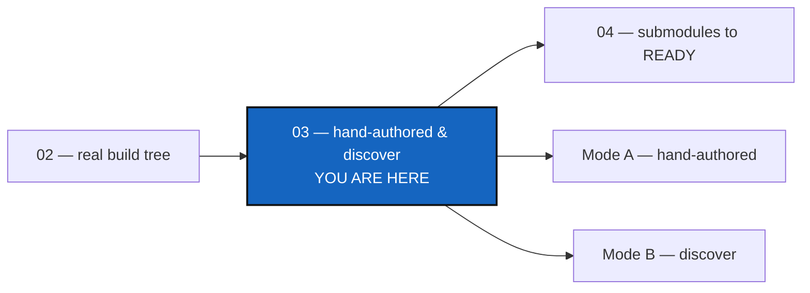

# Tutorial 3 of 4 — Configuration Discovery Modes

*Created: 2026-08-25*

## Abstract — read this first

**What this document is.** Two of the three ways to reach a working
`.cgs` for a real project that has none of its own upstream: writing one
by hand (Mode A), and deriving one from an existing checkout with
`discover` (Mode B). Both use the same real project, `cawaqsviz`.

**Why it exists.** Tutorials 1 and 2 both hand-author a `.cgs` from
scratch. Most real projects instead already have a checkout on disk —
`discover` reads that checkout instead of asking you to type the topology
by hand.

**What you will find.** The `cawaqsviz` topology, Mode A (by hand), and
Mode B (`discover`), including a troubleshooting note for a GitHub
anonymous-clone quirk you may hit along the way.

**Who it is for.** Anyone onboarding a real project that has no `.cgs`
yet, either writing one by hand or starting from a checkout already on
disk. If the project instead already uses git submodules, skip ahead to
[Tutorial 4](04_submodules_to_ready.md).

**What you need to do with it.** Read it after Tutorials 1 and 2. Read
Mode A first even if you plan to use Mode B — it defines the topology Mode
B's output is checked against.



---

Tutorials [1](01_first_multi_repo_workspace.md) and
[2](02_onboarding_a_real_build_tree.md) both hand-author a `.cgs` from
scratch. This one covers the opposite case: a real project,
**`cawaqsviz`** (<https://gitlab.com/cawaqs/gviz/cawaqsviz>), that has **no**
`.cgs` of its own anywhere upstream.

There are three ways to reach a working `.cgs` for a project like this.
This tutorial covers the first two:

| Mode | Starting point | Command |
|---|---|---|
| A — hand-authored | Read the project's topology yourself, write the `.cgs` by hand | none (a text editor) |
| B — `discover` | A checkout already exists on disk | `pixi run cgitsync discover` |

The third way, migrating from existing git submodules with
`import-submodules`, is [Tutorial 4](04_submodules_to_ready.md) —
along with what to do next with any of the three: taking the resulting
`.cgs` to a real, `READY` tree.

These are not different projects — they are different *starting points*
for the same one, so this tutorial (and the next) can demonstrate every
route without inventing a fourth toy topology. Read Mode A first
regardless of which one you'll actually use: it establishes the topology
every other mode is checked against.

> **Every command below is a Pixi task.** Always run `pixi run cgitsync
> ...`, never a bare `cgitsync ...` — see the note in
> [Tutorial 1](01_first_multi_repo_workspace.md) if this is new to you.

> **`cgitsync` works with public projects only.** No credentials or tokens
> are stored; authentication relies entirely on the ambient environment
> (`ssh-agent`, an HTTPS credential helper, etc.). If any repository's
> upstream is private and the environment does not already have access, the
> subsequent `pixi run cgitsync initialise`/`bootstrap`/`pull` will fail at
> the clone step — this applies to both modes below, and to Tutorial 4.

---

## 1. Topology

`cawaqsviz` is a GitLab project nested three path segments deep
(`cawaqs/gviz/cawaqsviz` — a subgroup, not a plain `owner/repository`
pair), with two GitHub children mounted at non-default paths:

```
CaWaQS-Viz  (GitLab: cawaqs/gviz/cawaqsviz, root, mounted at ".")
  ├── HydrologicalTwinAlphaSeries  (GitHub, at external/HydrologicalTwinAlphaSeries)
  └── user_guide_CaWaQS-Viz        (GitHub, at docs/CWV_user_guide)
```

Neither child has a `.cgs` of its own — no override is needed for that: the
default `nested_config = "auto"` already resolves a repository with zero
nested `*.cgs` matches as a normal leaf. (See
`AgentSpec/Onboarding_DevPlanTicket.md` Phase 1 for the topology corrections
this file needed in a different area — a nonexistent repository identifier
and an invalid `default_branch`.)

---

## 2. Mode A — write it by hand

The most explicit route, and the most error-prone: read the project's own
`.gitmodules` and topology, then author the `.cgs` directly.

```toml
# examples/cawaqsviz.cgs
project = { name = "CaWaQS-Viz", default_branch = "main" }

repos = [
    { repository = "gitlab:cawaqs/gviz/cawaqsviz", relative_path = ".", fallback_branch = "main" },
    { repository = "github:flipoyo/HydrologicalTwinAlphaSeries", relative_path = "external/HydrologicalTwinAlphaSeries", fallback_branch = "main" },
    { repository = "github:flipoyo/user_guide_CaWaQS-Viz", relative_path = "docs/CWV_user_guide", fallback_branch = "main" },
]
```

**Key lessons (avoid repeating these mistakes):**

1. **Always use `relative_path = "."` on the root repo** — do not rely on
   the name-matching auto-mount convention from Tutorial 1; it only works
   when the identifier's last segment is an exact string match for
   `project.name`, which is easy to get wrong on a real project.
2. **`relative_path` must mirror the actual submodule paths** declared in
   `.gitmodules`, not the bare repo name — this is exactly the field
   `discover` (Mode B) derives from the filesystem instead of typing.
3. **You do not need `nested_config` on a child with no `.cgs` of its
   own** — the default `"auto"` already resolves that as a normal leaf.
   Reserve an explicit `nested_config` for the cases that are still real:
   `"disabled"` when a repo does carry a `.cgs` you want to skip, or a
   named path when its nested `.cgs` isn't at the default location (a
   named path that doesn't exist there is still an error).

Run it the same way as Tutorial 1's Quickstart, but with `bootstrap` (see
the README's Standalone mode section), since this example doesn't require
`cgitsync` to be cloned inside the tree it manages:

```bash
pixi run cgitsync validate examples/cawaqsviz.cgs
pixi run cgitsync bootstrap examples/cawaqsviz.cgs cawaqsviz-demo
pixi run cgitsync view-tree --search-dir <path bootstrap printed>
```

`tests/integration/test_cgsi_topology.py::TestCloneAndLaunchReleaseLifecycle::
test_cawaqsviz_example_clones_into_corrected_nested_layout` exercises this
exact file (not a copy) against local bare-repo remotes in CI; it was also
run once against the real live repositories on 2026-08-25 and reached a
`READY` tree with both children at their correct nested paths.

---

## 3. Mode B — derive it with `discover`

The opposite route: start from nothing but a checkout, and let `cgitsync`
read the filesystem instead of writing the `.cgs` by hand. Prefer this
route whenever a checkout is already available — it cannot repeat Mode A's
hand-authoring mistakes, since `relative_path` falls out of the walk
directly instead of being typed.

```bash
# A plain clone leaves submodule paths empty; initialise them first so
# discover has something to find at those paths. --init only (not
# --recursive): the two direct children are all Mode A's topology needs —
# see the note below on why going deeper can pull in more than expected.
git clone https://gitlab.com/cawaqs/gviz/cawaqsviz cawaqsviz-scan
cd cawaqsviz-scan
git submodule update --init

# Dry run: report what discover sees, write nothing.
pixi run cgitsync discover . --max-depth 3
```

> **If `git submodule update` prompts for a GitHub username/password and
> then fails with `error: RPC failed; HTTP 401` / `expected flush after ref
> listing`:** both submodules are genuinely public repositories (verified
> via the GitHub API), but GitHub can still `401` the anonymous
> object-fetch request that a real clone needs, independent of Git's
> protocol version — only the lightweight ref-advertisement request is
> guaranteed to work anonymously. The reliable fix is to authenticate the
> request instead of relying on anonymous access. If you already have an
> SSH key registered with GitHub (check with `ssh -T git@github.com`),
> rewrite the submodule URLs to SSH for this clone only:
> ```bash
> git -c url."git@github.com:".insteadOf="https://github.com/" submodule update --init
> ```
> Otherwise, create a GitHub [personal access
> token](https://github.com/settings/tokens) and use it as the password
> when prompted — GitHub dropped account-password auth for git operations
> in 2021, which is what the plain `git submodule update --init` above was
> actually failing on. This is unrelated to `master.py`/
> `.cgitsync/master.toml` — that file only sets the commit *author
> identity* `cgitsync` uses for its own generated commits, never
> clone/fetch authentication.

Expected report (three repositories, no warnings):

```
Found 3 git repository(ies) under <path>
proposed project name: cawaqsviz

  - .
      remote: https://gitlab.com/cawaqs/gviz/cawaqsviz
      id:     gitlab:cawaqs/gviz/cawaqsviz
      branch: main
      nested: auto (no .cgs of its own)

  - docs/CWV_user_guide
      remote: https://github.com/flipoyo/user_guide_CaWaQS-Viz
      id:     github:flipoyo/user_guide_CaWaQS-Viz
      branch: (detached)
      nested: auto (no .cgs of its own)

  - external/HydrologicalTwinAlphaSeries
      remote: https://github.com/flipoyo/HydrologicalTwinAlphaSeries.git
      id:     github:flipoyo/HydrologicalTwinAlphaSeries
      branch: (detached)
      nested: auto (no .cgs of its own)

Dry run — pass --write FILE to save this draft as a .cgs.
```

> **Why `--init` and not `--init --recursive`:** `HydrologicalTwinAlphaSeries`
> has since grown its own nested submodule
> (`docs/hydrological_twin`) upstream. `--recursive` pulls that in too, and
> `discover` (which walks the filesystem for whatever is actually checked
> out) then reports 4 repositories instead of the 3 above — harmless, but
> it no longer matches Mode A's `examples/cawaqsviz.cgs`, which only knows
> about the two direct children. `cgitsync` itself never has this
> ambiguity: `initialise`/`bootstrap` follow `.cgs`-declared nesting only,
> never git submodules, recursively or otherwise.

Satisfied with the report, save the draft and check it:

```bash
pixi run cgitsync discover . --write cawaqsviz-discovered.cgs
pixi run cgitsync validate cawaqsviz-discovered.cgs
```

The draft reconstructs Mode A's file field-for-field: the root at
`relative_path = "."` and both children at their real submodule paths
rather than their bare repo names. `nested_config` is left unset on both
children (the `discover` report above shows they have no `.cgs` of their
own, but that's informational only — the default `"auto"` already resolves
cleanly either way, so `discover` writes no override for it).

`discover` is read-only and offline: it clones nothing, changes nothing,
and contacts no remote. It reports only what is **checked out at scan
time** — a repository cloned without `--recurse-submodules` leaves its
submodule paths as empty directories, and those are correctly not
reported. A repository with no `origin`, or whose remote is not a
recognised `provider:owner/repository`, is listed as a warning rather than
guessed at. Always review the draft before using it.

**Next:** [Tutorial 4 — Migrating git Submodules to a READY Tree](04_submodules_to_ready.md)
covers the third way to reach a `.cgs` (`import-submodules`, for a project
that already tracks its children as git submodules), and takes any of the
three resulting `.cgs` files the rest of the way to a working tree.
