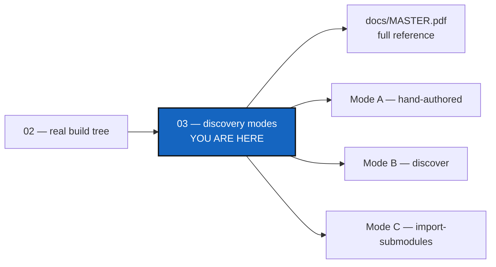

# Tutorial 3 of 3 — Configuration Discovery Modes

*Created: 2026-08-25*

## Abstract — read this first

**What this document is.** The third and most advanced of the three worked
tutorials in [`docs/tutorials/`](README.md): a real project, `cawaqsviz`,
that has no `.cgs` of its own anywhere upstream, reached three independent
ways — hand-authored, `discover`, and `import-submodules`.

**Why it exists.** Tutorials 1 and 2 both hand-author a `.cgs` from
scratch. Most real projects instead already have a checkout on disk or
already use git submodules — this tutorial covers both automated onboarding
paths, and when to reach for each.

**What you will find.** The `cawaqsviz` topology, Mode A (by hand), Mode B
(`discover`), Mode C (`import-submodules`, including a before/after and the
mechanics of the conversion), a throwaway-tree trial run, and a
which-mode-to-reach-for summary.

**Who it is for.** Anyone onboarding a real project that has no `.cgs` yet.
Read Mode A first regardless of which mode you'll actually use — it
establishes the topology the other two are checked against.

**What you need to do with it.** Read it after Tutorials 1 and 2, then pick
the mode matching your own project's situation (the root README's
Standalone section links back here per-case).



---

**The most advanced of the three tutorials.** Tutorials
[1](01_first_multi_repo_workspace.md) and
[2](02_onboarding_a_real_build_tree.md) both hand-author a `.cgs` from
scratch. This one covers the opposite situation: a real project,
**`cawaqsviz`** (<https://gitlab.com/cawaqs/gviz/cawaqsviz>), that has **no**
`.cgs` of its own anywhere upstream — and all three independent ways
`cgitsync` offers to arrive at a working one for it anyway:

| Mode | Starting point | Command |
|---|---|---|
| A — hand-authored | Read the project's topology yourself, write the `.cgs` by hand | none (a text editor) |
| B — `discover` | A checkout already exists on disk | `pixi run cgitsync discover` |
| C — `import-submodules` | The project already uses git submodules | `pixi run cgitsync import-submodules` |

These are not three different projects — they are three different *starting
points* for the same one, so this tutorial can demonstrate every route
without inventing a fourth toy topology. Read Mode A first regardless of
which one you'll actually use: it establishes the topology every other mode
is checked against.

> **Every command below is a Pixi task.** Always run `pixi run cgitsync
> ...`, never a bare `cgitsync ...` — see the note in
> [Tutorial 1](01_first_multi_repo_workspace.md) if this is new to you.

> **`cgitsync` works with public projects only.** No credentials or tokens
> are stored; authentication relies entirely on the ambient environment
> (`ssh-agent`, an HTTPS credential helper, etc.). If any repository's
> upstream is private and the environment does not already have access, the
> subsequent `pixi run cgitsync initialise`/`bootstrap`/`pull` will fail at
> the clone step — this applies to all three modes below.

---

## 1. Topology

`cawaqsviz` is a GitLab project nested three path segments deep
(`cawaqs/gviz/cawaqsviz` — a subgroup, not a plain `owner/repository`
pair), with two GitHub children mounted at non-default paths:

```
CaWaQS-Viz  (GitLab: cawaqs/gviz/cawaqsviz, root, mounted at ".")
  ├── HydrologicalTwinAlphaSeries  (GitHub, at external/HydrologicalTwinAlphaSeries)
  └── user_guide_CaWaQS-Viz        (GitHub, at docs/CWV_user_guide)
```

Neither child has a `.cgs` of its own — no override is needed for that: the
default `nested_config = "auto"` already resolves a repository with zero
nested `*.cgs` matches as a normal leaf. (See
`AgentSpec/Onboarding_DevPlanTicket.md` Phase 1 for the topology corrections
this file needed in a different area — a nonexistent repository identifier
and an invalid `default_branch`.)

---

## 2. Mode A — write it by hand

The most explicit route, and the most error-prone: read the project's own
`.gitmodules` and topology, then author the `.cgs` directly.

```toml
# examples/cawaqsviz.cgs
project = { name = "CaWaQS-Viz", default_branch = "main" }

repos = [
    { repository = "gitlab:cawaqs/gviz/cawaqsviz", relative_path = ".", fallback_branch = "main" },
    { repository = "github:flipoyo/HydrologicalTwinAlphaSeries", relative_path = "external/HydrologicalTwinAlphaSeries", fallback_branch = "main" },
    { repository = "github:flipoyo/user_guide_CaWaQS-Viz", relative_path = "docs/CWV_user_guide", fallback_branch = "main" },
]
```

**Key lessons (avoid repeating these mistakes):**

1. **Always use `relative_path = "."` on the root repo** — do not rely on
   the name-matching auto-mount convention from Tutorial 1; it only works
   when the identifier's last segment is an exact string match for
   `project.name`, which is easy to get wrong on a real project.
2. **`relative_path` must mirror the actual submodule paths** declared in
   `.gitmodules`, not the bare repo name — this is exactly the field
   `discover` (Mode B) derives from the filesystem instead of typing.
3. **You do not need `nested_config` on a child with no `.cgs` of its
   own** — the default `"auto"` already resolves that as a normal leaf.
   Reserve an explicit `nested_config` for the cases that are still real:
   `"disabled"` when a repo does carry a `.cgs` you want to skip, or a
   named path when its nested `.cgs` isn't at the default location (a
   named path that doesn't exist there is still an error).

Run it the same way as Tutorial 1's Quickstart, but with `bootstrap` (see
the README's Standalone mode section), since this example doesn't require
`cgitsync` to be cloned inside the tree it manages:

```bash
pixi run cgitsync validate examples/cawaqsviz.cgs
pixi run cgitsync bootstrap examples/cawaqsviz.cgs cawaqsviz-demo
pixi run cgitsync view-tree --search-dir <path bootstrap printed>
```

`tests/integration/test_cgsi_topology.py::TestCloneAndLaunchReleaseLifecycle::
test_cawaqsviz_example_clones_into_corrected_nested_layout` exercises this
exact file (not a copy) against local bare-repo remotes in CI; it was also
run once against the real live repositories on 2026-08-25 and reached a
`READY` tree with both children at their correct nested paths.

---

## 3. Mode B — derive it with `discover`

The opposite route: start from nothing but a checkout, and let `cgitsync`
read the filesystem instead of writing the `.cgs` by hand. Prefer this
route whenever a checkout is already available — it cannot repeat Mode A's
hand-authoring mistakes, since `relative_path` falls out of the walk
directly instead of being typed.

```bash
# A plain clone leaves submodule paths empty; initialise them first so
# discover has something to find at those paths. --init only (not
# --recursive): the two direct children are all Mode A's topology needs —
# see the note below on why going deeper can pull in more than expected.
git clone https://gitlab.com/cawaqs/gviz/cawaqsviz cawaqsviz-scan
cd cawaqsviz-scan
git submodule update --init

# Dry run: report what discover sees, write nothing.
pixi run cgitsync discover . --max-depth 3
```

> **If `git submodule update` prompts for a GitHub username/password and
> then fails with `error: RPC failed; HTTP 401` / `expected flush after ref
> listing`:** both submodules are genuinely public repositories (verified
> via the GitHub API), but GitHub can still `401` the anonymous
> object-fetch request that a real clone needs, independent of Git's
> protocol version — only the lightweight ref-advertisement request is
> guaranteed to work anonymously. The reliable fix is to authenticate the
> request instead of relying on anonymous access. If you already have an
> SSH key registered with GitHub (check with `ssh -T git@github.com`),
> rewrite the submodule URLs to SSH for this clone only:
> ```bash
> git -c url."git@github.com:".insteadOf="https://github.com/" submodule update --init
> ```
> Otherwise, create a GitHub [personal access
> token](https://github.com/settings/tokens) and use it as the password
> when prompted — GitHub dropped account-password auth for git operations
> in 2021, which is what the plain `git submodule update --init` above was
> actually failing on. This is unrelated to `master.py`/
> `.cgitsync/master.toml` — that file only sets the commit *author
> identity* `cgitsync` uses for its own generated commits, never
> clone/fetch authentication.

Expected report (three repositories, no warnings):

```
Found 3 git repository(ies) under <path>
proposed project name: cawaqsviz

  - .
      remote: https://gitlab.com/cawaqs/gviz/cawaqsviz
      id:     gitlab:cawaqs/gviz/cawaqsviz
      branch: main
      nested: auto (no .cgs of its own)

  - docs/CWV_user_guide
      remote: https://github.com/flipoyo/user_guide_CaWaQS-Viz
      id:     github:flipoyo/user_guide_CaWaQS-Viz
      branch: (detached)
      nested: auto (no .cgs of its own)

  - external/HydrologicalTwinAlphaSeries
      remote: https://github.com/flipoyo/HydrologicalTwinAlphaSeries.git
      id:     github:flipoyo/HydrologicalTwinAlphaSeries
      branch: (detached)
      nested: auto (no .cgs of its own)

Dry run — pass --write FILE to save this draft as a .cgs.
```

> **Why `--init` and not `--init --recursive`:** `HydrologicalTwinAlphaSeries`
> has since grown its own nested submodule
> (`docs/hydrological_twin`) upstream. `--recursive` pulls that in too, and
> `discover` (which walks the filesystem for whatever is actually checked
> out) then reports 4 repositories instead of the 3 above — harmless, but
> it no longer matches Mode A's `examples/cawaqsviz.cgs`, which only knows
> about the two direct children. `cgitsync` itself never has this
> ambiguity: `initialise`/`bootstrap` follow `.cgs`-declared nesting only,
> never git submodules, recursively or otherwise.

Satisfied with the report, save the draft and check it:

```bash
pixi run cgitsync discover . --write cawaqsviz-discovered.cgs
pixi run cgitsync validate cawaqsviz-discovered.cgs
```

The draft reconstructs Mode A's file field-for-field: the root at
`relative_path = "."` and both children at their real submodule paths
rather than their bare repo names. `nested_config` is left unset on both
children (the `discover` report above shows they have no `.cgs` of their
own, but that's informational only — the default `"auto"` already resolves
cleanly either way, so `discover` writes no override for it).

`discover` is read-only and offline: it clones nothing, changes nothing,
and contacts no remote. It reports only what is **checked out at scan
time** — a repository cloned without `--recurse-submodules` leaves its
submodule paths as empty directories, and those are correctly not
reported. A repository with no `origin`, or whose remote is not a
recognised `provider:owner/repository`, is listed as a warning rather than
guessed at. Always review the draft before using it.

---

## 4. Mode C — migrate it with `import-submodules`

The historical route: before either `.cgs` above existed, `cawaqsviz`
tracked both children as real git submodules
(`external/HydrologicalTwinAlphaSeries` and `docs/CWV_user_guide`).
`cgitsync`'s model is **plain independent clones** rather than gitlinks —
`import-submodules` converts an existing submodule setup to that model.

### 4.1 Before / after

```
cawaqsviz/          ← parent repo
  .gitmodules       ← declares two submodules
  external/
    HydrologicalTwinAlphaSeries/   ← gitlink today
  docs/
    CWV_user_guide/                ← gitlink today
```

| File / object | Before | After |
|---|---|---|
| Parent index | `160000` gitlink entries for both paths | No gitlink entries |
| `.gitmodules` | Declares two submodules | Deleted |
| `.gitignore` | May not mention child paths | Both paths appended |
| Child `.git` | Present (if already cloned) | Unchanged — no re-clone needed |

### 4.2 Dry run first (safe, no changes)

```bash
pixi run cgitsync import-submodules /path/to/cawaqsviz
```

Output:

```
Dry run — 2 submodule(s) in /path/to/cawaqsviz/.gitmodules
Pass --apply to perform the conversion.

  submodule: external/HydrologicalTwinAlphaSeries
    path:    external/HydrologicalTwinAlphaSeries
    url:     https://github.com/flipoyo/HydrologicalTwinAlphaSeries.git
    branch:  main

  submodule: docs/CWV_user_guide
    path:    docs/CWV_user_guide
    url:     https://github.com/flipoyo/user_guide_CaWaQS-Viz
    branch:  main
```

### 4.3 Apply the conversion

```bash
pixi run cgitsync import-submodules /path/to/cawaqsviz \
    --apply --output cawaqsviz_submodules.cgs
```

What happens under the hood, per submodule:

1. **Preflight** — `git status --porcelain` in the child directory must be
   empty. Dirty working trees are rejected immediately.
2. **`git rm --cached <path>`** — removes the gitlink from the parent's
   index; the child's working tree and `.git` directory are untouched.
3. **`.gitmodules` updated** — the submodule's stanza is removed. When all
   submodules are converted, `.gitmodules` is deleted and its removal is
   staged.
4. **`.gitignore` updated** — `<path>` is appended to the parent's
   `.gitignore`, using the same helper the `.gitignore` lifecycle sync
   uses elsewhere in `cgitsync`.
5. A `cawaqsviz_submodules.cgs` snippet is written with one `[[repos]]`
   entry per converted submodule.

After applying, review and commit the staged changes manually:

```bash
cd /path/to/cawaqsviz
git status            # shows: deleted .gitmodules, modified .gitignore, removed gitlinks
git commit -m "chore: retire git submodules in favour of ComplexGitSync"
```

> **Live migration note:** running `import-submodules --apply` against the
> real `cawaqsviz` GitLab project is a visible, permanent change to a shared
> repository. Build and test the tool against local fixtures first (see the
> automated test below), then open a pull/merge request on `cawaqsviz`
> itself for maintainer review before merging.

### 4.4 Automated test

`tests/integration/test_cgsi_topology.py::TestImportSubmodules::
test_import_submodules_converts_gitlinks_to_plain_clones` creates a local
bare "parent" repo with a real `git submodule add` of a local bare "child"
repo, runs `import_submodules(..., apply=True)`, and asserts the gitlink is
gone, the child's working tree is intact, `.gitignore` contains the child's
path, and the emitted `.cgs` validates.

### 4.5 Trying the output as a real, throwaway test tree

Any of the three modes above ends in a `.cgs` file — Mode A's
`examples/cawaqsviz.cgs`, Mode B's `cawaqsviz-discovered.cgs`, Mode C's
`cawaqsviz_submodules.cgs`. This section walks through what to actually do
with one of them next, using Mode C's output as the example: `initialise`
it as a real tree, `branch`+`checkout` onto a disposable test branch, and
run `freeze-release` on it.

```bash
pixi run cgitsync initialise cawaqsviz_submodules.cgs
pixi run cgitsync branch test-cgs
pixi run cgitsync checkout test-cgs
pixi run cgitsync freeze-release test-state "first test on a throwaway branch"
```

`branch`+`checkout` create and switch to a purely local branch — nothing is
pushed yet, so it has no upstream on the remote. `freeze-release` (`add ->
commit -> pull -> push -> freeze`) handles that correctly: the `pull` step
is skipped when the current branch has no upstream (there is nothing to
pull for a branch that was never published), and `push` publishes it for
the first time on its own, the same way `git push -u` would. No manual
`push` before `freeze-release` is needed.

> **Before this was fixed**, running this exact sequence crashed at
> `freeze-release` with `fatal: couldn't find remote ref test-cgs` — `pull`
> unconditionally tried to pull a branch that had never been pushed. If you
> hit that error on an older `cgitsync`, run `pixi run cgitsync push`
> once by hand before `freeze-release` as a workaround.

`test-cgs`/`test-state` are disposable — this is meant for trying a mode's
output on a real tree, not for a release. Delete the remote branch and tag
afterwards if you don't want them to linger.

---

## 5. Which mode to reach for

- **`discover` (Mode B) and `import-submodules` (Mode C) answer different
  questions about the same tree.** `discover` reports what is *checked
  out*; `import-submodules` reads what git *declares* in `.gitmodules` and
  acts on it — a submodule path that was never initialised is invisible to
  Mode B but not to Mode C.
- **They compose.** `discover` a checkout to get the topology for free,
  cross-check it against `.gitmodules`, then `import-submodules --apply` to
  retire the submodules once you're confident in the result.
- **Mode A is the fallback** when neither a checkout nor `.gitmodules` is
  available — the same situation Tutorial 2's `cawaqs` is permanently in,
  since its 17 libraries never coexist in one directory tree until a `.cgs`
  already lists them.
