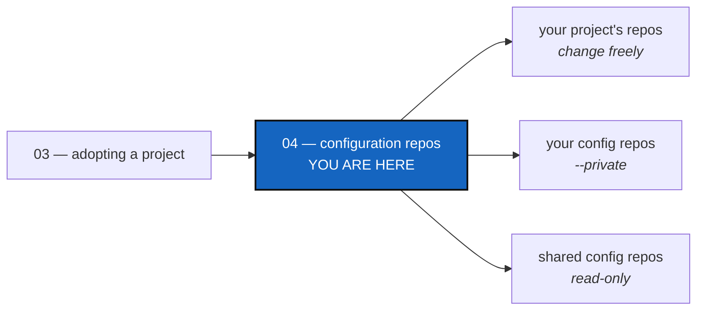

# Tutorial 4 of 4 — Private repos: the ones that configure your project

*Created: 2026-09-07*

## Abstract — read this first

**What this document is.** How to keep the repositories that *configure*
your project — pipelines, agent instructions, house rules — separate from
the ones that *are* your project, so work in one project does not leak into
the others.

**Why it exists.** Most repositories in a tree are yours to change freely.
A shared one is not. `cgitsync` needs to know which is which, and once it
does, it keeps you out of trouble by default.

**What you will find.** What a configuration repo is (§1), the two kinds
(§2), how to declare them (§3), the everyday commands (§4), a summary (§5),
and what is coming later (§6).

**Who it is for.** Anyone whose projects share documents or settings.
Do [Tutorial 1](01_first_multi_repo_workspace.md) first — this one assumes
you have already run a `.cgs` tree end to end.

**What you need to do with it.** Read §2, then follow §4. There is nothing
to memorise: the commands do the safe thing unless you ask otherwise.



---

> **Every command below is a Pixi task.** Run `pixi install` once per
> checkout, then always write `pixi run cgitsync ...`, never a bare
> `cgitsync ...`.

---

## 1. Project repos and private repos

A tree holds two kinds of repository.

**Project repos** are the work itself — whatever the project is for. Code,
documents, data. They follow your project's branch, because they *are* your
project.

**Private repos** are how the project is run: your pipelines, your
instructions to a coding agent, your review rules. Some things are the same
across all your projects, and you want **one copy** so that fixing it once
fixes it everywhere. A private repo holds that copy.

That changes what should happen to it. Start a feature branch, and your
project repos should follow you onto it. A private repo should not — or
every other project sharing it would suddenly see your half-finished work.

So you mark it **private** in the `.cgs`, and `cgitsync` keeps it on a
branch of its own.

## 2. The two kinds — this is the part that matters

Not all private repos are the same, and confusing them is the one mistake
worth designing against. The difference is **who may write**.

**private/distant.** Someone else's repository. You read it; only its owner
writes to it. Nothing you do here can change it. Example: a house-style
document a dozen projects mount.

**private/local.** It lives outside your project, but the part you use is
yours, and you commit to it. It sits on a branch named
after your project. Nobody else reads that branch, so writing to it is
safe. Example: your project's own notes and agent instructions.

**Private means distant unless you say otherwise.** `private = true` alone
gives you private/distant; adding `writable = true` makes it
private/local. That default is deliberate: the expensive mistake is writing
to something shared by accident, never the reverse. If you cannot write
where you expected to, `cgitsync` names the repository and says what to add
to the `.cgs`.

Here is this repository's own tree, which uses both kinds:

```bash
pixi run cgitsync view-tree
```

```text
ComplexGitSync (root) [ALIGNED] @9c9298a br=multi-branch fb=main
├── .agentSpec (parent) [ALIGNED] @117a9c5 br=main
│   └── DevSpec (leaf) [ALIGNED] @a5d3432 br=main
├── .claude (leaf) [ALIGNED] @df4221c br=ComplexGitSync_multi-branch fb=main
├── .localSpec (leaf) [ALIGNED] @9f50519 br=ComplexGitSync_multi-branch fb=main
└── DocComplexGitSync (parent) [ALIGNED] @ac1176e br=multi-branch fb=main
    └── DocSpec (leaf) [ALIGNED] @e6f1b0b br=main
```

`br=` is the branch each repository is on, and it tells you which kind
each one is:

| Repository | Branch | Kind |
|---|---|---|
| `ComplexGitSync`, `DocComplexGitSync` | `multi-branch` | the project's own — they followed the feature branch |
| `.localSpec`, `.claude` | `ComplexGitSync_multi-branch` | config, **read and write** — the branch is named after this project *and* the branch it is on |
| `.agentSpec`, `DevSpec`, `DocSpec` | `main` | config, **read-only** — `main` is what every other project reads |

**The branch name is the whole tell.** A configuration repo sitting on a
branch named after your project is yours. One sitting on `main` is
everybody's.

You do not have to read branch names to work this out. `cgitsync status`
prints a `SCOPE` column that says it outright:

```bash
pixi run cgitsync status
```

```text
REPOSITORY         PATH                SCOPE            LOCAL_BRANCH
DocSpec            docs/DocSpec        private/distant  main
DocComplexGitSync  docs                project          multi-branch
.localSpec         .localSpec          private/local    ComplexGitSync_multi-branch
.claude            .claude             private/local    ComplexGitSync_multi-branch
DevSpec            .agentSpec/DevSpec  private/distant  main
.agentSpec         .agentSpec          private/distant  main
ComplexGitSync     .                   project          multi-branch
legend: SCOPE — project = this project's own; private = a configuration
repository shared with other projects, local = this project may write to
it, distant = read-only
```

Three words, and they map onto the three things you can do:

| `SCOPE` | What it is | What writes to it |
|---|---|---|
| `project` | this project's own | `cgitsync commit`, `cgitsync push` |
| `private/local` | shared, and yours to write | the same, with `--private` |
| `private/distant` | shared, read-only | nothing |

**private** means shared with other projects. What separates the other two
words is **who may commit**, not how far away anything is:

- **distant** — the repository is private *to its owner*. You read it; only
  that owner writes to it. Nothing you do moves it.
- **local** — it holds settings that configure *your* project, and those
  settings are a contribution to your project, recorded on your own branch.
  You do commit to it.

`DevSpec` and `DocSpec` are nested inside private repos and show as private
too — a repository inside a shared one is just as shared.

### A branch per project branch

Look again at the `LOCAL_BRANCH` column above. `.localSpec` and `.claude`
are not on `ComplexGitSync`; they are on `ComplexGitSync_multi-branch`,
because the project is on `multi-branch`.

That is the rule, and it has one shape:

```text
branch X  ->  project repos:   X
              private/local:   <your project's name>          if X is main
                               <your project's name>_X        otherwise
```

The base is your **project's name**. `main` takes no suffix, because the
project's main line's settings branch is simply the project's name — which
is what every existing tree already has, so nothing has to move.

The separator is an underscore. Hyphens already turn up inside branch names
— `multi-branch` is one — so `ComplexGitSync-multi-branch` would leave you
guessing where the project name stops.

**Why it has to work this way.** A private/local repo is where your notes
and settings live. If it had one branch for every branch of your project,
then the moment you documented an unfinished feature, that documentation
would be live on `main` too, describing something that is not there yet.
A branch per project branch keeps unmerged notes unmerged.

**You never type the second name.** `cgitsync checkout multi-branch` puts
your own repositories on `multi-branch` and your settings repositories on
`ComplexGitSync_multi-branch`, creating that branch if it is not there.
`cgitsync branch multi-branch` does the same without moving anything. One
command, one branch name, and `cgitsync` works out what each repository
needs.

**Every command that touches Git takes `--private`.** It narrows the
command to your writable configuration repositories alone — so you can
commit, push, tag or check them out on their own without reaching for
plain `git`. Read-only ones are never written to, with or without it.

### The whole cycle

```bash
# start the feature: one command, both kinds of branch
pixi run cgitsync checkout multi-branch

# while you work: take updates from ComplexGitSync into
# ComplexGitSync_multi-branch, so your settings do not drift behind
pixi run cgitsync pull --private

# when it is done, go to the branch you are merging INTO first
pixi run cgitsync checkout main
pixi run cgitsync merge multi-branch
pixi run cgitsync merge --private multi-branch
```

**Check out the target before you merge.** `merge` brings a branch *into*
the one you are on, exactly like `git merge`. Running
`cgitsync merge multi-branch` while still on `multi-branch` merges it into
itself, so `cgitsync` refuses and tells you to check out the target first.

The last `merge` does **not** merge a branch called `multi-branch` — no
configuration repo has one. You always name your *project's* branch, and
each repository works out what that means for itself.

## 3. Declaring them

Two fields. `private = true` says "shared, leave it on its own branch".
`writable = true` adds "…but this project may write to it".

```toml
project = { name = "ComplexGitSync", default_branch = "main" }

repos = [
    { repository = "github:flipoyo/ComplexGitSync", fallback_branch = "main" },
    { repository = "github:flipoyo/DocComplexGitSync", fallback_branch = "main", relative_path = "docs", nested_config = "auto" },
    { repository = "github:flipoyo/.agentSpec", default_branch = "main", fallback_branch = "main", nested_config = "auto", private = true },
    { repository = "github:flipoyo/.localSpec", default_branch = "ComplexGitSync", fallback_branch = "main", private = true, writable = true },
    { repository = "github:flipoyo/.claude", default_branch = "ComplexGitSync", fallback_branch = "main", private = true, writable = true },
]
```

That is [`install.cgs`](../install.cgs), this tree's own file. Reading it:

- The first two entries have no `private`, so they are the project's own.
- `.agentSpec` is `private` and nothing more — read-only.
- `.localSpec` and `.claude` are `private, writable` — this project's, on
  its own branch.

The other fields are ordinary `.cgs`. `default_branch` is the branch a
private repository stays on, which is the field that decides §2's question,
so always write it. `fallback_branch = "main"` lets a fresh clone work
before the project-named branch exists.

**One entry covers everything inside it.** `.agentSpec` holds `DevSpec`,
which reaches this tree through `.agentSpec`'s own nested `.cgs`. You never
write a second `private = true` for it: `DevSpec` sits inside a read-only
configuration repo, so it is read-only too. The same goes the other way —
anything nested inside `.localSpec` is writable, and `--private` reaches
it.

A nested entry may lock itself down further than its parent: `private =
true` on its own line, with no `writable`, makes it read-only inside a
writable parent. It cannot open itself up. `writable = true` inside a
read-only configuration repo does nothing, because no repository can be
more open than the one holding it.

**Adding one to your own project:** copy an entry, pick `default_branch`
using §2, and run `pixi run cgitsync initialise <your.cgs>`.

## 4. Working day to day

### Your project's own work

Nothing special. The everyday commands already leave configuration repos
alone:

```bash
pixi run cgitsync branch my-feature
pixi run cgitsync checkout my-feature
# ... edit files ...
pixi run cgitsync add
pixi run cgitsync commit -m "what you changed"
pixi run cgitsync push
```

`add` with no arguments is fine — it stages your project's repositories and
skips every configuration repo. Each command says what it left out:

```text
scope=project skipped=5 configuration repo(s) (.claude, .localSpec with --private)
```

That line is the whole safety net. It tells you what was untouched, and
names the ones you *could* have written to.

### Changing your own configuration repos

Add `--private`. It switches the command over to the writable
configuration repos — and **only** those:

```bash
pixi run cgitsync add --private
pixi run cgitsync commit --private -m "update this project's notes"
pixi run cgitsync push --private
```

Two separate commits, two separate messages, which is usually what you
wanted anyway: your project's change and your notes change are different
changes.

If you ask for `--private` in a tree whose configuration repos are all
read-only, the command stops and tells you why rather than doing nothing
quietly:

```text
commit --private: no writable configuration repository in this tree. The private
repositories in this tree are read-only: .agentSpec, DevSpec, DocSpec. A private
repository is read-only unless its .cgs entry also says writable = true.
```

### Changing a read-only configuration repo

`cgitsync` will not do this for you, in either mode. That is the point.

When you genuinely need to change a shared document, do it deliberately,
with plain `git`, one repository at a time, after your project's own work
has been reviewed and merged:

```bash
git -C .agentSpec status
git -C .agentSpec add install.cgs
git -C .agentSpec commit -m "what you changed"
git -C .agentSpec push
```

Everyone mounting that repository sees the change on their next pull, so it
deserves the extra keystrokes.

> **This is a safety rail, not a lock.** `cgitsync` refuses; `git` does
> not. Marking something read-only stops accidents — it does not stop
> anyone determined, and it is no substitute for branch protection on the
> remote.

### Updating and releasing

```bash
pixi run cgitsync pull        # updates every repo, read-only ones included
pixi run cgitsync tag v1.2.3  # tags what this project may write
```

`pull` reaches everything — reading a shared repository is exactly what it
is for, and it is how you receive other people's fixes.

`tag` creates and pushes a tag, so it covers your project's repositories
and your writable configuration repos, and skips the read-only ones. You
lose nothing: the `.gts` snapshot records every repository's exact commit,
read-only ones included, so a release is rebuilt from the snapshot rather
than from tags. `tag` also needs a clean tree, so commit first.

## 5. Summary

| What you want | Command | What it touches |
|---|---|---|
| Work on your project | `add` / `commit` / `push` | your project's repos only |
| Update your own notes/config | same, plus `--private` | your writable config repos only |
| Change a shared document | plain `git -C <repo> ...` | that one repo, deliberately |
| Get everyone's latest | `pull` | everything |
| Cut a release | `tag` | everything you may write |
| See where you stand | `status`, `view-tree` | everything |

Three things to remember:

1. **Pinned means shared. Shared means read-only** unless the `.cgs` says
   `writable = true`.
2. **`--private` is for your own configuration repos**, and only those.
3. **The branch name tells you the kind.** Named after your project → yours.
   On `main` → everybody's.

## 6. What is coming later

`private` today means one thing: a **configuration repo** — documents and
settings shared between projects.

**Data repos are not defined yet.** A repository holding datasets is also
shared and also should not follow your feature branches, but the
resemblance may end there: a dataset is far larger, is versioned on its own
rhythm rather than with your releases, and may want a tag policy of its
own. Whether that becomes another field or another value of an existing one
is still open.

Until then, use `private` for configuration, and do not mount large datasets
this way expecting these rules to fit unchanged.

---

**More detail.** The full branch model — every `.cgs` field and how a
branch is chosen — is in the user guide's "Branches in a `.cgs`" section
([docs/MASTER.pdf](../docs/MASTER.pdf)).
