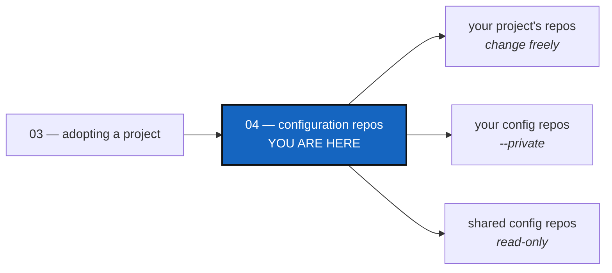

# Tutorial 4 of 5 — Private repos: the ones that configure your project

*Created: 2026-09-07*

## Abstract — read this first

**What this document is.** How to keep the repositories that *configure*
your project — pipelines, agent instructions, house rules — separate from
the ones that *are* your project, so work in one project does not leak into
the others.

**Why it exists.** Most repositories in a tree are yours to change freely.
A shared one is not. `cgitsync` needs to know which is which, and once it
does, it keeps you out of trouble by default.

**What you will find.** What a configuration repo is (§1), the two kinds
(§2), how to declare them (§3), the everyday commands (§4), a summary (§5),
and what is coming later (§6).

**Who it is for.** Anyone whose projects share documents or settings.
Do [Tutorial 1](01_first_multi_repo_workspace.md) first — this one assumes
you have already run a `.cgs` tree end to end.

**What you need to do with it.** Read §2, then follow §4. There is nothing
to memorise: the commands do the safe thing unless you ask otherwise.


```mermaid
graph LR
    T3["03 — adopting a project"] --> T4["04 — configuration repos<br/>YOU ARE HERE"]
    T4 --> OWN["your project's repos<br/><i>change freely</i>"]
    T4 --> MINE["your config repos<br/><i>--private</i>"]
    T4 --> SHARED["shared config repos<br/><i>read-only</i>"]

    classDef here fill:#1565C0,color:#fff,stroke:#111,stroke-width:2px;
    class T4 here;
```

---

> **Every command below is a Pixi task.** Run `pixi install` once per
> checkout, then always write `pixi run cgitsync ...`, never a bare
> `cgitsync ...`.

---

## 1. Project repos and private repos

A tree holds two kinds of repository.

**Project repos** are the work itself — whatever the project is for. Code,
documents, data. They follow your project's branch, because they *are* your
project.

**Private repos** are how the project is run: your pipelines, your
instructions to a coding agent, your review rules. Some things are the same
across all your projects, and you want **one copy** so that fixing it once
fixes it everywhere. A private repo holds that copy.

That changes what should happen to it. Start a feature branch, and your
project repos should follow you onto it. A private repo should not — or
every other project sharing it would suddenly see your half-finished work.

So you mark it **private** in the `.cgs`, and `cgitsync` keeps it on a
branch of its own.

## 2. The two kinds — this is the part that matters

Not all private repos are the same, and confusing them is the one mistake
worth designing against. The difference is **who may write**.

**private/distant.** Someone else's repository. You read it; only its owner
writes to it. Nothing you do here can change it. Example: a house-style
document a dozen projects mount.

**private/local.** It lives outside your project, but the part you use is
yours, and you commit to it. It sits on a branch named
after your project. Nobody else reads that branch, so writing to it is
safe. Example: your project's own notes and agent instructions.

**Private means distant unless you say otherwise.** `private = true` alone
gives you private/distant; adding `writable = true` makes it
private/local. That default is deliberate: the expensive mistake is writing
to something shared by accident, never the reverse. If you cannot write
where you expected to, `cgitsync` names the repository and says what to add
to the `.cgs`.

Here is a small tree that uses both kinds. `my-app` is the project, with
its documentation in a second repository. `house-rules` is a team-wide
document every project mounts, read-only. `notes` holds this project's own
notes, and is writable:

```toml
project = { name = "my-app", default_branch = "main" }

repos = [
    "github:you/my-app",
    { repository = "github:you/my-app-docs", relative_path = "docs" },

    # shared with every project, read-only here
    { repository = "github:team/house-rules", relative_path = ".shared/house-rules", default_branch = "main", private = true },

    # this project's own notes, on a branch named after the project
    { repository = "github:you/.notes", relative_path = ".local/notes", fallback_branch = "main", private = true, writable = true },
]
```

Build it standalone (`bootstrap my-app.cgs my-app`, then the `export` line
it prints; see [guide A](../guide/A-getting-started.md#4-your-first-tree-standalone)),
start a feature branch, and look at it:

```bash
pixi run cgitsync checkout faster-io
pixi run cgitsync view-tree
```

```text
my-app (root) [ALIGNED] @71e1fb0 br=faster-io fb=main
├── .notes (leaf) [ALIGNED] @9b3ed18 br=my-app_faster-io fb=main
├── house-rules (leaf) [ALIGNED] @cc07fb3 br=main
└── my-app-docs (leaf) [ALIGNED] @ed5bc84 br=faster-io fb=main
```

`br=` is the branch each repository is on, and it tells you which kind
each one is:

| Repository | Branch | Kind |
|---|---|---|
| `my-app`, `my-app-docs` | `faster-io` | the project's own: they followed the feature branch |
| `.notes` | `my-app_faster-io` | config, **read and write**: the branch is named after this project *and* the branch it is on |
| `house-rules` | `main` | config, **read-only**: `main` is what every other project reads |

**The branch name is the whole tell.** A configuration repo sitting on a
branch named after your project is yours. One sitting on `main` is
everybody's.

You don't have to read branch names to work this out. `cgitsync status`
prints a `SCOPE` column that says it outright:

```bash
pixi run cgitsync status
```

```text
REPOSITORY   PATH                 SCOPE            LOCAL_BRANCH      UPSTREAM_BRANCH  LOCAL  SYNC
my-app-docs  docs                 project          faster-io         -                clean  no-upstream
house-rules  .shared/house-rules  private/distant  main              origin/main      clean  synced
.notes       .local/notes         private/local    my-app_faster-io  -                clean  no-upstream
my-app       .                    project          faster-io         -                clean  no-upstream
legend: SCOPE — project = the work itself; private = a repository that configures the project, shared with your other projects; local = yours to write, distant = read-only
```

(`no-upstream` only means the new branch hasn't been pushed yet.)

Three words, and they map onto the three things you can do:

| `SCOPE` | What it is | What writes to it |
|---|---|---|
| `project` | this project's own | `cgitsync commit`, `cgitsync push` |
| `private/local` | shared, and yours to write | the same, with `--private` |
| `private/distant` | shared, read-only | nothing |

**private** means shared with other projects. What separates the other two
words is **who may commit**, not how far away anything is:

- **distant**: the repository is private *to its owner*. You read it; only
  that owner writes to it. Nothing you do moves it.
- **local**: it holds settings that configure *your* project, and those
  settings are a contribution to your project, recorded on your own branch.
  You do commit to it.

### A branch per project branch

Look again at `.notes` above. It isn't on `my-app`; it is on
`my-app_faster-io`, because the project is on `faster-io`.

That is the rule, and it has one shape:

```text
branch X  ->  project repos:   X
              private/local:   <your project's name>          if X is main
                               <your project's name>_X        otherwise
```

The base is your **project's name**. `main` takes no suffix: the main
line's settings branch is simply the project's name.

The separator is an underscore. Hyphens already turn up inside branch names
(`faster-io` is one), so `my-app-faster-io` would leave you guessing where
the project name stops.

**Why it has to work this way.** A private/local repo is where your notes
and settings live. If it had one branch for every branch of your project,
then the moment you documented an unfinished feature, that documentation
would be live on `main` too, describing something that isn't there yet.
A branch per project branch keeps unmerged notes unmerged.

**You never type the second name.** `cgitsync checkout faster-io` puts
your own repositories on `faster-io` and your settings repositories on
`my-app_faster-io`, creating that branch if it isn't there.
`cgitsync branch create faster-io` does the same without moving anything.
One command, one branch name, and `cgitsync` works out what each repository
needs.

**Ten commands take `--private`:** `pull` (with or without `--force`),
`fetch`, `checkout`, `branch` (on `create`, `list` and `close`), `add`,
`rm`, `commit`, `merge`, `push` and `tag`.
Four of them (`add`, `commit`, `push` and `merge`) also take `--all`,
which does both halves at once (see *Or do both at once* below).
`--private` narrows the command to your writable configuration
repositories alone, so you can commit, push, tag or check them out on
their own without reaching for plain `git`. Read-only ones are never
written to, with or without it. The whole-tree commands (`bootstrap`,
`initialise`, `freeze-release`) don't take it.

### The whole cycle

```bash
# once, right after bootstrap: commit the .gitignore it wrote, on main
pixi run cgitsync add && pixi run cgitsync commit "ignore the child repositories" && pixi run cgitsync push

# start the feature: one command, both kinds of branch
pixi run cgitsync checkout faster-io

# work, then commit and push both halves in one go
pixi run cgitsync commit --all -m "speed up file reading, and note why"
pixi run cgitsync push --all

# when it is done, go to the branch you are merging INTO first
pixi run cgitsync checkout main
pixi run cgitsync merge --all faster-io
pixi run cgitsync push --all
```

```text
pushed my-app-docs: origin/faster-io (upstream set)
pushed .notes: origin/my-app_faster-io (upstream set)
pushed my-app: origin/faster-io (upstream set)
pushed=3 skipped=0
```

**Check out the target before you merge.** `merge` brings a branch *into*
the one you are on, exactly like `git merge`. Running
`cgitsync merge faster-io` while still on `faster-io` merges it into
itself, so `cgitsync` refuses and tells you to check out the target first.

`merge --all faster-io` does **not** look for a branch called `faster-io`
in `.notes`, which has none. You always name your *project's* branch, and
each repository works out what that means for itself: `.notes` merges
`my-app_faster-io` into `my-app`.

> **Why commit the `.gitignore` on `main` first.** `bootstrap` writes it
> without committing. Left for your first feature commit, it would exist
> only on that branch, and back on `main` the child repositories would look
> like untracked files in the root. `merge` then refuses, because the
> root's worktree isn't clean.

## 3. Declaring them

Two fields. `private = true` says "shared, leave it on its own branch".
`writable = true` adds "…but this project may write to it". Reading the
`.cgs` above:

- `my-app` and `my-app-docs` have no `private`, so they are the project's own.
- `house-rules` is `private` and nothing more: read-only.
- `.notes` is `private, writable`: this project's, on its own branch.

A private repository is often there to keep work out of what you publish,
not to hide secrets. Project notes, plans and agent instructions live in a
`private, writable` repository, so the public project carries the product
and not the workshop. ComplexGitSync's own developer tree does exactly
this; see [CONTRIBUTING.md](../CONTRIBUTING.md#1-the-developer-tree).

The other fields are ordinary `.cgs`. `default_branch` is the branch a
read-only private repository stays on, so always write it there.
`fallback_branch = "main"` lets a fresh clone work before the
project-named branch exists. `relative_path` says where each one goes.

**For a `private, writable` entry the branch is computed, not chosen.** It is
your project's name on `main` and `<project>_<branch>` on any other branch,
and it is worked out the same way at the first clone as at every later
branch move. Writing `default_branch` there is optional; a value that is
neither that name nor the project's own `default_branch` is refused as a
near-certain copy-and-paste mistake. That branch is created by your first
private commit or branch move, so the first clone finds it missing and
uses the entry's `fallback_branch` instead.

**A repository declared inside another one's own nested `.cgs`** inherits
its parent's privacy with no entry of its own needed. It may lock itself
down *further* than its parent (`private = true`, no `writable`, inside a
writable parent) but never open itself up wider: `writable = true` inside a
read-only configuration repo does nothing, because no repository can be
more open than the one holding it. That is why a writable private repo
should be declared directly, never nested under a read-only one.

**Adding one to your own project:** copy an entry and pick
`default_branch` using §2. `pull` does not clone a repository added to the
`.cgs` after the tree was built. Commit and push your work, then rebuild:
in standalone, `bootstrap` the updated `.cgs` into a new workspace; nested,
run `initialise` again.

## 4. Working day to day

### Your project's own work

Nothing special. The everyday commands already leave configuration repos
alone:

```bash
pixi run cgitsync branch create my-feature
pixi run cgitsync checkout my-feature
# ... edit files ...
pixi run cgitsync add
pixi run cgitsync commit -m "what you changed"
pixi run cgitsync push
```

`add` with no arguments is fine: it stages your project's repositories and
skips every configuration repo. Its output names only the repositories it
staged or skipped, and your configuration repos are not among them.

### Changing your own configuration repos

Add `--private`. It switches the command over to the writable
configuration repos — and **only** those:

```bash
pixi run cgitsync add --private
pixi run cgitsync commit --private -m "update this project's notes"
pixi run cgitsync push --private
```

Two separate commits, two separate messages, which is usually what you
wanted anyway: your project's change and your notes change are different
changes.

### Or do both at once, with `--all`

When the change really is one change — you edited some code and the setting
that goes with it — running everything twice is busywork. `--all` does both
halves in one command, with one message:

```bash
pixi run cgitsync add --all
pixi run cgitsync commit --all -m "add the retry setting and the code that reads it"
pixi run cgitsync push --all
```

Three forms, and the plain one has not changed:

| You type | It reaches |
|---|---|
| `cgitsync add` | your own repositories |
| `cgitsync add --private` | your writable configuration repositories |
| `cgitsync add --all` | both, in one pass |

Read-only configuration repositories are never written to by any of the
three. `--all` and `--private` cannot be used together — `--all` already
includes everything `--private` would reach.

You still see the two halves separately, so giving up the typing does not
mean giving up knowing:

```text
scope=all project=my-app, my-app-docs private=.notes
scope=all never_written=1 read-only repo(s) (house-rules)
```

If your tree has no writable configuration repository at all, `--all` simply
does your own repositories and says the other half was empty. That is not an
error — most trees are like that. Asking for `--private` on such a tree still
stops, because there you asked for something that is not there.

`merge --all` is worth one extra word. It checks **every** repository before
merging **any** of them, so a conflict in a configuration repository leaves
your project repositories untouched too. Two separate `merge` commands could
not promise that: the first would already have merged before the second
found the conflict.

### When a merge refuses

Sooner or later two branches will have edited the same lines, and the merge
will stop before touching anything:

```text
cgitsync merge: merge refused; no repository was merged: docs: merging
'my-feature' conflicts in guide.tex; MyProject: merging 'my-feature' conflicts
```

Read that as good news about the tree, not only bad news about the branch.
**Nothing was merged anywhere** — not the repository that conflicts, not the
ones that would have merged cleanly. Your tree is exactly where it was, and
you can fix the conflict without also unpicking half a merge.

Ask what is wrong, and you get the same list back, re-checked against Git
rather than remembered:

```bash
pixi run cgitsync autofix
```

```text
docs: merging 'my-feature' still conflicts in guide.tex. This needs a person,
not a repair — nothing here can guess which side of a conflict is right.
  cgitsync merge --resolve my-feature
  cd /path/to/tree/docs && git mergetool
  cgitsync add && cgitsync commit
```

`autofix` will not resolve a content conflict, and no version of it ever
will: which side of two people's edits is right is not a question a tool can
answer. What it does is tell you which repositories are blocking, which files
in them, and whether the conflict is still there at all — run it after you
have fixed something and it will say so.

To do the fixing, hand the conflict to a worktree with `--resolve`:

```bash
pixi run cgitsync merge --resolve my-feature
```

This one **gives up the all-or-nothing promise on purpose**: it merges one
repository at a time and stops at the first conflict, leaving the conflict
markers in that repository's files for you to edit. Repositories merged
before it stay merged, and it says which ones they were and which it never
reached.

```text
stopped at docs: guide.tex
not reached: MyProject
no merge tool available. Resolve by hand:
  cd /path/to/tree/docs && git mergetool  # then: cgitsync add && cgitsync commit
```

`no merge tool available` means Git has no `merge.tool` configured on this
machine — `git mergetool` there would only ask you to set one. You do not
need one. Open the file, and edit the conflict markers Git wrote into it:

```text
<<<<<<< HEAD
the line as it is on the branch you are merging into
=======
the line as it is on my-feature
>>>>>>> my-feature
```

Keep whichever text is right — often a bit of both — delete the three marker
lines, then finish the merge from the tree's root:

```bash
pixi run cgitsync add
pixi run cgitsync commit "MyProject1.2.0 resolve guide.tex against my-feature"
```

Then run the merge again for whatever `--resolve` never reached. If you would
rather have a merge tool, `git config --global merge.tool meld` (or
`vimdiff`, or `code`) and `--resolve` will open it next time.

If you ask for `--private` in a tree whose configuration repos are all
read-only, the command stops and tells you why rather than doing nothing
quietly:

```text
commit --private: no writable configuration repository in this tree. The private
repositories in this tree are read-only: house-rules. A private
repository is read-only unless its .cgs entry also says writable = true.
```

### Changing a read-only configuration repo

`cgitsync` will not do this for you, in either mode. That is the point.

When you genuinely need to change a shared document, do it deliberately,
with plain `git`, one repository at a time, after your project's own work
has been reviewed and merged:

```bash
git -C .shared/house-rules status
git -C .shared/house-rules add STYLE.md
git -C .shared/house-rules commit -m "what you changed"
git -C .shared/house-rules push
```

Everyone mounting that repository sees the change on their next pull, so it
deserves the extra keystrokes.

> **This is a safety rail, not a lock.** `cgitsync` refuses; `git` does
> not. Marking something read-only stops accidents — it does not stop
> anyone determined, and it is no substitute for branch protection on the
> remote.

### Updating and releasing

```bash
pixi run cgitsync pull        # updates every repo, read-only ones included
pixi run cgitsync tag v1.2.3  # tags what this project may write
```

`pull` reaches everything — reading a shared repository is exactly what it
is for, and it is how you receive other people's fixes.

`tag` creates and pushes a tag, so it covers your project's repositories
and your writable configuration repos, and skips the read-only ones. You
lose nothing: the `.gts` snapshot records every repository's exact commit,
read-only ones included, so a release is rebuilt from the snapshot rather
than from tags. `tag` also needs a clean tree, so commit first.

## 5. Summary

| What you want | Command | What it touches |
|---|---|---|
| Work on your project | `add` / `commit` / `push` | your project's repos only |
| Update your own notes/config | same, plus `--private` | your writable config repos only |
| Change a shared document | plain `git -C <repo> ...` | that one repo, deliberately |
| Get everyone's latest | `pull` | everything |
| Cut a release | `tag` | everything you may write |
| See where you stand | `status`, `view-tree` | everything |

Three things to remember:

1. **Private means shared. Shared means read-only** unless the `.cgs` says
   `writable = true`.
2. **`--private` is for your own configuration repos**, and only those.
3. **The branch name tells you the kind.** Named after your project → yours.
   On `main` → everybody's.

## 6. What is coming later

`private` today means one thing: a **configuration repo** — documents and
settings shared between projects.

**Data repos are not defined yet.** A repository holding datasets is also
shared and also should not follow your feature branches, but the
resemblance may end there: a dataset is far larger, is versioned on its own
rhythm rather than with your releases, and may want a tag policy of its
own. Whether that becomes another field or another value of an existing one
is still open.

Until then, use `private` for configuration, and do not mount large datasets
this way expecting these rules to fit unchanged.

---

**More detail.** Private repos in daily use are summarised in
[guide C](../guide/C-working-day-to-day.md#5-private-repos-in-daily-use).
The full branch model (every `.cgs` field and how a branch is chosen) is in
the user guide's "Branches in a `.cgs`" section of the reference manual,
`docs/MASTER.pdf`, which comes with the `docs` repository a bootstrapped
install mounts.
