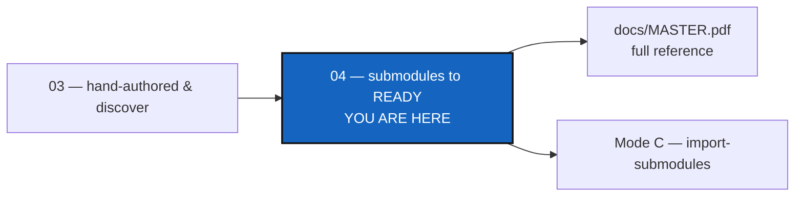

# Tutorial 4 of 4 — Migrating git Submodules to a READY Tree

*Created: 2026-09-02*

## Abstract — read this first

**What this document is.** The third way to reach a working `.cgs` for a
real project with none of its own: `import-submodules`, for a project that
already tracks its children as git submodules. It then takes the result —
or any `.cgs` from [Tutorial 3](03_configuration_discovery_modes.md) — the
rest of the way to a real, `READY` tree with `initialise`.

**Why it exists.** Tutorial 3 covers hand-authoring a `.cgs` and deriving
one with `discover`. Many real projects instead already use git
submodules, which `cgitsync` replaces with plain independent clones — this
tutorial covers that migration, and closes the loop: a `.cgs` draft is not
useful until it reaches a `READY` tree.

**What you will find.** A before/after picture of a submodule conversion,
a dry run, the real conversion, the automated test that proves it, and a
full walkthrough from a converted `.cgs` to a `READY` tree (`initialise` →
`branch`/`checkout` → `freeze-release`). Ends with a summary of which mode
— across this tutorial and Tutorial 3 — to reach for.

**Who it is for.** Anyone onboarding a project that already uses git
submodules, or anyone holding a `.cgs` draft from Tutorial 3 who wants to
see it through to a working tree.

**What you need to do with it.** Read [Tutorial 3](03_configuration_discovery_modes.md)
first — it establishes the `cawaqsviz` topology this mode is checked
against.



---

[Tutorial 3](03_configuration_discovery_modes.md) covers the first two
ways to reach a `.cgs` for **`cawaqsviz`**
(<https://gitlab.com/cawaqs/gviz/cawaqsviz>) — hand-authored (Mode A) and
`discover` (Mode B). This tutorial covers the third:

| Mode | Starting point | Command |
|---|---|---|
| C — `import-submodules` | The project already uses git submodules | `pixi run cgitsync import-submodules` |

It then takes any of the three resulting `.cgs` files further: `initialise`
into a real tree, and on to `READY`.

> **Every command below is a Pixi task, and works with public projects
> only.** See [Tutorial 1](01_first_multi_repo_workspace.md)'s note on
> Pixi tasks and [Tutorial 3](03_configuration_discovery_modes.md)'s note
> on public-project-only access — both apply here too.

---

## 1. Migrate with `import-submodules`

The historical route: before either `.cgs` file in Tutorial 3 existed,
`cawaqsviz` tracked both children as real git submodules
(`external/HydrologicalTwinAlphaSeries` and `docs/CWV_user_guide`).
`cgitsync`'s model is **plain independent clones** rather than gitlinks —
`import-submodules` converts an existing submodule setup to that model.

### 1.1 Before / after

```
cawaqsviz/          ← parent repo
  .gitmodules       ← declares two submodules
  external/
    HydrologicalTwinAlphaSeries/   ← gitlink today
  docs/
    CWV_user_guide/                ← gitlink today
```

| File / object | Before | After |
|---|---|---|
| Parent index | `160000` gitlink entries for both paths | No gitlink entries |
| `.gitmodules` | Declares two submodules | Deleted |
| `.gitignore` | May not mention child paths | Both paths appended |
| Child `.git` | Present (if already cloned) | Unchanged — no re-clone needed |

### 1.2 Dry run first (safe, no changes)

```bash
pixi run cgitsync import-submodules /path/to/cawaqsviz
```

Output:

```
Dry run — 2 submodule(s) in /path/to/cawaqsviz/.gitmodules
Pass --apply to perform the conversion.

  submodule: external/HydrologicalTwinAlphaSeries
    path:    external/HydrologicalTwinAlphaSeries
    url:     https://github.com/flipoyo/HydrologicalTwinAlphaSeries.git
    branch:  main

  submodule: docs/CWV_user_guide
    path:    docs/CWV_user_guide
    url:     https://github.com/flipoyo/user_guide_CaWaQS-Viz
    branch:  main
```

### 1.3 Apply the conversion

```bash
pixi run cgitsync import-submodules /path/to/cawaqsviz \
    --apply --output cawaqsviz_submodules.cgs
```

What happens under the hood, per submodule:

1. **Preflight** — `git status --porcelain` in the child directory must be
   empty. Dirty working trees are rejected immediately.
2. **`git rm --cached <path>`** — removes the gitlink from the parent's
   index; the child's working tree and `.git` directory are untouched.
3. **`.gitmodules` updated** — the submodule's stanza is removed. When all
   submodules are converted, `.gitmodules` is deleted and its removal is
   staged.
4. **`.gitignore` updated** — `<path>` is appended to the parent's
   `.gitignore`, using the same helper the `.gitignore` lifecycle sync
   uses elsewhere in `cgitsync`.
5. A `cawaqsviz_submodules.cgs` snippet is written with one `[[repos]]`
   entry per converted submodule.

After applying, review and commit the staged changes manually:

```bash
cd /path/to/cawaqsviz
git status            # shows: deleted .gitmodules, modified .gitignore, removed gitlinks
git commit -m "chore: retire git submodules in favour of ComplexGitSync"
```

> **Live migration note:** running `import-submodules --apply` against the
> real `cawaqsviz` GitLab project is a visible, permanent change to a shared
> repository. Build and test the tool against local fixtures first (see the
> automated test below), then open a pull/merge request on `cawaqsviz`
> itself for maintainer review before merging.

### 1.4 Automated test

`tests/integration/test_cgsi_topology.py::TestImportSubmodules::
test_import_submodules_converts_gitlinks_to_plain_clones` creates a local
bare "parent" repo with a real `git submodule add` of a local bare "child"
repo, runs `import_submodules(..., apply=True)`, and asserts the gitlink is
gone, the child's working tree is intact, `.gitignore` contains the child's
path, and the emitted `.cgs` validates.

---

## 2. Reaching READY: try the output on a real tree

Any of the three modes ends in a `.cgs` file — Tutorial 3's Mode A
(`examples/cawaqsviz.cgs`), Tutorial 3's Mode B
(`cawaqsviz-discovered.cgs`), or this tutorial's Mode C
(`cawaqsviz_submodules.cgs`). This section walks through what to actually
do with one of them next, using Mode C's output as the example:
`initialise` it as a real tree, `branch`+`checkout` onto a disposable test
branch, and run `freeze-release` on it.

```bash
pixi run cgitsync initialise cawaqsviz_submodules.cgs
pixi run cgitsync branch test-cgs
pixi run cgitsync checkout test-cgs
pixi run cgitsync freeze-release test-state "first test on a throwaway branch"
```

`initialise` clones every repo the `.cgs` declares and brings the tree to
`READY` — the same state Tutorial 1's `initialise` reaches for `CGSil1`.

`branch`+`checkout` create and switch to a purely local branch — nothing is
pushed yet, so it has no upstream on the remote. `freeze-release` (`add ->
commit -> pull -> push -> freeze`) handles that correctly: the `pull` step
is skipped when the current branch has no upstream (there is nothing to
pull for a branch that was never published), and `push` publishes it for
the first time on its own, the same way `git push -u` would. No manual
`push` before `freeze-release` is needed.

> **Before this was fixed**, running this exact sequence crashed at
> `freeze-release` with `fatal: couldn't find remote ref test-cgs` — `pull`
> unconditionally tried to pull a branch that had never been pushed. If you
> hit that error on an older `cgitsync`, run `pixi run cgitsync push`
> once by hand before `freeze-release` as a workaround.

`test-cgs`/`test-state` are disposable — this is meant for trying a mode's
output on a real tree, not for a release. Delete the remote branch and tag
afterwards if you don't want them to linger.

---

## 3. Which mode to reach for

- **`discover` (Tutorial 3's Mode B) and `import-submodules` (this
  tutorial's Mode C) answer different questions about the same tree.**
  `discover` reports what is *checked out*; `import-submodules` reads what
  git *declares* in `.gitmodules` and acts on it — a submodule path that
  was never initialised is invisible to Mode B but not to Mode C.
- **They compose.** `discover` a checkout to get the topology for free,
  cross-check it against `.gitmodules`, then `import-submodules --apply` to
  retire the submodules once you're confident in the result.
- **Mode A is the fallback** when neither a checkout nor `.gitmodules` is
  available — the same situation Tutorial 2's `cawaqs` is permanently in,
  since its 17 libraries never coexist in one directory tree until a `.cgs`
  already lists them.
